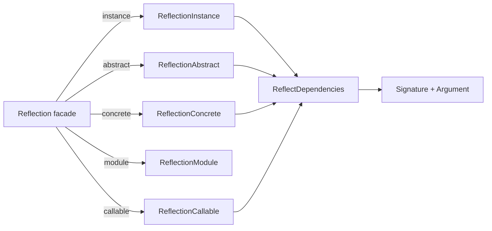

# orionis.introspection

> Herramientas de reflexión con caché que clasifican los miembros de una clase y resuelven las dependencias de un callable para el contenedor de Orionis.

## Tabla de contenidos

- [Descripción funcional](#descripción-funcional)
  - [Dónde encaja en el framework](#dónde-encaja-en-el-framework)
  - [Flujo de reflexión](#flujo-de-reflexión)
  - [Mapa de archivos](#mapa-de-archivos)
  - [Decisiones de diseño](#decisiones-de-diseño)
- [Referencia de API](#referencia-de-api)
  - [Reflection](#reflection)
  - [ReflectionAbstract](#reflectionabstract)
  - [ReflectionConcrete](#reflectionconcrete)
  - [ReflectionInstance](#reflectioninstance)
  - [ReflectionCallable](#reflectioncallable)
  - [ReflectionModule](#reflectionmodule)
  - [ReflectDependencies](#reflectdependencies)
  - [Argument](#argument)
  - [Signature](#signature)
  - [ModuleInspector](#moduleinspector)
  - [Contratos](#contratos)
  - [API de clasificación de miembros](#api-de-clasificación-de-miembros)
- [Ejemplos de uso](#ejemplos-de-uso)
  - [Clasificar los miembros de una clase](#clasificar-los-miembros-de-una-clase)
  - [Resolver las dependencias del constructor](#resolver-las-dependencias-del-constructor)
  - [Reflejar una instancia](#reflejar-una-instancia)
  - [Manejo de errores de reflexión](#manejo-de-errores-de-reflexión)
  - [Descubrir módulos y dataclasses congeladas](#descubrir-módulos-y-dataclasses-congeladas)
- [Consideraciones de rendimiento y concurrencia](#consideraciones-de-rendimiento-y-concurrencia)
- [Notas de compatibilidad](#notas-de-compatibilidad)

---

## Descripción funcional

`orionis.introspection` envuelve los módulos estándar `inspect`, `typing`, `ast`
e `importlib` detrás de clases especializadas que responden a las dos preguntas
que el framework se hace constantemente:

1. **¿Qué miembros expone esta clase, instancia o módulo?** — clasificados por
   *visibilidad* (público / protegido / privado / dunder), *tipo* (método de
   instancia, de clase, estático, atributo, propiedad) y *síncrono vs. asíncrono*.
2. **¿Qué necesita este callable para construirse?** — cada parámetro se
   convierte en un `Argument` y se reparte en cubetas de resueltos y no resueltos
   que el contenedor IoC consume directamente.

### Dónde encaja en el framework

| Consumidor | Qué usa |
| --- | --- |
| `orionis/container/container.py` | `ReflectionCallable`, `ReflectionConcrete`, `Argument`, `Signature` para el autowiring de `make`, `build`, `invoke` y `call`. |
| `orionis/console/core/loader.py` | `ModuleInspector`, `ReflectionModule` para descubrir comandos de consola. |
| `orionis/database/migrations/migrator.py` | `ModuleInspector`, `ReflectionModule` para descubrir clases de migración. |
| `orionis/foundation/application.py` | `ModuleInspector` para descubrir entidades de configuración en el arranque. |
| `orionis/console/commands/schedule/work_command.py` | `ReflectionInstance`. |

El paquete no tiene service provider ni facade: las clases se importan y se
instancian directamente.

### Flujo de reflexión



`ReflectionAbstract`, `ReflectionConcrete` y `ReflectionInstance` ejecutan un
**barrido de una sola pasada** sobre el espacio de nombres de la clase la primera
vez que se llama a cualquier accesor de clasificación, y a partir de ahí sirven
todos los demás desde una caché interna. `ReflectDependencies` es una envoltura
delgada con estado sobre dos funciones a nivel de módulo decoradas con
`functools.lru_cache`, así que inspeccionar repetidamente el mismo objetivo no
tiene coste.

### Mapa de archivos

| Ruta | Contenido |
| --- | --- |
| `reflection.py` | `Reflection` — facade estática: 5 métodos fábrica y 26 predicados. |
| `abstract/reflection.py` | `ReflectionAbstract` para clases `abc`. |
| `concretes/reflection.py` | `ReflectionConcrete` para clases ordinarias. |
| `instances/reflection.py` | `ReflectionInstance` para instancias de objeto. |
| `callables/reflection.py` | `ReflectionCallable` para funciones, métodos y lambdas. |
| `modules/reflection.py` | `ReflectionModule` para módulos importados. |
| `modules/inspector.py` | `ModuleInspector` — utilidades de descubrimiento por sistema de archivos y AST. |
| `dependencies/reflection.py` | `ReflectDependencies` y las funciones de resolución cacheadas. |
| `dependencies/entities/argument.py` | Dataclass congelada `Argument`. |
| `dependencies/entities/signature.py` | Dataclass congelada `Signature`. |
| `*/contracts/reflection.py` | Interfaces `abc.ABC` que implementa cada reflector. |

### Decisiones de diseño

- **Facade estática con imports perezosos** — `Reflection` solo contiene
  `@staticmethod` e importa cada reflector concreto dentro del método fábrica,
  así que importar `Reflection` no arrastra todo el paquete a memoria.
- **Barrido único + caché de diccionario** — las cubetas visibilidad × tipo ×
  síncrono/asíncrono se calculan una vez por instancia de reflector; después,
  cada accesor `get*` es una búsqueda en un diccionario.
- **Protocolo de caché tipo mapping** — `ReflectionAbstract`,
  `ReflectionConcrete`, `ReflectionInstance`, `ReflectionCallable` y
  `ReflectionModule` implementan `__getitem__`, `__setitem__`, `__contains__` y
  `__delitem__` sobre esa misma caché, de modo que quien llama puede guardar sus
  propios valores derivados junto a los internos.
- **Entidades congeladas** — `Argument` es `@dataclass(slots=True, kw_only=True,
  frozen=True)`; `Signature` es `@dataclass(frozen=True, kw_only=True)` y
  extiende `orionis.support.entities.base.BaseEntity`.
- **El name mangling queda oculto** — los miembros privados se devuelven sin el
  prefijo `_NombreDeClase` (`__seal`, no `_Repository__seal`), y los accesores
  que reciben un nombre de miembro vuelven a aplicar el mangling internamente.

---

## Referencia de API

### Reflection

`orionis.introspection.reflection.Reflection` — facade estática, nunca se
instancia.

**Métodos fábrica**

```python
@staticmethod
def instance(instance: Any) -> IReflectionInstance: ...

@staticmethod
def abstract(abstract: type) -> IReflectionAbstract: ...

@staticmethod
def concrete(concrete: type) -> IReflectionConcrete: ...

@staticmethod
def module(module: str) -> IReflectionModule: ...

@staticmethod
def callable(fn: Callable) -> IReflectionCallable: ...
```

Cada fábrica reenvía su argumento al constructor del reflector correspondiente y,
por tanto, propaga las mismas excepciones (ver cada clase más abajo).

**Predicados** — todos son `@staticmethod`, reciben un único `obj: Any` y
devuelven `bool`.

| Predicado | Delegado en |
| --- | --- |
| `isAbstract` | `inspect.isabstract` |
| `isAsyncGen` | `inspect.isasyncgen` |
| `isAsyncGenFunction` | `inspect.isasyncgenfunction` |
| `isAwaitable` | `inspect.isawaitable` |
| `isBuiltIn` | `inspect.isbuiltin` |
| `isClass` | `inspect.isclass` |
| `isCode` | `inspect.iscode` |
| `isCoroutine` | `inspect.iscoroutine` |
| `isCoroutineFunction` | `inspect.iscoroutinefunction` |
| `isDataDescriptor` | `inspect.isdatadescriptor` |
| `isFrame` | `inspect.isframe` |
| `isFunction` | `inspect.isfunction` |
| `isGenerator` | `inspect.isgenerator` |
| `isGeneratorFunction` | `inspect.isgeneratorfunction` |
| `isGetSetDescriptor` | `inspect.isgetsetdescriptor` |
| `isMemberDescriptor` | `inspect.ismemberdescriptor` |
| `isMethod` | `inspect.ismethod` |
| `isMethodDescriptor` | `inspect.ismethoddescriptor` |
| `isModule` | `inspect.ismodule` |
| `isRoutine` | `inspect.isroutine` |
| `isTraceback` | `inspect.istraceback` |

Cinco predicados implementan reglas propias:

- `isConcreteClass(obj)` — `True` cuando `obj` es un `type` que **no** es
  built-in, abstracto, genérico, un `Protocol` ni una construcción de `typing`,
  no lleva `abc.ABC` entre sus bases directas y tiene `__init__`. Comportamiento
  verificado: `Reflection.isConcreteClass(int)` devuelve `True`, porque
  `inspect.isbuiltin` es `False` para las clases.
- `isGeneric(obj)` — `True` cuando `typing.get_origin(obj)` no es `None`, cuando
  `obj` expone `__origin__` o cuando `obj` es un `typing.TypeVar`.
- `isProtocol(obj)` — `True` cuando `obj` es una clase, subclase de
  `typing.Protocol` y no es `Protocol` en sí.
- `isInstance(obj)` — `True` cuando `obj` no es una clase y el módulo de su tipo
  no es `builtins` ni `abc`.
- `isTypingConstruct(obj)` — `True` cuando `type(obj).__name__` coincide con uno
  de los 19 nombres fijos (`Any`, `Union`, `Optional`, `List`, `Dict`, `Set`,
  `Tuple`, `Callable`, `TypeVar`, `Generic`, `Protocol`, `Literal`, `Final`,
  `TypedDict`, `NewType`, `Deque`, `DefaultDict`, `Counter`, `ChainMap`).

### ReflectionAbstract

```python
class ReflectionAbstract(IReflectionAbstract):
    def __init__(self, abstract: type) -> None: ...
```

Lanza `TypeError` cuando `inspect.isabstract(abstract)` es `False`
(`"The class 'Repository' is not an abstract base class."`).

Además de la [API de clasificación de miembros](#api-de-clasificación-de-miembros)
expone:

| Método | Devuelve | Notas |
| --- | --- | --- |
| `getClass()` | `type` | La clase reflejada. |
| `getClassName()` | `str` | |
| `getModuleName()` | `str` | |
| `getModuleWithClassName()` | `str` | `modulo.NombreDeClase`. |
| `getDocstring()` | `str \| None` | |
| `getBaseClasses()` | `list[type]` | Bases directas, como lista. |
| `getSourceCode()` | `str` | Lanza `ValueError` si no se puede localizar el código fuente. |
| `getFile()` | `str` | Lanza `ValueError` si la clase no tiene un archivo de módulo importable. |
| `getAnnotations()` | `dict` | Anotaciones de clase sin el prefijo de mangling. |
| `hasAttribute(attribute)` | `bool` | |
| `getAttribute(attribute)` | `object \| None` | |
| `setAttribute(name, value)` | `bool` | `ValueError` con identificadores/palabras reservadas inválidos, `TypeError` con callables. |
| `removeAttribute(name)` | `bool` | `ValueError` si el atributo no existe. |
| `hasMethod(name)` | `bool` | Acepta el nombre privado sin manglar. |
| `removeMethod(name)` | `bool` | `ValueError` si el método no existe. |
| `getMethodSignature(name)` | `inspect.Signature` | `ValueError` si no existe, `TypeError` si no es callable. |
| `getPropertySignature(name)` | `inspect.Signature` | `ValueError` si no existe, `TypeError` si no es una propiedad. |
| `getPropertyDocstring(name)` | `str \| None` | Mismas excepciones que el anterior. |
| `constructorSignature()` | `Signature` | Delega en `ReflectDependencies`. |
| `methodSignature(method_name)` | `Signature` | `AttributeError` si el método no existe. |
| `clearCache()` | `None` | Vacía la caché interna. |

### ReflectionConcrete

```python
class ReflectionConcrete(IReflectionConcrete):
    def __init__(self, concrete: type) -> None: ...
```

Lanza `TypeError` cuando `Reflection.isConcreteClass(concrete)` es `False`
(`"Argument 'concrete' must be a class type, got 'ABCMeta' instead."`).

Ofrece la misma superficie que `ReflectionAbstract` más:

| Método | Devuelve | Notas |
| --- | --- | --- |
| `getSourceCode(method=None)` | `str \| None` | La clase completa si `method` es `None`; devuelve `None` en lugar de lanzar cuando no se puede leer el código o el método no existe. |
| `getFile()` | `str` | Lanza `ValueError` si la clase no tiene un archivo de módulo importable. |
| `getAttribute(name, default=None)` | `Any` | Admite un valor por defecto. |
| `setMethod(name, method)` | `bool` | `AttributeError` con nombres inválidos, `TypeError` con valores no callables. |
| `getProperty(name)` | `Any` | Invoca el getter usando la clase como receptor. |
| `getConstructorSignature()` | `inspect.Signature` | Firma cruda de `__init__`. |
| `constructorSignature()` | `Signature` | Análisis de dependencias de `__init__`. |
| `removeMethod(name)` | `bool` | |

### ReflectionInstance

```python
class ReflectionInstance(IReflectionInstance):
    def __init__(self, instance: Any) -> None: ...
```

Guardas del constructor, en orden:

| Condición | Excepción |
| --- | --- |
| `instance` es una clase | `TypeError: The provided instance must be an object instance, not a class.` |
| su tipo vive en `builtins` o `abc` | `TypeError: Cannot reflect on instances of built-in or abstract base classes.` |
| su tipo vive en `__main__` | `ValueError: Cannot reflect on instances from '__main__'.` |

Diferencias respecto a los reflectores de clase:

| Método | Devuelve | Notas |
| --- | --- | --- |
| `getInstance()` | `Any` | El objeto envuelto. |
| `getBaseClasses()` | `tuple[type, ...]` | Una **tupla**, no una lista. |
| `getAttributes()` y sus variantes por visibilidad | `dict[str, Any]` | Leen las variables **de instancia** (`vars(instance)`), no los atributos de clase. |
| `getAnnotations()` | `dict[str, type]` | Anotaciones de clase, sin manglar. |
| `getAttributeDocstring(name)` | `str \| None` | `AttributeError` si el atributo no existe. |
| `getMethodDocstring(name)` | `str \| None` | |
| `getSourceCode(method=None)` | `str \| None` | Devuelve `None` ante un fallo. |
| `getFile()` | `str \| None` | Devuelve `None` ante un fallo. |
| `removeMethod(name)` | `None` | No devuelve nada, a diferencia de `ReflectionConcrete.removeMethod`. |
| `getPropertyDocstring(name)` | `str` | `AttributeError` si la propiedad no existe. |
| `setMethod(name, method)` | `bool` | Vincula el callable a la **instancia**, así que aparece en el barrido de variables de instancia, no en `getMethods()`. |

### ReflectionCallable

```python
class ReflectionCallable(IReflectionCallable):
    def __init__(self, fn: callable) -> None: ...
```

Acepta `types.FunctionType`, `types.MethodType` o cualquier callable que exponga
`__code__`; cualquier otra cosa lanza
`TypeError: Expected a function, method, or lambda, got builtin_function_or_method`.

| Método | Devuelve | Notas |
| --- | --- | --- |
| `getCallable()` | `callable` | |
| `getName()` | `str` | Precalculado en `__init__`. |
| `getModuleName()` | `str` | Precalculado en `__init__`. |
| `getModuleWithCallableName()` | `str` | `modulo.nombre`. |
| `getDocstring()` | `str` | Cadena vacía si no hay docstring. |
| `getSourceCode()` | `str` | `AttributeError` cuando el código fuente no está disponible. |
| `getFile()` | `str` | Propaga el `TypeError` de `inspect.getfile`. |
| `getSignature()` | `inspect.Signature` | Cacheado. |
| `getDependencies()` | `Signature` | Análisis de dependencias cacheado. |
| `clearCache()` | `None` | |

### ReflectionModule

```python
class ReflectionModule(IReflectionModule):
    def __init__(self, module: str) -> None: ...
```

Lanza `TypeError` si el argumento no es una cadena, si es una cadena vacía o en
blanco (`"Module name must be a non-empty string, got ''"`) o si falla la
importación (`"Failed to import module 'x': ..."`).

| Método | Devuelve | Notas |
| --- | --- | --- |
| `getModule()` | `object` | El objeto módulo importado. |
| `getClasses()` | `dict` | Todas las clases presentes en el espacio de nombres, incluidas las importadas. |
| `getPublicClasses()` / `getProtectedClasses()` / `getPrivateClasses()` | `dict` | Filtradas por prefijo del nombre. |
| `hasClass(class_name)` | `bool` | |
| `getClass(class_name)` | `type \| None` | |
| `setClass(class_name, cls)` | `bool` | `ValueError` con nombres inválidos o palabras reservadas, `TypeError` si `cls` no es una clase. |
| `removeClass(class_name)` | `bool` | `ValueError` si no existe. |
| `getConstants()` | `dict` | Atributos no callables cuyo nombre está en mayúsculas. |
| `getPublicConstants()` / `getProtectedConstants()` / `getPrivateConstants()` | `dict` | |
| `getConstant(constant_name)` | `object \| None` | |
| `getFunctions()` | `dict` | Solo valores de tipo `types.FunctionType`. |
| `getPublicFunctions()` / `getPublicSyncFunctions()` / `getPublicAsyncFunctions()` | `dict` | El mismo trío existe para `Protected` y `Private`. |
| `getImports()` | `dict` | Atributos cuyo valor es un módulo. |
| `getFile()` | `str` | Propaga el `TypeError` de `inspect.getfile` en módulos en memoria. |
| `getSourceCode()` | `str` | Lanza `ValueError` cuando no se puede leer el archivo. |
| `clearCache()` | `None` | |

Todos los accesores anteriores memoizan su resultado; llamarlos dos veces
devuelve exactamente el mismo objeto.

### ReflectDependencies

```python
class ReflectDependencies(IReflectDependencies):
    __slots__ = ("_target",)

    def __init__(self, target: Any | None = None) -> None: ...
    def constructorSignature(self) -> Signature: ...
    def methodSignature(self, method_name: str) -> Signature: ...
    def callableSignature(self) -> Signature: ...
```

- `constructorSignature()` inspecciona `target.__init__`.
- `methodSignature(name)` inspecciona `getattr(target, name)`; un nombre
  inexistente propaga `AttributeError`.
- `callableSignature()` lanza
  `TypeError: Target 42 is not callable and cannot have a signature.` cuando el
  objetivo no es callable, y `ValueError: Unable to inspect signature of ...`
  cuando `inspect.signature` falla (por ejemplo, con `min`).

**Reglas de clasificación aplicadas a cada parámetro**

| Situación | Cubeta | `type` / `class_name` |
| --- | --- | --- |
| Se llama `self`, `cls`, `args` o `kwargs`, o está declarado como `*args` / `**kwargs` | omitido | — |
| Sin anotación y sin valor por defecto | `unresolved` | `type(typing.Any)` → `typing._AnyMeta` |
| Tiene valor por defecto | `resolved` | `type(default)` — el valor por defecto prevalece sobre la anotación |
| Anotado con un tipo de `builtins`, sin valor por defecto | `unresolved` | el tipo anotado |
| Anotado con un tipo que no es de `builtins`, sin valor por defecto | `resolved` | el tipo anotado; `is_schema=True` si es subclase de `msgspec.Struct` |
| Anotado con una cadena (referencia adelantada) | `resolved` | módulo `typing`, `class_name` es la cadena literal, `type` es `str` |

### Argument

```python
@dataclass(slots=True, kw_only=True, frozen=True)
class Argument:
    name: str
    resolved: bool
    module_name: str
    class_name: str
    type: type[Any]
    full_class_path: str
    is_keyword_only: bool = False
    is_schema: bool = False
    default: Any | None = None
```

`__post_init__` lanza `TypeError` cuando `module_name`, `class_name` o
`full_class_path` no son `str`, y `ValueError` cuando `type` es `None` y no se
proporcionó ningún `default`.

### Signature

```python
@dataclass(frozen=True, kw_only=True)
class Signature(BaseEntity):
    resolved: dict[str, Argument]
    unresolved: dict[str, Argument]
    ordered: dict[str, Argument]
```

`__post_init__` lanza `TypeError` si alguno de los tres campos no es un `dict`.

| Método | Devuelve | Notas |
| --- | --- | --- |
| `hasParameters()` | `bool` | `True` cuando `ordered` no está vacío. |
| `noArgumentsRequired()` | `bool` | Inverso de `hasParameters()`. |
| `hasUnresolvedArguments()` | `bool` | |
| `getResolved()` / `getUnresolved()` / `getAllOrdered()` | `dict[str, Argument]` | Devuelven los diccionarios **almacenados**. |
| `resolvedToDict()` / `unresolvedToDict()` / `toDict()` | `dict[str, Argument]` | Devuelven **copias**. |
| `getPositionalOnly()` / `getKeywordOnly()` | `dict[str, Argument]` | Diccionarios nuevos filtrados por `is_keyword_only`. |
| `arguments()` | `dict_items[str, Argument]` | Vista iterable sobre `ordered`; es lo que consume el contenedor. |

### ModuleInspector

Utilidad de métodos estáticos y de clase con una caché de clases resueltas
compartida por todo el proceso.

```python
@staticmethod
def discoverModules(base_path: Path, target_path: Path) -> set[str]: ...

@classmethod
def loadClass(
    cls: type,
    module_path: str | None = None,
    class_name: str | None = None,
    *,
    metadata: dict[str, str] | None = None,
) -> type: ...

@staticmethod
def fileImportsAny(file_path: Path, target_modules: set[str]) -> bool: ...

@staticmethod
def discoverFrozenDataclasses(
    modules: set[str],
) -> set[tuple[str, str, str, type[Any]]]: ...
```

- `discoverModules` recorre `target_path` buscando archivos `*.py`, convierte el
  directorio padre a notación con puntos relativa a `base_path`, elimina los
  segmentos de `site-packages` y de entorno virtual, y descarta las entradas que
  quedan vacías (archivos situados directamente en `base_path`).
- `loadClass` acepta `module_path`/`class_name` explícitos o un `metadata` con
  las claves `module` y `class` (`dict` o `MappingProxyType`). Lanza
  `ImportError`, `AttributeError` o `TypeError` (el atributo no es una clase).
  Las resoluciones correctas se cachean por `"modulo.Clase"`.
- `fileImportsAny` analiza el archivo con `ast` y devuelve `False` si el archivo
  no existe, tiene un error de sintaxis o no se puede decodificar como UTF-8.
- `discoverFrozenDataclasses` devuelve tuplas
  `(stem_del_archivo, ruta_del_modulo, nombre_de_clase, objeto_clase)` para las
  dataclasses congeladas **definidas en** cada módulo, y envuelve cualquier fallo
  de importación en `RuntimeError`.

### Contratos

Cada reflector implementa una interfaz `abc.ABC` ubicada en el paquete hermano
`contracts`:

| Contrato | Métodos abstractos | Declara `__slots__ = ()` |
| --- | --- | --- |
| `IReflectionAbstract` | 61 | no |
| `IReflectionConcrete` | 64 | no |
| `IReflectionInstance` | 65 | no |
| `IReflectionModule` | 28 | no |
| `IReflectionCallable` | 10 | sí |
| `IReflectDependencies` | 3 | sí |

Como cuatro de los seis contratos no declaran slots vacíos, solo las instancias
de `ReflectionCallable` y `ReflectDependencies` carecen de `__dict__` por
instancia; las de `ReflectionAbstract`, `ReflectionConcrete`,
`ReflectionInstance` y `ReflectionModule` sí lo tienen.

### API de clasificación de miembros

`ReflectionAbstract`, `ReflectionConcrete` y `ReflectionInstance` comparten el
mismo esquema de nombres para sus accesores:

```
get[Public|Protected|Private][Class|Static|""][Sync|Async|""]Methods() -> list[str]
get[Public|Protected|Private]Attributes() -> dict
get[Public|Protected|Private]Properties() -> list[str]
getDunderMethods() / getMagicMethods() -> list[str]
getDunderAttributes() / getMagicAttributes() -> dict
```

- **Visibilidad** — `Public` (sin guion bajo inicial), `Protected` (un solo guion
  bajo inicial), `Private` (con name mangling, devuelto sin el prefijo
  `_NombreDeClase`), más los accesores dunder independientes.
- **Tipo** — métodos de instancia normales, métodos de clase (`Class`,
  `@classmethod`) o métodos estáticos (`Static`, `@staticmethod`).
- **Síncrono/asíncrono** — el infijo `Sync`/`Async` divide la lista según
  `inspect.iscoroutinefunction`; omitirlo devuelve ambos.
- `getMagicMethods()` y `getMagicAttributes()` son alias de las variantes
  `Dunder`.
- `getMethods()` agrega los métodos de instancia, de clase y estáticos de las
  tres visibilidades.

---

## Ejemplos de uso

Todos los ejemplos asumen que este módulo existe como `app/services/catalog.py`:

```python
from abc import ABC, abstractmethod


class CatalogContract(ABC):
    """Contract for catalog services."""

    @abstractmethod
    def search(self, term: str) -> list[str]:
        """Search the catalog."""


class Catalog:
    """In-memory catalog service."""

    limit: int = 25
    _cursor: str = "0"
    __token: str = "secret"

    def __init__(self, dsn: str = "sqlite://") -> None:
        self.dsn = dsn

    def search(self, term: str) -> list[str]:
        """Return the matching entries."""
        return [term]

    async def searchAsync(self, term: str) -> list[str]:
        """Return the matching entries asynchronously."""
        return [term]

    def _reset(self) -> None:
        """Reset the internal cursor."""

    def __seal(self) -> None:
        """Seal the catalog."""

    @classmethod
    def build(cls) -> "Catalog":
        """Build a catalog with defaults."""
        return cls()

    @staticmethod
    def ping() -> bool:
        """Return True when the service is reachable."""
        return True

    @property
    def cursor(self) -> str:
        """Return the current cursor."""
        return self._cursor
```

### Clasificar los miembros de una clase

```python
from app.services.catalog import Catalog
from orionis.introspection import Reflection

reflection = Reflection.concrete(Catalog)

print(reflection.getPublicMethods())        # ['search', 'searchAsync']
print(reflection.getPublicSyncMethods())    # ['search']
print(reflection.getPublicAsyncMethods())   # ['searchAsync']
print(reflection.getProtectedMethods())     # ['_reset']
print(reflection.getPrivateMethods())       # ['__seal']
print(reflection.getPublicClassMethods())   # ['build']
print(reflection.getPublicStaticMethods())  # ['ping']
print(reflection.getPublicProperties())     # ['cursor']
print(reflection.getPublicAttributes())     # {'limit': 25}
print(reflection.getPrivateAttributes())    # {'__token': 'secret'}
print(reflection.getMethodSignature("__seal"))  # (self) -> None
```

### Resolver las dependencias del constructor

```python
import msgspec

from orionis.introspection import ReflectDependencies


class Payload(msgspec.Struct):
    name: str


class Repo:
    pass


class Service:
    def __init__(self, repo: Repo, payload: Payload, retries: int, *, tag="x") -> None:
        self.repo = repo
        self.payload = payload
        self.retries = retries
        self.tag = tag


signature = ReflectDependencies(Service).constructorSignature()

print(signature.hasParameters())          # True
print(list(signature.getResolved()))      # ['repo', 'payload', 'tag']
print(list(signature.getUnresolved()))    # ['retries']
print(list(signature.getKeywordOnly()))   # ['tag']

for name, argument in signature.arguments():
    print(name, argument.class_name, argument.resolved, argument.is_schema)
# repo Repo True False
# payload Payload True True
# retries int False False
# tag str True False
```

`retries: int` cae en `unresolved` porque una anotación de tipo builtin sin valor
por defecto no aporta información que el contenedor pueda usar para construir un
valor.

### Reflejar una instancia

```python
from app.services.catalog import Catalog
from orionis.introspection import ReflectionInstance

reflection = ReflectionInstance(Catalog("postgres://"))

print(reflection.getClassName())          # Catalog
print(reflection.getAttributes())         # {'dsn': 'postgres://'}
print(reflection.getAnnotations())        # {'limit': <class 'int'>, ...}
print(reflection.getMethodDocstring("search"))
print(reflection.getPropertyDocstring("cursor"))
print(reflection.getProperty("cursor"))   # 0
print(type(reflection.getBaseClasses()))  # <class 'tuple'>
```

`getAttributes()` lee variables de instancia, así que `limit`, `_cursor` y
`__token` (atributos de clase) no aparecen; sí figuran en `getAnnotations()`.

### Manejo de errores de reflexión

```python
from app.services.catalog import Catalog, CatalogContract
from orionis.introspection import (
    ReflectDependencies,
    ReflectionAbstract,
    ReflectionCallable,
    ReflectionConcrete,
    ReflectionInstance,
    ReflectionModule,
)

try:
    ReflectionAbstract(Catalog)
except TypeError as exc:
    print(exc)  # The class 'Catalog' is not an abstract base class.

try:
    ReflectionConcrete(CatalogContract)
except TypeError as exc:
    print(exc)  # Argument 'concrete' must be a class type, got 'ABCMeta' instead.

try:
    ReflectionInstance(Catalog)
except TypeError as exc:
    print(exc)  # The provided instance must be an object instance, not a class.

try:
    ReflectionInstance(42)
except TypeError as exc:
    print(exc)  # Cannot reflect on instances of built-in or abstract base classes.

try:
    ReflectionCallable(len)
except TypeError as exc:
    print(exc)  # Expected a function, method, or lambda, got builtin_function_or_method

try:
    ReflectionModule("")
except TypeError as exc:
    print(exc)  # Module name must be a non-empty string, got ''

try:
    ReflectDependencies(min).callableSignature()
except ValueError as exc:
    print(exc)  # Unable to inspect signature of <built-in function min>: ...
```

`ReflectionInstance` también rechaza con `ValueError` los objetos cuya clase está
definida en `__main__`, así que ejecuta los fragmentos anteriores como módulo
(`python -m ...`) o importa las clases desde un paquete.

### Descubrir módulos y dataclasses congeladas

```python
from pathlib import Path

from orionis.introspection import ModuleInspector, ReflectionModule

base = Path.cwd()
modules = ModuleInspector.discoverModules(base, base / "app")
print(sorted(modules)[:3])

Path_ = ModuleInspector.loadClass(metadata={"module": "pathlib", "class": "Path"})
print(Path_.__name__)  # Path

frozen = ModuleInspector.discoverFrozenDataclasses(
    {"orionis.introspection.dependencies.entities.argument"},
)
print(sorted(entry[2] for entry in frozen))  # ['Argument']

reflection = ReflectionModule("orionis.introspection.reflection")
print(list(reflection.getPublicClasses()))   # ['Any', 'Reflection']
print(list(reflection.getConstants()))       # ['TYPE_CHECKING']
print(list(reflection.getImports()))         # ['abc', 'inspect', 'typing']
```

`getPublicClasses()` incluye `Any` porque `ReflectionModule` inspecciona todo lo
que está vinculado en el espacio de nombres del módulo, incluidos los nombres
importados.

---

## Consideraciones de rendimiento y concurrencia

- **Un barrido por instancia de reflector.** `ReflectionAbstract`,
  `ReflectionConcrete` y `ReflectionInstance` recorren el espacio de nombres de
  la clase una sola vez, en la primera llamada de clasificación, y después
  responden desde un diccionario. Reutiliza el reflector en lugar de crear uno
  nuevo por consulta.
- **Cachés LRU de proceso.**
  `orionis/introspection/dependencies/reflection.py` cachea `inspect.signature` y
  el `Signature` resuelto por objetivo con `functools.lru_cache(maxsize=1024)`.
  Las entradas se indexan por el propio objeto objetivo, así que este debe ser
  hasheable; los fallos no se cachean y se vuelven a lanzar en cada llamada.
- **Caché de clases de proceso.** `ModuleInspector.loadClass` guarda las clases
  resueltas en un diccionario a nivel de clase indexado por `"modulo.Clase"`.
  Nunca se invalida durante la vida del proceso.
- **Las mutaciones invalidan la caché.** `setAttribute`, `removeAttribute`,
  `setMethod` y `removeMethod` refrescan o limpian las cachés internas. Mutar la
  clase reflejada directamente (con `setattr`/`delattr`) **no** lo hace, así que
  el reflector puede seguir sirviendo listas de miembros obsoletas.
- **`ReflectionModule` solo invalida la entrada `classes`.** `setClass` y
  `removeClass` eliminan la clave de caché `"classes"`, pero las vistas derivadas
  (`getPublicClasses`, `getProtectedClasses`, `getPrivateClasses`) conservan lo
  que ya hubieran memoizado. Llama a `clearCache()` tras mutar un módulo si
  necesitas refrescar esas vistas.
- **No hay locks en ninguna parte.** Ninguna clase del paquete usa primitivas de
  `threading` ni de `asyncio`. Varios lectores concurrentes sobre el mismo
  reflector son seguros una vez completado el barrido; un primer uso concurrente
  puede ejecutar el barrido más de una vez, lo cual es un desperdicio pero
  produce el mismo resultado. Mutar un reflector desde varios hilos no está
  sincronizado.
- **`asyncio`.** Ningún método del paquete es una corrutina; la distinción
  síncrono/asíncrono se refiere a los miembros *inspeccionados*, no a la API.
- **E/S.** `getSourceCode`, `getFile`, `discoverModules`, `fileImportsAny` y
  `discoverFrozenDataclasses` acceden al sistema de archivos, y `loadClass`,
  `discoverFrozenDataclasses` y `ReflectionModule.__init__` pueden importar
  módulos, ejecutando su código de nivel superior.

---

## Notas de compatibilidad

- **Python `>= 3.14`** (`requires-python` en `pyproject.toml`). El paquete se
  apoya en la semántica de anotaciones de PEP 649: `getAnnotations()` lee
  `__annotations__` directamente, de modo que una clase definida en un módulo con
  `from __future__ import annotations` devuelve **cadenas**, mientras que una
  clase definida sin ese import devuelve objetos de tipo reales.
- **Dependencias.** Solo la biblioteca estándar (`abc`, `ast`, `dataclasses`,
  `functools`, `importlib`, `inspect`, `keyword`, `pathlib`, `re`, `sys`,
  `types`, `typing`) más `msgspec>=0.21.1`, que ya es dependencia base de Orionis
  y se usa únicamente para marcar `is_schema` en `Argument`.
- **Sin provider ni facade.** Importa las clases directamente; no hay nada que
  registrar en el contenedor ni nada que `pin()`.
- **Convención de nombres privados.** Todos los accesores intercambian el nombre
  *sin manglar* (`__seal`). Pasar la forma manglada (`_Catalog__seal`) no está
  soportado por `hasMethod`, `getMethodSignature`, `removeMethod` ni
  `methodSignature`.
- **Las asimetrías entre reflectores son intencionales y observables.**
  `ReflectionInstance.getBaseClasses()` devuelve una `tuple` mientras que los
  reflectores de clase devuelven una `list`;
  `ReflectionInstance.removeMethod()` devuelve `None` mientras que
  `ReflectionConcrete.removeMethod()` devuelve `bool`;
  `ReflectionAbstract.getSourceCode()` lanza `ValueError` mientras que las
  variantes de clase concreta e instancia devuelven `None`.
- **Versión en inglés:** [README.md](README.md).
