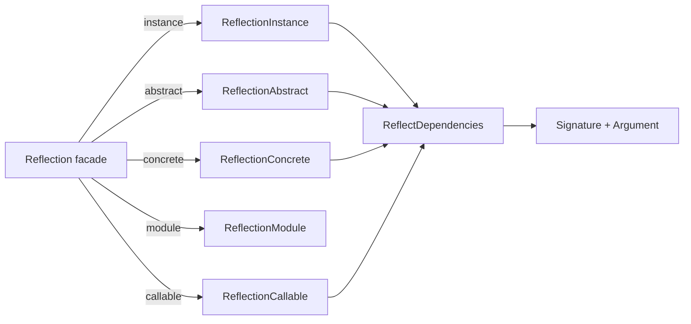

# orionis.introspection

> Cached reflection toolkit that classifies class members and resolves callable dependencies for the Orionis container.

## Table of contents

- [Functional description](#functional-description)
  - [Where it fits in the framework](#where-it-fits-in-the-framework)
  - [Reflection pipeline](#reflection-pipeline)
  - [File map](#file-map)
  - [Design decisions](#design-decisions)
- [API reference](#api-reference)
  - [Reflection](#reflection)
  - [ReflectionAbstract](#reflectionabstract)
  - [ReflectionConcrete](#reflectionconcrete)
  - [ReflectionInstance](#reflectioninstance)
  - [ReflectionCallable](#reflectioncallable)
  - [ReflectionModule](#reflectionmodule)
  - [ReflectDependencies](#reflectdependencies)
  - [Argument](#argument)
  - [Signature](#signature)
  - [ModuleInspector](#moduleinspector)
  - [Contracts](#contracts)
  - [Member classification API](#member-classification-api)
- [Usage examples](#usage-examples)
  - [Classifying the members of a class](#classifying-the-members-of-a-class)
  - [Resolving constructor dependencies](#resolving-constructor-dependencies)
  - [Reflecting an object instance](#reflecting-an-object-instance)
  - [Handling reflection errors](#handling-reflection-errors)
  - [Discovering modules and frozen dataclasses](#discovering-modules-and-frozen-dataclasses)
- [Performance and concurrency considerations](#performance-and-concurrency-considerations)
- [Compatibility notes](#compatibility-notes)

---

## Functional description

`orionis.introspection` wraps the standard library `inspect`, `typing`, `ast`
and `importlib` modules behind purpose-built classes that answer two questions
the framework asks constantly:

1. **What members does this class/instance/module expose?** — classified by
   *visibility* (public / protected / private / dunder), *kind* (instance,
   class, static method, attribute, property) and *sync vs. async*.
2. **What does this callable need in order to be built?** — every parameter is
   turned into an `Argument` and split into resolved / unresolved buckets that
   the IoC container consumes directly.

### Where it fits in the framework

| Consumer | What it uses |
| --- | --- |
| `orionis/container/container.py` | `ReflectionCallable`, `ReflectionConcrete`, `Argument`, `Signature` to autowire `make`, `build`, `invoke` and `call`. |
| `orionis/console/core/loader.py` | `ModuleInspector`, `ReflectionModule` to discover CLI commands. |
| `orionis/database/migrations/migrator.py` | `ModuleInspector`, `ReflectionModule` to discover migration classes. |
| `orionis/foundation/application.py` | `ModuleInspector` to discover configuration entities at boot. |
| `orionis/console/commands/schedule/work_command.py` | `ReflectionInstance`. |

The package has no service provider and no facade: the classes are imported and
instantiated directly.

### Reflection pipeline



`ReflectionAbstract`, `ReflectionConcrete` and `ReflectionInstance` run a
**single-pass scan** over the class namespace the first time any classification
accessor is called, then serve every subsequent accessor from an internal
cache. `ReflectDependencies` is a thin, stateful wrapper around two module-level
`functools.lru_cache` functions, so repeated inspections of the same target are
free.

### File map

| Path | Contents |
| --- | --- |
| `reflection.py` | `Reflection` — static facade: 5 factory methods plus 26 predicates. |
| `abstract/reflection.py` | `ReflectionAbstract` for `abc` classes. |
| `concretes/reflection.py` | `ReflectionConcrete` for ordinary classes. |
| `instances/reflection.py` | `ReflectionInstance` for object instances. |
| `callables/reflection.py` | `ReflectionCallable` for functions, methods and lambdas. |
| `modules/reflection.py` | `ReflectionModule` for imported modules. |
| `modules/inspector.py` | `ModuleInspector` — filesystem/AST discovery helpers. |
| `dependencies/reflection.py` | `ReflectDependencies` and the cached resolution functions. |
| `dependencies/entities/argument.py` | `Argument` frozen dataclass. |
| `dependencies/entities/signature.py` | `Signature` frozen dataclass. |
| `*/contracts/reflection.py` | `abc.ABC` interfaces implemented by each reflector. |

### Design decisions

- **Static facade with lazy imports** — `Reflection` only holds `@staticmethod`s
  and imports each concrete reflector inside the factory method, so importing
  `Reflection` does not pull the whole package into memory.
- **Single-pass scan + dictionary cache** — the visibility × kind × sync/async
  buckets are computed once per reflector instance; every `get*` accessor is a
  dictionary lookup afterwards.
- **Mapping-like cache protocol** — `ReflectionAbstract`, `ReflectionConcrete`,
  `ReflectionInstance`, `ReflectionCallable` and `ReflectionModule` implement
  `__getitem__`, `__setitem__`, `__contains__` and `__delitem__` over that same
  cache, so callers can store their own derived values next to the built-in ones.
- **Frozen entities** — `Argument` is `@dataclass(slots=True, kw_only=True,
  frozen=True)`; `Signature` is `@dataclass(frozen=True, kw_only=True)` and
  extends `orionis.support.entities.base.BaseEntity`.
- **Name mangling is hidden** — private members are returned with the
  `_ClassName` prefix stripped (`__seal`, not `_Repository__seal`), and the
  accessors that take a member name re-apply the mangling internally.

---

## API reference

### Reflection

`orionis.introspection.reflection.Reflection` — static facade, never
instantiated.

**Factory methods**

```python
@staticmethod
def instance(instance: Any) -> IReflectionInstance: ...

@staticmethod
def abstract(abstract: type) -> IReflectionAbstract: ...

@staticmethod
def concrete(concrete: type) -> IReflectionConcrete: ...

@staticmethod
def module(module: str) -> IReflectionModule: ...

@staticmethod
def callable(fn: Callable) -> IReflectionCallable: ...
```

Each factory forwards its argument to the matching reflector constructor and
therefore propagates the same exceptions (see each class below).

**Predicates** — all are `@staticmethod`, take a single `obj: Any` and return
`bool`.

| Predicate | Backed by |
| --- | --- |
| `isAbstract` | `inspect.isabstract` |
| `isAsyncGen` | `inspect.isasyncgen` |
| `isAsyncGenFunction` | `inspect.isasyncgenfunction` |
| `isAwaitable` | `inspect.isawaitable` |
| `isBuiltIn` | `inspect.isbuiltin` |
| `isClass` | `inspect.isclass` |
| `isCode` | `inspect.iscode` |
| `isCoroutine` | `inspect.iscoroutine` |
| `isCoroutineFunction` | `inspect.iscoroutinefunction` |
| `isDataDescriptor` | `inspect.isdatadescriptor` |
| `isFrame` | `inspect.isframe` |
| `isFunction` | `inspect.isfunction` |
| `isGenerator` | `inspect.isgenerator` |
| `isGeneratorFunction` | `inspect.isgeneratorfunction` |
| `isGetSetDescriptor` | `inspect.isgetsetdescriptor` |
| `isMemberDescriptor` | `inspect.ismemberdescriptor` |
| `isMethod` | `inspect.ismethod` |
| `isMethodDescriptor` | `inspect.ismethoddescriptor` |
| `isModule` | `inspect.ismodule` |
| `isRoutine` | `inspect.isroutine` |
| `isTraceback` | `inspect.istraceback` |

Five predicates implement their own rules:

- `isConcreteClass(obj)` — `True` when `obj` is a `type` that is **not**
  built-in, abstract, generic, a `Protocol`, a typing construct, does not list
  `abc.ABC` among its direct bases and has an `__init__`. Verified behaviour:
  `Reflection.isConcreteClass(int)` returns `True`, because `inspect.isbuiltin`
  is `False` for classes.
- `isGeneric(obj)` — `True` when `typing.get_origin(obj)` is not `None`, when
  `obj` exposes `__origin__`, or when `obj` is a `typing.TypeVar`.
- `isProtocol(obj)` — `True` when `obj` is a class, is a subclass of
  `typing.Protocol` and is not `Protocol` itself.
- `isInstance(obj)` — `True` when `obj` is not a class and the module of its
  type is neither `builtins` nor `abc`.
- `isTypingConstruct(obj)` — `True` when `type(obj).__name__` matches one of the
  19 hardcoded names (`Any`, `Union`, `Optional`, `List`, `Dict`, `Set`,
  `Tuple`, `Callable`, `TypeVar`, `Generic`, `Protocol`, `Literal`, `Final`,
  `TypedDict`, `NewType`, `Deque`, `DefaultDict`, `Counter`, `ChainMap`).

### ReflectionAbstract

```python
class ReflectionAbstract(IReflectionAbstract):
    def __init__(self, abstract: type) -> None: ...
```

Raises `TypeError` when `inspect.isabstract(abstract)` is `False`
(`"The class 'Repository' is not an abstract base class."`).

Beyond the [member classification API](#member-classification-api) it exposes:

| Method | Returns | Notes |
| --- | --- | --- |
| `getClass()` | `type` | The reflected class. |
| `getClassName()` | `str` | |
| `getModuleName()` | `str` | |
| `getModuleWithClassName()` | `str` | `module.ClassName`. |
| `getDocstring()` | `str \| None` | |
| `getBaseClasses()` | `list[type]` | Direct bases, as a list. |
| `getSourceCode()` | `str` | Raises `ValueError` when the source cannot be located. |
| `getFile()` | `str` | Raises `ValueError` when the class has no importable module file. |
| `getAnnotations()` | `dict` | Class annotations with the mangling prefix stripped. |
| `hasAttribute(attribute)` | `bool` | |
| `getAttribute(attribute)` | `object \| None` | |
| `setAttribute(name, value)` | `bool` | `ValueError` for invalid identifiers/keywords, `TypeError` for callables. |
| `removeAttribute(name)` | `bool` | `ValueError` when the attribute is absent. |
| `hasMethod(name)` | `bool` | Accepts the demangled private name. |
| `removeMethod(name)` | `bool` | `ValueError` when the method is absent. |
| `getMethodSignature(name)` | `inspect.Signature` | `ValueError` if absent, `TypeError` if not callable. |
| `getPropertySignature(name)` | `inspect.Signature` | `ValueError` if absent, `TypeError` if not a property. |
| `getPropertyDocstring(name)` | `str \| None` | Same exceptions as above. |
| `constructorSignature()` | `Signature` | Delegates to `ReflectDependencies`. |
| `methodSignature(method_name)` | `Signature` | `AttributeError` when the method is absent. |
| `clearCache()` | `None` | Empties the internal cache. |

### ReflectionConcrete

```python
class ReflectionConcrete(IReflectionConcrete):
    def __init__(self, concrete: type) -> None: ...
```

Raises `TypeError` when `Reflection.isConcreteClass(concrete)` is `False`
(`"Argument 'concrete' must be a class type, got 'ABCMeta' instead."`).

It offers the same surface as `ReflectionAbstract` plus:

| Method | Returns | Notes |
| --- | --- | --- |
| `getSourceCode(method=None)` | `str \| None` | Whole class when `method` is `None`; returns `None` instead of raising when the source cannot be read or the method does not exist. |
| `getFile()` | `str` | Raises `ValueError` when the class has no importable module file. |
| `getAttribute(name, default=None)` | `Any` | Supports a fallback value. |
| `setMethod(name, method)` | `bool` | `AttributeError` for invalid names, `TypeError` for non-callables. |
| `getProperty(name)` | `Any` | Invokes the getter with the class as receiver. |
| `getConstructorSignature()` | `inspect.Signature` | Raw `__init__` signature. |
| `constructorSignature()` | `Signature` | Dependency analysis of `__init__`. |
| `removeMethod(name)` | `bool` | |

### ReflectionInstance

```python
class ReflectionInstance(IReflectionInstance):
    def __init__(self, instance: Any) -> None: ...
```

Constructor guards, in order:

| Condition | Exception |
| --- | --- |
| `instance` is a class | `TypeError: The provided instance must be an object instance, not a class.` |
| its type lives in `builtins` or `abc` | `TypeError: Cannot reflect on instances of built-in or abstract base classes.` |
| its type lives in `__main__` | `ValueError: Cannot reflect on instances from '__main__'.` |

Differences from the class-level reflectors:

| Method | Returns | Notes |
| --- | --- | --- |
| `getInstance()` | `Any` | The wrapped object. |
| `getBaseClasses()` | `tuple[type, ...]` | A **tuple**, not a list. |
| `getAttributes()` and its visibility variants | `dict[str, Any]` | Read **instance** variables (`vars(instance)`), not class attributes. |
| `getAnnotations()` | `dict[str, type]` | Class annotations, demangled. |
| `getAttributeDocstring(name)` | `str \| None` | `AttributeError` when the attribute is absent. |
| `getMethodDocstring(name)` | `str \| None` | |
| `getSourceCode(method=None)` | `str \| None` | Returns `None` on failure. |
| `getFile()` | `str \| None` | Returns `None` on failure. |
| `removeMethod(name)` | `None` | Returns nothing, unlike `ReflectionConcrete.removeMethod`. |
| `getPropertyDocstring(name)` | `str` | `AttributeError` when the property is absent. |
| `setMethod(name, method)` | `bool` | Binds the callable on the **instance**, so it surfaces through the instance-variable scan, not through `getMethods()`. |

### ReflectionCallable

```python
class ReflectionCallable(IReflectionCallable):
    def __init__(self, fn: callable) -> None: ...
```

Accepts `types.FunctionType`, `types.MethodType` or any callable exposing
`__code__`; anything else raises
`TypeError: Expected a function, method, or lambda, got builtin_function_or_method`.

| Method | Returns | Notes |
| --- | --- | --- |
| `getCallable()` | `callable` | |
| `getName()` | `str` | Precomputed in `__init__`. |
| `getModuleName()` | `str` | Precomputed in `__init__`. |
| `getModuleWithCallableName()` | `str` | `module.name`. |
| `getDocstring()` | `str` | Empty string when absent. |
| `getSourceCode()` | `str` | `AttributeError` when the source is unavailable. |
| `getFile()` | `str` | Propagates `TypeError` from `inspect.getfile`. |
| `getSignature()` | `inspect.Signature` | Cached. |
| `getDependencies()` | `Signature` | Cached dependency analysis. |
| `clearCache()` | `None` | |

### ReflectionModule

```python
class ReflectionModule(IReflectionModule):
    def __init__(self, module: str) -> None: ...
```

Raises `TypeError` for a non-string, an empty/blank string
(`"Module name must be a non-empty string, got ''"`) or an import failure
(`"Failed to import module 'x': ..."`).

| Method | Returns | Notes |
| --- | --- | --- |
| `getModule()` | `object` | The imported module object. |
| `getClasses()` | `dict` | Every class found in the module namespace, including imported ones. |
| `getPublicClasses()` / `getProtectedClasses()` / `getPrivateClasses()` | `dict` | Filtered by name prefix. |
| `hasClass(class_name)` | `bool` | |
| `getClass(class_name)` | `type \| None` | |
| `setClass(class_name, cls)` | `bool` | `ValueError` for invalid names/keywords, `TypeError` when `cls` is not a class. |
| `removeClass(class_name)` | `bool` | `ValueError` when absent. |
| `getConstants()` | `dict` | Non-callable attributes whose name is uppercase. |
| `getPublicConstants()` / `getProtectedConstants()` / `getPrivateConstants()` | `dict` | |
| `getConstant(constant_name)` | `object \| None` | |
| `getFunctions()` | `dict` | Only `types.FunctionType` values. |
| `getPublicFunctions()` / `getPublicSyncFunctions()` / `getPublicAsyncFunctions()` | `dict` | Same trio for `Protected` and `Private`. |
| `getImports()` | `dict` | Module-typed attributes. |
| `getFile()` | `str` | Propagates `TypeError` from `inspect.getfile` for in-memory modules. |
| `getSourceCode()` | `str` | Raises `ValueError` when the file cannot be read. |
| `clearCache()` | `None` | |

Every accessor above memoizes its result; calling it twice returns the very same
object.

### ReflectDependencies

```python
class ReflectDependencies(IReflectDependencies):
    __slots__ = ("_target",)

    def __init__(self, target: Any | None = None) -> None: ...
    def constructorSignature(self) -> Signature: ...
    def methodSignature(self, method_name: str) -> Signature: ...
    def callableSignature(self) -> Signature: ...
```

- `constructorSignature()` inspects `target.__init__`.
- `methodSignature(name)` inspects `getattr(target, name)`; a missing name
  propagates `AttributeError`.
- `callableSignature()` raises
  `TypeError: Target 42 is not callable and cannot have a signature.` when the
  target is not callable, and `ValueError: Unable to inspect signature of ...`
  when `inspect.signature` fails (for example on `min`).

**Classification rules applied to every parameter**

| Situation | Bucket | `type` / `class_name` |
| --- | --- | --- |
| Named `self`, `cls`, `args` or `kwargs`, or declared as `*args` / `**kwargs` | skipped | — |
| No annotation and no default | `unresolved` | `type(typing.Any)` → `typing._AnyMeta` |
| Has a default value | `resolved` | `type(default)` — the default wins over the annotation |
| Annotated with a `builtins` type, no default | `unresolved` | the annotated type |
| Annotated with a non-`builtins` type, no default | `resolved` | the annotated type; `is_schema=True` when it is a `msgspec.Struct` subclass |
| Annotated with a string (forward reference) | `resolved` | module `typing`, `class_name` is the literal string, `type` is `str` |

### Argument

```python
@dataclass(slots=True, kw_only=True, frozen=True)
class Argument:
    name: str
    resolved: bool
    module_name: str
    class_name: str
    type: type[Any]
    full_class_path: str
    is_keyword_only: bool = False
    is_schema: bool = False
    default: Any | None = None
```

`__post_init__` raises `TypeError` when `module_name`, `class_name` or
`full_class_path` is not a `str`, and `ValueError` when `type` is `None` while
no `default` was supplied.

### Signature

```python
@dataclass(frozen=True, kw_only=True)
class Signature(BaseEntity):
    resolved: dict[str, Argument]
    unresolved: dict[str, Argument]
    ordered: dict[str, Argument]
```

`__post_init__` raises `TypeError` when any of the three fields is not a `dict`.

| Method | Returns | Notes |
| --- | --- | --- |
| `hasParameters()` | `bool` | `True` when `ordered` is non-empty. |
| `noArgumentsRequired()` | `bool` | Inverse of `hasParameters()`. |
| `hasUnresolvedArguments()` | `bool` | |
| `getResolved()` / `getUnresolved()` / `getAllOrdered()` | `dict[str, Argument]` | Return the **stored** dictionaries. |
| `resolvedToDict()` / `unresolvedToDict()` / `toDict()` | `dict[str, Argument]` | Return **copies**. |
| `getPositionalOnly()` / `getKeywordOnly()` | `dict[str, Argument]` | New dicts filtered by `is_keyword_only`. |
| `arguments()` | `dict_items[str, Argument]` | Iterable view over `ordered`; this is what the container consumes. |

### ModuleInspector

Static/class-method utility with a process-wide class-level cache of resolved
classes.

```python
@staticmethod
def discoverModules(base_path: Path, target_path: Path) -> set[str]: ...

@classmethod
def loadClass(
    cls: type,
    module_path: str | None = None,
    class_name: str | None = None,
    *,
    metadata: dict[str, str] | None = None,
) -> type: ...

@staticmethod
def fileImportsAny(file_path: Path, target_modules: set[str]) -> bool: ...

@staticmethod
def discoverFrozenDataclasses(
    modules: set[str],
) -> set[tuple[str, str, str, type[Any]]]: ...
```

- `discoverModules` walks `target_path` for `*.py` files, converts the parent
  directory to dotted notation relative to `base_path`, strips `site-packages`
  and virtualenv segments, and skips entries that collapse to an empty string
  (files sitting directly in `base_path`).
- `loadClass` accepts either explicit `module_path`/`class_name` or a `metadata`
  mapping with the keys `module` and `class` (`dict` or `MappingProxyType`).
  Raises `ImportError`, `AttributeError` or `TypeError` (attribute is not a
  class). Successful lookups are cached by `"module.Class"`.
- `fileImportsAny` parses the file with `ast` and returns `False` when the file
  is missing, has a syntax error, or cannot be decoded as UTF-8.
- `discoverFrozenDataclasses` returns
  `(file_stem, module_path, class_name, class_object)` tuples for frozen
  dataclasses **defined in** each module, and wraps any import failure in
  `RuntimeError`.

### Contracts

Each reflector implements an `abc.ABC` interface located in the sibling
`contracts` package:

| Contract | Abstract methods | Declares `__slots__ = ()` |
| --- | --- | --- |
| `IReflectionAbstract` | 61 | no |
| `IReflectionConcrete` | 64 | no |
| `IReflectionInstance` | 65 | no |
| `IReflectionModule` | 28 | no |
| `IReflectionCallable` | 10 | yes |
| `IReflectDependencies` | 3 | yes |

Because four of the six contracts do not declare empty slots, only
`ReflectionCallable` and `ReflectDependencies` instances are free of a
per-instance `__dict__`; `ReflectionAbstract`, `ReflectionConcrete`,
`ReflectionInstance` and `ReflectionModule` instances still carry one.

### Member classification API

`ReflectionAbstract`, `ReflectionConcrete` and `ReflectionInstance` share the
same accessor naming scheme:

```
get[Public|Protected|Private][Class|Static|""][Sync|Async|""]Methods() -> list[str]
get[Public|Protected|Private]Attributes() -> dict
get[Public|Protected|Private]Properties() -> list[str]
getDunderMethods() / getMagicMethods() -> list[str]
getDunderAttributes() / getMagicAttributes() -> dict
```

- **Visibility** — `Public` (no leading underscore), `Protected` (single leading
  underscore), `Private` (name-mangled, returned with the `_ClassName` prefix
  removed), plus the separate dunder accessors.
- **Kind** — plain instance methods, `Class` methods (`@classmethod`) or
  `Static` methods (`@staticmethod`).
- **Sync/async** — the `Sync`/`Async` infix splits the list by
  `inspect.iscoroutinefunction`; omitting it returns both.
- `getMagicMethods()` and `getMagicAttributes()` are aliases of the `Dunder`
  variants.
- `getMethods()` aggregates instance, class and static methods of all three
  visibilities.

---

## Usage examples

All examples below assume this module exists as `app/services/catalog.py`:

```python
from abc import ABC, abstractmethod


class CatalogContract(ABC):
    """Contract for catalog services."""

    @abstractmethod
    def search(self, term: str) -> list[str]:
        """Search the catalog."""


class Catalog:
    """In-memory catalog service."""

    limit: int = 25
    _cursor: str = "0"
    __token: str = "secret"

    def __init__(self, dsn: str = "sqlite://") -> None:
        self.dsn = dsn

    def search(self, term: str) -> list[str]:
        """Return the matching entries."""
        return [term]

    async def searchAsync(self, term: str) -> list[str]:
        """Return the matching entries asynchronously."""
        return [term]

    def _reset(self) -> None:
        """Reset the internal cursor."""

    def __seal(self) -> None:
        """Seal the catalog."""

    @classmethod
    def build(cls) -> "Catalog":
        """Build a catalog with defaults."""
        return cls()

    @staticmethod
    def ping() -> bool:
        """Return True when the service is reachable."""
        return True

    @property
    def cursor(self) -> str:
        """Return the current cursor."""
        return self._cursor
```

### Classifying the members of a class

```python
from app.services.catalog import Catalog
from orionis.introspection import Reflection

reflection = Reflection.concrete(Catalog)

print(reflection.getPublicMethods())        # ['search', 'searchAsync']
print(reflection.getPublicSyncMethods())    # ['search']
print(reflection.getPublicAsyncMethods())   # ['searchAsync']
print(reflection.getProtectedMethods())     # ['_reset']
print(reflection.getPrivateMethods())       # ['__seal']
print(reflection.getPublicClassMethods())   # ['build']
print(reflection.getPublicStaticMethods())  # ['ping']
print(reflection.getPublicProperties())     # ['cursor']
print(reflection.getPublicAttributes())     # {'limit': 25}
print(reflection.getPrivateAttributes())    # {'__token': 'secret'}
print(reflection.getMethodSignature("__seal"))  # (self) -> None
```

### Resolving constructor dependencies

```python
import msgspec

from orionis.introspection import ReflectDependencies


class Payload(msgspec.Struct):
    name: str


class Repo:
    pass


class Service:
    def __init__(self, repo: Repo, payload: Payload, retries: int, *, tag="x") -> None:
        self.repo = repo
        self.payload = payload
        self.retries = retries
        self.tag = tag


signature = ReflectDependencies(Service).constructorSignature()

print(signature.hasParameters())          # True
print(list(signature.getResolved()))      # ['repo', 'payload', 'tag']
print(list(signature.getUnresolved()))    # ['retries']
print(list(signature.getKeywordOnly()))   # ['tag']

for name, argument in signature.arguments():
    print(name, argument.class_name, argument.resolved, argument.is_schema)
# repo Repo True False
# payload Payload True True
# retries int False False
# tag str True False
```

`retries: int` lands in `unresolved` because a bare builtin annotation carries no
information the container can use to build a value.

### Reflecting an object instance

```python
from app.services.catalog import Catalog
from orionis.introspection import ReflectionInstance

reflection = ReflectionInstance(Catalog("postgres://"))

print(reflection.getClassName())          # Catalog
print(reflection.getAttributes())         # {'dsn': 'postgres://'}
print(reflection.getAnnotations())        # {'limit': <class 'int'>, ...}
print(reflection.getMethodDocstring("search"))
print(reflection.getPropertyDocstring("cursor"))
print(reflection.getProperty("cursor"))   # 0
print(type(reflection.getBaseClasses()))  # <class 'tuple'>
```

`getAttributes()` reads instance variables, so `limit`, `_cursor` and `__token`
(class attributes) are not listed; they show up in `getAnnotations()` instead.

### Handling reflection errors

```python
from app.services.catalog import Catalog, CatalogContract
from orionis.introspection import (
    ReflectDependencies,
    ReflectionAbstract,
    ReflectionCallable,
    ReflectionConcrete,
    ReflectionInstance,
    ReflectionModule,
)

try:
    ReflectionAbstract(Catalog)
except TypeError as exc:
    print(exc)  # The class 'Catalog' is not an abstract base class.

try:
    ReflectionConcrete(CatalogContract)
except TypeError as exc:
    print(exc)  # Argument 'concrete' must be a class type, got 'ABCMeta' instead.

try:
    ReflectionInstance(Catalog)
except TypeError as exc:
    print(exc)  # The provided instance must be an object instance, not a class.

try:
    ReflectionInstance(42)
except TypeError as exc:
    print(exc)  # Cannot reflect on instances of built-in or abstract base classes.

try:
    ReflectionCallable(len)
except TypeError as exc:
    print(exc)  # Expected a function, method, or lambda, got builtin_function_or_method

try:
    ReflectionModule("")
except TypeError as exc:
    print(exc)  # Module name must be a non-empty string, got ''

try:
    ReflectDependencies(min).callableSignature()
except ValueError as exc:
    print(exc)  # Unable to inspect signature of <built-in function min>: ...
```

`ReflectionInstance` also rejects objects whose class is defined in `__main__`
with `ValueError`, so run the snippets above as a module (`python -m ...`) or
import the classes from a package.

### Discovering modules and frozen dataclasses

```python
from pathlib import Path

from orionis.introspection import ModuleInspector, ReflectionModule

base = Path.cwd()
modules = ModuleInspector.discoverModules(base, base / "app")
print(sorted(modules)[:3])

Path_ = ModuleInspector.loadClass(metadata={"module": "pathlib", "class": "Path"})
print(Path_.__name__)  # Path

frozen = ModuleInspector.discoverFrozenDataclasses(
    {"orionis.introspection.dependencies.entities.argument"},
)
print(sorted(entry[2] for entry in frozen))  # ['Argument']

reflection = ReflectionModule("orionis.introspection.reflection")
print(list(reflection.getPublicClasses()))   # ['Any', 'Reflection']
print(list(reflection.getConstants()))       # ['TYPE_CHECKING']
print(list(reflection.getImports()))         # ['abc', 'inspect', 'typing']
```

`getPublicClasses()` reports `Any` because `ReflectionModule` inspects whatever
is bound in the module namespace, including imported names.

---

## Performance and concurrency considerations

- **One scan per reflector instance.** `ReflectionAbstract`, `ReflectionConcrete`
  and `ReflectionInstance` walk the class namespace once, on the first
  classification call, and then answer from a dictionary. Reuse the reflector
  instead of building a new one per query.
- **Process-wide LRU caches.** `orionis/introspection/dependencies/reflection.py`
  caches `inspect.signature` and the resolved `Signature` per target with
  `functools.lru_cache(maxsize=1024)`. Cached entries are keyed by the target
  object itself, so the target must be hashable; failures are not cached and are
  re-raised on every call.
- **Process-wide class cache.** `ModuleInspector.loadClass` stores resolved
  classes in a class-level dictionary keyed by `"module.Class"`. It is never
  invalidated during the process lifetime.
- **Mutation invalidates the cache.** `setAttribute`, `removeAttribute`,
  `setMethod` and `removeMethod` refresh or clear the internal caches. Mutating
  the reflected class directly (with `setattr`/`delattr`) does **not**, so the
  reflector may keep serving stale member lists.
- **`ReflectionModule` invalidates only the `classes` entry.** `setClass` and
  `removeClass` drop the `"classes"` cache key, but the derived views
  (`getPublicClasses`, `getProtectedClasses`, `getPrivateClasses`) keep whatever
  they had already memoized. Call `clearCache()` after mutating a module if you
  need those views refreshed.
- **No locks anywhere.** No class in this package uses `threading` or `asyncio`
  primitives. Concurrent readers of the same reflector are safe once the scan has
  completed; concurrent first-use may run the scan more than once, which is
  wasteful but produces the same result. Mutating a reflector from several
  threads is not synchronised.
- **`asyncio`.** No method in the package is a coroutine; the sync/async
  distinction refers to the *inspected* members, not to the API itself.
- **I/O.** `getSourceCode`, `getFile`, `discoverModules`, `fileImportsAny` and
  `discoverFrozenDataclasses` touch the filesystem, and `loadClass` /
  `discoverFrozenDataclasses` / `ReflectionModule.__init__` may import modules,
  executing their top-level code.

---

## Compatibility notes

- **Python `>= 3.14`** (`requires-python` in `pyproject.toml`). The package
  relies on PEP 649 semantics for annotations: `getAnnotations()` reads
  `__annotations__` directly, so a class defined in a module that uses
  `from __future__ import annotations` yields **strings**, while a class defined
  without it yields real type objects.
- **Dependencies.** Only the standard library (`abc`, `ast`, `dataclasses`,
  `functools`, `importlib`, `inspect`, `keyword`, `pathlib`, `re`, `sys`,
  `types`, `typing`) plus `msgspec>=0.21.1`, which is already a base dependency
  of Orionis and is used solely to flag `is_schema` on `Argument`.
- **No provider, no facade.** Import the classes directly; there is nothing to
  register in the container and nothing to `pin()`.
- **Private-name convention.** All accessors exchange the *demangled* name
  (`__seal`). Passing the mangled form (`_Catalog__seal`) is not supported by
  `hasMethod`, `getMethodSignature`, `removeMethod` or `methodSignature`.
- **Asymmetries between reflectors are intentional and observable.**
  `ReflectionInstance.getBaseClasses()` returns a `tuple` while the class-level
  reflectors return a `list`; `ReflectionInstance.removeMethod()` returns `None`
  while `ReflectionConcrete.removeMethod()` returns `bool`;
  `ReflectionAbstract.getSourceCode()` raises `ValueError` while the concrete and
  instance variants return `None`.
- **Spanish version:** [README.es.md](README.es.md).
