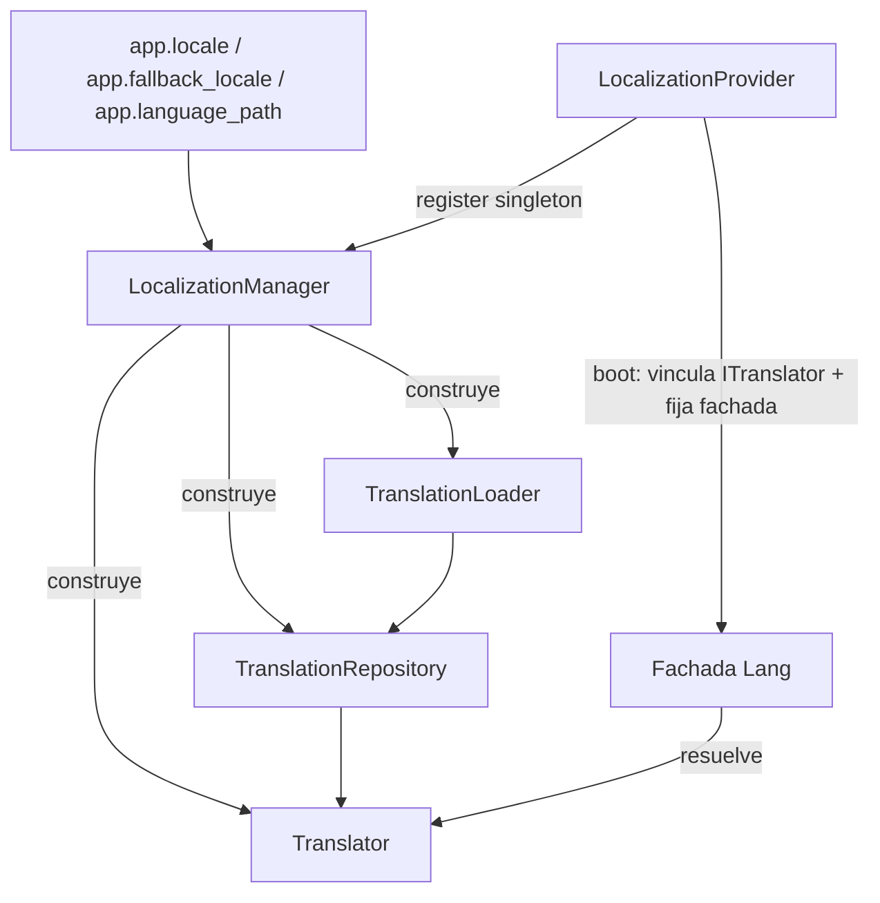

# Orionis Localization (`orionis.localization`)

> Carga, caché y pluralización de traducciones al estilo Laravel para el framework Orionis.
>
> 🇬🇧 English version: [README.md](README.md)

`orionis.localization` resuelve líneas de traducción para el locale activo
de la aplicación. Lee archivos de traducción JSON desde disco, mantiene una
caché en memoria por locale, sustituye placeholders `:name` y selecciona la
forma plural correcta de una traducción según un contador — el mismo modelo
mental que usa la fachada `Lang` de Laravel, adaptado a Python usando
`msgspec` para una decodificación JSON rápida.

---

## Tabla de contenidos

1. [Requisitos](#requisitos)
2. [Descripción funcional del módulo](#descripción-funcional-del-módulo)
3. [Arquitectura](#arquitectura)
4. [Referencia de API](#referencia-de-api)
   - [`TranslationLoader`](#translationloader-orionislocalizationloadertranslationloader)
   - [`TranslationRepository`](#translationrepository-orionislocalizationrepositorytranslationrepository)
   - [`Translator`](#translator-orionislocalizationtranslatortranslator)
   - [`LocalizationManager`](#localizationmanager-orionislocalizationmanagerlocalizationmanager)
   - [`LocalizationProvider`](#localizationprovider-orionislocalizationproviderlocalizationprovider)
   - [Excepciones](#excepciones)
   - [Tipos](#tipos)
   - [Contratos](#contratos)
5. [Ejemplos de uso](#ejemplos-de-uso)
6. [Consideraciones de rendimiento y concurrencia](#consideraciones-de-rendimiento-y-concurrencia)
7. [Notas de diseño](#notas-de-diseño)
8. [Notas de compatibilidad](#notas-de-compatibilidad)

---

## Requisitos

No se requiere ninguna instalación adicional a la del propio framework:

```bash
pip install orionis
```

- **Python:** 3.14 o superior.
- **Dependencia en tiempo de ejecución:** [`msgspec`](https://pypi.org/project/msgspec/)
  (`msgspec>=0.21.1`, dependencia central y no opcional del framework) es
  usada por `TranslationLoader` para decodificar los archivos JSON de
  traducción con el máximo rendimiento posible.
- Las fuentes de traducción son simples **archivos JSON** ubicados bajo el
  directorio configurado en `app.language_path` (ver
  [Descripción funcional del módulo](#descripción-funcional-del-módulo)).
  No se requiere ningún otro paso de instalación.

## Descripción funcional del módulo

Cualquier aplicación que sirva más de un idioma necesita tres cosas: un
lugar de donde leer el texto traducido, una forma rápida de evitar releer
ese texto en cada petición, y una manera de interpolar valores y elegir
entre formas singular y plural. `orionis.localization` ofrece las tres
cosas, divididas en colaboradores pequeños y de responsabilidad única:

- **`TranslationLoader`** lee las fuentes de traducción de un locale dado
  desde disco y devuelve un `dict[str, str]` plano. Soporta dos formatos de
  archivo:
  - **Archivos raíz** — `{language_path}/{locale}.json` — cuyas claves son
    el **texto fuente literal** (estilo Laravel de "cadenas de traducción
    como claves"), p. ej. `{"Welcome back": "Bienvenido de nuevo"}`.
  - **Archivos agrupados** — `{language_path}/{locale}/{group}.json` —
    aplanados en claves con notación de punto como `validation.required`.
  - Ante colisiones de claves, **gana el archivo raíz** sobre los archivos
    agrupados (las entradas raíz se fusionan al final).
  - El loader en sí **no mantiene caché** — cada llamada a `load()` vuelve a
    leer los archivos desde disco.
- **`TranslationRepository`** envuelve un loader con una caché en memoria
  indexada por locale, de modo que el mapa de traducciones de cada locale se
  lee de disco **como máximo una vez** por instancia del repositorio.
- **`Translator`** es el punto de entrada principal que usan las
  aplicaciones: resuelve una clave de traducción contra el locale activo
  (recurriendo a un locale de respaldo configurado, y luego a la propia
  clave), sustituye placeholders `:name` y selecciona un segmento
  pluralizado mediante `choice()`.
- **`LocalizationManager`** lee `app.locale`, `app.fallback_locale` y
  `app.language_path` de la configuración de la aplicación y conecta el
  loader, el repositorio y el traductor, cacheando una única instancia
  compartida de `Translator`.
- **`LocalizationProvider`** es el `ServiceProvider` del framework que
  registra `ILocalizationManager` como singleton, construye el traductor en
  el arranque, lo vincula bajo `ITranslator` y "fija" (pin) la fachada `Lang`
  (`orionis.support.facades.lang.Lang`, fuera de este módulo) para un acceso
  a atributos sin sobrecarga a partir de ese momento.

## Arquitectura



- `LocalizationManager` (`orionis/localization/manager.py`) es el único
  colaborador que interactúa con el contenedor/configuración de la
  aplicación; `Translator`, `TranslationRepository` y `TranslationLoader`
  son clases simples, agnósticas de DI, que solo necesitan los argumentos
  pasados a sus constructores.
- `LocalizationProvider` (`orionis/localization/provider.py`) es un
  `ServiceProvider` del framework (de
  `orionis.container.providers.service_provider`). En `register()` vincula
  `ILocalizationManager` → `LocalizationManager` como singleton; en
  `boot()` resuelve el manager, llama a `manager.translator()`, vincula el
  resultado bajo `ITranslator`, y fija la fachada `Lang`.
- Cada clase concreta implementa un contrato equivalente en
  `orionis/localization/contracts/` (`ITranslationLoader`,
  `ITranslationRepository`, `ITranslator`, `ILocalizationManager`), cada uno
  en su propio archivo; `contracts/__init__.py` los reexporta todos.
- Los globals de plantillas Jinja2 (`__`, `trans`, `choice`, `locale`,
  `locales`) se configuran en `orionis.view.helpers.lang` (fuera de este
  módulo) a través de la fachada `Lang` fijada — este módulo solo provee
  el motor de traducción subyacente.

## Referencia de API

### `TranslationLoader` (`orionis.localization.loader.TranslationLoader`)

```python
class TranslationLoader(ITranslationLoader):
    __slots__ = ("_path",)
    def __init__(self, path: Path) -> None: ...
```

Lee las fuentes de traducción de un locale directamente desde disco. No
mantiene caché.

| Método | Firma | Descripción |
| --- | --- | --- |
| `load` | `(locale: str) -> TranslationMap` | Fusiona primero los archivos agrupados `{path}/{locale}/{group}.json` (aplanados como `group.key`) y luego el archivo raíz `{path}/{locale}.json` (claves literales) — las entradas raíz ganan en caso de colisión. Devuelve `{}` si no existe nada para el locale. |
| `availableLocales` | `() -> tuple[str, ...]` | Tupla ordenada de todos los locales descubiertos a partir de archivos raíz `*.json` y subdirectorios agrupados que contienen al menos un archivo `*.json`. Devuelve `()` si el directorio de idiomas no existe. |

**Lanza:**

- `TranslationFileNotFoundException` — si un archivo se elimina entre el
  descubrimiento y la lectura (protección ante condición de carrera).
- `TranslationSyntaxException` — si un archivo contiene JSON inválido, o su
  elemento raíz no es un objeto JSON.

### `TranslationRepository` (`orionis.localization.repository.TranslationRepository`)

```python
class TranslationRepository(ITranslationRepository):
    __slots__ = ("_cache", "_loader")
    def __init__(self, loader: ITranslationLoader) -> None: ...
```

Caché en memoria de mapas de traducción indexados por locale; cada locale
se carga desde disco **exactamente una vez**.

| Método | Firma | Descripción |
| --- | --- | --- |
| `get` | `(locale: str) -> TranslationMap` | Devuelve el mapa cacheado, cargándolo mediante el loader si hay un fallo de caché (cache miss). |
| `has` | `(locale: str) -> bool` | `True` si `locale` ya está cacheado (**no** dispara una carga). |
| `forget` | `(locale: str) -> bool` | Elimina la entrada de caché de `locale`. Devuelve `True` si se eliminó una entrada. |
| `flush` | `() -> None` | Vacía toda la caché. |
| `loadedLocales` | `() -> tuple[str, ...]` | Locales actualmente presentes en la caché. |

### `Translator` (`orionis.localization.translator.Translator`)

```python
class Translator(ITranslator):
    __slots__ = ("_fallback", "_loader", "_locale", "_missing", "_repository")
    def __init__(
        self, *, locale: str, fallback: str,
        loader: ITranslationLoader, repository: ITranslationRepository,
    ) -> None: ...
```

La API principal orientada al consumidor. Lanza `InvalidLocaleException`
desde `__init__` si `locale` o `fallback` está mal formado.

**Resolución de traducciones**

| Método | Firma | Descripción |
| --- | --- | --- |
| `get` | `(key: str, locale: str \| None = None, **replace: object) -> str` | Busca `key` en `locale` (o el locale activo), luego en el locale de respaldo, y finalmente recurre al handler de claves faltantes o a la propia clave. Sustituye placeholders `:name` a partir de `**replace` cuando se proporcionan. |
| `has` | `(key: str, locale: str \| None = None, *, fallback: bool = True) -> bool` | `True` si existe una línea de traducción registrada para `key`. Usa `fallback=False` para omitir la comprobación del locale de respaldo. |
| `choice` | `(key: str, count: int, locale: str \| None = None, **replace: object) -> str` | Resuelve `key` vía `get()`, lo divide por `\|` en segmentos plurales, selecciona el segmento correspondiente (ver [reglas de pluralización](#reglas-de-pluralización)), y siempre expone un placeholder `:count` igual a `count` (salvo que se sobrescriba explícitamente en `**replace`). |

**Gestión de locales**

| Método | Firma | Descripción |
| --- | --- | --- |
| `setLocale` | `(locale: str) -> None` | Cambia el locale activo. Lanza `InvalidLocaleException` si está mal formado. |
| `getLocale` | `() -> str` | Devuelve el locale activo. |
| `availableLocales` | `() -> tuple[str, ...]` | Delega en `loader.availableLocales()`. |

**Gestión de caché**

| Método | Firma | Descripción |
| --- | --- | --- |
| `reload` | `(locale: str \| None = None) -> None` | Descarta la caché de `locale`, o toda la caché si `locale is None`, forzando una nueva lectura desde disco en el próximo acceso. |
| `forget` | `(locale: str) -> bool` | Descarta la caché de un único locale. Devuelve `True` si se eliminó una entrada. |
| `flush` | `() -> None` | Descarta toda la caché. |
| `missing` | `(handler: MissingKeyHandler \| None) -> None` | Registra un invocable `(key: str, locale: str) -> str \| None` que se llama cuando una clave no puede resolverse; si devuelve `None` (o no hay handler registrado), se usa la propia clave como traducción. |

Todos los parámetros de locale se validan con la misma expresión regular
usada internamente (`^[A-Za-z0-9]+(?:[_-][A-Za-z0-9]+)*$`); un código
inválido lanza `InvalidLocaleException` en cualquier método que acepte un
locale.

#### Sustitución de placeholders

Los placeholders `:name` se sustituyen usando tres variantes de
mayúsculas/minúsculas, aplicadas desde el **nombre de parámetro más largo al
más corto** (así `:name` nunca queda "tapado" por un placeholder más corto
como `:na` definido al mismo tiempo):

- `:name` → el valor en su forma de cadena original.
- `:Name` → el valor capitalizado (`str.capitalize()`).
- `:NAME` → el valor en mayúsculas.

#### Reglas de pluralización

`choice(key, count)` divide la línea resuelta por `|` en segmentos y elige
uno, en este orden:

1. **Condición exacta explícita** — un segmento prefijado con
   `{condición}`, p. ej. `{0} no hay manzanas|{1} una manzana|{*} :count manzanas`.
   `{*}` siempre coincide; `{n}` coincide solo cuando `count == n`.
2. **Condición de rango explícita** — un segmento prefijado con
   `[min,max]`, p. ej. `[2,4] pocas manzanas|[5,*] muchas manzanas`.
   Cualquiera de los límites puede ser `*` (sin límite en ese lado).
3. **Recurso posicional** — si ninguna condición explícita coincide: se
   usa el **primer** segmento cuando `count == 1`, y el **segundo** en
   cualquier otro caso. Una línea con un único segmento siempre se
   devuelve tal cual.

### `LocalizationManager` (`orionis.localization.manager.LocalizationManager`)

```python
class LocalizationManager(ILocalizationManager):
    __slots__ = ("_app", "_translator")
    def __init__(self, app: IApplication) -> None: ...
```

| Método | Firma | Descripción |
| --- | --- | --- |
| `translator` | `() -> ITranslator` | Devuelve el `Translator` compartido, construyéndolo en la primera llamada a partir de `app.config("app.locale")` (por defecto `"en"`), `app.config("app.fallback_locale")` (por defecto: el locale resuelto), y `app.config("app.language_path")` (por defecto `"resources/lang/"`, resuelto contra `app.basePath` si es relativo). Lanza `InvalidLocaleException` si el locale/respaldo configurado está mal formado. |

### `LocalizationProvider` (`orionis.localization.provider.LocalizationProvider`)

```python
class LocalizationProvider(ServiceProvider):
    def register(self) -> None: ...
    async def boot(self) -> None: ...
```

| Método | Descripción |
| --- | --- |
| `register()` | Vincula `ILocalizationManager` → `LocalizationManager` como singleton mediante `self.app.singleton(...)`. |
| `boot()` | Resuelve `ILocalizationManager` (`await self.app.make(...)`), llama a `manager.translator()`, vincula el resultado bajo `ITranslator` mediante `self.app.instance(...)`, y fija la fachada `Lang` (`await LangFacade.pin()`) para un acceso directo a atributos sin DI a partir de ese momento. |

### Excepciones

Todas definidas en `orionis.localization.exceptions`, y todas heredan de
`TranslationException(Exception)`:

| Excepción | Se lanza cuando |
| --- | --- |
| `TranslationException` | Clase base de todo error de localización. |
| `InvalidLocaleException` | Un código de locale está vacío, mal formado o no es seguro (falla la expresión regular de locale). |
| `TranslationFileNotFoundException` | No se encuentra un archivo de traducción en disco (condición de carrera entre el descubrimiento y la lectura). |
| `TranslationSyntaxException` | Un archivo de traducción contiene JSON inválido, o su elemento raíz no es un objeto JSON. |

### Tipos

Definidos en `orionis.localization.types` usando alias `type` de PEP 695:

| Alias | Definición | Descripción |
| --- | --- | --- |
| `TranslationMap` | `dict[str, str]` | Mapa plano de clave de traducción → texto traducido para un locale. |
| `LocaleCache` | `dict[str, TranslationMap]` | Asocia un código de locale con su mapa de traducciones. |
| `MissingKeyHandler` | `Callable[[str, str], str \| None]` | Handler invocado con `(key, locale)` ante una clave faltante; puede devolver una línea de reemplazo o `None`. |

### Contratos

Un archivo por interfaz en `orionis.localization.contracts`, todos
reexportados desde `contracts/__init__.py`:

| Contrato | Implementado por |
| --- | --- |
| `ITranslationLoader` | `TranslationLoader` |
| `ITranslationRepository` | `TranslationRepository` |
| `ITranslator` | `Translator` |
| `ILocalizationManager` | `LocalizationManager` |

## Ejemplos de uso

### Configuración de los archivos de traducción

```
resources/lang/
├── en.json                 # archivo raíz: texto fuente literal como claves
├── es.json
├── en/
│   └── validation.json     # archivo agrupado: aplanado como "validation.<clave>"
└── es/
    └── validation.json
```

```json
// resources/lang/en.json
{"Welcome back, :name!": "Welcome back, :name!"}
```

```json
// resources/lang/es.json
{"Welcome back, :name!": "¡Bienvenido de nuevo, :name!"}
```

```json
// resources/lang/en/validation.json
{"required": "The :field field is required.|The :field fields are required."}
```

### Usar `Translator` directamente

```python
from pathlib import Path
from orionis.localization import TranslationLoader, TranslationRepository, Translator

loader = TranslationLoader(Path("resources/lang"))
repository = TranslationRepository(loader)
translator = Translator(
    locale="es",
    fallback="en",
    loader=loader,
    repository=repository,
)

translator.get("Welcome back, :name!", name="Ada")
# "¡Bienvenido de nuevo, Ada!"

translator.has("Welcome back, :name!")   # True
translator.setLocale("en")
translator.getLocale()                   # "en"
translator.availableLocales()            # ("en", "es")
```

### Pluralización con `choice`

```python
translator.setLocale("en")
translator.choice("validation.required", 1, field="name")
# "The name field is required."
translator.choice("validation.required", 3, field="name")
# "The name fields are required."
```

### Manejo de claves faltantes y control de caché

```python
translator.missing(lambda key, locale: f"[missing: {key}]")
translator.get("no.such.key")   # "[missing: no.such.key]"

translator.reload("es")   # fuerza a releer "es" desde disco
translator.flush()        # descarta todos los locales cacheados
```

### A través del contenedor de la aplicación (gestionado por el framework)

```python
from orionis.localization.contracts.translator import ITranslator

# Normalmente se resuelve mediante el contenedor de DI una vez que
# LocalizationProvider ha arrancado (ver orionis.container para `make`/`build`).
translator: ITranslator = await app.make(ITranslator)
translator.get("Welcome back, :name!", name="Ada")
```

Una vez que `LocalizationProvider.boot()` se ha ejecutado, el mismo
traductor también es accesible a través de la fachada `Lang` fijada
(`orionis.support.facades.lang.Lang`, fuera de este módulo) y de los
globals de Jinja2 `__`, `trans`, `choice`, `locale`, `locales` usados en las
plantillas de vistas.

## Consideraciones de rendimiento y concurrencia

- **Búsquedas O(1) después de la primera carga**: `TranslationRepository`
  lee los archivos de cada locale desde disco **como máximo una vez**; cada
  llamada posterior a `get()` (desde `Translator.get`/`has`/`choice`) es una
  simple búsqueda en un diccionario.
- **`TranslationLoader` en sí es sin estado y sin caché** — llamar a
  `loader.load(locale)` directamente (sin pasar por el repositorio) siempre
  vuelve a leer de disco y a decodificar el JSON con `msgspec`. En el
  código de la aplicación, prefiere pasar por
  `TranslationRepository`/`Translator`.
- **`__slots__` en todas las clases concretas** (`TranslationLoader`,
  `TranslationRepository`, `Translator`, `LocalizationManager`) elimina la
  sobrecarga de `__dict__` por instancia — es una decisión de diseño
  existente.
- **Un único `Translator` compartido por aplicación**:
  `LocalizationManager` construye el traductor una sola vez
  (`translator()` cachea la instancia en `self._translator`) y
  `LocalizationProvider` lo vincula como una instancia `ITranslator` en el
  contenedor, de modo que toda la aplicación comparte una única caché de
  `TranslationRepository`.
- **Sin bloqueos alrededor de la caché**: `TranslationRepository._cache` es
  un `dict` simple sin bloqueo. En el uso normal del framework (manejo de
  peticiones síncrono respaldado por `asyncio`, sin escritores
  multi-hilo concurrentes sobre el mismo repositorio), esto no supone un
  problema; si construyes patrones de acceso concurrente personalizados
  sobre un `TranslationRepository` compartido, ten en cuenta que las cargas
  simultáneas de un mismo locale desde distintos hilos no están
  sincronizadas.
- **La validación de locale es una comprobación de frontera con expresión
  regular compilada**, realizada únicamente en `Translator`
  (`_LOCALE_PATTERN`); `TranslationLoader`/`TranslationRepository` confían
  en que la cadena de locale que reciben ya ha sido validada por quien la
  llama (`Translator`).
- **La decodificación JSON usa `msgspec.json.decode`**, elegido por su
  rendimiento frente al módulo estándar `json`; esto afecta únicamente a
  las lecturas de archivo subyacentes de `TranslationLoader.load` y
  `availableLocales` (no a cada búsqueda cacheada repetida).

## Notas de diseño

- **Colaboradores en capas, de responsabilidad única**: la carga
  (`TranslationLoader`), el cacheo (`TranslationRepository`) y la
  resolución/formateo (`Translator`) son intencionalmente clases separadas
  conectadas por `LocalizationManager`, en lugar de una única clase
  monolítica — cada una puede probarse, reemplazarse o reutilizarse de
  forma independiente (el paquete `contracts/` hace explícita esta
  sustitución).
- **Superficie de API inspirada en Laravel**: archivos raíz de traducción
  con texto literal como clave, archivos agrupados con notación de punto,
  sintaxis de placeholders `:name` con variantes automáticas
  `:Name`/`:NAME`, y pluralización con `choice()` mediante condiciones
  `{n}`/`[a,b]`, todo ello reflejando las convenciones de `Lang`/
  `trans_choice()` de Laravel, adaptadas a Python.
- **Orden de fusión "gana la raíz"**: dentro de `TranslationLoader.load()`,
  los archivos agrupados se fusionan primero y el archivo raíz se fusiona
  al final, específicamente para que las claves de texto literal del
  archivo raíz tengan precedencia sobre claves agrupadas del mismo nombre —
  es una regla de colisión deliberada, no un accidente del orden de
  iteración.
- **Sin recuperación de excepciones personalizada dentro del loader/repositorio**:
  solo `Translator` centraliza la validación del código de locale
  (`InvalidLocaleException` se lanza como comprobación de frontera);
  `TranslationLoader`/`TranslationRepository` asumen que la cadena de
  locale ya es válida, manteniendo simple su lógica interna.
- **`LocalizationManager` requiere anotaciones evaluadas (no en forma de
  cadena)**: el módulo deliberadamente **no** usa
  `from __future__ import annotations` (documentado en su propio
  docstring) porque el contenedor de DI resuelve las dependencias del
  constructor (`app: IApplication`) a partir de anotaciones de tipo
  evaluadas vía `orionis.introspection`; anotaciones en forma de cadena
  romperían la inyección del constructor para esta clase.
- **Fijado (pin) de la fachada en el arranque**:
  `LocalizationProvider.boot()` llama a `await LangFacade.pin()` después de
  vincular `ITranslator`, de modo que las llamadas posteriores a la fachada
  `Lang` omiten la resolución por contenedor y despachan directamente a la
  instancia de traductor vinculada.

## Notas de compatibilidad

- **Versión mínima de Python:** 3.14 (según `pyproject.toml`,
  `requires-python = ">=3.14"`), igual que el resto del framework. El
  módulo `types.py` usa la sentencia `type` de PEP 695, que requiere esta
  versión.
- **Dependencia obligatoria:** `msgspec>=0.21.1` (dependencia central,
  usada para la decodificación JSON rápida de los archivos de traducción).
- **Dependencias internas del framework:** `LocalizationManager` depende
  de `orionis.foundation.contracts.application.IApplication`;
  `LocalizationProvider` depende de
  `orionis.container.providers.service_provider.ServiceProvider` y de
  `orionis.support.facades.lang.Lang`. Estas forman parte del framework y
  no requieren instalación por separado.
- Sin comportamiento específico de plataforma; los archivos de traducción
  se leen con las APIs estándar de `pathlib`/`Path` y funcionan de forma
  idéntica en Windows, Linux y macOS.
