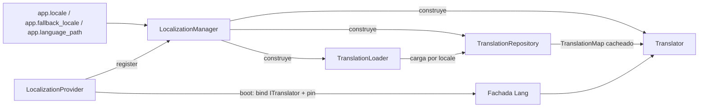

# Orionis Localization (`orionis.localization`)

> Lee archivos JSON de traducción, los cachea por locale, interpola marcadores `:name` y selecciona segmentos plurales.

🇬🇧 English version: [README.md](README.md)

## Tabla de contenidos

- [Descripción funcional](#descripción-funcional)
  - [Dónde encaja](#dónde-encaja)
  - [Flujo de resolución](#flujo-de-resolución)
  - [Mapa de archivos](#mapa-de-archivos)
  - [Disposición de los archivos de traducción](#disposición-de-los-archivos-de-traducción)
  - [Decisiones de diseño](#decisiones-de-diseño)
- [Referencia de API](#referencia-de-api)
  - [`TranslationLoader`](#translationloader)
  - [`TranslationRepository`](#translationrepository)
  - [`Translator`](#translator)
  - [`LocalizationManager`](#localizationmanager)
  - [`LocalizationProvider`](#localizationprovider)
  - [Excepciones](#excepciones)
  - [Alias de tipos](#alias-de-tipos)
  - [Contratos](#contratos)
  - [Claves de configuración](#claves-de-configuración)
- [Ejemplos de uso](#ejemplos-de-uso)
  - [Pila de traducción independiente](#pila-de-traducción-independiente)
  - [Archivos agrupados y formas plurales](#archivos-agrupados-y-formas-plurales)
  - [Manejo de errores](#manejo-de-errores)
  - [Claves ausentes e invalidación de caché](#claves-ausentes-e-invalidación-de-caché)
  - [Dentro del framework](#dentro-del-framework)
  - [Plantillas](#plantillas)
- [Consideraciones de rendimiento y concurrencia](#consideraciones-de-rendimiento-y-concurrencia)
- [Notas de compatibilidad](#notas-de-compatibilidad)

## Descripción funcional

`orionis.localization` convierte un directorio de archivos JSON en líneas
traducidas para el locale activo. Tiene cuatro responsabilidades: leer las
fuentes de traducción desde disco, cachearlas en memoria por locale, resolver
una clave (locale activo → locale de respaldo → la propia clave) y seleccionar
la forma plural adecuada para una cantidad.

### Dónde encaja

| Vecino | Relación |
| --- | --- |
| `orionis.foundation.application` | Aporta `config("app.locale")`, `config("app.fallback_locale")`, `config("app.language_path")` y `basePath`, que consume `LocalizationManager`. |
| `orionis.container.providers.service_provider` | Clase base de `LocalizationProvider`. |
| `orionis.foundation.core_providers` | Registra `LocalizationProvider` en `CORE_PROVIDERS`. |
| `orionis.support.facades.lang.Lang` | Fachada cuyo accessor es `ITranslator`; la fija `LocalizationProvider.boot()`. |
| `orionis.view.globals.lang` | Construye los globals de plantilla `trans`, `__`, `choice`, `locale` y `locales` sobre la fachada `Lang`. |
| `msgspec` | Decodifica cada archivo de traducción (`msgspec.json.decode`). |

### Flujo de resolución



Una llamada a `get()` recorre la cadena en este orden:

1. Validar el locale cuando se pasa explícitamente (`InvalidLocaleException`
   si falla).
2. Pedir al repositorio el mapa de traducciones del locale destino; el
   repositorio solo lee de disco cuando falla la caché.
3. Si la clave no existe y el destino no es el locale de respaldo, repetir la
   búsqueda contra el locale de respaldo.
4. Si la clave sigue sin aparecer, invocar el manejador de claves ausentes;
   si no hay ninguno, o no devuelve un `str`, se usa la propia clave.
5. Sustituir los marcadores cuando se han pasado parámetros por palabra clave.

### Mapa de archivos

| Archivo | Contenido |
| --- | --- |
| `__init__.py` | Reexporta las cuatro excepciones más `TranslationLoader`, `TranslationRepository`, `Translator` y `LocalizationManager`. |
| `loader.py` | `TranslationLoader`: lee y aplana las fuentes JSON, descubre locales. |
| `repository.py` | `TranslationRepository`: caché en memoria indexada por locale. |
| `translator.py` | `Translator`: búsqueda, respaldo, marcadores, pluralización y validación de locale. |
| `manager.py` | `LocalizationManager`: arma la pila desde la configuración de la aplicación. |
| `provider.py` | `LocalizationProvider`: bindings del contenedor y fijado de la fachada. |
| `exceptions.py` | `TranslationException` y sus tres especializaciones. |
| `types.py` | Alias PEP 695 `TranslationMap`, `LocaleCache`, `MissingKeyHandler`. |
| `contracts/` | `ITranslationLoader`, `ITranslationRepository`, `ITranslator`, `ILocalizationManager`. |

### Disposición de los archivos de traducción

Bajo la ruta de idiomas configurada conviven dos disposiciones:

```text
resources/lang/
├── en.json                 # archivo raíz: las claves son el texto literal
├── es.json
└── es/                     # archivos agrupados: prefijados con el nombre base
    ├── validation.json     # -> "validation.required"
    └── auth.json           # -> "auth.failed"
```

- Los archivos agrupados se mezclan primero, en el orden `sorted()` de su
  nombre, y los objetos anidados se aplanan con notación de punto
  (`{"size": {"string": "..."}}` dentro de `validation.json` se convierte en
  `validation.size.string`).
- El archivo raíz se mezcla al final, así que **las entradas raíz ganan** ante
  una colisión de claves. Un objeto anidado declarado en el archivo raíz se
  aplana bajo su propia clave.
- Las hojas que no son cadenas se almacenan como `str(value)`.

### Decisiones de diseño

- Cada colaborador implementa un ABC de `contracts/` que declara
  `__slots__ = ()`, y cada clase concreta declara sus propios `__slots__`, de
  modo que las instancias no arrastran `__dict__`.
- El loader no cachea y el repositorio no hace E/S: cachear y leer son
  deliberadamente objetos distintos.
- `Translator` es el único límite que valida códigos de locale, lo que
  mantiene el path traversal fuera del loader y del repositorio.
- `LocalizationManager` es la única clase que conoce el contenedor de la
  aplicación; las otras tres son objetos simples construidos con los
  argumentos de su constructor.
- `manager.py` **no** usa `from __future__ import annotations` a propósito: el
  contenedor resuelve las dependencias del constructor a partir de
  anotaciones evaluadas (documentado en el docstring de la clase).
- Todo el módulo es síncrono; el único `async def` es
  `LocalizationProvider.boot()`.

## Referencia de API

### `TranslationLoader`

`orionis/localization/loader.py` — implementa `ITranslationLoader`,
`__slots__ = ("_path",)`.

```python
def __init__(self, path: Path) -> None: ...
def load(self, locale: str) -> TranslationMap: ...
def availableLocales(self) -> tuple[str, ...]: ...
```

**`__init__(path)`** — `path` es el directorio absoluto (o ya resuelto) que
contiene las fuentes de traducción. Se guarda tal cual; el loader nunca lo
crea.

**`load(locale)`** — devuelve un `dict[str, str]` plano que mezcla
`{path}/{locale}/*.json` (aplanado, ordenado por nombre de archivo) y
`{path}/{locale}.json` (mezclado al final, por lo que gana en colisiones).
Devuelve un mapa vacío cuando no existe ninguna fuente. Cada llamada relee el
disco: el loader no tiene caché.

- Lanza `TranslationSyntaxException` cuando un archivo no está codificado en
  UTF-8, no es JSON válido o su elemento raíz no es un objeto JSON.
- Lanza `TranslationFileNotFoundException` desde la guarda del método privado
  `__readFile` cuando un archivo desaparece entre el descubrimiento y la
  lectura.
- Efectos secundarios: lecturas bloqueantes del sistema de archivos
  (`Path.is_dir`, `Path.glob`, `Path.is_file`, `Path.read_bytes`).

**`availableLocales()`** — recorre un solo nivel de directorio y devuelve los
códigos de locale ordenados: el nombre base de cada archivo `*.json` más el
nombre de cada directorio que contenga al menos un `*.json`. Devuelve `()`
cuando la ruta configurada no es un directorio.

### `TranslationRepository`

`orionis/localization/repository.py` — implementa `ITranslationRepository`,
`__slots__ = ("_cache", "_loader")`.

```python
def __init__(self, loader: ITranslationLoader) -> None: ...
def get(self, locale: str) -> TranslationMap: ...
def has(self, locale: str) -> bool: ...
def forget(self, locale: str) -> bool: ...
def flush(self) -> None: ...
def loadedLocales(self) -> tuple[str, ...]: ...
```

**`get(locale)`** — devuelve el mapa de traducciones cacheado, cargándolo a
través del loader en la primera petición. Los resultados vacíos también se
cachean, así que un locale desconocido se lee de disco una sola vez. El objeto
devuelto es el propio `dict` cacheado, no una copia. Propaga cualquier
excepción lanzada por el loader.

**`has(locale)`** — `True` cuando el locale ya está en la caché; nunca dispara
una carga.

**`forget(locale)`** — elimina una entrada de caché y devuelve `True` cuando
se eliminó algo, `False` en caso contrario.

**`flush()`** — limpia todas las entradas de la caché.

**`loadedLocales()`** — códigos de locale cacheados en orden de inserción.

### `Translator`

`orionis/localization/translator.py` — implementa `ITranslator`,
`__slots__ = ("_fallback", "_loader", "_locale", "_missing", "_repository")`.

```python
def __init__(
    self,
    *,
    locale: str,
    fallback: str,
    loader: ITranslationLoader,
    repository: ITranslationRepository,
) -> None: ...
def get(self, key: str, locale: str | None = None, **replace: object) -> str: ...
def has(
    self,
    key: str,
    locale: str | None = None,
    *,
    fallback: bool = True,
) -> bool: ...
def choice(
    self,
    key: str,
    count: int,
    locale: str | None = None,
    **replace: object,
) -> str: ...
def setLocale(self, locale: str) -> None: ...
def getLocale(self) -> str: ...
def availableLocales(self) -> tuple[str, ...]: ...
def reload(self, locale: str | None = None) -> None: ...
def forget(self, locale: str) -> bool: ...
def flush(self) -> None: ...
def missing(self, handler: MissingKeyHandler | None) -> None: ...
```

**Constructor** — solo admite argumentos por palabra clave. `locale` y
`fallback` se validan de inmediato y lanzan `InvalidLocaleException` si están
mal formados. `loader` solo se usa en `availableLocales()`; todas las búsquedas
pasan por `repository`.

**Validación de locale** — se acepta un locale cuando es `str` y coincide con
`^[A-Za-z0-9]+(?:[_-][A-Za-z0-9]+)*$` (por ejemplo `en`, `en_US`, `en-US`,
`zh-Hant-TW`). Cualquier otra cosa — cadena vacía, `../etc`, `es/es`,
`es.json`, un valor que no sea cadena — lanza `InvalidLocaleException`. La
comprobación se ejecuta en el constructor, en `setLocale`, en `forget`, en
`reload` cuando se indica un locale, y en `get`/`has`/`choice` cuando se pasa
un `locale=` explícito.

**`get(key, locale=None, **replace)`** — resuelve `key` contra el locale
destino, luego contra el de respaldo, luego con el manejador de claves
ausentes y finalmente devuelve la propia clave. La sustitución de marcadores
solo se ejecuta cuando `replace` no está vacío. Por cada parámetro, procesado
del nombre más largo al más corto, se reemplazan tres variantes:

| Marcador | Se sustituye por |
| --- | --- |
| `:NAME` | `str(value).upper()` |
| `:Name` | `str(value).capitalize()` |
| `:name` | `str(value)` |

Ordenar por longitud evita que `:name` eclipse a `:name_full`.

**`has(key, locale=None, *, fallback=True)`** — comprueba el locale destino y,
salvo que `fallback=False` o que el destino ya sea el locale de respaldo,
también el de respaldo.

**`choice(key, count, locale=None, **replace)`** — resuelve la línea con
`get(key, locale)` (sin sustituciones) y la divide por `|`. Los segmentos se
seleccionan en este orden:

1. **Condición exacta explícita** `{n}` — coincide cuando `n` es igual a
   `count`; `{*}` coincide con cualquier cantidad.
2. **Condición de rango explícita** `[a,b]` — coincide cuando `count >= a` y
   `count <= b`; cualquiera de los límites puede ser `*`. Los límites no
   numéricos nunca coinciden.
3. **Regla posicional** — el primer segmento cuando hay un único segmento o
   `count == 1`, y el segundo en cualquier otro caso. Se elimina cualquier
   condición explícita que siguiera presente.

El segmento seleccionado se recorta con `str.strip()`, `count` siempre queda
disponible como marcador `:count` y los parámetros extra se sustituyen con las
mismas reglas que en `get()`.

`count` se usa exactamente como se recibe: las condiciones explícitas lo
comparan contra sus límites numéricos y la regla posicional evalúa
`count == 1`. No se aplica conversión ni validación, así que una cantidad no
numérica propaga el `TypeError` de comparación que lanza Python.

**`setLocale(locale)` / `getLocale()`** — cambian y leen el locale activo. La
instancia vinculada a `ITranslator` se comparte en todo el proceso, así que
`setLocale` afecta a todas las búsquedas posteriores de todas las tareas.

**`availableLocales()`** — delega en `loader.availableLocales()`.

**`reload(locale=None)`** — `flush()` sobre el repositorio cuando
`locale is None`; en caso contrario, `forget(locale)`.

**`forget(locale)` / `flush()`** — validan (solo `forget`) y delegan en el
repositorio.

**`missing(handler)`** — registra un `Callable[[str, str], str | None]` que se
invoca con `(clave, locale_destino)` cuando una clave no puede resolverse. Su
valor de retorno solo se usa si es un `str`; cualquier otra cosa (incluido
`None`) hace que se devuelva la clave. Pasar `None` elimina el manejador.

### `LocalizationManager`

`orionis/localization/manager.py` — implementa `ILocalizationManager`,
`__slots__ = ("_app", "_translator")`.

```python
def __init__(self, app: IApplication) -> None: ...
def translator(self) -> ITranslator: ...
```

**`translator()`** — construye el translator en la primera llamada y lo
cachea, de modo que toda la aplicación comparte un translator y una caché de
traducciones. El método privado `__buildTranslator` lee:

| Ajuste | Respaldo aplicado por el manager |
| --- | --- |
| `app.locale` | `"en"` |
| `app.fallback_locale` | el `locale` ya resuelto |
| `app.language_path` | `"resources/lang/"` |

Los valores se convierten con `str(...)`. Una ruta de idiomas relativa se
resuelve contra `app.basePath`; una ruta absoluta se usa tal cual. Lanza
`InvalidLocaleException` cuando el locale configurado o el de respaldo están
mal formados.

### `LocalizationProvider`

`orionis/localization/provider.py` — extiende
`orionis.container.providers.service_provider.ServiceProvider`.

```python
def register(self) -> None: ...
async def boot(self) -> None: ...
```

**`register()`** — vincula `ILocalizationManager` → `LocalizationManager` como
singleton. No se vincula nada más en esta fase.

**`boot()`** — resuelve `ILocalizationManager`, llama a `manager.translator()`,
vincula la instancia resultante bajo `ITranslator` con `app.instance(...)` y
espera `Lang.pin()` para que el acceso a atributos de la fachada sea directo.

El provider figura en `orionis.foundation.core_providers.CORE_PROVIDERS` y no
es diferible. `register()` se ejecuta durante `Application.create()`; `boot()`
se ejecuta después, cuando arranca el runtime HTTP o CLI. Por eso, en un script
que solo importa `bootstrap.app`, `ITranslator` **no** está vinculado todavía y
la fachada `Lang` **no** está fijada — véase
[Dentro del framework](#dentro-del-framework).

### Excepciones

`orionis/localization/exceptions.py`.

| Excepción | Se lanza cuando |
| --- | --- |
| `TranslationException(Exception)` | Clase base; nunca se lanza directamente. |
| `InvalidLocaleException` | Un código de locale está vacío, mal formado, no es cadena o es inseguro para usarse en rutas. Solo la lanza `Translator`. |
| `TranslationFileNotFoundException` | Un archivo de traducción no existe cuando `TranslationLoader.__readFile` lo abre (carrera entre descubrimiento y lectura). |
| `TranslationSyntaxException` | Un archivo de traducción no está codificado en UTF-8, contiene JSON inválido, o su elemento raíz no es un objeto JSON. |

Las cuatro se reexportan desde `orionis.localization`.

### Alias de tipos

`orionis/localization/types.py`, declarados con sentencias `type` de PEP 695.

```python
type TranslationMap = dict[str, str]
type LocaleCache = dict[str, TranslationMap]
type MissingKeyHandler = Callable[[str, str], str | None]
```

`Callable` se importa en tiempo de ejecución (no bajo `TYPE_CHECKING`) para que
`MissingKeyHandler.__value__` pueda evaluarse desde herramientas de
introspección.

### Contratos

`orionis/localization/contracts/` — cuatro clases `abc.ABC`, cada una con
`__slots__ = ()`; `contracts/__init__.py` las reexporta todas.

| Contrato | Métodos abstractos |
| --- | --- |
| `ITranslationLoader` | `load`, `availableLocales` |
| `ITranslationRepository` | `get`, `has`, `forget`, `flush`, `loadedLocales` |
| `ITranslator` | `get`, `has`, `choice`, `setLocale`, `getLocale`, `availableLocales`, `reload`, `forget`, `flush`, `missing` |
| `ILocalizationManager` | `translator` |

### Claves de configuración

Las lee `LocalizationManager` mediante `app.config(...)`; se declaran en
`config/app.py`.

| Clave | Variable de entorno | Valor por defecto |
| --- | --- | --- |
| `app.locale` | `APP_LOCALE` | `en` |
| `app.fallback_locale` | `APP_FALLBACK_LOCALE` | `en` |
| `app.language_path` | `APP_LANGUAGE_PATH` | `resources/lang/` |

## Ejemplos de uso

### Pila de traducción independiente

Cablear los tres colaboradores a mano, sin contenedor de aplicación.

```python
from pathlib import Path
from orionis.localization import TranslationLoader, TranslationRepository, Translator

loader = TranslationLoader(Path("resources/lang"))
repository = TranslationRepository(loader)
translator = Translator(
    locale="es",
    fallback="en",
    loader=loader,
    repository=repository,
)

print(translator.get("Welcome"))
print(translator.get("Hello :name", name="Carlos"))
print(translator.choice("There is one apple|There are :count apples", 1))
print(translator.choice("There is one apple|There are :count apples", 5))
print(translator.availableLocales())
print(translator.has("Welcome"), translator.has("Missing key"))
```

```text
Bienvenido
Hello Carlos
There is one apple
There are 5 apples
('en', 'es')
True False
```

`"Hello :name"` no está declarada en `resources/lang`, así que se devuelve la
propia clave y solo se sustituye el marcador.

### Archivos agrupados y formas plurales

```python
import tempfile
from pathlib import Path
from orionis.localization import TranslationLoader, TranslationRepository, Translator

with tempfile.TemporaryDirectory() as tmp:
    root = Path(tmp)
    (root / "es").mkdir()
    (root / "es" / "validation.json").write_text(
        '{"required": "El campo :attribute es obligatorio",'
        ' "size": {"string": "Maximo :max caracteres"}}',
        encoding="utf-8",
    )
    (root / "es.json").write_text('{"Save": "Guardar"}', encoding="utf-8")

    loader = TranslationLoader(root)
    print(loader.load("es"))

    translator = Translator(
        locale="es",
        fallback="es",
        loader=loader,
        repository=TranslationRepository(loader),
    )
    print(translator.get("validation.required", attribute="email"))
    print(translator.get("validation.size.string", max=10))
    print(translator.choice("{0} Sin archivos|{1} Un archivo|[2,*] :count archivos", 0))
    print(translator.choice("{0} Sin archivos|{1} Un archivo|[2,*] :count archivos", 4))
```

```text
{'validation.required': 'El campo :attribute es obligatorio', 'validation.size.string': 'Maximo :max caracteres', 'Save': 'Guardar'}
El campo email es obligatorio
Maximo 10 caracteres
Sin archivos
4 archivos
```

### Manejo de errores

```python
import tempfile
from pathlib import Path
from orionis.localization import (
    InvalidLocaleException,
    TranslationLoader,
    TranslationRepository,
    TranslationSyntaxException,
    Translator,
)

loader = TranslationLoader(Path("resources/lang"))
translator = Translator(
    locale="en",
    fallback="en",
    loader=loader,
    repository=TranslationRepository(loader),
)

try:
    translator.setLocale("../etc/passwd")
except InvalidLocaleException as exc:
    print(f"{type(exc).__name__}: {exc}")

with tempfile.TemporaryDirectory() as tmp:
    (Path(tmp) / "es.json").write_text("{broken", encoding="utf-8")
    try:
        TranslationLoader(Path(tmp)).load("es")
    except TranslationSyntaxException as exc:
        print(type(exc).__name__)
```

```text
InvalidLocaleException: Invalid locale code: '../etc/passwd'
TranslationSyntaxException
```

Ambas excepciones derivan de `TranslationException`, así que una sola cláusula
`except TranslationException` atrapa cualquier fallo de localización.

### Claves ausentes e invalidación de caché

```python
import tempfile
from pathlib import Path
from orionis.localization import TranslationLoader, TranslationRepository, Translator

missing_keys = []


def report(key: str, locale: str) -> str | None:
    """Collect untranslated keys and let the translator echo them."""
    missing_keys.append((key, locale))
    return None


with tempfile.TemporaryDirectory() as tmp:
    root = Path(tmp)
    (root / "es.json").write_text('{"Save": "Guardar"}', encoding="utf-8")

    loader = TranslationLoader(root)
    repository = TranslationRepository(loader)
    translator = Translator(
        locale="es",
        fallback="es",
        loader=loader,
        repository=repository,
    )
    translator.missing(report)

    print(translator.get("Cancel"), missing_keys)
    print(repository.loadedLocales())

    (root / "es.json").write_text('{"Save": "Guardar cambios"}', encoding="utf-8")
    print(translator.get("Save"))
    translator.reload("es")
    print(translator.get("Save"))
```

```text
Cancel [('Cancel', 'es')]
('es',)
Guardar
Guardar cambios
```

El segundo `print` muestra la caché en acción: editar el archivo no cambia nada
hasta que `reload()` descarta el locale cacheado.

### Dentro del framework

Una vez arrancado el runtime HTTP o CLI, `ITranslator` está vinculado y `Lang`
está fijada, así que `await app.make(ITranslator)` y `Lang.get(...)` funcionan.
El script siguiente se ejecuta fuera de ese ciclo de vida, donde solo está
disponible `ILocalizationManager`, y reproduce a mano los dos bindings.

```python
import asyncio
from bootstrap.app import app
from orionis.localization.contracts.manager import ILocalizationManager
from orionis.localization.contracts.translator import ITranslator
from orionis.support.facades.lang import Lang


async def main() -> None:
    """Resolve the shared translator through the container."""
    manager = await app.make(ILocalizationManager)
    translator = manager.translator()
    print(translator.get("Welcome", locale="es"))
    print(translator is manager.translator())

    app.instance(ITranslator, translator)
    await Lang.pin()
    print(Lang.get("Welcome", locale="es"))
    print(Lang.choice("There is one apple|There are :count apples", 5))
    print(Lang.getLocale(), Lang.availableLocales())


asyncio.run(main())
```

```text
Bienvenido
True
Bienvenido
There are 5 apples
es ('en', 'es')
```

Sin `app.instance(ITranslator, ...)`, `await app.make(ITranslator)` lanza
`TypeError: Argument 'concrete' must be a class type, got 'ABCMeta' instead.`,
y un `Lang.get("Welcome")` sin fijar devuelve un objeto `_FacadeDispatch` en
lugar de una cadena.

En el código de aplicación — controladores, comandos, middleware — se inyecta
el contrato o se usa la fachada ya fijada:

```python
from orionis.http import HttpResponse, response
from orionis.localization.contracts.translator import ITranslator


class GreetingController:

    async def index(self, translator: ITranslator) -> HttpResponse:
        """Return a greeting translated into the active locale."""
        return response.json({"message": translator.get("Welcome")})
```

### Plantillas

`orionis.view.provider.ViewServiceProvider.boot()` registra cinco globals de
Jinja2 construidos en `orionis.view.globals.lang` sobre la fachada `Lang`:
`trans`, su alias `__`, `choice`, `locale` y `locales`. Aceptan los mismos
argumentos que los métodos equivalentes del translator.

```jinja
<html lang="{{ locale() }}">
  <h1>{{ __("Welcome") }}</h1>
  <p>{{ trans("Hello :name", name=user.name) }}</p>
  <p>{{ choice("There is one apple|There are :count apples", basket.size) }}</p>
  <ul>
    <li>{{ code }}</li>
  </ul>
</html>
```

## Consideraciones de rendimiento y concurrencia

- **El disco solo se toca cuando falla la caché.**
  `TranslationRepository.get()` es una única búsqueda en `dict` una vez que el
  locale se ha cargado; `TranslationLoader.load()` relee y vuelve a decodificar
  todos los archivos en cada llamada y es la única operación cara.
- **E/S bloqueante.** El loader usa llamadas síncronas de `pathlib`. Como el
  translator se construye normalmente durante `LocalizationProvider.boot()`,
  ese coste se paga al arrancar y no por petición — salvo que se llame a
  `reload()`, `forget()` o `flush()` en caliente, lo que devuelve la siguiente
  carga al hilo del llamante (incluido un event loop de `asyncio`).
- **Sin locks en ninguna parte.** El módulo no contiene ninguna primitiva de
  `threading` ni de `asyncio`. Dos tareas concurrentes que fallen la caché del
  mismo locale pueden llamar ambas a `loader.load()`; gana la última
  asignación y ambas reciben un mapa válido. Esta garantía está declarada en
  los docstrings de clase de `TranslationRepository` y `Translator`.
- **Estado mutable compartido.** `LocalizationProvider` vincula una única
  instancia de `Translator` para todo el proceso, así que `setLocale()`,
  `missing()`, `reload()`, `forget()` y `flush()` son efectos globales. Para
  seleccionar idioma por petición o por llamada, pasar `locale=` a `get`, `has`
  o `choice` en lugar de cambiar el locale activo.
- **El mapa cacheado no se copia.** `TranslationRepository.get()` devuelve el
  propio `dict` cacheado; mutarlo muta la caché para todos los consumidores.
- **Coste de la sustitución.** Cada parámetro realiza hasta tres pasadas de
  `str.replace` sobre la línea, y los nombres de parámetro se ordenan en cada
  llamada que los aporte; las líneas sin parámetros se saltan la sustitución
  por completo.
- **Acceso por fachada.** Tras `Lang.pin()` (ejecutado en `boot()`), las
  llamadas a la fachada son acceso directo y síncrono a atributos, sin
  resolución del contenedor.

## Notas de compatibilidad

- **Python:** `>= 3.14` (`requires-python` en `pyproject.toml`). `types.py`
  usa sentencias de alias `type` de PEP 695.
- **Dependencias:** `msgspec>=0.21.1`, dependencia base del framework; no hace
  falta instalar nada más allá de `pip install orionis`.
- **Codificación:** los archivos de traducción deben ser JSON codificado en
  UTF-8. Se leen como bytes con `Path.read_bytes()` y los decodifica
  `msgspec.json.decode`; un archivo guardado en cualquier otra codificación
  lanza `TranslationSyntaxException`.
- **`from __future__ import annotations`:** lo usan `loader.py`,
  `repository.py`, `translator.py`, `provider.py`, `types.py` y todos los
  contratos, pero **no** `manager.py`, cuyo constructor reflecciona el
  contenedor de inyección de dependencias.
- **Slots:** los cuatro contratos declaran `__slots__ = ()` y las cuatro clases
  concretas declaran sus propios `__slots__`, así que sus instancias no tienen
  `__dict__`. Una subclase que necesite atributos extra debe declarar sus
  propios `__slots__` o un `__dict__`.
- **Seguridad de rutas:** los códigos de locale se validan contra un patrón
  estricto antes de llegar al sistema de archivos, lo que rechaza separadores y
  segmentos `..`.
