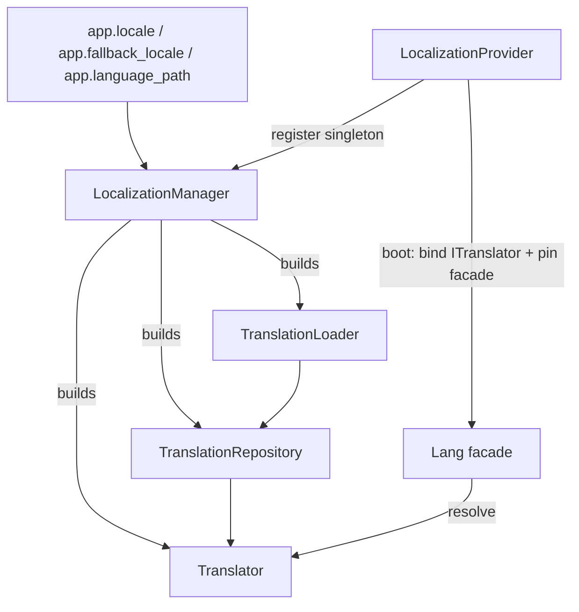

# Orionis Localization (`orionis.localization`)

> Laravel-style translation loading, caching, and pluralization for the Orionis Framework.
>
> 🇪🇸 Versión en español: [README.es.md](README.es.md)

`orionis.localization` resolves translation lines for the application's
active locale. It reads JSON translation files from disk, keeps a
per-locale in-memory cache, substitutes `:name`-style placeholders, and
picks the correct plural form of a translation based on a count — the same
mental model used by Laravel's `Lang` facade, adapted to Python with
`msgspec` for fast JSON decoding.

---

## Table of contents

1. [Requirements](#requirements)
2. [Module overview](#module-overview)
3. [Architecture](#architecture)
4. [API reference](#api-reference)
   - [`TranslationLoader`](#translationloader-orionislocalizationloadertranslationloader)
   - [`TranslationRepository`](#translationrepository-orionislocalizationrepositorytranslationrepository)
   - [`Translator`](#translator-orionislocalizationtranslatortranslator)
   - [`LocalizationManager`](#localizationmanager-orionislocalizationmanagerlocalizationmanager)
   - [`LocalizationProvider`](#localizationprovider-orionislocalizationproviderlocalizationprovider)
   - [Exceptions](#exceptions)
   - [Types](#types)
   - [Contracts](#contracts)
5. [Usage examples](#usage-examples)
6. [Performance and concurrency considerations](#performance-and-concurrency-considerations)
7. [Design notes](#design-notes)
8. [Compatibility notes](#compatibility-notes)

---

## Requirements

No installation beyond the framework itself is required:

```bash
pip install orionis
```

- **Python:** 3.14 or newer.
- **Runtime dependency:** [`msgspec`](https://pypi.org/project/msgspec/)
  (`msgspec>=0.21.1`, a core, non-optional dependency of the framework) is
  used by `TranslationLoader` to decode translation JSON files as fast as
  possible.
- Translation sources are plain **JSON files** placed under the directory
  configured by `app.language_path` (see [Module overview](#module-overview)).
  No other installation step is required.

## Module overview

Any application that serves more than one language needs three things: a
place to read translation text from, a fast way to avoid re-reading that
text on every request, and a way to interpolate values and pick singular vs.
plural forms. `orionis.localization` provides all three, split into small,
single-purpose collaborators:

- **`TranslationLoader`** reads translation sources for a given locale from
  disk and returns a flat `dict[str, str]`. It supports two file layouts:
  - **Root files** — `{language_path}/{locale}.json` — whose keys are the
    **literal source text** (Laravel "translation strings as keys" style),
    e.g. `{"Welcome back": "Bienvenido de nuevo"}`.
  - **Grouped files** — `{language_path}/{locale}/{group}.json` — flattened
    into dot-notated keys such as `validation.required`.
  - On key collisions, the **root file wins** over grouped files (root
    entries are merged last).
  - The loader itself holds **no cache** — every `load()` call re-reads the
    files from disk.
- **`TranslationRepository`** wraps a loader with an in-memory cache keyed
  by locale, so each locale's translation map is read from disk **at most
  once** per repository instance.
- **`Translator`** is the main entry point applications use: it resolves a
  translation key against the active locale (falling back to a configured
  fallback locale, then to the key itself), substitutes `:name` placeholders,
  and selects a pluralized segment via `choice()`.
- **`LocalizationManager`** reads `app.locale`, `app.fallback_locale`, and
  `app.language_path` from the application configuration and wires the
  loader, repository, and translator together, caching a single shared
  `Translator` instance.
- **`LocalizationProvider`** is the framework `ServiceProvider` that
  registers `ILocalizationManager` as a singleton, builds the translator at
  boot time, binds it under `ITranslator`, and pins the `Lang` facade
  (`orionis.support.facades.lang.Lang`, outside this module) for
  overhead-free attribute access afterwards.

## Architecture



- `LocalizationManager` (`orionis/localization/manager.py`) is the only
  collaborator that talks to the application container/config; `Translator`,
  `TranslationRepository`, and `TranslationLoader` are plain, DI-agnostic
  classes that only need the arguments passed to their constructors.
- `LocalizationProvider` (`orionis/localization/provider.py`) is a framework
  `ServiceProvider` (from `orionis.container.providers.service_provider`).
  In `register()` it binds `ILocalizationManager` → `LocalizationManager` as
  a singleton; in `boot()` it resolves the manager, calls
  `manager.translator()`, binds the resulting instance under `ITranslator`,
  and pins the `Lang` facade.
- Every concrete class implements a matching contract in
  `orionis/localization/contracts/` (`ITranslationLoader`,
  `ITranslationRepository`, `ITranslator`, `ILocalizationManager`), each in
  its own file; `contracts/__init__.py` re-exports all four.
- Jinja2 template globals (`__`, `trans`, `choice`, `locale`, `locales`) are
  wired in `orionis.view.helpers.lang` (outside this module) through the
  pinned `Lang` facade — this module only provides the underlying
  translation engine.

## API reference

### `TranslationLoader` (`orionis.localization.loader.TranslationLoader`)

```python
class TranslationLoader(ITranslationLoader):
    __slots__ = ("_path",)
    def __init__(self, path: Path) -> None: ...
```

Reads translation sources for a locale directly from disk. Holds no cache.

| Method | Signature | Description |
| --- | --- | --- |
| `load` | `(locale: str) -> TranslationMap` | Merges grouped `{path}/{locale}/{group}.json` files (flattened as `group.key`) first, then the root `{path}/{locale}.json` file (literal keys) — root entries win on collision. Returns `{}` if nothing exists for the locale. |
| `availableLocales` | `() -> tuple[str, ...]` | Sorted tuple of every locale discovered from root `*.json` files and grouped subdirectories containing at least one `*.json` file. Returns `()` if the language path does not exist. |

**Raises:**

- `TranslationFileNotFoundException` — if a file is removed between
  discovery and read (race condition guard).
- `TranslationSyntaxException` — if a file contains invalid JSON, or its
  root JSON element is not an object.

### `TranslationRepository` (`orionis.localization.repository.TranslationRepository`)

```python
class TranslationRepository(ITranslationRepository):
    __slots__ = ("_cache", "_loader")
    def __init__(self, loader: ITranslationLoader) -> None: ...
```

In-memory cache of translation maps keyed by locale; each locale is loaded
from disk **exactly once**.

| Method | Signature | Description |
| --- | --- | --- |
| `get` | `(locale: str) -> TranslationMap` | Returns the cached map, loading it via the loader on a cache miss. |
| `has` | `(locale: str) -> bool` | `True` if `locale` is already cached (does **not** trigger a load). |
| `forget` | `(locale: str) -> bool` | Removes the cache entry for `locale`. Returns `True` if an entry was removed. |
| `flush` | `() -> None` | Clears the entire cache. |
| `loadedLocales` | `() -> tuple[str, ...]` | Locales currently present in the cache. |

### `Translator` (`orionis.localization.translator.Translator`)

```python
class Translator(ITranslator):
    __slots__ = ("_fallback", "_loader", "_locale", "_missing", "_repository")
    def __init__(
        self, *, locale: str, fallback: str,
        loader: ITranslationLoader, repository: ITranslationRepository,
    ) -> None: ...
```

The main consumer-facing API. Raises `InvalidLocaleException` from `__init__`
if `locale` or `fallback` is malformed.

**Translation resolution**

| Method | Signature | Description |
| --- | --- | --- |
| `get` | `(key: str, locale: str \| None = None, **replace: object) -> str` | Looks up `key` in `locale` (or the active locale), then in the fallback locale, then falls back to the missing-key handler / the key itself. Substitutes `:name` placeholders from `**replace` when provided. |
| `has` | `(key: str, locale: str \| None = None, *, fallback: bool = True) -> bool` | `True` if a translation line is registered for `key`. Set `fallback=False` to skip checking the fallback locale. |
| `choice` | `(key: str, count: int, locale: str \| None = None, **replace: object) -> str` | Resolves `key` via `get()`, splits it on `\|` into plural segments, selects the matching segment (see [pluralization rules](#pluralization-rules)), and always exposes a `:count` placeholder set to `count` (unless explicitly overridden in `**replace`). |

**Locale management**

| Method | Signature | Description |
| --- | --- | --- |
| `setLocale` | `(locale: str) -> None` | Changes the active locale. Raises `InvalidLocaleException` if malformed. |
| `getLocale` | `() -> str` | Returns the active locale. |
| `availableLocales` | `() -> tuple[str, ...]` | Delegates to `loader.availableLocales()`. |

**Cache management**

| Method | Signature | Description |
| --- | --- | --- |
| `reload` | `(locale: str \| None = None) -> None` | Discards the cache for `locale`, or the entire cache when `locale is None`, forcing a re-read from disk on next access. |
| `forget` | `(locale: str) -> bool` | Discards the cache for a single locale. Returns `True` if an entry was removed. |
| `flush` | `() -> None` | Discards the entire cache. |
| `missing` | `(handler: MissingKeyHandler \| None) -> None` | Registers a callable `(key: str, locale: str) -> str \| None` invoked when a key cannot be resolved; if it returns `None` (or is unset), the key itself is used as the translation. |

All locale arguments are validated against the same regex used internally
(`^[A-Za-z0-9]+(?:[_-][A-Za-z0-9]+)*$`); an invalid code raises
`InvalidLocaleException` wherever a locale parameter is accepted.

#### Placeholder substitution

`:name` placeholders are replaced using three case variants, applied from
the **longest parameter name to the shortest** (so `:name` is never
shadowed by a shorter `:na` placeholder defined at the same time):

- `:name` → the raw string value.
- `:Name` → the value capitalized (`str.capitalize()`).
- `:NAME` → the value uppercased.

#### Pluralization rules

`choice(key, count)` splits the resolved line on `|` into segments and
picks one, in this order:

1. **Explicit exact condition** — a segment prefixed with `{condition}`,
   e.g. `{0} no apples|{1} one apple|{*} :count apples`. `{*}` always
   matches; `{n}` matches only when `count == n`.
2. **Explicit range condition** — a segment prefixed with `[low,high]`,
   e.g. `[2,4] a few apples|[5,*] many apples`. Either bound may be `*`
   (unbounded on that side).
3. **Positional fallback** — if no explicit condition matches: the
   **first** segment is used when `count == 1`, the **second** segment
   otherwise. A single-segment line is always returned as-is.

### `LocalizationManager` (`orionis.localization.manager.LocalizationManager`)

```python
class LocalizationManager(ILocalizationManager):
    __slots__ = ("_app", "_translator")
    def __init__(self, app: IApplication) -> None: ...
```

| Method | Signature | Description |
| --- | --- | --- |
| `translator` | `() -> ITranslator` | Returns the shared `Translator`, building it on first call from `app.config("app.locale")` (default `"en"`), `app.config("app.fallback_locale")` (default: the resolved locale), and `app.config("app.language_path")` (default `"resources/lang/"`, resolved against `app.basePath` when relative). Raises `InvalidLocaleException` if the configured locale/fallback is malformed. |

### `LocalizationProvider` (`orionis.localization.provider.LocalizationProvider`)

```python
class LocalizationProvider(ServiceProvider):
    def register(self) -> None: ...
    async def boot(self) -> None: ...
```

| Method | Description |
| --- | --- |
| `register()` | Binds `ILocalizationManager` → `LocalizationManager` as a singleton via `self.app.singleton(...)`. |
| `boot()` | Resolves `ILocalizationManager` (`await self.app.make(...)`), calls `manager.translator()`, binds the result under `ITranslator` via `self.app.instance(...)`, and pins the `Lang` facade (`await LangFacade.pin()`) for direct, DI-free attribute access afterwards. |

### Exceptions

All defined in `orionis.localization.exceptions`, all inheriting from
`TranslationException(Exception)`:

| Exception | Raised when |
| --- | --- |
| `TranslationException` | Base class for every localization error. |
| `InvalidLocaleException` | A locale code is empty, malformed, or unsafe (fails the locale regex). |
| `TranslationFileNotFoundException` | A translation file cannot be found on disk (race condition between discovery and read). |
| `TranslationSyntaxException` | A translation file contains invalid JSON, or its root element is not a JSON object. |

### Types

Defined in `orionis.localization.types` using PEP 695 `type` aliases:

| Alias | Definition | Description |
| --- | --- | --- |
| `TranslationMap` | `dict[str, str]` | Flat mapping of translation key → translated text for one locale. |
| `LocaleCache` | `dict[str, TranslationMap]` | Maps a locale code to its translation map. |
| `MissingKeyHandler` | `Callable[[str, str], str \| None]` | Handler invoked with `(key, locale)` on a missing key; may return a replacement line or `None`. |

### Contracts

One file per interface in `orionis.localization.contracts`, all re-exported
from `contracts/__init__.py`:

| Contract | Implemented by |
| --- | --- |
| `ITranslationLoader` | `TranslationLoader` |
| `ITranslationRepository` | `TranslationRepository` |
| `ITranslator` | `Translator` |
| `ILocalizationManager` | `LocalizationManager` |

## Usage examples

### Setting up translation files

```
resources/lang/
├── en.json                 # root file: literal source text as keys
├── es.json
├── en/
│   └── validation.json     # grouped file: flattened as "validation.<key>"
└── es/
    └── validation.json
```

```json
// resources/lang/en.json
{"Welcome back, :name!": "Welcome back, :name!"}
```

```json
// resources/lang/es.json
{"Welcome back, :name!": "¡Bienvenido de nuevo, :name!"}
```

```json
// resources/lang/en/validation.json
{"required": "The :field field is required.|The :field fields are required."}
```

### Using `Translator` directly

```python
from pathlib import Path
from orionis.localization import TranslationLoader, TranslationRepository, Translator

loader = TranslationLoader(Path("resources/lang"))
repository = TranslationRepository(loader)
translator = Translator(
    locale="es",
    fallback="en",
    loader=loader,
    repository=repository,
)

translator.get("Welcome back, :name!", name="Ada")
# "¡Bienvenido de nuevo, Ada!"

translator.has("Welcome back, :name!")   # True
translator.setLocale("en")
translator.getLocale()                   # "en"
translator.availableLocales()            # ("en", "es")
```

### Pluralization with `choice`

```python
translator.setLocale("en")
translator.choice("validation.required", 1, field="name")
# "The name field is required."
translator.choice("validation.required", 3, field="name")
# "The name fields are required."
```

### Missing-key handling and cache control

```python
translator.missing(lambda key, locale: f"[missing: {key}]")
translator.get("no.such.key")   # "[missing: no.such.key]"

translator.reload("es")   # forces "es" to be re-read from disk
translator.flush()        # drops every cached locale
```

### Via the application container (framework-managed)

```python
from orionis.localization.contracts.translator import ITranslator

# Typically resolved through the DI container once LocalizationProvider
# has booted (see orionis.container for `make`/`build`).
translator: ITranslator = await app.make(ITranslator)
translator.get("Welcome back, :name!", name="Ada")
```

Once `LocalizationProvider.boot()` has run, the same translator is also
reachable through the pinned `Lang` facade
(`orionis.support.facades.lang.Lang`, outside this module) and through the
Jinja2 globals `__`, `trans`, `choice`, `locale`, `locales` used in view
templates.

## Performance and concurrency considerations

- **O(1) lookups after the first load**: `TranslationRepository` reads each
  locale's files from disk **at most once**; every subsequent `get()` call
  (from `Translator.get`/`has`/`choice`) is a plain dictionary lookup.
- **`TranslationLoader` itself is stateless and uncached** — calling
  `loader.load(locale)` directly (bypassing the repository) always re-reads
  from disk and re-decodes JSON with `msgspec`. Prefer going through
  `TranslationRepository`/`Translator` in application code.
- **`__slots__` on every concrete class** (`TranslationLoader`,
  `TranslationRepository`, `Translator`, `LocalizationManager`) removes
  per-instance `__dict__` overhead — an existing design choice.
- **Single shared `Translator` per application**: `LocalizationManager`
  builds the translator once (`translator()` caches the instance in
  `self._translator`) and `LocalizationProvider` binds it as an `ITranslator`
  instance in the container, so the whole application shares one
  `TranslationRepository` cache.
- **No locking around the cache**: `TranslationRepository._cache` is a plain
  `dict` with no lock. In the framework's normal usage (synchronous request
  handling backed by `asyncio`, no multi-threaded writers to the same
  repository), this is not an issue; if you build custom concurrent access
  patterns around a shared `TranslationRepository`, be aware that
  simultaneous first-time loads of the same locale from different threads
  are not synchronized.
- **Locale validation is a compiled regex boundary check** performed only in
  `Translator` (`_LOCALE_PATTERN`); `TranslationLoader`/`TranslationRepository`
  trust that the locale string they receive has already been validated by
  the caller (`Translator`).
- **JSON decoding uses `msgspec.json.decode`**, chosen for throughput over
  the standard library's `json` module; this affects `TranslationLoader.load`
  and `availableLocales`'s underlying file reads only (not repeated per
  cached lookup).

## Design notes

- **Layered, single-responsibility collaborators**: loading (`TranslationLoader`),
  caching (`TranslationRepository`), and resolution/formatting (`Translator`)
  are intentionally separate classes wired together by `LocalizationManager`,
  rather than one monolithic class — each can be tested, replaced, or reused
  independently (the `contracts/` package makes this substitution explicit).
- **Laravel-inspired API surface**: literal-text root translation files,
  dot-notated grouped files, `:name` placeholder syntax with automatic
  `:Name`/`:NAME` case variants, and `choice()` pluralization with `{n}`/
  `[a,b]` conditions all mirror Laravel's `Lang`/`trans_choice()` conventions,
  adapted to Python.
- **Root-wins merge order**: within `TranslationLoader.load()`, grouped
  files are merged first and the root file is merged last specifically so
  literal-text keys in the root file take precedence over same-named
  grouped keys — this is a deliberate collision rule, not an accident of
  iteration order.
- **No custom exception recovery inside the loader/repository**: only
  `Translator` centralizes locale-code validation (`InvalidLocaleException`
  is raised as a boundary check); `TranslationLoader`/`TranslationRepository`
  assume the locale string is already valid, keeping their internals simple.
- **`LocalizationManager` requires evaluated (non-string) annotations**: the
  module deliberately does **not** use `from __future__ import annotations`
  (documented in its own docstring) because the DI container resolves
  constructor dependencies (`app: IApplication`) from evaluated type
  annotations via `orionis.introspection`; stringized annotations would
  break constructor injection for this class.
- **Facade pinning at boot**: `LocalizationProvider.boot()` calls
  `await LangFacade.pin()` after binding `ITranslator`, so later calls to the
  `Lang` facade skip container resolution and dispatch directly to the
  bound translator instance.

## Compatibility notes

- **Minimum Python version:** 3.14 (per `pyproject.toml`,
  `requires-python = ">=3.14"`), matching the rest of the framework. The
  `types.py` module uses the PEP 695 `type` statement, which requires this
  version.
- **Required dependency:** `msgspec>=0.21.1` (core dependency, used for
  fast JSON decoding of translation files).
- **Framework-internal dependencies:** `LocalizationManager` depends on
  `orionis.foundation.contracts.application.IApplication`; `LocalizationProvider`
  depends on `orionis.container.providers.service_provider.ServiceProvider`
  and `orionis.support.facades.lang.Lang`. These are part of the framework
  and require no separate installation.
- No platform-specific behavior; translation files are read with standard
  `pathlib`/`Path` APIs and work identically on Windows, Linux, and macOS.
