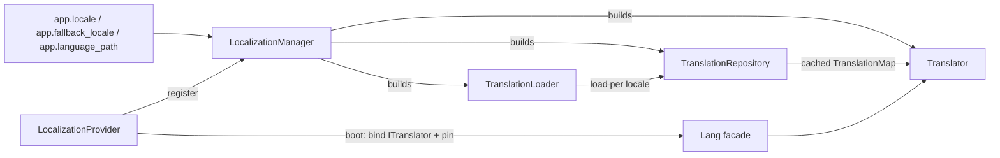

# Orionis Localization (`orionis.localization`)

> Reads JSON translation files, caches them per locale, interpolates `:name` placeholders and selects plural segments.

🇪🇸 Versión en español: [README.es.md](README.es.md)

## Table of contents

- [Functional description](#functional-description)
  - [Where it fits](#where-it-fits)
  - [Resolution pipeline](#resolution-pipeline)
  - [File map](#file-map)
  - [Translation file layout](#translation-file-layout)
  - [Design decisions](#design-decisions)
- [API reference](#api-reference)
  - [`TranslationLoader`](#translationloader)
  - [`TranslationRepository`](#translationrepository)
  - [`Translator`](#translator)
  - [`LocalizationManager`](#localizationmanager)
  - [`LocalizationProvider`](#localizationprovider)
  - [Exceptions](#exceptions)
  - [Type aliases](#type-aliases)
  - [Contracts](#contracts)
  - [Configuration keys](#configuration-keys)
- [Usage examples](#usage-examples)
  - [Standalone translation stack](#standalone-translation-stack)
  - [Grouped files and plural forms](#grouped-files-and-plural-forms)
  - [Error handling](#error-handling)
  - [Missing keys and cache invalidation](#missing-keys-and-cache-invalidation)
  - [Inside the framework](#inside-the-framework)
  - [Templates](#templates)
- [Performance and concurrency considerations](#performance-and-concurrency-considerations)
- [Compatibility notes](#compatibility-notes)

## Functional description

`orionis.localization` turns a directory of JSON files into translated lines
for the active locale. It owns four responsibilities: reading translation
sources from disk, caching them per locale in memory, resolving a key
(active locale → fallback locale → the key itself) and selecting the right
plural segment for a quantity.

### Where it fits

| Neighbour | Relationship |
| --- | --- |
| `orionis.foundation.application` | Provides `config("app.locale")`, `config("app.fallback_locale")`, `config("app.language_path")` and `basePath`, consumed by `LocalizationManager`. |
| `orionis.container.providers.service_provider` | Base class of `LocalizationProvider`. |
| `orionis.foundation.core_providers` | Registers `LocalizationProvider` in `CORE_PROVIDERS`. |
| `orionis.support.facades.lang.Lang` | Facade whose accessor is `ITranslator`; pinned by `LocalizationProvider.boot()`. |
| `orionis.view.globals.lang` | Builds the `trans`, `__`, `choice`, `locale` and `locales` template globals on top of the `Lang` facade. |
| `msgspec` | Decodes every translation file (`msgspec.json.decode`). |

### Resolution pipeline



A `get()` call walks the chain in this order:

1. Validate the locale when one is passed explicitly (`InvalidLocaleException`
   on failure).
2. Ask the repository for the translation map of the target locale; the
   repository loads it from disk only on a cache miss.
3. If the key is absent and the target is not the fallback locale, repeat the
   lookup against the fallback locale.
4. If the key is still absent, call the registered missing-key handler; when
   there is none, or it does not return a `str`, the key itself is used.
5. Substitute placeholders when keyword parameters were supplied.

### File map

| File | Content |
| --- | --- |
| `__init__.py` | Re-exports the four exceptions plus `TranslationLoader`, `TranslationRepository`, `Translator` and `LocalizationManager`. |
| `loader.py` | `TranslationLoader`: reads and flattens JSON sources, discovers locales. |
| `repository.py` | `TranslationRepository`: in-memory cache keyed by locale. |
| `translator.py` | `Translator`: lookup, fallback, placeholders, pluralization, locale validation. |
| `manager.py` | `LocalizationManager`: builds the stack from the application configuration. |
| `provider.py` | `LocalizationProvider`: container bindings and facade pinning. |
| `exceptions.py` | `TranslationException` and its three specializations. |
| `types.py` | PEP 695 aliases `TranslationMap`, `LocaleCache`, `MissingKeyHandler`. |
| `contracts/` | `ITranslationLoader`, `ITranslationRepository`, `ITranslator`, `ILocalizationManager`. |

### Translation file layout

Two layouts coexist under the configured language path:

```text
resources/lang/
├── en.json                 # root file: keys are the literal source text
├── es.json
└── es/                     # grouped files: keys are prefixed with the stem
    ├── validation.json     # -> "validation.required"
    └── auth.json           # -> "auth.failed"
```

- Grouped files are merged first, in `sorted()` order of their file name, and
  nested objects are flattened with dot notation
  (`{"size": {"string": "..."}}` inside `validation.json` becomes
  `validation.size.string`).
- The root file is merged last, so **root entries win** on key collision. A
  nested object declared in the root file is flattened under its own key.
- Leaves that are not strings are stored as `str(value)`.

### Design decisions

- Each collaborator implements an ABC from `contracts/` that declares
  `__slots__ = ()`, and every concrete class declares its own `__slots__`, so
  instances carry no `__dict__`.
- The loader holds no cache and the repository performs no I/O: caching and
  reading are deliberately separate objects.
- `Translator` is the only boundary that validates locale codes, which keeps
  path traversal out of the loader and the repository.
- `LocalizationManager` is the only class aware of the application container;
  the other three are plain objects built from constructor arguments.
- `manager.py` intentionally does **not** use `from __future__ import
  annotations`: the container resolves constructor dependencies from evaluated
  annotations (documented in the class docstring).
- The whole module is synchronous; the single `async def` is
  `LocalizationProvider.boot()`.

## API reference

### `TranslationLoader`

`orionis/localization/loader.py` — implements `ITranslationLoader`,
`__slots__ = ("_path",)`.

```python
def __init__(self, path: Path) -> None: ...
def load(self, locale: str) -> TranslationMap: ...
def availableLocales(self) -> tuple[str, ...]: ...
```

**`__init__(path)`** — `path` is the absolute (or already resolved) directory
holding the translation sources. It is stored as-is; the loader never creates
it.

**`load(locale)`** — returns a flat `dict[str, str]` merging
`{path}/{locale}/*.json` (flattened, sorted by file name) and
`{path}/{locale}.json` (merged last, so it wins on collision). Returns an empty
mapping when neither source exists. Every call re-reads from disk: the loader
has no cache.

- Raises `TranslationSyntaxException` when a file is not UTF-8 encoded, is not
  valid JSON, or its root element is not a JSON object.
- Raises `TranslationFileNotFoundException` from the private `__readFile`
  guard when a file disappears between discovery and read.
- Side effects: blocking file-system reads (`Path.is_dir`, `Path.glob`,
  `Path.is_file`, `Path.read_bytes`).

**`availableLocales()`** — scans one directory level and returns the sorted
locale codes: the stem of every `*.json` file plus the name of every directory
containing at least one `*.json` file. Returns `()` when the configured path is
not a directory.

### `TranslationRepository`

`orionis/localization/repository.py` — implements `ITranslationRepository`,
`__slots__ = ("_cache", "_loader")`.

```python
def __init__(self, loader: ITranslationLoader) -> None: ...
def get(self, locale: str) -> TranslationMap: ...
def has(self, locale: str) -> bool: ...
def forget(self, locale: str) -> bool: ...
def flush(self) -> None: ...
def loadedLocales(self) -> tuple[str, ...]: ...
```

**`get(locale)`** — returns the cached translation map, loading it through the
loader on the first request. Empty results are cached too, so an unknown locale
is read from disk only once. The returned object is the cached `dict` itself,
not a copy. Propagates any exception raised by the loader.

**`has(locale)`** — `True` when the locale is already in the cache; it never
triggers a load.

**`forget(locale)`** — removes one cache entry and returns `True` when
something was removed, `False` otherwise.

**`flush()`** — clears every cache entry.

**`loadedLocales()`** — cached locale codes in insertion order.

### `Translator`

`orionis/localization/translator.py` — implements `ITranslator`,
`__slots__ = ("_fallback", "_loader", "_locale", "_missing", "_repository")`.

```python
def __init__(
    self,
    *,
    locale: str,
    fallback: str,
    loader: ITranslationLoader,
    repository: ITranslationRepository,
) -> None: ...
def get(self, key: str, locale: str | None = None, **replace: object) -> str: ...
def has(
    self,
    key: str,
    locale: str | None = None,
    *,
    fallback: bool = True,
) -> bool: ...
def choice(
    self,
    key: str,
    count: int,
    locale: str | None = None,
    **replace: object,
) -> str: ...
def setLocale(self, locale: str) -> None: ...
def getLocale(self) -> str: ...
def availableLocales(self) -> tuple[str, ...]: ...
def reload(self, locale: str | None = None) -> None: ...
def forget(self, locale: str) -> bool: ...
def flush(self) -> None: ...
def missing(self, handler: MissingKeyHandler | None) -> None: ...
```

**Constructor** — keyword-only. Both `locale` and `fallback` are validated
immediately and raise `InvalidLocaleException` when malformed. `loader` is used
only by `availableLocales()`; every lookup goes through `repository`.

**Locale validation** — a locale is accepted when it is a `str` matching
`^[A-Za-z0-9]+(?:[_-][A-Za-z0-9]+)*$` (for example `en`, `en_US`, `en-US`,
`zh-Hant-TW`). Anything else — empty string, `../etc`, `es/es`, `es.json`, a
non-string value — raises `InvalidLocaleException`. The check runs in the
constructor, in `setLocale`, in `forget`, in `reload` when a locale is given,
and in `get`/`has`/`choice` when an explicit `locale=` is passed.

**`get(key, locale=None, **replace)`** — resolves `key` against the target
locale, then the fallback locale, then the missing-key handler, then the key
itself. Placeholder substitution runs only when `replace` is non-empty. For
every parameter, processed from the longest name to the shortest, three
variants are replaced:

| Placeholder | Replaced with |
| --- | --- |
| `:NAME` | `str(value).upper()` |
| `:Name` | `str(value).capitalize()` |
| `:name` | `str(value)` |

Sorting by length prevents `:name` from shadowing `:name_full`.

**`has(key, locale=None, *, fallback=True)`** — checks the target locale and,
unless `fallback=False` or the target already is the fallback locale, the
fallback locale as well.

**`choice(key, count, locale=None, **replace)`** — resolves the line with
`get(key, locale)` (without substitutions) and splits it on `|`. Segments are
selected in this order:

1. **Explicit exact condition** `{n}` — matches when `n` equals `count`;
   `{*}` matches any count.
2. **Explicit range condition** `[a,b]` — matches when `count >= a` and
   `count <= b`; either bound may be `*`. Non-numeric bounds never match.
3. **Positional rule** — the first segment when there is a single segment or
   `count == 1`, otherwise the second segment. Any explicit condition still
   present is stripped.

The selected segment is trimmed with `str.strip()`, `count` is always exposed
as the `:count` placeholder, and the extra parameters are substituted with the
same rules as `get()`.

`count` is used exactly as received: explicit conditions compare it against
their numeric bounds and the positional rule tests `count == 1`. No coercion or
validation is applied, so a non-numeric quantity propagates the comparison
`TypeError` raised by Python.

**`setLocale(locale)` / `getLocale()`** — change and read the active locale.
The instance bound to `ITranslator` is shared process-wide, so `setLocale`
affects every subsequent lookup in every task.

**`availableLocales()`** — delegates to `loader.availableLocales()`.

**`reload(locale=None)`** — `flush()` on the repository when `locale is None`,
otherwise `forget(locale)`.

**`forget(locale)` / `flush()`** — validate (only `forget`) and delegate to the
repository.

**`missing(handler)`** — registers a `Callable[[str, str], str | None]`
invoked with `(key, target_locale)` when a key cannot be resolved. Its return
value is used only when it is a `str`; anything else (including `None`) falls
back to echoing the key. Pass `None` to remove the handler.

### `LocalizationManager`

`orionis/localization/manager.py` — implements `ILocalizationManager`,
`__slots__ = ("_app", "_translator")`.

```python
def __init__(self, app: IApplication) -> None: ...
def translator(self) -> ITranslator: ...
```

**`translator()`** — builds the translator on first call and caches it, so the
whole application shares one translator and one translation cache. The private
`__buildTranslator` reads:

| Setting | Fallback applied by the manager |
| --- | --- |
| `app.locale` | `"en"` |
| `app.fallback_locale` | the resolved `locale` |
| `app.language_path` | `"resources/lang/"` |

Values are coerced with `str(...)`. A relative language path is resolved
against `app.basePath`; an absolute path is used verbatim. Raises
`InvalidLocaleException` when the configured locale or fallback locale is
malformed.

### `LocalizationProvider`

`orionis/localization/provider.py` — extends
`orionis.container.providers.service_provider.ServiceProvider`.

```python
def register(self) -> None: ...
async def boot(self) -> None: ...
```

**`register()`** — binds `ILocalizationManager` → `LocalizationManager` as a
singleton. Nothing else is bound at this stage.

**`boot()`** — resolves `ILocalizationManager`, calls `manager.translator()`,
binds the resulting instance under `ITranslator` with `app.instance(...)`, and
awaits `Lang.pin()` so facade attribute access becomes a direct passthrough.

The provider is listed in `orionis.foundation.core_providers.CORE_PROVIDERS`
and is not deferrable. `register()` runs during `Application.create()`;
`boot()` runs later, when the HTTP or CLI runtime starts. In a plain script
that only imports `bootstrap.app`, `ITranslator` is therefore **not** bound yet
and the `Lang` facade is **not** pinned — see
[Inside the framework](#inside-the-framework).

### Exceptions

`orionis/localization/exceptions.py`.

| Exception | Raised when |
| --- | --- |
| `TranslationException(Exception)` | Base class; never raised directly. |
| `InvalidLocaleException` | A locale code is empty, malformed, not a string, or unsafe for path use. Raised by `Translator` only. |
| `TranslationFileNotFoundException` | A translation file does not exist when `TranslationLoader.__readFile` opens it (race between discovery and read). |
| `TranslationSyntaxException` | A translation file is not UTF-8 encoded, contains invalid JSON, or its root element is not a JSON object. |

All four are re-exported from `orionis.localization`.

### Type aliases

`orionis/localization/types.py`, declared with PEP 695 `type` statements.

```python
type TranslationMap = dict[str, str]
type LocaleCache = dict[str, TranslationMap]
type MissingKeyHandler = Callable[[str, str], str | None]
```

`Callable` is imported at runtime (not under `TYPE_CHECKING`) so
`MissingKeyHandler.__value__` can be evaluated by introspection tools.

### Contracts

`orionis/localization/contracts/` — four `abc.ABC` classes, each declaring
`__slots__ = ()`; `contracts/__init__.py` re-exports all of them.

| Contract | Abstract methods |
| --- | --- |
| `ITranslationLoader` | `load`, `availableLocales` |
| `ITranslationRepository` | `get`, `has`, `forget`, `flush`, `loadedLocales` |
| `ITranslator` | `get`, `has`, `choice`, `setLocale`, `getLocale`, `availableLocales`, `reload`, `forget`, `flush`, `missing` |
| `ILocalizationManager` | `translator` |

### Configuration keys

Read by `LocalizationManager` through `app.config(...)`; declared in
`config/app.py`.

| Key | Environment variable | Default |
| --- | --- | --- |
| `app.locale` | `APP_LOCALE` | `en` |
| `app.fallback_locale` | `APP_FALLBACK_LOCALE` | `en` |
| `app.language_path` | `APP_LANGUAGE_PATH` | `resources/lang/` |

## Usage examples

### Standalone translation stack

Wire the three collaborators by hand — no application container involved.

```python
from pathlib import Path
from orionis.localization import TranslationLoader, TranslationRepository, Translator

loader = TranslationLoader(Path("resources/lang"))
repository = TranslationRepository(loader)
translator = Translator(
    locale="es",
    fallback="en",
    loader=loader,
    repository=repository,
)

print(translator.get("Welcome"))
print(translator.get("Hello :name", name="Carlos"))
print(translator.choice("There is one apple|There are :count apples", 1))
print(translator.choice("There is one apple|There are :count apples", 5))
print(translator.availableLocales())
print(translator.has("Welcome"), translator.has("Missing key"))
```

```text
Bienvenido
Hello Carlos
There is one apple
There are 5 apples
('en', 'es')
True False
```

`"Hello :name"` is not declared in `resources/lang`, so the key is echoed back
and only the placeholder is substituted.

### Grouped files and plural forms

```python
import tempfile
from pathlib import Path
from orionis.localization import TranslationLoader, TranslationRepository, Translator

with tempfile.TemporaryDirectory() as tmp:
    root = Path(tmp)
    (root / "es").mkdir()
    (root / "es" / "validation.json").write_text(
        '{"required": "El campo :attribute es obligatorio",'
        ' "size": {"string": "Maximo :max caracteres"}}',
        encoding="utf-8",
    )
    (root / "es.json").write_text('{"Save": "Guardar"}', encoding="utf-8")

    loader = TranslationLoader(root)
    print(loader.load("es"))

    translator = Translator(
        locale="es",
        fallback="es",
        loader=loader,
        repository=TranslationRepository(loader),
    )
    print(translator.get("validation.required", attribute="email"))
    print(translator.get("validation.size.string", max=10))
    print(translator.choice("{0} Sin archivos|{1} Un archivo|[2,*] :count archivos", 0))
    print(translator.choice("{0} Sin archivos|{1} Un archivo|[2,*] :count archivos", 4))
```

```text
{'validation.required': 'El campo :attribute es obligatorio', 'validation.size.string': 'Maximo :max caracteres', 'Save': 'Guardar'}
El campo email es obligatorio
Maximo 10 caracteres
Sin archivos
4 archivos
```

### Error handling

```python
import tempfile
from pathlib import Path
from orionis.localization import (
    InvalidLocaleException,
    TranslationLoader,
    TranslationRepository,
    TranslationSyntaxException,
    Translator,
)

loader = TranslationLoader(Path("resources/lang"))
translator = Translator(
    locale="en",
    fallback="en",
    loader=loader,
    repository=TranslationRepository(loader),
)

try:
    translator.setLocale("../etc/passwd")
except InvalidLocaleException as exc:
    print(f"{type(exc).__name__}: {exc}")

with tempfile.TemporaryDirectory() as tmp:
    (Path(tmp) / "es.json").write_text("{broken", encoding="utf-8")
    try:
        TranslationLoader(Path(tmp)).load("es")
    except TranslationSyntaxException as exc:
        print(type(exc).__name__)
```

```text
InvalidLocaleException: Invalid locale code: '../etc/passwd'
TranslationSyntaxException
```

Both exceptions derive from `TranslationException`, so a single `except
TranslationException` clause traps any localization failure.

### Missing keys and cache invalidation

```python
import tempfile
from pathlib import Path
from orionis.localization import TranslationLoader, TranslationRepository, Translator

missing_keys = []


def report(key: str, locale: str) -> str | None:
    """Collect untranslated keys and let the translator echo them."""
    missing_keys.append((key, locale))
    return None


with tempfile.TemporaryDirectory() as tmp:
    root = Path(tmp)
    (root / "es.json").write_text('{"Save": "Guardar"}', encoding="utf-8")

    loader = TranslationLoader(root)
    repository = TranslationRepository(loader)
    translator = Translator(
        locale="es",
        fallback="es",
        loader=loader,
        repository=repository,
    )
    translator.missing(report)

    print(translator.get("Cancel"), missing_keys)
    print(repository.loadedLocales())

    (root / "es.json").write_text('{"Save": "Guardar cambios"}', encoding="utf-8")
    print(translator.get("Save"))
    translator.reload("es")
    print(translator.get("Save"))
```

```text
Cancel [('Cancel', 'es')]
('es',)
Guardar
Guardar cambios
```

The second `print` shows the cache in action: editing the file changes nothing
until `reload()` discards the cached locale.

### Inside the framework

Once the HTTP or CLI runtime has started, `ITranslator` is bound and `Lang` is
pinned, so `await app.make(ITranslator)` and `Lang.get(...)` both work. The
script below runs outside that lifecycle, where only `ILocalizationManager` is
available, and reproduces the two bindings by hand.

```python
import asyncio
from bootstrap.app import app
from orionis.localization.contracts.manager import ILocalizationManager
from orionis.localization.contracts.translator import ITranslator
from orionis.support.facades.lang import Lang


async def main() -> None:
    """Resolve the shared translator through the container."""
    manager = await app.make(ILocalizationManager)
    translator = manager.translator()
    print(translator.get("Welcome", locale="es"))
    print(translator is manager.translator())

    app.instance(ITranslator, translator)
    await Lang.pin()
    print(Lang.get("Welcome", locale="es"))
    print(Lang.choice("There is one apple|There are :count apples", 5))
    print(Lang.getLocale(), Lang.availableLocales())


asyncio.run(main())
```

```text
Bienvenido
True
Bienvenido
There are 5 apples
es ('en', 'es')
```

Without `app.instance(ITranslator, ...)`, `await app.make(ITranslator)` raises
`TypeError: Argument 'concrete' must be a class type, got 'ABCMeta' instead.`,
and an unpinned `Lang.get("Welcome")` returns a `_FacadeDispatch` object
instead of a string.

In application code — controllers, commands, middleware — inject the contract
or use the pinned facade:

```python
from orionis.http import HttpResponse, response
from orionis.localization.contracts.translator import ITranslator


class GreetingController:

    async def index(self, translator: ITranslator) -> HttpResponse:
        """Return a greeting translated into the active locale."""
        return response.json({"message": translator.get("Welcome")})
```

### Templates

`orionis.view.provider.ViewServiceProvider.boot()` registers five Jinja2
globals built in `orionis.view.globals.lang` on top of the `Lang` facade:
`trans`, its alias `__`, `choice`, `locale` and `locales`. They accept the same
arguments as the matching translator methods.

```jinja
<html lang="{{ locale() }}">
  <h1>{{ __("Welcome") }}</h1>
  <p>{{ trans("Hello :name", name=user.name) }}</p>
  <p>{{ choice("There is one apple|There are :count apples", basket.size) }}</p>
  <ul>
    <li>{{ code }}</li>
  </ul>
</html>
```

## Performance and concurrency considerations

- **Disk access happens only on a cache miss.** `TranslationRepository.get()`
  is a single `dict` lookup once a locale has been loaded;
  `TranslationLoader.load()` re-reads and re-decodes every file on each call
  and is the only expensive operation.
- **Blocking I/O.** The loader uses synchronous `pathlib` calls. Because the
  translator is normally built during `LocalizationProvider.boot()`, this cost
  is paid at startup, not per request — unless `reload()`, `forget()` or
  `flush()` is called at runtime, which moves the next load back into the
  caller's thread (including an `asyncio` event loop).
- **No locks anywhere.** The module contains no `threading` or `asyncio`
  primitive. Two concurrent tasks missing the cache for the same locale can
  both call `loader.load()`; the last assignment wins and both callers receive
  a valid map. This guarantee is stated in the class docstrings of
  `TranslationRepository` and `Translator`.
- **Shared mutable state.** `LocalizationProvider` binds a single `Translator`
  instance for the whole process, so `setLocale()`, `missing()`, `reload()`,
  `forget()` and `flush()` are global side effects. For per-request or
  per-call language selection, pass `locale=` to `get`, `has` or `choice`
  instead of switching the active locale.
- **The cached map is not copied.** `TranslationRepository.get()` returns the
  cached `dict` itself; mutating it mutates the cache for every consumer.
- **Substitution cost.** Each parameter performs up to three `str.replace`
  passes over the line, and the parameter names are sorted on every call that
  supplies them; lines without parameters skip substitution entirely.
- **Facade access.** After `Lang.pin()` (executed in `boot()`), facade calls
  are direct synchronous attribute access with no container resolution.

## Compatibility notes

- **Python:** `>= 3.14` (`requires-python` in `pyproject.toml`). `types.py`
  uses PEP 695 `type` alias statements.
- **Dependencies:** `msgspec>=0.21.1`, a core dependency of the framework; no
  extra installation is required beyond `pip install orionis`.
- **Encoding:** translation files must be UTF-8 encoded JSON. They are read as
  bytes with `Path.read_bytes()` and decoded by `msgspec.json.decode`; a file
  stored in any other encoding raises `TranslationSyntaxException`.
- **`from __future__ import annotations`:** used by `loader.py`,
  `repository.py`, `translator.py`, `provider.py`, `types.py` and every
  contract, but deliberately **not** by `manager.py`, whose constructor is
  reflected by the dependency-injection container.
- **Slots:** the four contracts declare `__slots__ = ()` and the four concrete
  classes declare their own `__slots__`, so their instances have no `__dict__`.
  A subclass that needs extra attributes must declare its own `__slots__` or a
  `__dict__`.
- **Path safety:** locale codes are validated against a strict pattern before
  reaching the file system, which rejects separators and `..` segments.
