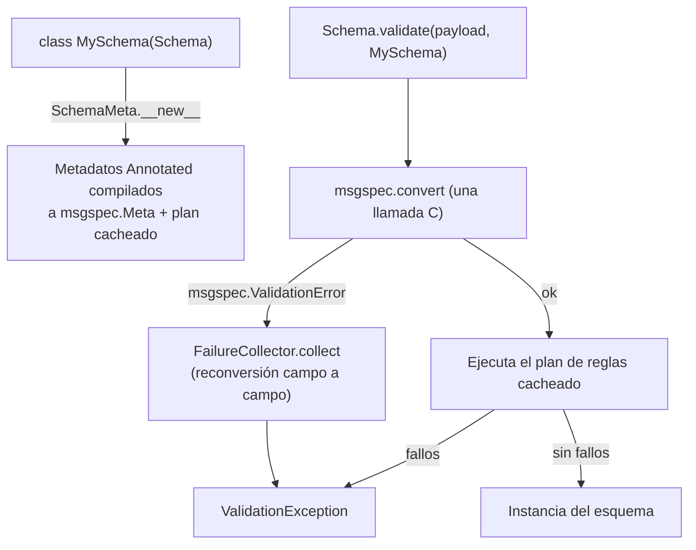

# Orionis Schemas (`orionis.schemas`)

> Capa de validación declarativa construida sobre `msgspec`: conversión de tipos, restricciones, reglas personalizadas y reporte de múltiples errores para cuerpos HTTP y cualquier dato crudo.

## Tabla de contenidos

- [Descripción funcional](#descripción-funcional)
  - [Dónde encaja](#dónde-encaja)
  - [Pipeline de validación](#pipeline-de-validación)
  - [Mapa de archivos](#mapa-de-archivos)
- [Referencia de API](#referencia-de-api)
  - [`Schema` — clase base (`orionis.schemas.schema`)](#schema--clase-base-orionisschemasschema)
  - [`SchemaMeta` (`orionis.schemas.schema`)](#schemameta-orionisschemasschema)
  - [`Schema.validate` — punto de entrada del validador (`orionis.schemas.validator`)](#schemavalidate--punto-de-entrada-del-validador-orionisschemasvalidator)
  - [Alias de campo (`orionis.schemas.fields`)](#alias-de-campo-orionisschemasfields)
  - [Metadatos de restricción (`orionis.schemas.constraints`)](#metadatos-de-restricción-orionisschemasconstraints)
  - [Metadatos de documentación (`orionis.schemas.metadata`)](#metadatos-de-documentación-orionisschemasmetadata)
  - [`MetaCompiler` y `MetadataConflictError` (`orionis.schemas.compiler`)](#metacompiler-y-metadataconflicterror-orionisschemascompiler)
  - [`Rule` e `IRule`](#rule-e-irule)
  - [Reglas incorporadas (`orionis.schemas.rules`)](#reglas-incorporadas-orionisschemasrules)
  - [Módulos auxiliares de reglas](#módulos-auxiliares-de-reglas)
  - [`ValidationFailure` (`orionis.schemas.entities.failure`)](#validationfailure-orionisschemasentitiesfailure)
  - [`ValidationException` (`orionis.schemas.exceptions.validation`)](#validationexception-orionisschemasexceptionsvalidation)
  - [`ValidationErrorParser` (`orionis.schemas.exception_parser`)](#validationerrorparser-orionisschemasexception_parser)
  - [`FailureCollector` (`orionis.schemas.failure_collector`)](#failurecollector-orionisschemasfailure_collector)
  - [Plan de validación (`orionis.schemas.rules_executor`)](#plan-de-validación-orionisschemasrules_executor)
  - [Marcadores de metadatos (`orionis.schemas.meta`)](#marcadores-de-metadatos-orionisschemasmeta)
- [Ejemplos de uso](#ejemplos-de-uso)
  - [Declarar y validar un esquema](#declarar-y-validar-un-esquema)
  - [Reportar todos los errores a la vez](#reportar-todos-los-errores-a-la-vez)
  - [Esquemas anidados y mensajes personalizados](#esquemas-anidados-y-mensajes-personalizados)
  - [Escribir una regla personalizada](#escribir-una-regla-personalizada)
  - [Validación automática del cuerpo de una petición HTTP](#validación-automática-del-cuerpo-de-una-petición-http)
- [Consideraciones de rendimiento y concurrencia](#consideraciones-de-rendimiento-y-concurrencia)
- [Notas de compatibilidad](#notas-de-compatibilidad)

## Descripción funcional

`orionis.schemas` convierte la declaración de una clase en un objeto tipado y
validado. Un esquema declara sus campos con anotaciones estándar de Python; la
metaclase compila los metadatos de esas anotaciones en restricciones
`msgspec.Meta`, y el validador convierte un payload crudo (`dict`, JSON
decodificado, datos de formulario) en una instancia del esquema, reportando
**todos** los fallos a la vez en lugar de detenerse en el primero.

### Dónde encaja

- **`orionis.container`** — `Container.__resolveSchemaArgument` lee el cuerpo de
  la petición actual (`await request.data()`) y llama a
  `Schema.validate(data, argument.type)` cuando un parámetro del handler está
  anotado con una subclase de `msgspec.Struct` (`Argument.is_schema`, resuelto
  por `orionis.introspection`). Eso es lo que hace que los parámetros de un
  controlador se validen automáticamente.
- **`orionis.http`** — `KernelHTTP` captura `ValidationException` y delega en
  `orionis.http.validation.validation_response`, que devuelve `422` con
  `exc.error()` para clientes JSON/AJAX, o un redirect `302` de vuelta con los
  errores y el input anterior en el flash de sesión para navegadores.
- **`orionis.orm` / `orionis.database`** — solo los usa la regla `Unique`, que
  ejecuta una consulta de una sola fila contra una conexión configurada.
- **`orionis.support.facades.datetime.DateTime`** — lo usan las reglas
  temporales (`After`, `Before`, `DateFormat`, …) para resolver momentos en la
  zona horaria de la aplicación.
- **`orionis.support.entities.BaseEntity`** — `ValidationFailure` la extiende.

### Pipeline de validación



Existen dos caminos distintos:

- **Camino feliz** — una llamada a `msgspec.convert` (nivel C) más el plan de
  reglas cacheado. Cuando el esquema no declara ninguna `Rule` personalizada, no
  se ejecuta ningún bucle de validación en Python.
- **Camino de error** — se entra solo después de que `msgspec.convert` ya haya
  fallado. `FailureCollector` reconvierte el payload campo a campo para reportar
  todos los errores de tipo y de restricción, y luego ejecuta las reglas
  personalizadas sobre los valores que convirtieron bien. Una regla asociada a
  un campo cuyo propio valor falló la conversión **no** se ejecuta (no hay valor
  que inspeccionar); una regla cuyo campo hermano falló **sí** se ejecuta.

### Mapa de archivos

| Ruta | Contenido |
|---|---|
| `__init__.py` | Reexporta la clase base `Schema`. |
| `schema.py` | Metaclase `SchemaMeta` y clase base `Schema`. |
| `validator.py` | Clase utilitaria `Schema` que expone el estático `validate`. |
| `fields.py` | Alias de typing (`Field`, `Choice`, `Nullable`, …). |
| `constraints.py` | Dataclasses de restricción + reexportación de todas las reglas. |
| `metadata.py` | Metadatos de documentación (`Title`, `Description`, `Message`, …). |
| `compiler.py` | `MetaCompiler`, `MetadataConflictError`. |
| `rule.py` | Clase base `Rule` para reglas personalizadas. |
| `rules_executor.py` | Constructor/caché del plan y bucle de ejecución de reglas. |
| `failure_collector.py` | Reconversión campo a campo en el camino de error. |
| `exception_parser.py` | `ValidationErrorParser` para el texto de error de `msgspec`. |
| `contracts/constraint.py` | Contrato abstracto `IRule`. |
| `entities/failure.py` | Entidad `ValidationFailure`. |
| `exceptions/validation.py` | `ValidationException`. |
| `meta/` | Marcadores base: `ValidationMetadata`, `ConstraintMetadata`, `DocumentMetadata`. |
| `rules/` | 37 reglas incorporadas + los auxiliares `measure`, `temporal` e `image_probe`. |

## Referencia de API

### `Schema` — clase base (`orionis.schemas.schema`)

```python
class Schema(msgspec.Struct, metaclass=SchemaMeta):

    def toDict(self) -> dict[str, object]:
        ...
```

Clase base de la que hereda todo esquema de la aplicación. Es un
`msgspec.Struct` normal, así que la declaración de campos, los valores por
defecto, las reglas de orden y el encoding siguen la semántica de `msgspec`.

- `toDict()` — devuelve `msgspec.structs.asdict(self)`, es decir, un
  diccionario superficial de nombres de campo a valores.

Atributos que la metaclase agrega a cada subclase:

| Atributo | Tipo | Contenido |
|---|---|---|
| `__orionis_meta__` | `dict[str, list[object]]` | Metadatos que no son `msgspec.Meta`, por campo (instancias de `Rule` personalizadas y cualquier otro objeto dejado en `Annotated`). Los campos sin metadatos personalizados se omiten. |
| `__orionis_constraints__` | `dict[str, dict[str, str]]` | Mensajes personalizados por campo, indexados por nombre de restricción (`min_length`, `ge`, …, más la clave reservada `type` que produce `Message`). |

> Nota de importación: `orionis.schemas.Schema` (esta clase base) y
> `orionis.schemas.validator.Schema` (la utilidad validadora) comparten nombre.
> El código de aplicación que necesita ambas importa la segunda con alias, por
> ejemplo `from orionis.schemas.validator import Schema as Validator`.

### `SchemaMeta` (`orionis.schemas.schema`)

```python
class SchemaMeta(type(msgspec.Struct)):

    def __new__(
        cls,
        name: str,
        bases: tuple[type, ...],
        namespace: dict[str, object],
        **kwargs: object,
    ) -> SchemaMeta:
        ...
```

Se ejecuta una vez por definición de clase y realiza cuatro tareas:

1. Envuelve `__annotate_func__` (el callback de anotaciones perezosas de PEP
   649) para que cada campo `Annotated` tenga sus elementos `ValidationMetadata`
   compilados en un único `msgspec.Meta` mediante `MetaCompiler.compile`,
   dejando intacto cualquier otro metadato.
2. Extrae los mensajes personalizados: el keyword `message=` de cada restricción
   y el texto de un marcador `Message(...)` (guardado bajo la clave reservada
   `type`) hacia `__orionis_constraints__`.
3. Recolecta los metadatos restantes en `__orionis_meta__`.
4. Llama a `_build_plan(klass)` para que el plan de validación quede cacheado
   antes de la primera petición.

**Lanza**

- `MetadataConflictError` — propagado desde `MetaCompiler.compile` cuando las
  anotaciones de un campo están duplicadas, son ambiguas, imposibles o
  inválidas.
- `TypeError` — desde `_build_plan` cuando un campo lleva metadatos
  personalizados que no son ni `Rule` ni `ValidationMetadata`; el mensaje es
  `Field '<name>' on '<Class>': '<type>' is not a valid custom rule. Custom
  rules must subclass 'orionis.schemas.rule.Rule'.`

Ambos errores aparecen en **tiempo de definición de clase**, es decir, al
importar, nunca durante una petición.

### `Schema.validate` — punto de entrada del validador (`orionis.schemas.validator`)

```python
class Schema:

    __slots__ = ()

    @staticmethod
    def validate(payload: object, schema: type[Schema]) -> Schema:
        ...
```

- `payload` — entrada cruda. Cualquier objeto aceptado por `msgspec.convert`;
  los mappings son el caso para el que está optimizado el camino de error.
- `schema` — la clase de esquema a la que convertir.
- **Devuelve** una instancia de `schema`.
- **Lanza** `ValidationException` con todos los fallos encontrados.

Comportamiento: una llamada `msgspec.convert(payload, type=schema)`; si tiene
éxito, el plan cacheado ejecuta las reglas personalizadas y, si alguna falló, se
lanza una única `ValidationException` con todas. Si la conversión falla, la
excepción se construye con `FailureCollector.collect(payload, schema, exc)`.

Efectos secundarios: ninguno más allá de poblar las cachés de planes a nivel de
módulo.

### Alias de campo (`orionis.schemas.fields`)

Reexportaciones ligeras de nombres de `typing` para que un esquema se lea como
una declaración y no como fontanería de tipos. Son alias, no envoltorios: el
comportamiento es exactamente el de la construcción `typing` subyacente.

| Alias | Nombre subyacente |
|---|---|
| `Field` | `typing.Annotated` |
| `Choice` | `typing.Literal` |
| `Nullable` | `typing.Optional` |
| `AnyOf` | `typing.Union` |
| `Constant` | `typing.Final` |
| `Alias` | `typing.TypeAlias` |
| `Static` | `typing.ClassVar` |

### Metadatos de restricción (`orionis.schemas.constraints`)

Dataclasses frozen con slots que heredan de `ConstraintMetadata`. Se colocan
dentro de `Field[...]` y se compilan a `msgspec.Meta`, así que las aplica
`msgspec` durante la conversión, no código Python.

```python
@dataclass(frozen=True, slots=True)
class GreaterThan(ConstraintMetadata):
    value: int | float
    message: str | None = field(default=None, kw_only=True)
```

| Restricción | Firma | Clave de `msgspec.Meta` |
|---|---|---|
| `GreaterThan` | `GreaterThan(value, *, message=None)` | `gt` |
| `GreaterThanOrEqual` | `GreaterThanOrEqual(value, *, message=None)` | `ge` |
| `LessThan` | `LessThan(value, *, message=None)` | `lt` |
| `LessThanOrEqual` | `LessThanOrEqual(value, *, message=None)` | `le` |
| `MultipleOf` | `MultipleOf(value, *, message=None)` | `multiple_of` |
| `Pattern` | `Pattern(regex, *, message=None)` | `pattern` |
| `MinLength` | `MinLength(value, *, message=None)` | `min_length` |
| `MaxLength` | `MaxLength(value, *, message=None)` | `max_length` |
| `TimezoneAware` | `TimezoneAware(*, message=None)` | `tz=True` |
| `TimezoneNaive` | `TimezoneNaive(*, message=None)` | `tz=False` |

El keyword `message` lo consume `SchemaMeta`: se guarda en
`__orionis_constraints__` y reemplaza el texto por defecto de `msgspec` cuando
esa es la restricción que falló.

El módulo además reexporta todas las reglas incorporadas, de modo que un esquema
puede importar restricciones y reglas desde un único lugar — es el estilo de
importación que usan los esquemas de la aplicación en `app/http/schemas/`.

### Metadatos de documentación (`orionis.schemas.metadata`)

Dataclasses frozen con slots que heredan de `DocumentMetadata`. No validan nada;
alimentan las propiedades de JSON Schema / OpenAPI de `msgspec.Meta`.

| Clase | Firma | Efecto |
|---|---|---|
| `Title` | `Title(value: str)` | `msgspec.Meta(title=...)`. |
| `Description` | `Description(value: str)` | `msgspec.Meta(description=...)`. |
| `Examples` | `Examples(values: list[object])` | `msgspec.Meta(examples=...)`. |
| `ExtraJsonSchema` | `ExtraJsonSchema(data: dict[str, object])` | Se fusiona en el objeto JSON Schema generado. |
| `Extra` | `Extra(data: dict[str, object])` | Se propaga sin interpretar. |
| `Message` | `Message(text: str)` | Mensaje personalizado de **error de tipo**; se guarda bajo la clave reservada `type` de `__orionis_constraints__`. |

`Message` es la única forma de sobrescribir el error `Expected <type>, got
<type>` de un campo simple. Solo se conserva el primer `Message` encontrado en
un campo.

### `MetaCompiler` y `MetadataConflictError` (`orionis.schemas.compiler`)

```python
class MetaCompiler:

    __slots__ = ()

    @staticmethod
    def compile(metadata: list[ValidationMetadata]) -> msgspec.Meta:
        ...


class MetadataConflictError(ValueError):
    ...
```

`compile` indexa los metadatos por tipo concreto, valida la combinación y
construye un único `msgspec.Meta` poblando `gt`, `ge`, `lt`, `le`,
`multiple_of`, `pattern`, `min_length`, `max_length`, `tz`, `title`,
`description`, `examples`, `extra_json_schema` y `extra`.

`MetadataConflictError` se lanza en cuatro categorías:

| Categoría | Ejemplo |
|---|---|
| Tipos duplicados | dos `MinLength` en el mismo campo |
| Límites ambiguos | `GreaterThan` + `GreaterThanOrEqual`, `LessThan` + `LessThanOrEqual`, `TimezoneAware` + `TimezoneNaive` |
| Rangos imposibles | `MinLength(10)` + `MaxLength(5)`; un límite inferior numérico que no queda por debajo del superior |
| Valores inválidos | `MultipleOf(0)` o negativo, `MinLength(-1)`, `MaxLength(-5)` |

### `Rule` e `IRule`

```python
class Rule(IRule):

    __slots__ = ("_code", "_message")

    def __init__(self, *, message: str | None = None) -> None:
        ...

    def enforce(self, field: str, value: object, instance: object) -> bool:
        ...

    def validate(
        self,
        field: str,
        value: object,
        instance: object,
    ) -> ValidationFailure | None:
        ...
```

`Rule` es la clase base para validaciones que no pueden expresarse como una
restricción de `msgspec`. Las subclases **solo sobrescriben `enforce`**:

- `enforce` devuelve `True` cuando el valor pasa. La implementación base lanza
  `NotImplementedError` con el mensaje
  `Subclasses must implement the enforce method.`
- `validate` es el punto de entrada que llama el ejecutor; envuelve a `enforce`
  y construye un `ValidationFailure(field=..., rule=self._code,
  message=self._message)` cuando devuelve `False`. No está pensado para
  sobrescribirse.
- `__init__` resuelve, una sola vez, los atributos de clase `__code__`
  (respaldo: `type(self).__name__.lower()`) y `__message__`, y permite que el
  keyword `message=` sobrescriba este último.

`IRule` (`orionis.schemas.contracts.constraint`) es el `abc.ABC` correspondiente
con `__slots__ = ()`, que declara `__init__`, `enforce` y `validate` como
abstractos.

Convención que siguen todas las reglas incorporadas: cuando el valor no es del
tipo Python esperado, `enforce` devuelve `True` y deja que la capa de tipos
reporte el desajuste, de modo que un mismo valor erróneo nunca produce dos
errores.

### Reglas incorporadas (`orionis.schemas.rules`)

Todas son importables desde `orionis.schemas.rules` o desde
`orionis.schemas.constraints`. Todos los constructores aceptan el keyword-only
`message` para sobrescribir el texto por defecto.

| Regla | Constructor | Código `rule` | Comprueba |
|---|---|---|---|
| `Accepted` | `Accepted(*, message=None)` | `accepted` | `True`, `1`, o `"yes"`/`"on"`/`"1"`/`"true"` (sin distinguir mayúsculas). |
| `ActiveUrl` | `ActiveUrl(*, message=None)` | `active_url` | Que el hostname de la URL resuelva mediante `socket.getaddrinfo`. |
| `After` | `After(reference=None, *, message=None)` | `after` | Fecha estrictamente posterior al momento de referencia. |
| `AfterOrEqual` | `AfterOrEqual(reference=None, *, message=None)` | `after_or_equal` | Fecha igual o posterior al momento de referencia. |
| `Alpha` | `Alpha(*, ascii_only=False, message=None)` | `alpha` | Solo caracteres alfabéticos. |
| `Ascii` | `Ascii(*, message=None)` | `ascii` | Solo caracteres ASCII de 7 bits. |
| `Before` | `Before(reference=None, *, message=None)` | `before` | Fecha estrictamente anterior al momento de referencia. |
| `BeforeOrEqual` | `BeforeOrEqual(reference=None, *, message=None)` | `before_or_equal` | Fecha igual o anterior al momento de referencia. |
| `Between` | `Between(minimum, maximum, *, message=None)` | `between` | Tamaño medido dentro de los límites inclusivos. Lanza `ValueError` si `minimum > maximum`. |
| `ConfirmPassword` | `ConfirmPassword(other_field="password", *, message=None)` | `confirm_password` | Que coincida con el campo hermano de contraseña. |
| `DateFormat` | `DateFormat(*formats, message=None)` | `date_format` | Cadena de fecha que coincide con uno de los formatos aceptados. |
| `DecimalPlaces` | `DecimalPlaces(minimum, maximum=None, *, message=None)` | `decimal` | Número de decimales requerido. |
| `Different` | `Different(*values, message=None)` | `different` | Que difiera de todos los valores indicados. |
| `Dimensions` | `Dimensions(*, min_width=None, max_width=None, min_height=None, max_height=None, width=None, height=None, ratio=None, min_ratio=None, max_ratio=None, message=None)` | `dimensions` | Imagen subida que cumple las restricciones de dimensión. |
| `DoesntEndWith` | `DoesntEndWith(*suffixes, message=None)` | `doesnt_end_with` | Que no termine con ninguno de los sufijos prohibidos. |
| `DoesntStartWith` | `DoesntStartWith(*prefixes, message=None)` | `doesnt_start_with` | Que no empiece con ninguno de los prefijos prohibidos. |
| `Email` | `Email(*, message=None)` | `email` | Dirección con forma RFC, ≤ 254 caracteres, parte local ≤ 64. |
| `Encoding` | `Encoding(encoding="utf-8", *, message=None)` | `encoding` | Representable en el códec indicado. |
| `EndsWith` | `EndsWith(*suffixes, message=None)` | `ends_with` | Que termine con uno de los sufijos permitidos. |
| `File` | `File(*, message=None)` | `file` | Que el valor exponga el protocolo de archivo subido. |
| `GreaterThanOrEqualField` | `GreaterThanOrEqualField(other_field, *, message=None)` | `gte` | Mayor o igual que un campo hermano. |
| `Image` | `Image(*, message=None)` | `image` | Que el archivo subido sea un ráster PNG, JPEG, GIF, BMP o WebP. |
| `Integer` | `Integer(*, message=None)` | `integer` | Que represente un número entero. |
| `IpAddress` | `IpAddress(version=4, *, message=None)` | `ip` | Dirección IP válida; `version` acepta `4`, `6` o `None` (cualquier familia), otros valores lanzan `ValueError`. |
| `Json` | `Json(*, message=None)` | `json` | Documento JSON sintácticamente válido. |
| `LessThanOrEqualField` | `LessThanOrEqualField(other_field, *, message=None)` | `lte` | Menor o igual que un campo hermano. |
| `Lowercase` | `Lowercase(*, message=None)` | `lowercase` | Sin caracteres en mayúscula. |
| `MacAddress` | `MacAddress(*, message=None)` | `mac_address` | Dirección MAC válida. |
| `MaxDigits` | `MaxDigits(maximum, *, message=None)` | `max_digits` | Como mucho el número de dígitos indicado. |
| `MimeTypes` | `MimeTypes(*mime_types, message=None)` | `mimetypes` | Archivo subido que declara uno de los tipos MIME aceptados. |
| `Size` | `Size(size, *, message=None)` | `size` | Tamaño medido exacto. |
| `StartsWith` | `StartsWith(*prefixes, message=None)` | `starts_with` | Que empiece con uno de los prefijos permitidos. |
| `StrongPassword` | `StrongPassword(*, message=None)` | `strong_password` | Al menos 8 caracteres con una mayúscula, una minúscula y un dígito. |
| `Ulid` | `Ulid(*, message=None)` | `ulid` | ULID válido. |
| `Unique` | `Unique(table, column, *, ignore=None, ignore_column="id", connection=None, message=None)` | `unique` | Que ninguna fila almacenada tenga el valor. |
| `Uppercase` | `Uppercase(*, message=None)` | `uppercase` | Sin caracteres en minúscula. |
| `Uuid` | `Uuid(version=None, *, message=None)` | `uuid` | Identificador RFC 9562; `version` acepta `1`, `3`, `4`, `5`, `6`, `7`, `8` o `None`, otros valores lanzan `ValueError`. |

Reglas con efectos secundarios que conviene destacar:

- **`Unique`** — construye un plan de `RawQueryBuilder` limitado a una fila y lo
  ejecuta a través de `Loop.runSync`. Cuando ya hay un event loop en marcha (una
  petición HTTP) crea una `Connection` desechable, consulta y siempre hace
  `disconnect()` en un `finally`; la conexión pooled no puede reutilizarse
  porque pertenece al loop del llamante. Sin loop en marcha usa la conexión
  compartida que resuelve `ConnectionResolver`. El hilo llamante se bloquea
  hasta que la consulta termina. `ignore`/`ignore_column` excluyen la fila que
  se está actualizando.
- **`ActiveUrl`** — realiza una resolución DNS bloqueante en el hilo llamante.
- **`File`, `Image`, `Dimensions`, `MimeTypes`, `Size`, `Between`** — inspeccionan
  archivos subidos. La detección es estructural: cualquier objeto que exponga
  `read`, `size` y `filename`, de modo que el módulo nunca importa el paquete de
  payload HTTP.

### Módulos auxiliares de reglas

Auxiliares a nivel de módulo (`snake_case`) que comparten las reglas anteriores;
forman parte de la superficie del módulo pero no son reglas.

| Módulo | Auxiliares públicos |
|---|---|
| `rules/measure.py` | `KILOBYTE`, `is_file(value) -> bool`, `read_content(value) -> bytes \| None`, `measure(value) -> float \| None` |
| `rules/temporal.py` | `to_datetime(value)`, `parse_moment(text)`, `resolve_moment(reference, instance)` |
| `rules/image_probe.py` | `probe_image(data: bytes) -> tuple[str, int, int] \| None` |

- `measure(value)` devuelve el propio número para números, `len()` para valores
  con tamaño, `size / 1024` para archivos subidos y `None` para booleanos o
  cualquier cosa sin tamaño comparable.
- `parse_moment` entiende las palabras clave `now`, `today`, `tomorrow` y
  `yesterday`, y en el resto de casos delega en
  `DateTime.parse(text, strict=False)`.
- `resolve_moment` trata una referencia de tipo cadena primero como nombre de un
  campo hermano, y solo después intenta interpretarla como fecha.
- `probe_image` lee las dimensiones directamente de la cabecera del archivo para
  PNG, JPEG, GIF, BMP y WebP: no hace falta ninguna librería de imágenes.

### `ValidationFailure` (`orionis.schemas.entities.failure`)

```python
@dataclass(slots=True, frozen=True)
class ValidationFailure(BaseEntity):
    field: str
    rule: str
    message: str

    def toDict(self) -> dict:
        ...
```

Descripción inmutable de un fallo. `field` es la ruta con puntos
(`"address.zip_code"`, `""` para un error sobre el propio payload), `rule` es la
clave de restricción (`min_length`, `ge`, `type`, `missing`) o el `__code__` de
la regla que falló, y `message` es el texto final que ve el cliente. `toDict()`
sobrescribe `BaseEntity.toDict()` con un diccionario literal de tres claves.

### `ValidationException` (`orionis.schemas.exceptions.validation`)

```python
class ValidationException(Exception):

    def __init__(
        self,
        failures: ValidationFailure | Sequence[ValidationFailure],
        message: str | None = None,
    ) -> None:
        ...

    def error(self) -> dict:
        ...
```

Acepta un fallo suelto o una `list`/`tuple` de ellos y expone:

| Atributo | Tipo | Contenido |
|---|---|---|
| `failures` | `tuple[ValidationFailure, ...]` | Todos los fallos, en el orden en que se recolectaron. |
| `failure` | `ValidationFailure \| None` | El primero, o `None` si se construyó vacía. |
| `errors` | `dict[str, list[str]]` | Mensajes agrupados por nombre de campo. |
| `message` | `str` | El argumento `message`, o el mensaje del primer fallo con el sufijo `(and N more error[s])`. Sin fallos: `The given data was invalid.` |

`error()` devuelve `{"message": self.message, "errors": self.errors}`, que es
exactamente el cuerpo que se envía con el HTTP `422`.

### `ValidationErrorParser` (`orionis.schemas.exception_parser`)

```python
class ValidationErrorParser:

    __slots__ = ()

    @classmethod
    def parse(
        cls,
        error: msgspec.ValidationError,
        schema: type | None = None,
    ) -> ValidationFailure:
        ...

    @classmethod
    def parseAt(
        cls,
        error: msgspec.ValidationError,
        schema: type | None,
        base: str,
    ) -> ValidationFailure:
        ...
```

Convierte el texto de una `msgspec.ValidationError` en un `ValidationFailure`:

- Separa el sufijo `<message> - at `$<path>`` con búsquedas de cadena simples y
  une la ruta con `base` (los índices de secuencia como `[0]` se añaden sin
  punto).
- Reconoce `missing required field \`x\`` y reporta `rule="missing"`.
- Mapea el mensaje a una clave de restricción mediante una lista ordenada de
  frases (`of length >=` → `min_length`, ` >= ` → `ge`, `Expected` → `type`, …);
  si no coincide ninguna, `rule` es `"type"`.
- Recorre la jerarquía del esquema siguiendo la ruta con puntos para localizar
  el esquema hoja y sustituye el mensaje por el personalizado declarado en
  `__orionis_constraints__`, si existe.

`parse(error, schema)` equivale a `parseAt(error, schema, "")`.

Dos cachés a nivel de módulo mantienen barato el camino de error:
`_STRUCT_FIELDS_MAP` (esquema → tipos de campo) y `_NESTED_TYPE_CACHE`
(`(schema, field)` → esquema anidado o `None`).

### `FailureCollector` (`orionis.schemas.failure_collector`)

```python
class FailureCollector:

    __slots__ = ()

    @classmethod
    def collect(
        cls,
        payload: object,
        schema: type,
        error: msgspec.ValidationError,
    ) -> tuple[ValidationFailure, ...]:
        ...
```

Se ejecuta solo después de que haya fallado la conversión del payload completo.
Para un payload de tipo `Mapping` convierte cada campo declarado por separado,
de modo que:

- Los campos obligatorios ausentes se reportan con `rule="missing"` y el mensaje
  ``Object missing required field `x` ``.
- Cada campo que falla la conversión aporta su propio fallo (recursando en los
  esquemas anidados, que reportan sus errores con rutas separadas por puntos).
- Los campos que convirtieron bien siguen ejecutando sus reglas personalizadas,
  recibiendo un `types.SimpleNamespace` construido con los valores convertidos
  correctamente: eso es lo que mantiene utilizables las reglas entre campos
  cuando no existe ninguna instancia del esquema.

Cuando ningún campo declarado puede ser culpado (payload que no es mapping,
campos desconocidos, hooks personalizados), el error originalmente parseado se
inserta en la posición 0.

Su plan por esquema se cachea en `_FIELD_PLAN_CACHE` y reutiliza el plan de
reglas construido por `rules_executor`, así que las reglas se declaran en un
único lugar.

### Plan de validación (`orionis.schemas.rules_executor`)

Módulo interno (todos sus nombres llevan el prefijo `_`), documentado porque
define comportamiento observable: **cuándo** se ejecutan las reglas
personalizadas y en **qué orden** se producen los fallos.

| Nombre | Propósito |
|---|---|
| `_PLAN_CACHE` | `dict[type, tuple]`, a nivel de proceso, una entrada por clase de esquema. |
| `_build_plan(klass) -> tuple` | Construye y cachea el plan; las entradas son `(field_name, field_name_dot, getter, validators, is_nested)`. Solo conserva campos con reglas o con esquema anidado, así que un plan vacío significa "no hay nada que hacer". Lanza `TypeError` con metadatos no soportados. |
| `_collect_with_plan(plan, instance, prefix, failures) -> None` | El bucle caliente: lee cada campo con un `operator.attrgetter` precompilado, recursa primero en los esquemas anidados y luego ejecuta los validadores del campo, acumulando cada fallo. |

Consecuencias visibles desde fuera: los fallos anidados de un campo se reportan
antes que los fallos de las reglas de ese mismo campo, y el plan de un esquema
anidado se precalienta al construir el plan del padre, así que no ocurre ninguna
construcción en frío a mitad de una petición.

### Marcadores de metadatos (`orionis.schemas.meta`)

| Clase | Módulo | Rol |
|---|---|---|
| `ValidationMetadata` | `meta/validation.py` | Marcador raíz (`__slots__ = ()`) de todo lo que puede anotar un campo de esquema. |
| `ConstraintMetadata` | `meta/constraint.py` | Marcador de los metadatos que participan en la validación de valores. |
| `DocumentMetadata` | `meta/document.py` | Marcador de los metadatos que solo alimentan la salida de documentación. |

Declaran `__slots__ = ()` para que las subclases dataclass frozen con
`slots=True` no choquen con un conflicto entre `__dict__` y slots.

## Ejemplos de uso

### Declarar y validar un esquema

```python
from orionis.schemas import Schema
from orionis.schemas.constraints import (
    Email,
    GreaterThanOrEqual,
    LessThanOrEqual,
    MinLength,
)
from orionis.schemas.fields import Field, Nullable
from orionis.schemas.validator import Schema as Validator


class RegisterSchema(Schema):
    name: Field[str, MinLength(3)]
    email: Field[str, Email()]
    age: Field[int, GreaterThanOrEqual(18), LessThanOrEqual(120)]
    nickname: Nullable[str] = None


user = Validator.validate(
    {"name": "Ada", "email": "ada@example.com", "age": 36},
    RegisterSchema,
)

print(user.name, user.age)
print(user.toDict())
```

Salida:

```text
Ada 36
{'name': 'Ada', 'email': 'ada@example.com', 'age': 36, 'nickname': None}
```

### Reportar todos los errores a la vez

Continuación del fragmento anterior:

```python
from orionis.schemas.exceptions.validation import ValidationException

try:
    Validator.validate({"name": "Al", "email": "nope", "age": 12}, RegisterSchema)
except ValidationException as exc:
    print(exc.message)
    print(exc.errors)
    for failure in exc.failures:
        print(failure.field, "|", failure.rule, "|", failure.message)
```

Salida:

```text
Expected `str` of length >= 3 (and 2 more errors)
{'name': ['Expected `str` of length >= 3'], 'age': ['Expected `int` >= 18'], 'email': ['Value must be a valid email address.']}
name | min_length | Expected `str` of length >= 3
age | ge | Expected `int` >= 18
email | email | Value must be a valid email address.
```

Los errores de tipo y de restricción van primero, en el orden de declaración de
los campos; los fallos de reglas van después, porque se ejecutan una vez que se
conocen todos los valores.

### Esquemas anidados y mensajes personalizados

```python
from orionis.schemas import Schema
from orionis.schemas.constraints import MinLength, StrongPassword
from orionis.schemas.exceptions.validation import ValidationException
from orionis.schemas.fields import Field
from orionis.schemas.metadata import Message
from orionis.schemas.validator import Schema as Validator


class Address(Schema):
    city: Field[str, MinLength(2, message="City is too short.")]
    zip_code: Field[str, Message("The zip code must be text.")]


class Account(Schema):
    address: Address
    password: Field[str, StrongPassword(message="Choose a stronger password.")]


try:
    Validator.validate(
        {"address": {"city": "X", "zip_code": 1000}, "password": "weak"},
        Account,
    )
except ValidationException as exc:
    print(exc.errors)
```

Salida:

```text
{'address.city': ['City is too short.'], 'address.zip_code': ['The zip code must be text.'], 'password': ['Choose a stronger password.']}
```

### Escribir una regla personalizada

```python
from orionis.schemas import Schema
from orionis.schemas.exceptions.validation import ValidationException
from orionis.schemas.fields import Field
from orionis.schemas.rule import Rule
from orionis.schemas.validator import Schema as Validator


class EvenNumber(Rule):

    __code__ = "even"
    __message__ = "Value must be an even number."

    def enforce(self, field: str, value: object, instance: object) -> bool:
        return isinstance(value, int) and value % 2 == 0


class Ticket(Schema):
    seats: Field[int, EvenNumber()]


print(Validator.validate({"seats": 4}, Ticket).toDict())

try:
    Validator.validate({"seats": 3}, Ticket)
except ValidationException as exc:
    print(exc.errors, exc.failures[0].rule)
```

Salida:

```text
{'seats': 4}
{'seats': ['Value must be an even number.']} even
```

### Validación automática del cuerpo de una petición HTTP

Basta con anotar un parámetro del controlador con un esquema: el contenedor lee
el cuerpo, lo valida e inyecta la instancia tipada. Si la validación falla, el
controlador nunca se ejecuta — `KernelHTTP` transforma la `ValidationException`
en un payload `422` para clientes JSON o en un redirect de vuelta con los
errores en el flash para navegadores.

```python
from orionis.http import HttpResponse, response
from orionis.http.base import BaseController
from orionis.schemas import Schema
from orionis.schemas.constraints import ConfirmPassword, Email, MinLength, Unique
from orionis.schemas.fields import Field
from orionis.schemas.metadata import Message


class RegisterSchema(Schema):

    name: Field[
        str,
        Message("Name must be a string."),
        MinLength(6, message="Name must be at least 6 characters long."),
    ]

    email: Field[
        str,
        Message("Email must be a string."),
        Email(message="Email must be a valid email address."),
        Unique(table="users", column="email", message="Email already exists."),
    ]

    password: Field[str, MinLength(8)]

    password_confirmation: Field[
        str,
        ConfirmPassword(message="Password confirmation does not match."),
    ]


class RegisterController(BaseController):

    async def register(self, payload: RegisterSchema) -> HttpResponse:
        return response.json({"email": payload.email})
```

## Consideraciones de rendimiento y concurrencia

- **Todo lo caro ocurre una sola vez, al importar.** Compilar los metadatos,
  detectar conflictos y construir el plan de validación ocurre dentro de
  `SchemaMeta.__new__`. Una petición solo paga `msgspec.convert` más, cuando el
  esquema declara reglas personalizadas, una pasada sobre el plan cacheado.
- **Un esquema sin reglas personalizadas cuesta exactamente una llamada C.**
  `_build_plan` conserva solo los campos con reglas o con esquema anidado; un
  plan vacío cortocircuita todo el bucle Python de `Schema.validate`.
- **El camino multi-error se activa solo al fallar.** `FailureCollector`
  reconvierte campo a campo, lo que es medible y notablemente más caro que una
  única conversión, pero se ejecuta solo cuando el payload ya fue rechazado.
- **Las cachés son de proceso y no tienen límite.** `_PLAN_CACHE`,
  `_FIELD_PLAN_CACHE`, `_STRUCT_FIELDS_MAP` y `_NESTED_TYPE_CACHE` son `dict`s a
  nivel de módulo, indexados por clase y sin desalojo. Cada valor almacenado es
  función pura de su clave, así que una doble construcción concurrente guarda
  datos idénticos; en la práctica lo que acota la memoria es el propio número de
  clases.
- **Las instancias de regla se comparten.** Una regla se construye una vez,
  dentro de la anotación de la clase, y su `validate` se llama para cada payload
  — incluso concurrentemente. Las reglas incorporadas solo leen sus slots de
  configuración y no guardan estado mutable; las reglas personalizadas deben
  hacer lo mismo.
- **El pipeline es totalmente síncrono.** `Schema.validate` es una función
  normal y bloquea el hilo llamante. Esto importa para las dos reglas con E/S:
  `ActiveUrl` bloquea en DNS y `Unique` bloquea en un viaje a la base de datos.
  `Unique` puentea el ORM async con `Loop.runSync`, que despacha a un hilo
  worker cuando ya hay un event loop en marcha; como ese worker tiene su propio
  loop, la regla abre y cierra una `Connection` dedicada por validación en lugar
  de reutilizar la del pool.
- **`__slots__` en todo el módulo.** `Rule`, `MetaCompiler`,
  `ValidationErrorParser`, `FailureCollector`, `validator.Schema`, los
  marcadores base, todas las reglas incorporadas y todas las dataclasses de
  restricción declaran `__slots__`, así que no se reserva ningún `__dict__` por
  instancia.

## Notas de compatibilidad

- **Python ≥ 3.14 es un requisito funcional, no solo un mínimo.** `SchemaMeta`
  envuelve `__annotate_func__`, el callback de anotaciones diferidas de PEP 649,
  que solo existe a partir de 3.14. El módulo no puede ejecutarse en versiones
  anteriores.
- **`msgspec >= 0.21.1`** viene como dependencia base del framework
  (`pyproject.toml`), así que no hace falta ninguna instalación extra. Textos de
  error como ``Expected `str` of length >= 3`` provienen de `msgspec`;
  `ValidationErrorParser` los reconoce por frase, así que un cambio en la
  redacción de `msgspec` afectaría a la clave `rule` detectada.
- **Los esquemas son subclases de `msgspec.Struct`.** Las reglas de orden de
  campos (los campos sin valor por defecto deben preceder a los que sí lo
  tienen), la exclusión de `ClassVar` y el comportamiento de encoding los define
  `msgspec`, no este módulo.
- **`orionis.schemas.Schema` frente a `orionis.schemas.validator.Schema`.** Dos
  clases distintas con el mismo nombre: la clase base de la que se hereda y la
  utilidad estática que expone `validate`. Importar la segunda con alias es la
  convención usada en todo el repositorio.
- **La regla `Unique` arrastra `orionis.orm` / `orionis.database`** y necesita
  una conexión configurada en el momento de validar; para motores distintos de
  SQLite hay que instalar el extra del driver correspondiente
  (`orionis[pgsql]`, `orionis[mysql]`, …). El resto de reglas solo dependen de
  la biblioteca estándar, salvo las temporales, que usan `DateTime` (pendulum) y
  por tanto la zona horaria de la aplicación.
- **`orionis.http` entiende `ValidationException`.** Lanzarla fuera de una
  petición es perfectamente válido; dentro de una se traduce automáticamente a
  una respuesta `422` o a un redirect de vuelta.
