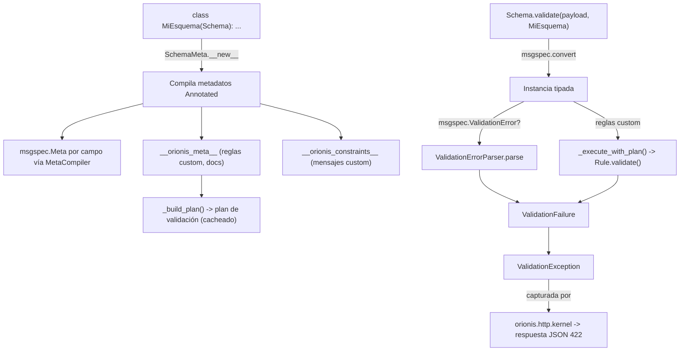

# Orionis Schemas (`orionis.schemas`)

> Esquemas de datos tipados y validados construidos sobre `msgspec.Struct`, con restricciones declarativas, reglas personalizadas y errores de validación estructurados.
>
> 🇬🇧 English version: [README.md](README.md)

`orionis.schemas` permite declarar formas de datos tipadas (cuerpos de
peticiones HTTP, DTOs, objetos de valor anidados) como clases simples y
anotadas, obteniendo tanto **coerción de tipos** como **validación** de
forma gratuita — impulsado por [`msgspec`](https://jcristharif.com/msgspec/)
por debajo, pero expuesto mediante una API específica de Orionis,
agnóstica del framework subyacente. Es la capa de esquemas que usa el
contenedor de DI para poblar y validar automáticamente los cuerpos de
peticiones HTTP, y puede usarse de forma independiente para cualquier
necesidad de validación de datos estructurados.

---

## Tabla de contenidos

1. [Requisitos](#requisitos)
2. [Descripción funcional del módulo](#descripción-funcional-del-módulo)
3. [Arquitectura](#arquitectura)
4. [Referencia de API](#referencia-de-api)
   - [`Schema` / `SchemaMeta`](#schema--schemameta-orionisschemasschemaschema)
   - [Alias de tipos de campo (`fields.py`)](#alias-de-tipos-de-campo-fieldspy)
   - [Metadatos de documentación (`metadata.py`)](#metadatos-de-documentación-metadatapy)
   - [Restricciones de validación (`constraints.py`)](#restricciones-de-validación-constraintspy)
   - [Reglas personalizadas: `Rule`, `IRule`, `StrongPassword`](#reglas-personalizadas-rule-irule-strongpassword)
   - [El punto de entrada del validador: `Schema.validate` (`validator.py`)](#el-punto-de-entrada-del-validador-schemavalidate-validatorpy)
   - [Manejo de errores: `ValidationFailure`, `ValidationException`, `ValidationErrorParser`](#manejo-de-errores-validationfailure-validationexception-validationerrorparser)
   - [`MetaCompiler` / `MetadataConflictError`](#metacompiler--metadataconflicterror)
5. [Ejemplos de uso](#ejemplos-de-uso)
6. [Consideraciones de rendimiento y concurrencia](#consideraciones-de-rendimiento-y-concurrencia)
7. [Notas de diseño](#notas-de-diseño)
8. [Notas de compatibilidad](#notas-de-compatibilidad)

---

## Requisitos

No se requiere ninguna instalación adicional a la del propio framework:

```bash
pip install orionis
```

- **Python:** 3.14 o superior — **requerido**, no solo como mínimo del
  framework: `SchemaMeta` depende del protocolo de anotaciones perezosas
  de PEP 649 (`__annotate_func__`), introducido en Python 3.14, para
  compilar los metadatos de campo.
- **Dependencia en tiempo de ejecución:** [`msgspec`](https://pypi.org/project/msgspec/)
  (`msgspec>=0.21.1`, dependencia central y no opcional del framework)
  provee la clase base `Struct` subyacente, la coerción de tipos, y la
  aplicación de restricciones de bajo nivel (`msgspec.Meta`).

## Descripción funcional del módulo

Validar datos entrantes (un cuerpo JSON de HTTP, un payload de
configuración, un objeto de valor anidado) normalmente requiere dos
cosas: convertir datos crudos en valores Python tipados, y rechazar
valores que no cumplan las reglas de negocio. `orionis.schemas` combina
ambas en una sola declaración:

- **`Schema`** (`orionis.schemas.schema.Schema`) — la clase base que
  extiende cada esquema. Es una subclase de `msgspec.Struct` construida a
  través de la metaclase `SchemaMeta`, que compila los metadatos de
  Orionis (restricciones, documentación, reglas personalizadas) adjuntos
  a cada campo vía `Annotated` en descriptores `msgspec.Meta`, de modo que
  el decodificador nativo de `msgspec` (respaldado por Rust) aplica la
  coerción de tipos **y** las restricciones incorporadas.
- **Alias de tipos de campo** (`fields.py`) — nombres cortos (`Field`,
  `Choice`, `Nullable`, `AnyOf`, `Constant`, `Alias`, `Static`) para los
  constructos estándar de `typing` usados para declarar campos, de modo
  que las clases de esquema se lean como dataclasses simples sin
  importar `typing` directamente.
- **Restricciones** (`constraints.py`) — reglas de valor declarativas
  (`MinLength`, `MaxLength`, `Pattern`, `GreaterThan`, `LessThan`, ...)
  que se compilan en argumentos de palabra clave de `msgspec.Meta`,
  aplicadas de forma nativa durante la decodificación — la ruta de
  validación más rápida.
- **Reglas personalizadas** (`rule.py`, `rules/strong_password.py`) —
  para comprobaciones que `msgspec.Meta` no puede expresar
  (comprobaciones entre campos, lógica arbitraria en Python), se
  subclasifica `Rule` y se implementa `enforce()`; las reglas se ejecutan
  en una segunda pasada, tras una decodificación de tipo/restricción
  exitosa.
- **Metadatos de documentación** (`metadata.py`) — anotaciones que no
  validan (`Title`, `Description`, `Examples`, `ExtraJsonSchema`,
  `Extra`, `Message`) para generación de JSON Schema/OpenAPI y texto de
  error personalizado.
- **El punto de entrada del validador** (`validator.py`) — una pequeña
  clase utilitaria, **también llamada `Schema`**, cuyo método estático
  `validate(payload, schema)` convierte un payload crudo en una instancia
  de esquema y ejecuta cualquier comprobación de `Rule` personalizada. Es
  lo que llama internamente el contenedor de DI para resolver parámetros
  anotados con `msgspec.Struct` (p. ej. cuerpos de petición HTTP) — ver
  [Notas de diseño](#notas-de-diseño) sobre el choque de nombres con el
  `Schema` de `schema.py`.
- **Errores estructurados** (`entities/failure.py`,
  `exceptions/validation.py`, `exception_parser.py`) — tanto los errores
  de validación nativos de `msgspec` como los fallos de `Rule`
  personalizados se normalizan en una única forma `ValidationFailure`
  (`field`, `rule`, `message`) y se lanzan como una única
  `ValidationException`, que `orionis.http.kernel` captura y convierte en
  una respuesta JSON `422`.

## Arquitectura



- `SchemaMeta` (en `schema.py`) intercepta la creación de clase de cada
  subclase de `Schema`: envuelve `__annotate_func__` para que cada campo
  `Annotated[...]` se reescriba con un `msgspec.Meta` compilado (vía
  `MetaCompiler`), recopila los metadatos que no son `msgspec.Meta`
  (`Rule` personalizadas, `Message`, metadatos de documentación) en
  `__orionis_meta__`, registra los mensajes de restricción personalizados
  por campo en `__orionis_constraints__`, y precompila el plan de
  validación de campos (`rules_executor._build_plan`) en el momento de
  definir la clase.
- `Schema.validate(payload, schema)` de `validator.py` es el punto de
  entrada en tiempo de ejecución: `msgspec.convert(payload, type=schema)`
  realiza la coerción de tipos y aplica de forma nativa cada restricción
  `msgspec.Meta` compilada; en caso de fallo,
  `ValidationErrorParser.parse(...)` convierte el texto de error crudo de
  `msgspec` en un `ValidationFailure`. Si tiene éxito, el plan cacheado de
  `rules_executor` ejecuta cada `Rule` personalizada (incluso de forma
  recursiva para campos `Schema` anidados), lanzando `ValidationException`
  ante el primer fallo.
- `orionis.container.container.Container` importa `validator.Schema`
  directamente y llama a `Schema.validate(...)` al auto-resolver un
  parámetro anotado con una subclase de `msgspec.Struct` (detectado vía
  `Argument.is_schema`, de `orionis.introspection`) — así es como los
  parámetros de controladores HTTP tipados con una subclase de `Schema`
  se pueblan y validan automáticamente desde el cuerpo de la petición.
- `orionis.http.kernel` importa `ValidationException` y la convierte en
  una respuesta `422` con el payload estructurado
  `{"field", "rule", "message"}` de `exc.error()`.

## Referencia de API

### `Schema` / `SchemaMeta` (`orionis.schemas.schema.Schema`)

```python
class SchemaMeta(type(msgspec.Struct)): ...

class Schema(msgspec.Struct, metaclass=SchemaMeta):
    """Clase base para las declaraciones de esquema de Orionis."""
```

Exportada en la raíz del paquete: `from orionis.schemas import Schema`.

Esta es la clase que extiende cada **definición** de esquema. No aporta
métodos públicos de instancia propios más allá de los que ofrece
`msgspec.Struct` (acceso a campos, `__init__`, igualdad, etc.); todo el
comportamiento vive en la metaclase, que se ejecuta una vez por subclase
en el momento de crear la clase:

| Comportamiento de la metaclase | Descripción |
| --- | --- |
| Compila metadatos `Annotated[...]` | Cada instancia de `ValidationMetadata` encontrada en los argumentos `Annotated[...]` de un campo se compila en un único `msgspec.Meta` vía `MetaCompiler.compile(...)`, reemplazando la anotación cruda. |
| `__orionis_meta__` | Atributo de clase: `dict[str, list[object]]` que mapea nombre de campo → metadatos personalizados que no son `msgspec.Meta` (instancias `Rule` personalizadas, metadatos de documentación) declarados en ese campo. |
| `__orionis_constraints__` | Atributo de clase: `dict[str, dict[str, str]]` que mapea nombre de campo → `{clave_restricción: mensaje_personalizado}`, construido a partir de cualquier argumento `message=...` pasado a una restricción o metadato `Message(...)`. |
| Precompilación del plan de validación | Llama al `rules_executor._build_plan(klass)` interno en el momento de crear la clase, para que la primera llamada a `Schema.validate(...)` de esa clase nunca pague el costo de una construcción en frío. |

**Lanza:** `MetadataConflictError` (de `compiler.py`) en el **momento de
definir la clase**, no en el de validar, si se declaran dos restricciones
en conflicto en el mismo campo (ver
[`MetaCompiler`](#metacompiler--metadataconflicterror)).

### Alias de tipos de campo (`fields.py`)

Nombres cortos y específicos del framework que reexportan constructos
estándar de `typing`, de modo que las declaraciones de campo de esquema
no necesitan `import typing` directamente:

| Alias | Constructo `typing` subyacente | Uso típico |
| --- | --- | --- |
| `Field` | `Annotated` | `name: Field[str, MinLength(3)]` — adjuntar metadatos a un campo. |
| `Choice` | `Literal` | `status: Choice["active", "inactive"]` — restringir a valores fijos. |
| `Nullable` | `Optional` | `middle_name: Nullable[str]` — permitir `None`. |
| `AnyOf` | `Union` | `id: AnyOf[int, str]` — aceptar uno de varios tipos. |
| `Constant` | `Final` | `VERSION: Constant[str] = "1.0"` — atributo de clase no sobrescribible. |
| `Alias` | `TypeAlias` | Declarar un alias de tipo reutilizable para campos de esquema. |
| `Static` | `ClassVar` | Marcar un atributo de esquema como de nivel de clase (excluido de los campos del struct). |

### Metadatos de documentación (`metadata.py`)

Todos subclasifican `DocumentMetadata` (un marcador `ValidationMetadata`
que **no** participa en la validación de valores) y son
`@dataclass(frozen=True, slots=True)`. Se usan dentro de
`Field[...]`/`Annotated[...]` junto con restricciones:

| Clase | Campos | Propósito |
| --- | --- | --- |
| `Title` | `value: str` | Título legible del campo para JSON Schema/OpenAPI. |
| `Description` | `value: str` | Descripción legible del campo. |
| `Examples` | `values: list[object]` | Valores de ejemplo para la salida de esquema generada. |
| `ExtraJsonSchema` | `data: dict[str, object]` | Propiedades JSON Schema crudas fusionadas en el esquema generado (p. ej. `readOnly`, `deprecated`, `x-*`). |
| `Extra` | `data: dict[str, object]` | Datos arbitrarios específicos de la aplicación, no interpretados por la generación de esquemas. |
| `Message` | `text: str` | Mensaje de error personalizado mostrado cuando falla la validación de **tipo** en este campo — la única forma de sobrescribir un mensaje de discordancia de tipo simple (p. ej. `Field[str, Message("Debe ser una cadena.")]`). |

### Restricciones de validación (`constraints.py`)

Todas subclasifican `ConstraintMetadata` (un marcador `ValidationMetadata`
que **sí** participa en la validación) y son `@dataclass(frozen=True,
slots=True)`. Cada una acepta un `message: str | None` opcional y
keyword-only, usado como texto de error personalizado cuando la
restricción falla:

| Clase | Campos | Aplica a | Se compila en la clave `msgspec.Meta` |
| --- | --- | --- | --- |
| `GreaterThan` | `value: int \| float` | Números | `gt` |
| `GreaterThanOrEqual` | `value: int \| float` | Números | `ge` |
| `LessThan` | `value: int \| float` | Números | `lt` |
| `LessThanOrEqual` | `value: int \| float` | Números | `le` |
| `MultipleOf` | `value: int \| float` | Números | `multiple_of` |
| `Pattern` | `regex: str` | Cadenas | `pattern` |
| `MinLength` | `value: int` | Cadenas/colecciones | `min_length` |
| `MaxLength` | `value: int` | Cadenas/colecciones | `max_length` |
| `TimezoneAware` | — | `datetime`/`time` | `tz_aware` |
| `TimezoneNaive` | — | `datetime`/`time` | `tz_naive` |

`StrongPassword` (en realidad definida en `rules/strong_password.py`, una
subclase de `Rule` — ver más abajo) se reexporta en el `__all__` de
`constraints.py` por conveniencia, ya que se usa habitualmente junto a
estas restricciones.

Estas restricciones se aplican **de forma nativa dentro del
decodificador de `msgspec`** en el momento de decodificar (sin bucle
adicional a nivel de Python por cada restricción) — ver
[Consideraciones de rendimiento](#consideraciones-de-rendimiento-y-concurrencia).

### Reglas personalizadas: `Rule`, `IRule`, `StrongPassword`

Para validaciones que `msgspec.Meta` no puede expresar, se subclasifica
`Rule`:

```python
class Rule(IRule):
    __slots__ = ("_code", "_message")
    def __init__(self, *, message: str | None = None) -> None: ...
    def enforce(self, field: str, value: object, instance: object) -> bool: ...
    def validate(self, field: str, value: object, instance: object) -> ValidationFailure | None: ...
```

| Miembro | Descripción |
| --- | --- |
| `__init__(*, message=None)` | Resuelve una sola vez, en tiempo de construcción, el mensaje de fallo efectivo (la sobrescritura por instancia o el `__message__` de clase) y el atributo de clase `__code__`. |
| `enforce(field, value, instance)` | **Debe sobrescribirse** en las subclases. Devuelve `True` cuando `value` es válido, `False` en caso contrario. La implementación base lanza `NotImplementedError`. |
| `validate(field, value, instance)` | Llama a `enforce(...)`; en caso de fallo, devuelve un `ValidationFailure(field=field, rule=<código resuelto>, message=<message o el por defecto>)`; devuelve `None` si tiene éxito. Normalmente no se sobrescribe. |
| `__code__` (atributo de clase, opcional) | Identificador de regla legible por máquina usado como `ValidationFailure.rule`; por defecto es el nombre de la clase en minúsculas si no se establece. |
| `__message__` (atributo de clase, opcional) | Mensaje de fallo por defecto usado cuando no se proporcionó un `message=` por instancia. |

`IRule` (`orionis.schemas.contracts.constraint.IRule`) es el contrato
`ABC` que implementa `Rule` (`__init__`, `enforce`, `validate`).

**`StrongPassword`** (`orionis.schemas.rules.strong_password.StrongPassword`)
— una `Rule` incorporada: requiere una cadena de al menos 8 caracteres que
contenga al menos una letra mayúscula, una minúscula y un dígito. Los
valores que no son cadenas se tratan como válidos (`True`) para que los
errores de tipo los reporte la propia comprobación de tipo del campo.
`__code__ = "strong_password"`.

Las reglas personalizadas se adjuntan a un campo junto a su tipo,
exactamente igual que las restricciones:

```python
zip_code: Field[str, ZipCode(message="Código postal inválido.")]
```

### El punto de entrada del validador: `Schema.validate` (`validator.py`)

```python
# orionis/schemas/validator.py
class Schema:
    @staticmethod
    def validate(payload: object, schema: type[Schema]) -> Schema: ...
```

> **Nota sobre el nombre:** esta clase también se llama `Schema`, pero es
> una clase **diferente** de `orionis.schemas.schema.Schema` (la clase
> base que extienden tus definiciones de esquema). El `Schema` de este
> módulo tiene un único `@staticmethod` y nunca se subclasifica ni se
> instancia — existe únicamente para exponer `validate(...)`. El propio
> código del framework lo importa bajo un alias para evitar confusión,
> p. ej. `from orionis.schemas.validator import Schema as Validator`.

| Método | Firma | Descripción |
| --- | --- | --- |
| `validate` | `(payload: object, schema: type[Schema]) -> Schema` (`@staticmethod`) | Convierte `payload` en `schema` vía `msgspec.convert(...)`, y luego ejecuta el plan de validación de reglas personalizadas cacheado del esquema (de forma recursiva, para campos `Schema` anidados). Devuelve la instancia completamente validada y tipada. |

**Lanza:** `ValidationException` — ya sea a partir de un
`msgspec.ValidationError` durante la conversión (convertido en un
`ValidationFailure` vía `ValidationErrorParser`), o a partir de la
primera `Rule` personalizada que falle.

### Manejo de errores: `ValidationFailure`, `ValidationException`, `ValidationErrorParser`

**`ValidationFailure`** (`orionis.schemas.entities.failure.ValidationFailure`)
— `@dataclass(slots=True, frozen=True)`, extiende
`orionis.support.entities.base.BaseEntity`:

| Campo | Tipo | Descripción |
| --- | --- | --- |
| `field` | `str` | Ruta separada por puntos del campo que falló (p. ej. `"address.zip_code"`). |
| `rule` | `str` | Identificador de regla/restricción legible por máquina (p. ej. `"min_length"`, `"strong_password"`, `"type"`, `"invalid"`). |
| `message` | `str` | Mensaje de fallo legible por humanos (personalizado, si está configurado; si no, el mensaje crudo de `msgspec`/la regla). |

`toDict() -> dict` está sobrescrito (evitando la implementación genérica
basada en `asdict` de `BaseEntity`) para construir
`{"field", "rule", "message"}` directamente, ya que todos los campos ya
son `str` planos.

**`ValidationException`** (`orionis.schemas.exceptions.validation.ValidationException`)
— subclase de `Exception` que envuelve exactamente un `ValidationFailure`:

| Miembro | Firma | Descripción |
| --- | --- | --- |
| `__init__` | `(failure: ValidationFailure) -> None` | Guarda `failure` y llama a `super().__init__(failure.message)`. |
| `failure` | `ValidationFailure` (atributo) | El fallo envuelto. |
| `error` | `() -> dict` | Devuelve `failure.toDict()` — la forma que `orionis.http.kernel` envía de vuelta como cuerpo de la respuesta `422`. |

**`ValidationErrorParser`** (`orionis.schemas.exception_parser.ValidationErrorParser`)
— traduce el texto crudo de `msgspec.ValidationError` en un
`ValidationFailure`:

| Método | Firma | Descripción |
| --- | --- | --- |
| `parse` | `(error: msgspec.ValidationError, schema: type \| None = None) -> ValidationFailure` (`@classmethod`) | Analiza el mensaje de error de `msgspec` para extraer la ruta del campo y la restricción que falló (`min_length`, `max_length`, `pattern`, `multiple_of`, `tz_naive`, `tz_aware`, `ge`, `le`, `gt`, `lt`, o `type`), y luego — si se proporciona `schema` — busca un mensaje personalizado en `__orionis_constraints__` (incluso a través de campos de esquema anidados) y lo sustituye si está presente. |

### `MetaCompiler` / `MetadataConflictError`

```python
class MetaCompiler:
    __slots__ = ()
    @staticmethod
    def compile(metadata: list[ValidationMetadata]) -> msgspec.Meta: ...
```

Usado internamente por `SchemaMeta` (y disponible para uso directo) para
convertir una lista de instancias `ValidationMetadata` en un único
`msgspec.Meta`.

| Método | Descripción |
| --- | --- |
| `compile(metadata)` | Indexa los metadatos por tipo concreto (rechazando duplicados), valida conflictos semánticos, y construye el descriptor `msgspec.Meta`. |

**`MetadataConflictError`** (subclase de `ValueError`) se lanza —
siempre en el **momento de definir la clase de esquema**, no en el de
validar — por:

- **Tipos duplicados**: la misma clase de metadato usada dos veces en un
  campo (p. ej. dos `MinLength`).
- **Límites ambiguos**: un límite exclusivo e inclusivo en el mismo lado
  (p. ej. `GreaterThan` + `GreaterThanOrEqual`).
- **Rangos lógicamente imposibles**: p. ej. `MinLength(100)` con
  `MaxLength(10)`, o `TimezoneAware` con `TimezoneNaive` en el mismo
  campo.
- **Valores individuales inválidos**: p. ej. `MultipleOf(0)`,
  `MinLength(-1)`.

## Ejemplos de uso

### Definir un esquema con restricciones, documentación y un mensaje personalizado

```python
from orionis.schemas import Schema
from orionis.schemas.fields import Field
from orionis.schemas.metadata import Message
from orionis.schemas.constraints import MinLength, StrongPassword

class StoreUserSchema(Schema):
    name: Field[
        str,
        Message("Name must be a string."),
        MinLength(8, message="Name must be at least 8 characters long."),
    ]
    email: Field[str, Message("Email must be a string.")]
    password: Field[
        str,
        StrongPassword(message="Min 8 chars with uppercase, lowercase, and a digit."),
    ]
```

### Esquemas anidados y una regla personalizada

```python
from orionis.schemas import Schema
from orionis.schemas.fields import Field
from orionis.schemas.rule import Rule

class ZipCode(Rule):
    __message__ = "Invalid ZIP code format."
    __code__ = "zipcode"

    def enforce(self, field: str, value: object, instance: object) -> bool:
        return (
            isinstance(value, str)
            and len(value) == 5
            and value.isdigit()
            and 501 <= int(value) <= 99950
        )

class AddressSchema(Schema):
    city: Field[str, MinLength(2)]
    zip_code: Field[str, ZipCode(message="ZIP code must be exactly 5 digits.")]

class StoreUserSchema(Schema):
    name: Field[str, MinLength(8)]
    address: AddressSchema  # validado de forma recursiva
```

### Validar un payload crudo directamente

```python
from orionis.schemas.validator import Schema as Validator
from orionis.schemas.exceptions.validation import ValidationException

payload = {
    "name": "Ada Lovelace",
    "email": "ada@example.com",
    "password": "Str0ngPass!",
}

try:
    user = Validator.validate(payload, StoreUserSchema)
except ValidationException as exc:
    print(exc.error())  # {"field": "...", "rule": "...", "message": "..."}
else:
    print(user.name, user.email)
```

### Validación automática de cuerpos de peticiones HTTP

Cualquier parámetro de un controlador HTTP anotado con una subclase de
`Schema` se valida automáticamente mediante el contenedor de DI antes de
que se ejecute tu handler (detectado vía el `Argument.is_schema` de
`orionis.introspection`):

```python
from app.http.schemas.store_user import StoreUserSchema

async def store(self, payload: StoreUserSchema) -> Response:
    # payload ya es aquí una instancia StoreUserSchema validada;
    # una petición inválida nunca llega a esta línea — el contenedor lanza
    # ValidationException, que orionis.http.kernel convierte en un 422.
    ...
```

## Consideraciones de rendimiento y concurrencia

- **Las restricciones se ejecutan de forma nativa dentro del
  decodificador de `msgspec`**: `MinLength`, `MaxLength`, `Pattern`,
  `GreaterThan`, etc. se compilan en argumentos de palabra clave de
  `msgspec.Meta`, por lo que las aplica el decodificador de `msgspec`
  (respaldado por C/Rust) durante `msgspec.convert(...)` — no hay un
  bucle adicional a nivel de Python para estas comprobaciones.
- **Las `Rule` personalizadas se ejecutan en una segunda pasada
  precompilada**: `SchemaMeta` construye un **plan de validación** una
  sola vez por clase de esquema, en el momento de definir la clase
  (`rules_executor._build_plan`), cacheando para cada campo: un
  `operator.attrgetter` vinculado, la tupla de invocables `rule.validate`
  vinculados, y si el campo contiene un esquema anidado.
  `Schema.validate(...)` reutiliza este plan cacheado en cada llamada —
  no hay reflexión ni búsqueda de nombre de atributo por llamada.
- **Caché de planes global indexada por clase**:
  `rules_executor._PLAN_CACHE` es un `dict[type, tuple]` a nivel de
  módulo, compartido en todo el proceso; los planes de esquemas anidados
  se "precalientan" de forma anticipada (`_warm_child_plan`) cuando se
  construye el plan padre, de modo que la primera validación real de un
  campo anidado nunca provoca una construcción en frío del plan.
- **Los campos sin reglas personalizadas ni esquema anidado no cuestan
  nada extra**: dichos campos **no** se añaden en absoluto al plan —
  `Schema.validate` realiza solo la decodificación `msgspec` simple, y
  luego una pasada de validación sobre un plan vacío (o más corto).
- **El primer fallo detiene la validación**: `_execute_with_plan` (y la
  decodificación `msgspec` subyacente) lanzan ante el **primer** fallo
  encontrado — este módulo reporta un único `ValidationFailure` por
  llamada a `validate()`, no un agregado de todos los campos que fallan.
- **Sin bloqueos alrededor de las cachés a nivel de módulo**:
  `_PLAN_CACHE` y `_STRUCT_FIELDS_MAP`/`_NESTED_TYPE_CACHE` del parser son
  diccionarios simples sin bloqueo; en CPython, las lecturas/escrituras
  simples de diccionario son atómicas bajo el GIL, lo cual es suficiente
  para el patrón de uso del framework (los planes se construyen una vez
  por clase, típicamente durante el arranque de la aplicación / primer
  uso, no repetidamente bajo una fuerte presión de escritura concurrente).
- **El costo de compilación de metadatos de `SchemaMeta` se paga una sola
  vez**, en el momento de importar, cuando se ejecuta el cuerpo de la
  clase de esquema — no en cada llamada a `Schema.validate(...)`.

## Notas de diseño

- **Dos clases distintas se llaman ambas `Schema`**:
  `orionis.schemas.schema.Schema` (la clase base que extiendes para
  *definir* un esquema) y `orionis.schemas.validator.Schema` (una clase
  utilitaria que expone el punto de entrada estático `validate(...)`).
  Es una división intencional y existente entre las responsabilidades de
  "declaración" y "validación en tiempo de ejecución", no un error de
  nomenclatura a corregir — importa la segunda bajo un alias
  (`from orionis.schemas.validator import Schema as Validator`) para
  evitar ambigüedad en código que necesite ambas.
- **Jerarquía de marcadores `ValidationMetadata`**: `ValidationMetadata`
  (raíz, `__slots__ = ()`) → `ConstraintMetadata` (valida valores; clases
  de `constraints.py`) y `DocumentMetadata` (solo documentación; clases
  de `metadata.py`) son dos ramas paralelas que no se solapan, que es
  cómo `SchemaMeta`/`MetaCompiler` distinguen "compilar en `msgspec.Meta`"
  de "recopilar para inspección posterior" sin una cadena de
  `isinstance` por cada tipo concreto.
- **Anotaciones perezosas de PEP 649, por diseño**: `SchemaMeta` envuelve
  `__annotate_func__` (en lugar de leer `__annotations__` de forma
  ansiosa) para que la compilación de metadatos ocurra de forma perezosa
  y exactamente una vez, coherente con la evaluación diferida de
  anotaciones de Python 3.14 — por esto 3.14 es un requisito estricto
  para este módulo en particular, no solo un mínimo general del
  framework.
- **Dataclasses congeladas y con slots en todas partes**: cada
  restricción (`constraints.py`), cada clase de metadato de
  documentación (`metadata.py`), y `ValidationFailure` son
  `@dataclass(frozen=True, slots=True)` — objetos de valor inmutables y
  ligeros en memoria, coherentes con las convenciones de entidades del
  resto del framework.
- **La detección de conflictos ocurre al definir la clase, no al
  validar**: `MetadataConflictError` aparece tan pronto como se *define*
  una clase de esquema en conflicto (durante `SchemaMeta.__new__`), lo
  que significa que un esquema con restricciones contradictorias falla
  en el momento de la importación / arranque de la aplicación, en lugar
  de comportarse mal silenciosamente en tiempo de petición.
- **`Rule.validate()` es un envoltorio delgado, no pensado para
  sobrescribirse**: se espera que las subclases sobrescriban únicamente
  `enforce()`; la tarea de `validate()` (convertir un resultado `False`
  en un `ValidationFailure` con el código/mensaje resuelto) está
  centralizada en la clase base `Rule`, de modo que cada regla
  personalizada obtiene un reporte de fallo consistente de forma
  gratuita.
- **`ValidationErrorParser` resuelve mensajes personalizados a través de
  esquemas anidados**: `_resolveSchema` recorre una ruta de campo con
  puntos (p. ej. `"address.zip_code"`) a través de clases `Schema`
  anidadas para encontrar la entrada correcta de
  `__orionis_constraints__`, de modo que un `message=...` personalizado
  establecido en un campo de un esquema anidado se respeta incluso
  cuando el fallo se origina desde la llamada de nivel superior a
  `Schema.validate(...)`.

## Notas de compatibilidad

- **Versión mínima de Python:** 3.14 (según `pyproject.toml`,
  `requires-python = ">=3.14"`) — y, de forma única entre los módulos de
  Orionis, aquí es un **requisito funcional estricto** (no solo el
  mínimo del framework), porque `SchemaMeta` depende del protocolo de
  anotaciones perezosas de PEP 649, disponible solo desde 3.14 en
  adelante.
- **Dependencia obligatoria:** `msgspec>=0.21.1` (dependencia central) —
  provee `msgspec.Struct`, `msgspec.Meta`, `msgspec.convert`, y
  `msgspec.ValidationError`, todos usados directamente por este módulo.
- **Dependencias internas del framework:**
  `orionis.support.entities.base.BaseEntity` (base de
  `ValidationFailure`); tanto `orionis.container.container.Container`
  como `orionis.http.kernel` dependen de este módulo (el punto de
  entrada del validador y el manejo de excepciones, respectivamente),
  pero este módulo **no** depende de ellos a su vez.
- Sin comportamiento específico de plataforma; el módulo es Python puro
  más `msgspec`, y se comporta de forma idéntica en Windows, Linux y
  macOS.
