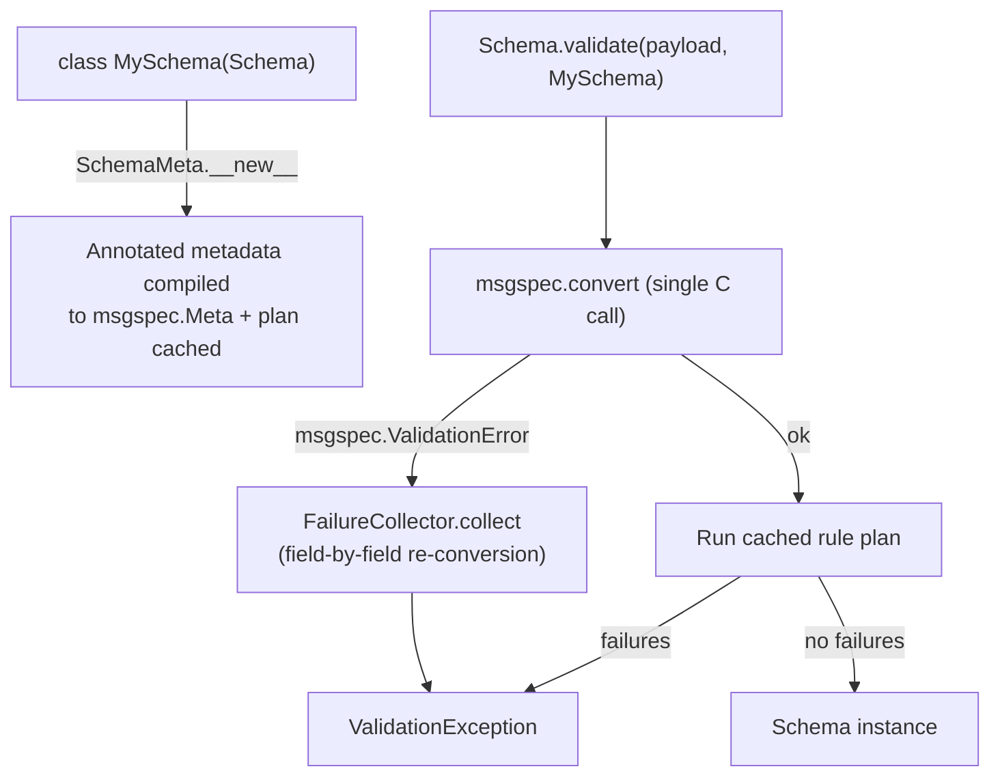

# Orionis Schemas (`orionis.schemas`)

> Declarative validation layer built on `msgspec`: type conversion, constraints, custom rules and multi-error reporting for HTTP payloads and any raw data.

## Table of contents

- [Functional description](#functional-description)
  - [Where it fits](#where-it-fits)
  - [Validation pipeline](#validation-pipeline)
  - [File map](#file-map)
- [API reference](#api-reference)
  - [`Schema` — base class (`orionis.schemas.schema`)](#schema--base-class-orionisschemasschema)
  - [`SchemaMeta` (`orionis.schemas.schema`)](#schemameta-orionisschemasschema)
  - [`Schema.validate` — validator entry point (`orionis.schemas.validator`)](#schemavalidate--validator-entry-point-orionisschemasvalidator)
  - [Field aliases (`orionis.schemas.fields`)](#field-aliases-orionisschemasfields)
  - [Constraint metadata (`orionis.schemas.constraints`)](#constraint-metadata-orionisschemasconstraints)
  - [Documentation metadata (`orionis.schemas.metadata`)](#documentation-metadata-orionisschemasmetadata)
  - [`MetaCompiler` and `MetadataConflictError` (`orionis.schemas.compiler`)](#metacompiler-and-metadataconflicterror-orionisschemascompiler)
  - [`Rule` and `IRule`](#rule-and-irule)
  - [Built-in rules (`orionis.schemas.rules`)](#built-in-rules-orionisschemasrules)
  - [Rule helper modules](#rule-helper-modules)
  - [`ValidationFailure` (`orionis.schemas.entities.failure`)](#validationfailure-orionisschemasentitiesfailure)
  - [`ValidationException` (`orionis.schemas.exceptions.validation`)](#validationexception-orionisschemasexceptionsvalidation)
  - [`ValidationErrorParser` (`orionis.schemas.exception_parser`)](#validationerrorparser-orionisschemasexception_parser)
  - [`FailureCollector` (`orionis.schemas.failure_collector`)](#failurecollector-orionisschemasfailure_collector)
  - [Validation plan (`orionis.schemas.rules_executor`)](#validation-plan-orionisschemasrules_executor)
  - [Metadata markers (`orionis.schemas.meta`)](#metadata-markers-orionisschemasmeta)
- [Usage examples](#usage-examples)
  - [Declaring and validating a schema](#declaring-and-validating-a-schema)
  - [Reporting every error at once](#reporting-every-error-at-once)
  - [Nested schemas and custom messages](#nested-schemas-and-custom-messages)
  - [Writing a custom rule](#writing-a-custom-rule)
  - [Automatic validation of an HTTP request body](#automatic-validation-of-an-http-request-body)
- [Performance and concurrency considerations](#performance-and-concurrency-considerations)
- [Compatibility notes](#compatibility-notes)

## Functional description

`orionis.schemas` turns a class declaration into a validated, typed object. A
schema declares its fields with standard Python annotations; the metaclass
compiles the metadata found in those annotations into `msgspec.Meta`
constraints, and the validator converts a raw payload (`dict`, decoded JSON,
form data) into an instance of the schema, reporting **every** failure at once
instead of stopping at the first one.

### Where it fits

- **`orionis.container`** — `Container.__resolveSchemaArgument` reads the body
  of the current request (`await request.data()`) and calls
  `Schema.validate(data, argument.type)` whenever a handler parameter is
  annotated with a `msgspec.Struct` subclass (`Argument.is_schema`, resolved by
  `orionis.introspection`). This is what makes controller parameters validated
  automatically.
- **`orionis.http`** — `KernelHTTP` catches `ValidationException` and delegates
  to `orionis.http.validation.validation_response`, which returns `422` with
  `exc.error()` for JSON/AJAX clients, or a `302` redirect back with the errors
  and the old input flashed into the session for browsers.
- **`orionis.orm` / `orionis.database`** — used only by the `Unique` rule, which
  runs a single-row probe against a configured connection.
- **`orionis.support.facades.datetime.DateTime`** — used by the temporal rules
  (`After`, `Before`, `DateFormat`, …) to resolve moments in the application
  timezone.
- **`orionis.support.entities.BaseEntity`** — `ValidationFailure` extends it.

### Validation pipeline



Two distinct paths exist:

- **Happy path** — one `msgspec.convert` call (C level) plus the cached rule
  plan. When the schema declares no custom `Rule`, no Python-level validation
  loop runs at all.
- **Error path** — entered only after `msgspec.convert` has already failed.
  `FailureCollector` re-converts the payload field by field so every type and
  constraint error is reported, and then runs the custom rules over the values
  that converted cleanly. A rule attached to a field whose own value failed
  conversion is **not** executed (there is no value to inspect); a rule whose
  sibling failed conversion **is** executed.

### File map

| Path | Contents |
|---|---|
| `__init__.py` | Re-exports the base `Schema`. |
| `schema.py` | `SchemaMeta` metaclass and the base `Schema` class. |
| `validator.py` | `Schema` utility class exposing the static `validate`. |
| `fields.py` | Typing aliases (`Field`, `Choice`, `Nullable`, …). |
| `constraints.py` | Constraint dataclasses + re-export of every built-in rule. |
| `metadata.py` | Documentation metadata (`Title`, `Description`, `Message`, …). |
| `compiler.py` | `MetaCompiler`, `MetadataConflictError`. |
| `rule.py` | `Rule` base class for custom rules. |
| `rules_executor.py` | Plan builder/cache and the rule execution loop. |
| `failure_collector.py` | Field-by-field re-conversion on the error path. |
| `exception_parser.py` | `ValidationErrorParser` for `msgspec` error text. |
| `contracts/constraint.py` | `IRule` abstract contract. |
| `entities/failure.py` | `ValidationFailure` entity. |
| `exceptions/validation.py` | `ValidationException`. |
| `meta/` | Marker bases: `ValidationMetadata`, `ConstraintMetadata`, `DocumentMetadata`. |
| `rules/` | 37 built-in rules + the `measure`, `temporal` and `image_probe` helpers. |

## API reference

### `Schema` — base class (`orionis.schemas.schema`)

```python
class Schema(msgspec.Struct, metaclass=SchemaMeta):

    def toDict(self) -> dict[str, object]:
        ...
```

Base class every application schema inherits from. It is a plain
`msgspec.Struct`, so field declaration, defaults, ordering rules and encoding
follow `msgspec` semantics.

- `toDict()` — returns `msgspec.structs.asdict(self)`, i.e. a shallow
  dictionary of field names to values.

Attributes attached by the metaclass to each subclass:

| Attribute | Type | Contents |
|---|---|---|
| `__orionis_meta__` | `dict[str, list[object]]` | Non-`msgspec.Meta` metadata per field (custom `Rule` instances and any other object left in `Annotated`). Fields without custom metadata are omitted. |
| `__orionis_constraints__` | `dict[str, dict[str, str]]` | Custom messages per field, keyed by constraint name (`min_length`, `ge`, …, plus the reserved `type` key produced by `Message`). |

> Import note: `orionis.schemas.Schema` (this base class) and
> `orionis.schemas.validator.Schema` (the validator utility) share a name.
> Application code that needs both imports the second one aliased, e.g.
> `from orionis.schemas.validator import Schema as Validator`.

### `SchemaMeta` (`orionis.schemas.schema`)

```python
class SchemaMeta(type(msgspec.Struct)):

    def __new__(
        cls,
        name: str,
        bases: tuple[type, ...],
        namespace: dict[str, object],
        **kwargs: object,
    ) -> SchemaMeta:
        ...
```

Runs once per class definition and performs four jobs:

1. Wraps `__annotate_func__` (the PEP 649 lazy annotation callback) so every
   `Annotated` field has its `ValidationMetadata` items compiled into a single
   `msgspec.Meta` via `MetaCompiler.compile`, keeping any other metadata
   untouched.
2. Extracts custom messages: the `message=` keyword of each constraint and the
   text of a `Message(...)` marker (stored under the reserved `type` key) into
   `__orionis_constraints__`.
3. Collects the remaining metadata into `__orionis_meta__`.
4. Calls `_build_plan(klass)` so the validation plan is cached before the first
   request.

**Raises**

- `MetadataConflictError` — propagated from `MetaCompiler.compile` when the
  annotations of a field are duplicated, ambiguous, impossible or invalid.
- `TypeError` — from `_build_plan` when a field carries custom metadata that is
  neither a `Rule` nor a `ValidationMetadata`; the message is
  `Field '<name>' on '<Class>': '<type>' is not a valid custom rule. Custom
  rules must subclass 'orionis.schemas.rule.Rule'.`

Both errors surface at **class definition time**, i.e. at import time, never
during a request.

### `Schema.validate` — validator entry point (`orionis.schemas.validator`)

```python
class Schema:

    __slots__ = ()

    @staticmethod
    def validate(payload: object, schema: type[Schema]) -> Schema:
        ...
```

- `payload` — raw input. Any object accepted by `msgspec.convert`; mappings are
  the case the error path is optimised for.
- `schema` — the schema class to convert to.
- **Returns** an instance of `schema`.
- **Raises** `ValidationException` carrying every failure found.

Behaviour: one `msgspec.convert(payload, type=schema)` call; on success the
cached plan runs the custom rules and, if any failed, a single
`ValidationException` is raised with all of them. On conversion failure the
exception is built from `FailureCollector.collect(payload, schema, exc)`.

Side effects: none beyond populating the module-level plan caches.

### Field aliases (`orionis.schemas.fields`)

Thin re-exports of `typing` names so a schema reads as a declaration rather
than as type plumbing. They are aliases, not wrappers — behaviour is exactly
that of the underlying `typing` construct.

| Alias | Underlying name |
|---|---|
| `Field` | `typing.Annotated` |
| `Choice` | `typing.Literal` |
| `Nullable` | `typing.Optional` |
| `AnyOf` | `typing.Union` |
| `Constant` | `typing.Final` |
| `Alias` | `typing.TypeAlias` |
| `Static` | `typing.ClassVar` |

### Constraint metadata (`orionis.schemas.constraints`)

Frozen, slotted dataclasses that inherit `ConstraintMetadata`. They are placed
inside `Field[...]` and compiled into `msgspec.Meta`, so they are enforced by
`msgspec` during conversion — not by Python code.

```python
@dataclass(frozen=True, slots=True)
class GreaterThan(ConstraintMetadata):
    value: int | float
    message: str | None = field(default=None, kw_only=True)
```

| Constraint | Signature | `msgspec.Meta` key |
|---|---|---|
| `GreaterThan` | `GreaterThan(value, *, message=None)` | `gt` |
| `GreaterThanOrEqual` | `GreaterThanOrEqual(value, *, message=None)` | `ge` |
| `LessThan` | `LessThan(value, *, message=None)` | `lt` |
| `LessThanOrEqual` | `LessThanOrEqual(value, *, message=None)` | `le` |
| `MultipleOf` | `MultipleOf(value, *, message=None)` | `multiple_of` |
| `Pattern` | `Pattern(regex, *, message=None)` | `pattern` |
| `MinLength` | `MinLength(value, *, message=None)` | `min_length` |
| `MaxLength` | `MaxLength(value, *, message=None)` | `max_length` |
| `TimezoneAware` | `TimezoneAware(*, message=None)` | `tz=True` |
| `TimezoneNaive` | `TimezoneNaive(*, message=None)` | `tz=False` |

The `message` keyword is consumed by `SchemaMeta`: it is stored in
`__orionis_constraints__` and replaces the default `msgspec` text when that
constraint is the one that failed.

The module also re-exports every built-in rule, so a schema can import
constraints and rules from a single place — this is the import style used by the
application schemas in `app/http/schemas/`.

### Documentation metadata (`orionis.schemas.metadata`)

Frozen, slotted dataclasses inheriting `DocumentMetadata`. They do not validate
anything; they feed the JSON Schema / OpenAPI properties of `msgspec.Meta`.

| Class | Signature | Effect |
|---|---|---|
| `Title` | `Title(value: str)` | `msgspec.Meta(title=...)`. |
| `Description` | `Description(value: str)` | `msgspec.Meta(description=...)`. |
| `Examples` | `Examples(values: list[object])` | `msgspec.Meta(examples=...)`. |
| `ExtraJsonSchema` | `ExtraJsonSchema(data: dict[str, object])` | Merged into the generated JSON Schema object. |
| `Extra` | `Extra(data: dict[str, object])` | Passed through untouched. |
| `Message` | `Message(text: str)` | Custom **type-mismatch** message; stored under the reserved `type` key of `__orionis_constraints__`. |

`Message` is the only way to override the `Expected <type>, got <type>` error of
a plain field. Only the first `Message` found on a field is kept.

### `MetaCompiler` and `MetadataConflictError` (`orionis.schemas.compiler`)

```python
class MetaCompiler:

    __slots__ = ()

    @staticmethod
    def compile(metadata: list[ValidationMetadata]) -> msgspec.Meta:
        ...


class MetadataConflictError(ValueError):
    ...
```

`compile` indexes the metadata by concrete type, validates the combination and
builds a single `msgspec.Meta` populating `gt`, `ge`, `lt`, `le`,
`multiple_of`, `pattern`, `min_length`, `max_length`, `tz`, `title`,
`description`, `examples`, `extra_json_schema` and `extra`.

`MetadataConflictError` is raised for four categories:

| Category | Example |
|---|---|
| Duplicate types | two `MinLength` on the same field |
| Ambiguous bounds | `GreaterThan` + `GreaterThanOrEqual`, `LessThan` + `LessThanOrEqual`, `TimezoneAware` + `TimezoneNaive` |
| Impossible ranges | `MinLength(10)` + `MaxLength(5)`; a numeric lower bound not below the upper one |
| Invalid values | `MultipleOf(0)` or negative, `MinLength(-1)`, `MaxLength(-5)` |

### `Rule` and `IRule`

```python
class Rule(IRule):

    __slots__ = ("_code", "_message")

    def __init__(self, *, message: str | None = None) -> None:
        ...

    def enforce(self, field: str, value: object, instance: object) -> bool:
        ...

    def validate(
        self,
        field: str,
        value: object,
        instance: object,
    ) -> ValidationFailure | None:
        ...
```

`Rule` is the base class for validation that cannot be expressed as a
`msgspec` constraint. Subclasses **only override `enforce`**:

- `enforce` returns `True` when the value passes. The base implementation
  raises `NotImplementedError` with the message
  `Subclasses must implement the enforce method.`
- `validate` is the entry point the executor calls; it wraps `enforce` and
  builds a `ValidationFailure(field=..., rule=self._code, message=self._message)`
  when it returns `False`. It is not meant to be overridden.
- `__init__` resolves, once, the class attributes `__code__` (fallback:
  `type(self).__name__.lower()`) and `__message__`, and lets the `message=`
  keyword override the latter.

`IRule` (`orionis.schemas.contracts.constraint`) is the matching `abc.ABC` with
`__slots__ = ()`, declaring `__init__`, `enforce` and `validate` as abstract.

Convention followed by every built-in rule: when the value is not of the
expected Python type, `enforce` returns `True` and lets the type layer report
the mismatch, so a single wrong value never produces two errors.

### Built-in rules (`orionis.schemas.rules`)

All of them are importable from `orionis.schemas.rules` or from
`orionis.schemas.constraints`. Every constructor accepts the keyword-only
`message` to override the default text.

| Rule | Constructor | `rule` code | Checks |
|---|---|---|---|
| `Accepted` | `Accepted(*, message=None)` | `accepted` | `True`, `1`, or `"yes"`/`"on"`/`"1"`/`"true"` (case-insensitive). |
| `ActiveUrl` | `ActiveUrl(*, message=None)` | `active_url` | The URL hostname resolves through `socket.getaddrinfo`. |
| `After` | `After(reference=None, *, message=None)` | `after` | Date strictly after the reference moment. |
| `AfterOrEqual` | `AfterOrEqual(reference=None, *, message=None)` | `after_or_equal` | Date on or after the reference moment. |
| `Alpha` | `Alpha(*, ascii_only=False, message=None)` | `alpha` | Only alphabetic characters. |
| `Ascii` | `Ascii(*, message=None)` | `ascii` | Only 7-bit ASCII characters. |
| `Before` | `Before(reference=None, *, message=None)` | `before` | Date strictly before the reference moment. |
| `BeforeOrEqual` | `BeforeOrEqual(reference=None, *, message=None)` | `before_or_equal` | Date on or before the reference moment. |
| `Between` | `Between(minimum, maximum, *, message=None)` | `between` | Measured size within inclusive bounds. Raises `ValueError` if `minimum > maximum`. |
| `ConfirmPassword` | `ConfirmPassword(other_field="password", *, message=None)` | `confirm_password` | Equals the sibling password field. |
| `DateFormat` | `DateFormat(*formats, message=None)` | `date_format` | Date string matching one of the accepted formats. |
| `DecimalPlaces` | `DecimalPlaces(minimum, maximum=None, *, message=None)` | `decimal` | Required number of decimal places. |
| `Different` | `Different(*values, message=None)` | `different` | Differs from every supplied value. |
| `Dimensions` | `Dimensions(*, min_width=None, max_width=None, min_height=None, max_height=None, width=None, height=None, ratio=None, min_ratio=None, max_ratio=None, message=None)` | `dimensions` | Uploaded image satisfying the dimension constraints. |
| `DoesntEndWith` | `DoesntEndWith(*suffixes, message=None)` | `doesnt_end_with` | Does not end with any forbidden suffix. |
| `DoesntStartWith` | `DoesntStartWith(*prefixes, message=None)` | `doesnt_start_with` | Does not start with any forbidden prefix. |
| `Email` | `Email(*, message=None)` | `email` | RFC-shaped address, ≤ 254 characters, local part ≤ 64. |
| `Encoding` | `Encoding(encoding="utf-8", *, message=None)` | `encoding` | Representable in the given codec. |
| `EndsWith` | `EndsWith(*suffixes, message=None)` | `ends_with` | Ends with one of the allowed suffixes. |
| `File` | `File(*, message=None)` | `file` | Value exposes the uploaded-file protocol. |
| `GreaterThanOrEqualField` | `GreaterThanOrEqualField(other_field, *, message=None)` | `gte` | Greater than or equal to a sibling field. |
| `Image` | `Image(*, message=None)` | `image` | Uploaded file is a PNG, JPEG, GIF, BMP or WebP raster. |
| `Integer` | `Integer(*, message=None)` | `integer` | Represents a whole number. |
| `IpAddress` | `IpAddress(version=4, *, message=None)` | `ip` | Valid IP address; `version` accepts `4`, `6` or `None` (either family), other values raise `ValueError`. |
| `Json` | `Json(*, message=None)` | `json` | Syntactically valid JSON document. |
| `LessThanOrEqualField` | `LessThanOrEqualField(other_field, *, message=None)` | `lte` | Less than or equal to a sibling field. |
| `Lowercase` | `Lowercase(*, message=None)` | `lowercase` | No uppercase characters. |
| `MacAddress` | `MacAddress(*, message=None)` | `mac_address` | Valid MAC address. |
| `MaxDigits` | `MaxDigits(maximum, *, message=None)` | `max_digits` | At most the given number of digits. |
| `MimeTypes` | `MimeTypes(*mime_types, message=None)` | `mimetypes` | Uploaded file declaring one of the accepted MIME types. |
| `Size` | `Size(size, *, message=None)` | `size` | Exact measured size. |
| `StartsWith` | `StartsWith(*prefixes, message=None)` | `starts_with` | Starts with one of the allowed prefixes. |
| `StrongPassword` | `StrongPassword(*, message=None)` | `strong_password` | At least 8 characters with an uppercase, a lowercase and a digit. |
| `Ulid` | `Ulid(*, message=None)` | `ulid` | Valid ULID. |
| `Unique` | `Unique(table, column, *, ignore=None, ignore_column="id", connection=None, message=None)` | `unique` | No stored row holds the value. |
| `Uppercase` | `Uppercase(*, message=None)` | `uppercase` | No lowercase characters. |
| `Uuid` | `Uuid(version=None, *, message=None)` | `uuid` | RFC 9562 identifier; `version` accepts `1`, `3`, `4`, `5`, `6`, `7`, `8` or `None`, other values raise `ValueError`. |

Rules with side effects worth calling out:

- **`Unique`** — builds a `RawQueryBuilder` plan limited to one row and runs it
  through `Loop.runSync`. When an event loop is already running (an HTTP
  request), it creates a throwaway `Connection`, queries, and always
  `disconnect()`s it in a `finally`; the pooled connection cannot be reused
  because it belongs to the caller's loop. Without a running loop it uses the
  shared connection resolved by `ConnectionResolver`. The calling thread blocks
  until the query resolves. `ignore`/`ignore_column` exclude the row being
  updated.
- **`ActiveUrl`** — performs a blocking DNS lookup on the calling thread.
- **`File`, `Image`, `Dimensions`, `MimeTypes`, `Size`, `Between`** — inspect
  uploaded files. Detection is structural: any object exposing `read`, `size`
  and `filename`, so the module never imports the HTTP payload package.

### Rule helper modules

Module-level helpers (`snake_case`) shared by the rules above; they are part of
the module surface but are not rules themselves.

| Module | Public helpers |
|---|---|
| `rules/measure.py` | `KILOBYTE`, `is_file(value) -> bool`, `read_content(value) -> bytes \| None`, `measure(value) -> float \| None` |
| `rules/temporal.py` | `to_datetime(value)`, `parse_moment(text)`, `resolve_moment(reference, instance)` |
| `rules/image_probe.py` | `probe_image(data: bytes) -> tuple[str, int, int] \| None` |

- `measure(value)` returns the number itself for numbers, `len()` for sized
  values, `size / 1024` for uploaded files and `None` for booleans or anything
  without a comparable size.
- `parse_moment` understands the keywords `now`, `today`, `tomorrow` and
  `yesterday`, and otherwise delegates to `DateTime.parse(text, strict=False)`.
- `resolve_moment` treats a string reference as a sibling field name first, and
  only falls back to parsing it as a date.
- `probe_image` reads dimensions straight from the file header for PNG, JPEG,
  GIF, BMP and WebP — no imaging library is required.

### `ValidationFailure` (`orionis.schemas.entities.failure`)

```python
@dataclass(slots=True, frozen=True)
class ValidationFailure(BaseEntity):
    field: str
    rule: str
    message: str

    def toDict(self) -> dict:
        ...
```

Immutable description of one failure. `field` is the dotted path
(`"address.zip_code"`, `""` for an error on the payload itself), `rule` is the
constraint key (`min_length`, `ge`, `type`, `missing`) or the `__code__` of the
rule that failed, and `message` is the final text shown to the client.
`toDict()` overrides `BaseEntity.toDict()` with a literal three-key dictionary.

### `ValidationException` (`orionis.schemas.exceptions.validation`)

```python
class ValidationException(Exception):

    def __init__(
        self,
        failures: ValidationFailure | Sequence[ValidationFailure],
        message: str | None = None,
    ) -> None:
        ...

    def error(self) -> dict:
        ...
```

Accepts a single failure or a `list`/`tuple` of them and exposes:

| Attribute | Type | Contents |
|---|---|---|
| `failures` | `tuple[ValidationFailure, ...]` | Every failure, in the order collected. |
| `failure` | `ValidationFailure \| None` | The first one, or `None` when built empty. |
| `errors` | `dict[str, list[str]]` | Messages grouped by field name. |
| `message` | `str` | The `message` argument, or the first failure message suffixed with `(and N more error[s])`. With no failures: `The given data was invalid.` |

`error()` returns `{"message": self.message, "errors": self.errors}` — the exact
body sent with HTTP `422`.

### `ValidationErrorParser` (`orionis.schemas.exception_parser`)

```python
class ValidationErrorParser:

    __slots__ = ()

    @classmethod
    def parse(
        cls,
        error: msgspec.ValidationError,
        schema: type | None = None,
    ) -> ValidationFailure:
        ...

    @classmethod
    def parseAt(
        cls,
        error: msgspec.ValidationError,
        schema: type | None,
        base: str,
    ) -> ValidationFailure:
        ...
```

Turns the text of a `msgspec.ValidationError` into a `ValidationFailure`:

- Splits the `<message> - at `$<path>`` suffix with plain string scans and
  joins the path with `base` (sequence indices such as `[0]` are appended
  without a dot).
- Recognises `missing required field \`x\`` and reports `rule="missing"`.
- Maps the message to a constraint key with an ordered list of phrases
  (`of length >=` → `min_length`, ` >= ` → `ge`, `Expected` → `type`, …);
  when nothing matches, `rule` is `"type"`.
- Walks the schema hierarchy along the dotted path to find the leaf schema and
  replaces the message with the custom one declared in
  `__orionis_constraints__`, when present.

`parse(error, schema)` is `parseAt(error, schema, "")`.

Two module-level caches keep the error path cheap: `_STRUCT_FIELDS_MAP`
(schema → field types) and `_NESTED_TYPE_CACHE` (`(schema, field)` → nested
schema or `None`).

### `FailureCollector` (`orionis.schemas.failure_collector`)

```python
class FailureCollector:

    __slots__ = ()

    @classmethod
    def collect(
        cls,
        payload: object,
        schema: type,
        error: msgspec.ValidationError,
    ) -> tuple[ValidationFailure, ...]:
        ...
```

Runs only after a whole-payload conversion has failed. For a `Mapping` payload
it converts each declared field on its own, so:

- Absent required fields are reported with `rule="missing"` and the message
  ``Object missing required field `x` ``.
- Every field that fails conversion contributes its own failure (recursing into
  nested schemas, which report their own errors with dotted paths).
- Fields that converted cleanly still run their custom rules, receiving a
  `types.SimpleNamespace` built from the successfully converted values — this is
  what keeps cross-field rules usable when no schema instance exists.

When no declared field can be blamed (non-mapping payload, unknown fields,
custom hooks), the originally parsed error is inserted at position 0.

Its per-schema plan is cached in `_FIELD_PLAN_CACHE` and reuses the rule plan
built by `rules_executor`, so rules are declared in a single place.

### Validation plan (`orionis.schemas.rules_executor`)

Internal module (all names are prefixed with `_`), documented because it defines
observable behaviour: **when** custom rules run and in **which order** failures
are produced.

| Name | Purpose |
|---|---|
| `_PLAN_CACHE` | `dict[type, tuple]`, process-wide, one entry per schema class. |
| `_build_plan(klass) -> tuple` | Builds and caches the plan; entries are `(field_name, field_name_dot, getter, validators, is_nested)`. Only fields with rules or with a nested schema are kept, so an empty plan means "nothing to do". Raises `TypeError` on unsupported metadata. |
| `_collect_with_plan(plan, instance, prefix, failures) -> None` | The hot loop: reads each field with a precompiled `operator.attrgetter`, recurses into nested schemas first, then runs the field validators, appending every failure. |

Consequences visible from the outside: nested failures for a field are reported
before that field's own rule failures, and the plan for a nested schema is
warmed when the parent plan is built, so no cold build happens mid-request.

### Metadata markers (`orionis.schemas.meta`)

| Class | Module | Role |
|---|---|---|
| `ValidationMetadata` | `meta/validation.py` | Root marker (`__slots__ = ()`) for anything that can annotate a schema field. |
| `ConstraintMetadata` | `meta/constraint.py` | Marker for metadata that takes part in value validation. |
| `DocumentMetadata` | `meta/document.py` | Marker for metadata that only feeds documentation output. |

They declare `__slots__ = ()` so that frozen dataclass subclasses using
`slots=True` do not hit a `__dict__`/slot conflict.

## Usage examples

### Declaring and validating a schema

```python
from orionis.schemas import Schema
from orionis.schemas.constraints import (
    Email,
    GreaterThanOrEqual,
    LessThanOrEqual,
    MinLength,
)
from orionis.schemas.fields import Field, Nullable
from orionis.schemas.validator import Schema as Validator


class RegisterSchema(Schema):
    name: Field[str, MinLength(3)]
    email: Field[str, Email()]
    age: Field[int, GreaterThanOrEqual(18), LessThanOrEqual(120)]
    nickname: Nullable[str] = None


user = Validator.validate(
    {"name": "Ada", "email": "ada@example.com", "age": 36},
    RegisterSchema,
)

print(user.name, user.age)
print(user.toDict())
```

Output:

```text
Ada 36
{'name': 'Ada', 'email': 'ada@example.com', 'age': 36, 'nickname': None}
```

### Reporting every error at once

Continuing the previous snippet:

```python
from orionis.schemas.exceptions.validation import ValidationException

try:
    Validator.validate({"name": "Al", "email": "nope", "age": 12}, RegisterSchema)
except ValidationException as exc:
    print(exc.message)
    print(exc.errors)
    for failure in exc.failures:
        print(failure.field, "|", failure.rule, "|", failure.message)
```

Output:

```text
Expected `str` of length >= 3 (and 2 more errors)
{'name': ['Expected `str` of length >= 3'], 'age': ['Expected `int` >= 18'], 'email': ['Value must be a valid email address.']}
name | min_length | Expected `str` of length >= 3
age | ge | Expected `int` >= 18
email | email | Value must be a valid email address.
```

Type and constraint errors come first, in field declaration order; rule
failures follow, because they run once every value is known.

### Nested schemas and custom messages

```python
from orionis.schemas import Schema
from orionis.schemas.constraints import MinLength, StrongPassword
from orionis.schemas.exceptions.validation import ValidationException
from orionis.schemas.fields import Field
from orionis.schemas.metadata import Message
from orionis.schemas.validator import Schema as Validator


class Address(Schema):
    city: Field[str, MinLength(2, message="City is too short.")]
    zip_code: Field[str, Message("The zip code must be text.")]


class Account(Schema):
    address: Address
    password: Field[str, StrongPassword(message="Choose a stronger password.")]


try:
    Validator.validate(
        {"address": {"city": "X", "zip_code": 1000}, "password": "weak"},
        Account,
    )
except ValidationException as exc:
    print(exc.errors)
```

Output:

```text
{'address.city': ['City is too short.'], 'address.zip_code': ['The zip code must be text.'], 'password': ['Choose a stronger password.']}
```

### Writing a custom rule

```python
from orionis.schemas import Schema
from orionis.schemas.exceptions.validation import ValidationException
from orionis.schemas.fields import Field
from orionis.schemas.rule import Rule
from orionis.schemas.validator import Schema as Validator


class EvenNumber(Rule):

    __code__ = "even"
    __message__ = "Value must be an even number."

    def enforce(self, field: str, value: object, instance: object) -> bool:
        return isinstance(value, int) and value % 2 == 0


class Ticket(Schema):
    seats: Field[int, EvenNumber()]


print(Validator.validate({"seats": 4}, Ticket).toDict())

try:
    Validator.validate({"seats": 3}, Ticket)
except ValidationException as exc:
    print(exc.errors, exc.failures[0].rule)
```

Output:

```text
{'seats': 4}
{'seats': ['Value must be an even number.']} even
```

### Automatic validation of an HTTP request body

Annotating a controller parameter with a schema is enough: the container reads
the body, validates it and injects the typed instance. If validation fails the
controller is never called — `KernelHTTP` turns the `ValidationException` into a
`422` payload for JSON clients or into a redirect back with flashed errors for
browsers.

```python
from orionis.http import HttpResponse, response
from orionis.http.base import BaseController
from orionis.schemas import Schema
from orionis.schemas.constraints import ConfirmPassword, Email, MinLength, Unique
from orionis.schemas.fields import Field
from orionis.schemas.metadata import Message


class RegisterSchema(Schema):

    name: Field[
        str,
        Message("Name must be a string."),
        MinLength(6, message="Name must be at least 6 characters long."),
    ]

    email: Field[
        str,
        Message("Email must be a string."),
        Email(message="Email must be a valid email address."),
        Unique(table="users", column="email", message="Email already exists."),
    ]

    password: Field[str, MinLength(8)]

    password_confirmation: Field[
        str,
        ConfirmPassword(message="Password confirmation does not match."),
    ]


class RegisterController(BaseController):

    async def register(self, payload: RegisterSchema) -> HttpResponse:
        return response.json({"email": payload.email})
```

## Performance and concurrency considerations

- **Everything expensive happens once, at import time.** Compiling metadata,
  detecting conflicts and building the validation plan run inside
  `SchemaMeta.__new__`. A request only pays for `msgspec.convert` plus, when the
  schema declares custom rules, one pass over the cached plan.
- **Schemas with no custom rules cost exactly one C call.** `_build_plan` keeps
  only the fields that have rules or a nested schema; an empty plan short-circuits
  the whole Python loop in `Schema.validate`.
- **The multi-error path is opt-in by failure.** `FailureCollector` re-converts
  field by field, which is measurably more expensive than a single conversion,
  but it only runs when the payload was already rejected.
- **Caches are process-wide and unbounded.** `_PLAN_CACHE`, `_FIELD_PLAN_CACHE`,
  `_STRUCT_FIELDS_MAP` and `_NESTED_TYPE_CACHE` are plain module-level `dict`s
  keyed by class, never evicted. Every stored value is a pure function of its
  key, so a concurrent double build stores identical data; the classes
  themselves are what keeps memory bounded in practice.
- **Rule instances are shared.** A rule is constructed once, inside the class
  annotation, and its `validate` is called for every payload — including
  concurrently. The built-in rules only read their configuration slots and hold
  no mutable state; custom rules must do the same.
- **The pipeline is fully synchronous.** `Schema.validate` is a normal function
  and blocks the calling thread. This matters for the two I/O rules: `ActiveUrl`
  blocks on DNS, and `Unique` blocks on a database round trip. `Unique` bridges
  the async ORM with `Loop.runSync`, which dispatches to a worker thread when an
  event loop is already running; because that worker has its own loop, the rule
  opens and closes a dedicated `Connection` per validation instead of reusing
  the pooled one.
- **`__slots__` throughout.** `Rule`, `MetaCompiler`, `ValidationErrorParser`,
  `FailureCollector`, `validator.Schema`, the marker bases, every built-in rule
  and every constraint dataclass declare `__slots__`, so no per-instance
  `__dict__` is allocated.

## Compatibility notes

- **Python ≥ 3.14 is a functional requirement, not just a floor.** `SchemaMeta`
  wraps `__annotate_func__`, the PEP 649 deferred-annotation callback, which
  only exists from 3.14 onwards. The module cannot run on earlier versions.
- **`msgspec >= 0.21.1`** ships as a base dependency of the framework
  (`pyproject.toml`), so no extra installation is needed. Error texts such as
  ``Expected `str` of length >= 3`` come from `msgspec`; `ValidationErrorParser`
  matches them by phrase, so a change in `msgspec`'s wording would affect the
  detected `rule` key.
- **Schemas are `msgspec.Struct` subclasses.** Field ordering rules (fields
  without a default must precede fields with one), `ClassVar` exclusion and
  encoding behaviour follow `msgspec`, not this module.
- **`orionis.schemas.Schema` vs `orionis.schemas.validator.Schema`.** Two
  different classes with the same name: the base class to inherit from, and the
  static utility exposing `validate`. Importing the second one aliased is the
  convention used across the repository.
- **The `Unique` rule pulls in `orionis.orm` / `orionis.database`** and needs a
  configured connection at validation time; for engines other than SQLite the
  matching driver extra must be installed (`orionis[pgsql]`, `orionis[mysql]`,
  …). Every other rule depends only on the standard library, except the temporal
  ones, which use `DateTime` (pendulum) and therefore the application timezone.
- **`ValidationException` is understood by `orionis.http`.** Raising it outside
  a request is perfectly valid; inside one it is automatically translated to a
  `422` response or a redirect back.
