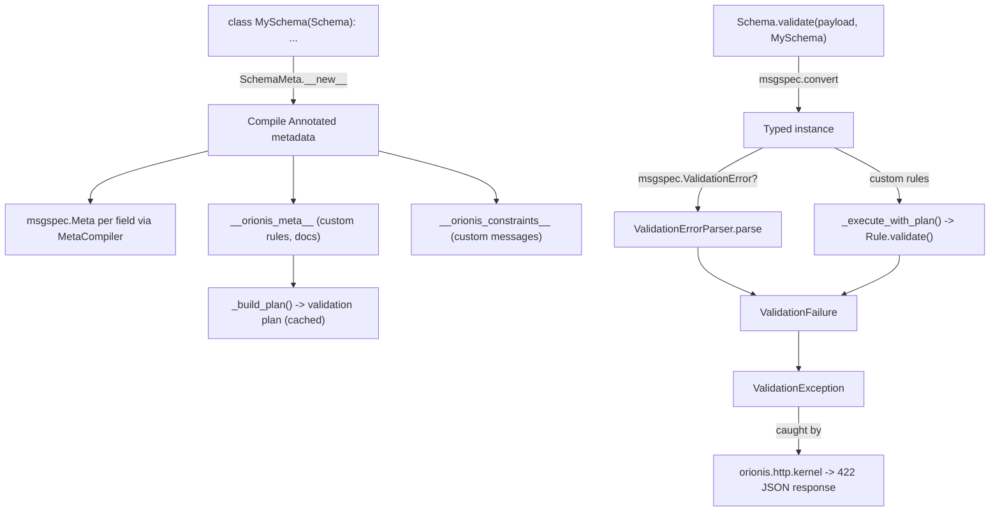

# Orionis Schemas (`orionis.schemas`)

> Typed, validated data schemas built on `msgspec.Struct`, with declarative constraints, custom rules, and structured validation errors.
>
> 🇪🇸 Versión en español: [README.es.md](README.es.md)

`orionis.schemas` lets you declare typed data shapes (HTTP request bodies,
DTOs, nested value objects) as plain, annotated classes and get both
**type coercion** and **validation** for free — powered by
[`msgspec`](https://jcristharif.com/msgspec/) under the hood, but exposed
through an Orionis-specific, framework-agnostic API. It is the schema
layer the DI container uses to auto-populate and validate HTTP request
bodies, and it can be used standalone for any structured-data validation
need.

---

## Table of contents

1. [Requirements](#requirements)
2. [Module overview](#module-overview)
3. [Architecture](#architecture)
4. [API reference](#api-reference)
   - [`Schema` / `SchemaMeta`](#schema--schemameta-orionisschemasschemaschema)
   - [Field type aliases (`fields.py`)](#field-type-aliases-fieldspy)
   - [Documentation metadata (`metadata.py`)](#documentation-metadata-metadatapy)
   - [Validation constraints (`constraints.py`)](#validation-constraints-constraintspy)
   - [Custom rules: `Rule`, `IRule`, `StrongPassword`](#custom-rules-rule-irule-strongpassword)
   - [The validator entry point: `Schema.validate` (`validator.py`)](#the-validator-entry-point-schemavalidate-validatorpy)
   - [Error handling: `ValidationFailure`, `ValidationException`, `ValidationErrorParser`](#error-handling-validationfailure-validationexception-validationerrorparser)
   - [`MetaCompiler` / `MetadataConflictError`](#metacompiler--metadataconflicterror)
5. [Usage examples](#usage-examples)
6. [Performance and concurrency considerations](#performance-and-concurrency-considerations)
7. [Design notes](#design-notes)
8. [Compatibility notes](#compatibility-notes)

---

## Requirements

No installation beyond the framework itself is required:

```bash
pip install orionis
```

- **Python:** 3.14 or newer — **required**, not just the framework
  minimum: `SchemaMeta` relies on the PEP 649 lazy annotation protocol
  (`__annotate_func__`), introduced in Python 3.14, to compile field
  metadata.
- **Runtime dependency:** [`msgspec`](https://pypi.org/project/msgspec/)
  (`msgspec>=0.21.1`, a core, non-optional dependency of the framework)
  provides the underlying `Struct` base class, type coercion, and the
  low-level constraint enforcement (`msgspec.Meta`).

## Module overview

Validating incoming data (an HTTP JSON body, a config payload, a nested
value object) usually requires two things: converting raw data into typed
Python values, and rejecting values that do not satisfy business rules.
`orionis.schemas` combines both into one declaration:

- **`Schema`** (`orionis.schemas.schema.Schema`) — the base class every
  schema extends. It is a `msgspec.Struct` subclass built through the
  `SchemaMeta` metaclass, which compiles Orionis metadata (constraints,
  documentation, custom rules) attached to each field via `Annotated`
  into `msgspec.Meta` descriptors, so `msgspec`'s native (Rust-backed)
  decoder enforces type coercion **and** built-in constraints.
- **Field type aliases** (`fields.py`) — short names (`Field`, `Choice`,
  `Nullable`, `AnyOf`, `Constant`, `Alias`, `Static`) for the standard
  `typing` constructs used to declare fields, so schema classes read
  close to plain dataclasses without importing `typing` directly.
- **Constraints** (`constraints.py`) — declarative value rules
  (`MinLength`, `MaxLength`, `Pattern`, `GreaterThan`, `LessThan`, ...)
  that compile down to `msgspec.Meta` keyword arguments, enforced natively
  during decoding — the fastest validation path.
- **Custom rules** (`rule.py`, `rules/strong_password.py`) — for checks
  `msgspec.Meta` cannot express (cross-field checks, arbitrary Python
  logic), you subclass `Rule` and implement `enforce()`; rules run in a
  second pass, after successful type/constraint decoding.
- **Documentation metadata** (`metadata.py`) — non-validating annotations
  (`Title`, `Description`, `Examples`, `ExtraJsonSchema`, `Extra`,
  `Message`) for JSON Schema/OpenAPI generation and custom error text.
- **The validator entry point** (`validator.py`) — a small utility class,
  **also named `Schema`**, whose `validate(payload, schema)` static method
  converts a raw payload into a schema instance and runs any custom
  `Rule` checks. This is what the DI container calls internally to
  resolve `msgspec.Struct`-annotated parameters (e.g. HTTP request bodies)
  — see [Design notes](#design-notes) for the naming clash with
  `schema.py`'s `Schema`.
- **Structured errors** (`entities/failure.py`, `exceptions/validation.py`,
  `exception_parser.py`) — both `msgspec`'s native validation errors and
  custom `Rule` failures are normalized into one `ValidationFailure`
  shape (`field`, `rule`, `message`) and raised as a single
  `ValidationException`, which `orionis.http.kernel` catches and turns
  into a `422` JSON response.

## Architecture



- `SchemaMeta` (in `schema.py`) intercepts class creation for every
  `Schema` subclass: it wraps `__annotate_func__` so each `Annotated[...]`
  field is rewritten with a compiled `msgspec.Meta` (via `MetaCompiler`),
  collects non-`msgspec.Meta` metadata (custom `Rule`s, `Message`, doc
  metadata) into `__orionis_meta__`, records per-field custom constraint
  messages into `__orionis_constraints__`, and pre-builds the field
  validation plan (`rules_executor._build_plan`) at class-definition time.
- `validator.py`'s `Schema.validate(payload, schema)` is the runtime entry
  point: `msgspec.convert(payload, type=schema)` performs type coercion
  and enforces every compiled `msgspec.Meta` constraint natively; on
  failure, `ValidationErrorParser.parse(...)` turns the raw `msgspec`
  error text into a `ValidationFailure`. On success, the cached plan from
  `rules_executor` runs every custom `Rule` (including recursively for
  nested `Schema` fields), raising `ValidationException` on the first
  failure.
- `orionis.container.container.Container` imports `validator.Schema`
  directly and calls `Schema.validate(...)` when auto-resolving a
  parameter annotated with a `msgspec.Struct` subclass (detected via
  `Argument.is_schema`, from `orionis.introspection`) — this is how HTTP
  controller parameters typed with a `Schema` subclass get populated and
  validated automatically from the request body.
- `orionis.http.kernel` imports `ValidationException` and converts it into
  a `422` response with the structured `{"field", "rule", "message"}`
  payload from `exc.error()`.

## API reference

### `Schema` / `SchemaMeta` (`orionis.schemas.schema.Schema`)

```python
class SchemaMeta(type(msgspec.Struct)): ...

class Schema(msgspec.Struct, metaclass=SchemaMeta):
    """Base class for Orionis schema declarations."""
```

Exported at the package root: `from orionis.schemas import Schema`.

This is the class every schema **definition** extends. It carries no
public instance methods of its own beyond what `msgspec.Struct` provides
(field access, `__init__`, equality, etc.); all the behavior lives in the
metaclass, which runs once per subclass at class-creation time:

| Metaclass behavior | Description |
| --- | --- |
| Compiles `Annotated[...]` metadata | Every `ValidationMetadata` instance found in a field's `Annotated[...]` args is compiled into a single `msgspec.Meta` via `MetaCompiler.compile(...)`, replacing the raw annotation. |
| `__orionis_meta__` | Class attribute: `dict[str, list[object]]` mapping field name → non-`msgspec.Meta` custom metadata (custom `Rule` instances, doc metadata) declared on that field. |
| `__orionis_constraints__` | Class attribute: `dict[str, dict[str, str]]` mapping field name → `{constraint_key: custom_message}`, built from any `message=...` argument passed to a constraint or `Message(...)` metadata. |
| Validation plan pre-build | Calls the internal `rules_executor._build_plan(klass)` at class-creation time so the first `Schema.validate(...)` call for that class never pays a cold-build cost. |

**Raises:** `MetadataConflictError` (from `compiler.py`) at **class
definition time** if two conflicting constraints are declared on the same
field (see [`MetaCompiler`](#metacompiler--metadataconflicterror)).

### Field type aliases (`fields.py`)

Short, framework-specific names re-exporting standard `typing` constructs,
so schema field declarations do not need to `import typing` directly:

| Alias | Underlying `typing` construct | Typical use |
| --- | --- | --- |
| `Field` | `Annotated` | `name: Field[str, MinLength(3)]` — attach metadata to a field. |
| `Choice` | `Literal` | `status: Choice["active", "inactive"]` — restrict to fixed values. |
| `Nullable` | `Optional` | `middle_name: Nullable[str]` — allow `None`. |
| `AnyOf` | `Union` | `id: AnyOf[int, str]` — accept one of several types. |
| `Constant` | `Final` | `VERSION: Constant[str] = "1.0"` — non-overridable class attribute. |
| `Alias` | `TypeAlias` | Declare a reusable type alias for schema fields. |
| `Static` | `ClassVar` | Mark a schema attribute as class-level (excluded from struct fields). |

### Documentation metadata (`metadata.py`)

All subclass `DocumentMetadata` (a `ValidationMetadata` marker that does
**not** participate in value validation) and are `@dataclass(frozen=True,
slots=True)`. Used inside `Field[...]`/`Annotated[...]` alongside
constraints:

| Class | Fields | Purpose |
| --- | --- | --- |
| `Title` | `value: str` | Human-readable field title for JSON Schema/OpenAPI. |
| `Description` | `value: str` | Human-readable field description. |
| `Examples` | `values: list[object]` | Example values for generated schema output. |
| `ExtraJsonSchema` | `data: dict[str, object]` | Raw JSON Schema properties merged into the generated schema (e.g. `readOnly`, `deprecated`, `x-*`). |
| `Extra` | `data: dict[str, object]` | Arbitrary application-specific data, not interpreted by schema generation. |
| `Message` | `text: str` | Custom error message shown when **type** validation fails on this field — the only way to override a plain-type mismatch message (e.g. `Field[str, Message("Must be a string.")]`). |

### Validation constraints (`constraints.py`)

All subclass `ConstraintMetadata` (a `ValidationMetadata` marker that
**does** participate in validation) and are `@dataclass(frozen=True,
slots=True)`. Each accepts an optional keyword-only `message: str | None`
used as the custom error text when the constraint fails:

| Class | Fields | Applies to | Compiles to `msgspec.Meta` key |
| --- | --- | --- | --- |
| `GreaterThan` | `value: int \| float` | Numbers | `gt` |
| `GreaterThanOrEqual` | `value: int \| float` | Numbers | `ge` |
| `LessThan` | `value: int \| float` | Numbers | `lt` |
| `LessThanOrEqual` | `value: int \| float` | Numbers | `le` |
| `MultipleOf` | `value: int \| float` | Numbers | `multiple_of` |
| `Pattern` | `regex: str` | Strings | `pattern` |
| `MinLength` | `value: int` | Strings/collections | `min_length` |
| `MaxLength` | `value: int` | Strings/collections | `max_length` |
| `TimezoneAware` | — | `datetime`/`time` | `tz_aware` |
| `TimezoneNaive` | — | `datetime`/`time` | `tz_naive` |

`StrongPassword` (actually defined in `rules/strong_password.py`, a
`Rule` subclass — see below) is re-exported from `constraints.py`'s
`__all__` for convenience, since it is commonly used alongside these
constraints.

These constraints are enforced **natively by `msgspec`** at decode time
(no Python-level loop per constraint) — see
[Performance considerations](#performance-and-concurrency-considerations).

### Custom rules: `Rule`, `IRule`, `StrongPassword`

For validations `msgspec.Meta` cannot express, subclass `Rule`:

```python
class Rule(IRule):
    __slots__ = ("_code", "_message")
    def __init__(self, *, message: str | None = None) -> None: ...
    def enforce(self, field: str, value: object, instance: object) -> bool: ...
    def validate(self, field: str, value: object, instance: object) -> ValidationFailure | None: ...
```

| Member | Description |
| --- | --- |
| `__init__(*, message=None)` | Resolves the effective failure message (per-instance override or the class-level `__message__`) and the `__code__` class attribute once, at construction time. |
| `enforce(field, value, instance)` | **Must be overridden** by subclasses. Return `True` when `value` is valid, `False` otherwise. Base implementation raises `NotImplementedError`. |
| `validate(field, value, instance)` | Calls `enforce(...)`; on failure, returns a `ValidationFailure(field=field, rule=<resolved code>, message=<message or default>)`; returns `None` on success. Not usually overridden. |
| `__code__` (class attribute, optional) | Machine-readable rule identifier used as `ValidationFailure.rule`; defaults to the lowercase class name if unset. |
| `__message__` (class attribute, optional) | Default failure message used when no per-instance `message=` was supplied. |

`IRule` (`orionis.schemas.contracts.constraint.IRule`) is the `ABC`
contract `Rule` implements (`__init__`, `enforce`, `validate`).

**`StrongPassword`** (`orionis.schemas.rules.strong_password.StrongPassword`)
— a built-in `Rule`: requires a string of at least 8 characters containing
at least one uppercase letter, one lowercase letter, and one digit.
Non-string values are treated as valid (`True`) so type errors are
reported by the field's own type check instead. `__code__ =
"strong_password"`.

Custom rules are attached to a field alongside its type, exactly like
constraints:

```python
zip_code: Field[str, ZipCode(message="Invalid ZIP code.")]
```

### The validator entry point: `Schema.validate` (`validator.py`)

```python
# orionis/schemas/validator.py
class Schema:
    @staticmethod
    def validate(payload: object, schema: type[Schema]) -> Schema: ...
```

> **Naming note:** this class is also called `Schema`, but it is a
> **different class** from `orionis.schemas.schema.Schema` (the base class
> your schema definitions extend). This module's `Schema` has a single
> `@staticmethod` and is never subclassed or instantiated — it exists
> purely to expose `validate(...)`. The framework's own code imports it
> under an alias to avoid confusion, e.g.
> `from orionis.schemas.validator import Schema as Validator`.

| Method | Signature | Description |
| --- | --- | --- |
| `validate` | `(payload: object, schema: type[Schema]) -> Schema` (`@staticmethod`) | Converts `payload` into `schema` via `msgspec.convert(...)`, then runs the schema's cached custom-rule validation plan (recursively, for nested `Schema` fields). Returns the fully validated, typed instance. |

**Raises:** `ValidationException` — either from a `msgspec.ValidationError`
during conversion (parsed into a `ValidationFailure` via
`ValidationErrorParser`), or from the first failing custom `Rule`.

### Error handling: `ValidationFailure`, `ValidationException`, `ValidationErrorParser`

**`ValidationFailure`** (`orionis.schemas.entities.failure.ValidationFailure`)
— `@dataclass(slots=True, frozen=True)`, extends
`orionis.support.entities.base.BaseEntity`:

| Field | Type | Description |
| --- | --- | --- |
| `field` | `str` | Dot-separated path of the field that failed (e.g. `"address.zip_code"`). |
| `rule` | `str` | Machine-readable rule/constraint identifier (e.g. `"min_length"`, `"strong_password"`, `"type"`, `"invalid"`). |
| `message` | `str` | Human-readable failure message (custom, if configured, otherwise the raw `msgspec`/rule message). |

`toDict() -> dict` is overridden (bypassing `BaseEntity`'s generic
`asdict`-based implementation) to build `{"field", "rule", "message"}`
directly, since every field is already a plain `str`.

**`ValidationException`** (`orionis.schemas.exceptions.validation.ValidationException`)
— `Exception` subclass wrapping exactly one `ValidationFailure`:

| Member | Signature | Description |
| --- | --- | --- |
| `__init__` | `(failure: ValidationFailure) -> None` | Stores `failure` and calls `super().__init__(failure.message)`. |
| `failure` | `ValidationFailure` (attribute) | The wrapped failure. |
| `error` | `() -> dict` | Returns `failure.toDict()` — the shape `orionis.http.kernel` sends back as the `422` response body. |

**`ValidationErrorParser`** (`orionis.schemas.exception_parser.ValidationErrorParser`)
— translates raw `msgspec.ValidationError` text into a `ValidationFailure`:

| Method | Signature | Description |
| --- | --- | --- |
| `parse` | `(error: msgspec.ValidationError, schema: type \| None = None) -> ValidationFailure` (`@classmethod`) | Parses the `msgspec` error message to extract the field path and the failing constraint (`min_length`, `max_length`, `pattern`, `multiple_of`, `tz_naive`, `tz_aware`, `ge`, `le`, `gt`, `lt`, or `type`), then — if `schema` is given — looks up a custom message from `__orionis_constraints__` (including through nested schema fields) and substitutes it when present. |

### `MetaCompiler` / `MetadataConflictError`

```python
class MetaCompiler:
    __slots__ = ()
    @staticmethod
    def compile(metadata: list[ValidationMetadata]) -> msgspec.Meta: ...
```

Used internally by `SchemaMeta` (and available for direct use) to turn a
list of `ValidationMetadata` instances into a single `msgspec.Meta`.

| Method | Description |
| --- | --- |
| `compile(metadata)` | Indexes the metadata by concrete type (rejecting duplicates), validates for semantic conflicts, and builds the `msgspec.Meta` descriptor. |

**`MetadataConflictError`** (`ValueError` subclass) is raised — always at
**schema class-definition time**, not at validation time — for:

- **Duplicate types**: the same metadata class used twice on one field
  (e.g. two `MinLength`).
- **Ambiguous bounds**: both an exclusive and inclusive bound on the same
  side (e.g. `GreaterThan` + `GreaterThanOrEqual`).
- **Logically impossible ranges**: e.g. `MinLength(100)` with
  `MaxLength(10)`, or `TimezoneAware` with `TimezoneNaive` on the same
  field.
- **Invalid individual values**: e.g. `MultipleOf(0)`, `MinLength(-1)`.

## Usage examples

### Defining a schema with constraints, documentation, and a custom message

```python
from orionis.schemas import Schema
from orionis.schemas.fields import Field
from orionis.schemas.metadata import Message
from orionis.schemas.constraints import MinLength, StrongPassword

class StoreUserSchema(Schema):
    name: Field[
        str,
        Message("Name must be a string."),
        MinLength(8, message="Name must be at least 8 characters long."),
    ]
    email: Field[str, Message("Email must be a string.")]
    password: Field[
        str,
        StrongPassword(message="Min 8 chars with uppercase, lowercase, and a digit."),
    ]
```

### Nested schemas and a custom rule

```python
from orionis.schemas import Schema
from orionis.schemas.fields import Field
from orionis.schemas.rule import Rule

class ZipCode(Rule):
    __message__ = "Invalid ZIP code format."
    __code__ = "zipcode"

    def enforce(self, field: str, value: object, instance: object) -> bool:
        return (
            isinstance(value, str)
            and len(value) == 5
            and value.isdigit()
            and 501 <= int(value) <= 99950
        )

class AddressSchema(Schema):
    city: Field[str, MinLength(2)]
    zip_code: Field[str, ZipCode(message="ZIP code must be exactly 5 digits.")]

class StoreUserSchema(Schema):
    name: Field[str, MinLength(8)]
    address: AddressSchema  # validated recursively
```

### Validating a raw payload directly

```python
from orionis.schemas.validator import Schema as Validator
from orionis.schemas.exceptions.validation import ValidationException

payload = {
    "name": "Ada Lovelace",
    "email": "ada@example.com",
    "password": "Str0ngPass!",
}

try:
    user = Validator.validate(payload, StoreUserSchema)
except ValidationException as exc:
    print(exc.error())  # {"field": "...", "rule": "...", "message": "..."}
else:
    print(user.name, user.email)
```

### Automatic validation of HTTP request bodies

Any HTTP controller parameter annotated with a `Schema` subclass is
validated automatically by the DI container before your handler runs
(detected via `orionis.introspection`'s `Argument.is_schema`):

```python
from app.http.schemas.store_user import StoreUserSchema

async def store(self, payload: StoreUserSchema) -> Response:
    # payload is already a validated StoreUserSchema instance here;
    # a failing request never reaches this line — the container raises
    # ValidationException, which orionis.http.kernel turns into a 422.
    ...
```

## Performance and concurrency considerations

- **Constraints run natively inside `msgspec`'s decoder**: `MinLength`,
  `MaxLength`, `Pattern`, `GreaterThan`, etc. compile into `msgspec.Meta`
  keyword arguments, so they are enforced by `msgspec`'s C/Rust-backed
  decoder during `msgspec.convert(...)` — there is no additional
  Python-level loop for these checks.
- **Custom `Rule`s run in a second, pre-compiled pass**: `SchemaMeta`
  builds a **validation plan** once per schema class, at class-definition
  time (`rules_executor._build_plan`), caching for each field: a bound
  `operator.attrgetter`, the tuple of bound `rule.validate` callables, and
  whether the field holds a nested schema. `Schema.validate(...)` reuses
  this cached plan on every call — there is no per-call reflection or
  attribute-name lookup.
- **Global plan cache keyed by class**: `rules_executor._PLAN_CACHE` is a
  module-level `dict[type, tuple]` shared process-wide; nested schema
  plans are eagerly "warmed" (`_warm_child_plan`) when the parent plan is
  built, so the first real validation of a nested field never triggers a
  cold plan build.
- **Fields with no custom rules and no nested schema cost nothing extra**:
  such fields are **not** added to the plan at all — `Schema.validate`
  performs plain `msgspec` decoding only, then a validation pass over an
  empty (or shorter) plan.
- **First failure stops validation**: `_execute_with_plan` (and the
  underlying `msgspec` decode) raise on the **first** encountered failure
  — this module reports a single `ValidationFailure` per `validate()`
  call, not an aggregate of all failing fields.
- **No locking around the module-level caches**: `_PLAN_CACHE` and the
  parser's `_STRUCT_FIELDS_MAP`/`_NESTED_TYPE_CACHE` are plain dicts
  without a lock; in CPython, simple dict reads/writes are atomic under
  the GIL, which is sufficient for the framework's usage pattern (plans
  are built once per class, typically during application boot / first
  use, not repeatedly under heavy concurrent write pressure).
- **`SchemaMeta`'s metadata-compilation cost is paid once**, at import
  time when the schema class body executes — not on every
  `Schema.validate(...)` call.

## Design notes

- **Two different classes are both named `Schema`**: `orionis.schemas.schema.Schema`
  (the base class you extend to *define* a schema) and
  `orionis.schemas.validator.Schema` (a utility class exposing the static
  `validate(...)` entry point). This is an intentional, existing split
  between "declaration" and "runtime validation" concerns, not a naming
  bug to fix — import the second one under an alias
  (`from orionis.schemas.validator import Schema as Validator`) to avoid
  ambiguity in code that needs both.
- **`ValidationMetadata` marker hierarchy**: `ValidationMetadata` (root,
  `__slots__ = ()`) → `ConstraintMetadata` (validates values;
  `constraints.py` classes) and `DocumentMetadata` (documentation only;
  `metadata.py` classes) are two parallel, non-overlapping branches, which
  is how `SchemaMeta`/`MetaCompiler` distinguish "compile into
  `msgspec.Meta`" from "collect for later inspection" without an
  `isinstance` chain per concrete type.
- **PEP 649 lazy annotations, by design**: `SchemaMeta` wraps
  `__annotate_func__` (rather than reading `__annotations__` eagerly) so
  metadata compilation happens lazily and exactly once, consistent with
  Python 3.14's deferred annotation evaluation — this is why 3.14 is a
  hard requirement for this module specifically, not just a general
  framework floor.
- **Frozen, slotted dataclasses throughout**: every constraint
  (`constraints.py`), every doc-metadata class (`metadata.py`), and
  `ValidationFailure` are `@dataclass(frozen=True, slots=True)` —
  immutable, memory-lean value objects consistent with the rest of the
  framework's entity conventions.
- **Conflict detection happens at class-definition time, not at
  validation time**: `MetadataConflictError` surfaces as soon as a
  conflicting schema class is *defined* (during `SchemaMeta.__new__`),
  which means a schema with contradictory constraints fails at import
  time / application boot rather than silently misbehaving at request
  time.
- **`Rule.validate()` is a thin, non-overridden wrapper**: subclasses are
  expected to override only `enforce()`; `validate()`'s job (converting a
  `False` result into a `ValidationFailure` with the resolved code/message)
  is centralized in the base `Rule` class so every custom rule gets
  consistent failure reporting for free.
- **`ValidationErrorParser` resolves custom messages through nested
  schemas**: `_resolveSchema` walks a dotted field path (e.g.
  `"address.zip_code"`) down through nested `Schema` classes to find the
  right `__orionis_constraints__` entry, so a custom `message=...` set on
  a nested schema's field is honored even when the failure originates
  from the top-level `Schema.validate(...)` call.

## Compatibility notes

- **Minimum Python version:** 3.14 (per `pyproject.toml`,
  `requires-python = ">=3.14"`) — and, uniquely among Orionis modules,
  this is a **hard functional requirement** here (not just the framework
  floor), because `SchemaMeta` depends on the PEP 649 lazy annotation
  protocol available only from 3.14 onward.
- **Required dependency:** `msgspec>=0.21.1` (core dependency) — provides
  `msgspec.Struct`, `msgspec.Meta`, `msgspec.convert`, and
  `msgspec.ValidationError`, all used directly by this module.
- **Framework-internal dependencies:** `orionis.support.entities.base.BaseEntity`
  (base for `ValidationFailure`); `orionis.container.container.Container`
  and `orionis.http.kernel` both depend on this module (validator entry
  point and exception handling, respectively) but this module does **not**
  depend back on them.
- No platform-specific behavior; the module is pure Python plus `msgspec`,
  and behaves identically on Windows, Linux, and macOS.
