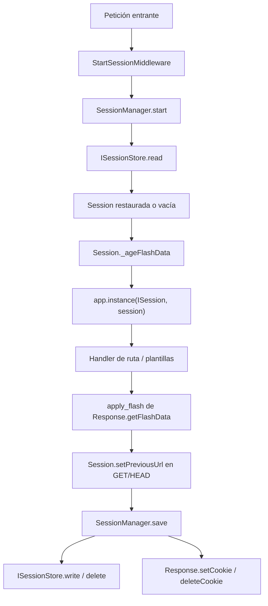

# `orionis.session`

> Sesiones HTTP perezosas respaldadas por cookie, con datos flash y cuatro stores intercambiables.

## Tabla de contenidos

- [Requisitos](#requisitos)
- [Descripción funcional](#descripción-funcional)
  - [Dónde encaja](#dónde-encaja)
  - [Ciclo de vida de una petición](#ciclo-de-vida-de-una-petición)
  - [Mapa de archivos](#mapa-de-archivos)
  - [Decisiones de diseño](#decisiones-de-diseño)
- [Referencia de API](#referencia-de-api)
  - [`Session`](#session)
  - [`ISession`](#isession)
  - [`SessionManager`](#sessionmanager)
  - [`SessionRecord`](#sessionrecord)
  - [`ISessionStore`](#isessionstore)
  - [`MemorySessionStore`](#memorysessionstore)
  - [`FileSessionStore`](#filesessionstore)
  - [`CacheSessionStore`](#cachesessionstore)
  - [`DatabaseSessionStore`](#databasesessionstore)
  - [Ayudantes de flash](#ayudantes-de-flash)
  - [Excepciones](#excepciones)
  - [Configuración](#configuración)
- [Ejemplos de uso](#ejemplos-de-uso)
  - [Leer y escribir datos de sesión en un controlador](#leer-y-escribir-datos-de-sesión-en-un-controlador)
  - [Mensajes flash, input previo y errores de validación](#mensajes-flash-input-previo-y-errores-de-validación)
  - [Rotar el ID al iniciar sesión e invalidar al cerrarla](#rotar-el-id-al-iniciar-sesión-e-invalidar-al-cerrarla)
  - [Usar un store directamente, sin la capa HTTP](#usar-un-store-directamente-sin-la-capa-http)
  - [Manejo de errores](#manejo-de-errores)
  - [Elegir el driver desde el entorno](#elegir-el-driver-desde-el-entorno)
- [Consideraciones de rendimiento y concurrencia](#consideraciones-de-rendimiento-y-concurrencia)
- [Notas de compatibilidad](#notas-de-compatibilidad)

## Requisitos

No hace falta instalar nada más allá de `pip install orionis`: los cuatro stores
vienen con el framework. Cada driver sí tiene su propio prerrequisito en tiempo
de ejecución:

| Driver     | Prerrequisito                                                                        |
|------------|--------------------------------------------------------------------------------------|
| `memory`   | Ninguno.                                                                               |
| `file`     | Un directorio con permisos de escritura; lo crea `FileSessionStore.__init__`.          |
| `cache`    | Un store de caché configurado (`orionis.cache`); sirve cualquier backend.               |
| `database` | Una conexión configurada (`orionis.database`). Los drivers de SQLite y PostgreSQL son dependencias base; MySQL, Oracle y SQL Server requieren su extra (`pip install "orionis[mysql]"`, `[oracle]`, `[sqlserver]`). |

La serialización de los stores `file` y `database` se apoya en
`msgspec>=0.21.1`, que ya es dependencia base del framework.

## Descripción funcional

`orionis.session` mantiene estado por usuario entre peticiones HTTP que, por
definición, no lo conservan. Divide el problema en tres piezas que colaboran sin
solaparse:

- **`Session`** posee el payload en memoria, las bolsas de flash y los flags de
  estado (`started`, `dirty`, `invalidated`, `wantsRegenerate`). No hace E/S ni
  ve nunca `Request`, `Response` o un store.
- **`SessionManager`** es el coordinador: restaura una `Session` al inicio de la
  petición, la registra en el contenedor y —solo si la sesión se usó de verdad—
  la persiste y escribe la cookie en la salida.
- Las implementaciones de **`ISessionStore`** persisten objetos `SessionRecord`.
  No saben nada de cookies, identificadores ni objetos `Session`.

### Dónde encaja

`StartSessionMiddleware` (`orionis.http.layer.web.start_session`) es el único
consumidor de `SessionManager` en el framework. Forma parte del pipeline de
middleware **web** que arma `KernelHTTP`, así que las rutas fuera del grupo web
nunca crean una sesión.

Módulos relacionados:

- `orionis.http` — `Response.withFlash()`, `Response.withInput()` y
  `Response.withErrors()` encolan datos que `apply_flash()` traslada a la sesión;
  `orionis.http.validation` redirige hacia atrás usando
  `Session.getPreviousUrl()`.
- `orionis.view` — los globals de plantilla `session`, `old`, `errors` y `flash`
  leen a través de `ISession`.
- `orionis.cache`, `orionis.database` / `orionis.orm` — backends de los drivers
  `cache` y `database`.
- `orionis.support.facades.session.Session` — facade cuyo accessor es `ISession`;
  `ScopedFacade` lee directamente del scope activo sin pin global. El acceso tras
  cerrar el scope falla.

### Ciclo de vida de una petición



`save()` procesa invalidación primero y después retorna si `session.started` es
`False`, así que una
petición que no escribió nada no produce ni escritura en el store ni cabecera
`Set-Cookie`.

### Mapa de archivos

| Ruta | Contenido |
|---|---|
| `session.py` | `Session`, el objeto de sesión en runtime. |
| `manager.py` | `SessionManager`, el coordinador de la petición. |
| `flash.py` | Claves reservadas y los ayudantes de flash a nivel de módulo. |
| `exceptions.py` | `SessionException`, `SessionStorageException`. |
| `contracts/session.py` | `ISession`. |
| `contracts/store.py` | `ISessionStore`. |
| `contracts/__init__.py` | Reexporta `ISession` e `ISessionStore`. |
| `entities/record.py` | `SessionRecord`. |
| `stores/memory.py` | `MemorySessionStore`. |
| `stores/file.py` | `FileSessionStore`, `_SessionPayload`. |
| `stores/cache.py` | `CacheSessionStore`. |
| `stores/database.py` | `DatabaseSessionStore`, `_build_sessions_table`. |

`orionis/session/__init__.py` está vacío: cada símbolo se importa desde su
propio módulo.

### Decisiones de diseño

- **Activación perezosa.** No se genera identificador ni se persiste nada hasta
  la primera escritura. El tráfico anónimo cuesta, como mucho, una lectura del
  store, y solo si llegó una cookie.
- **Escrituras idempotentes.** `put()` y `flash()` retornan temprano cuando el
  valor almacenado ya es igual al nuevo, así que volver a renderizar una página
  no marca la sesión como sucia.
- **`__slots__` en todo.** `Session`, `SessionManager` y los cuatro stores
  declaran `__slots__`; `ISession` e `ISessionStore` declaran `__slots__ = ()`,
  de modo que las instancias no cargan `__dict__`.
- **Patrón Strategy para la persistencia.** Cualquier objeto que cumpla
  `ISessionStore` es enchufable; `SessionManager.__resolveStore()` mapea el
  `SessionDriver` configurado a un store concreto una sola vez, al construirse.
- **`SessionRecord` como única moneda de intercambio.** Los stores nunca ven una
  `Session`, y `Session` nunca ve un store.
- **Tres espacios de nombres de flash separados.** Los mensajes de estado viven
  bajo sus propias claves, el input de formulario bajo `_old_input` y los errores
  de validación bajo `_errors`. Cada uno tiene un escritor y un lector, así que
  una redirección con errores no puede pisar un mensaje de estado.
- **Las credenciales se filtran en el borde.** `filter_input()` elimina los
  campos tipo contraseña antes de que nada llegue al store.

## Referencia de API

### `Session`

`orionis.session.session.Session`, implementa [`ISession`](#isession).

```python
class Session(ISession):
    __slots__ = (
        "_data", "_dirty", "_id", "_invalidated",
        "_is_new", "_regenerate", "_started",
    )

    def __init__(
        self,
        id: str | None = None,
        data: dict[str, Any] | None = None,
        *,
        started: bool = False,
        is_new: bool = True,
    ) -> None: ...
```

| Parámetro | Tipo | Descripción |
|---|---|---|
| `id` | `str \| None` | Identificador de sesión. `None` para una sesión nueva; el ID se genera en la primera escritura. |
| `data` | `dict[str, Any] \| None` | Payload inicial. `None` crea un diccionario vacío. |
| `started` | `bool` (solo keyword) | `True` cuando la sesión se cargó desde un store. |
| `is_new` | `bool` (solo keyword) | `False` para sesiones restauradas desde un store. |

**Propiedades de solo lectura**

| Propiedad | Tipo | Significado |
|---|---|---|
| `id` | `str \| None` | Identificador actual, `None` antes de la primera escritura. |
| `started` | `bool` | `True` una vez que una escritura activó la sesión. |
| `dirty` | `bool` | `True` cuando hay cambios pendientes de persistir. |
| `invalidated` | `bool` | `True` cuando la sesión está marcada para eliminarse. |
| `isNew` | `bool` | `True` cuando la sesión no se restauró desde un store. |
| `wantsRegenerate` | `bool` | `True` cuando el ID debe rotarse antes de guardar. |

**Métodos públicos**

| Firma | Devuelve | Comportamiento |
|---|---|---|
| `get(key: str, default: Any = None)` | `Any` | Valor de `key`, o `default`. |
| `put(key: str, value: Any)` | `None` | Guarda el valor y activa la sesión en la primera llamada. No hace nada —ni marca dirty— si el valor almacenado ya es igual a `value`. |
| `has(key: str)` | `bool` | `True` cuando la clave existe. |
| `forget(key: str)` | `None` | Elimina la clave; marca dirty solo si la clave existía y la sesión ya estaba activa. |
| `clear()` | `None` | Vacía el payload, bolsas de flash incluidas. Marca dirty solo si había datos y la sesión estaba activa. |
| `flash(key: str, value: Any)` | `None` | Encola un valor en la bolsa flash *nueva*. No hace nada si ya se flasheó el mismo valor en esta petición. |
| `getFlash(key: str, default: Any = None)` | `Any` | Lee primero la bolsa *nueva*, luego la *vieja*, y por último `default`. |
| `flashInput(values: Mapping[str, Any])` | `None` | Flashea un payload enviado bajo `_old_input` tras eliminar los campos tipo credencial. Llamadas repetidas en la misma petición se mezclan. |
| `getOldInput(key: str, default: Any = None)` | `Any` | Valor enviado para `key` en la petición anterior, o `default` cuando la bolsa falta o no es un diccionario. |
| `flashErrors(errors: Mapping[str, Any] \| Exception)` | `None` | Normaliza y flashea errores de validación bajo `_errors`. Llamadas repetidas en la misma petición se mezclan. |
| `getErrors()` | `dict[str, list[str]]` | Errores flasheados, `{}` cuando no hay ninguno. |
| `setPreviousUrl(url: str)` | `None` | Guarda `url` bajo `_previous_url` mediante `put()`. |
| `getPreviousUrl(default: str \| None = None)` | `str \| None` | Última URL registrada, o `default`. |
| `regenerate()` | `None` | Solicita la rotación del ID, activando la sesión y marcándola dirty. El cambio real ocurre en `SessionManager.save()`. |
| `invalidate()` | `None` | Limpia el payload, activa `invalidated` y `dirty`, y cancela una regeneración pendiente. |
| `all()` | `dict[str, Any]` | Copia superficial del payload, incluidas las bolsas de flash internas. |

**Métodos internos del framework** (los llama `SessionManager`; no forman parte
de `ISession`)

| Firma | Devuelve | Comportamiento |
|---|---|---|
| `_ageFlashData()` | `None` | Mueve la bolsa nueva a la vieja y descarta la vieja anterior; marca dirty si existía alguna de las dos. |
| `_rotateId()` | `str \| None` | Asigna un identificador nuevo, limpia `wantsRegenerate`, marca dirty y devuelve el ID anterior (o `None`). |
| `_markClean()` | `None` | Limpia el flag dirty tras una escritura exitosa. |

**Efectos e interioridades.** Los identificadores salen de
`secrets.token_urlsafe(32)` (43 caracteres URL-safe). El privado `__activate()`
genera el ID bajo demanda y activa `started`. Los datos flash viven en dos claves
reservadas del payload, `_flash_new` y `_flash_old`, visibles también en `all()`
— que es justo lo que persisten los stores. Ningún método de `Session` lanza
excepciones.

### `ISession`

`orionis.session.contracts.session.ISession` — `abc.ABC` con `__slots__ = ()`,
reexportado además desde `orionis.session.contracts`.

Declara como miembros abstractos las seis propiedades de solo lectura y todos los
métodos públicos listados arriba (`get`, `put`, `has`, `forget`, `clear`,
`flash`, `getFlash`, `flashInput`, `getOldInput`, `flashErrors`, `getErrors`,
`setPreviousUrl`, `getPreviousUrl`, `regenerate`, `invalidate`, `all`). Los tres
métodos internos del framework (`_ageFlashData`, `_rotateId`, `_markClean`)
**no** forman parte del contrato: existen solo en la clase concreta `Session`.

Este contrato es la clave con la que `SessionManager` registra la sesión en el
contenedor, y el accessor de la facade `Session`.

### `SessionManager`

`orionis.session.manager.SessionManager` — clase plana (sin contrato), con
`__slots__` que cubre el store, el delta de vigencia y cada atributo de cookie
precalculado.

```python
def __init__(self, app: IApplication, cache: ICacheManager) -> None: ...
```

| Parámetro | Tipo | Descripción |
|---|---|---|
| `app` | `IApplication` | Instancia de la aplicación; aporta `config("session")`, `basePath` e `instance()`. |
| `cache` | `ICacheManager` | Gestor de caché inyectado por el contenedor para que el store de caché no dependa del estado de pin de la facade `Cache`. |

El constructor construye `SessionConfig(**app.config("session"))`, resuelve el
store una sola vez y precalcula `timedelta(minutes=config.lifetime)` más todos
los atributos de cookie (`_cookie_name`, `_cookie_path`, `_cookie_domain`,
`_cookie_max_age`, `_cookie_secure`, `_cookie_http_only`, `_cookie_same_site`,
`_cookie_partitioned`). `_cookie_max_age` es `None` cuando `expire_on_close`
está activo; en caso contrario, `lifetime * 60`.

**Métodos públicos**

```python
async def start(self, request: Request) -> Session: ...
async def save(self, response: Response, session: Session) -> None: ...
async def abort(self, session: Session) -> None: ...
```

`start()` lee la cookie nombrada por `config.cookie`; si existe llama a
`ISessionStore.read()` y reconstruye una `Session(id=..., data=...,
started=True, is_new=False)`, y si no crea una `Session()` vacía y perezosa.
Después envejece los datos flash y enlaza la instancia en el contenedor con
`app.instance(ISession, session)`.

`save()` borra registros invalidados y expira la cookie aunque estén sin activar.
Las otras sesiones sin uso se omiten. Las activas rotan si se solicitó: los nuevos
registros usan `write()` y los restaurados `update()` condicional. Cada guardado
renueva juntos servidor y cookie, aunque no haya cambios de payload. Una petición
obsoleta no recrea registros borrados/expirados ni emite su cookie anterior.

`abort()` persiste invalidación o eliminación del ID anterior si una cancelación
o error impide responder. El middleware convierte excepciones mediante `ICatch`
antes de guardar. `regenerate()` después de `invalidate()` permite un ciclo nuevo;
`_markClean()` también marca el registro como persistido.

**Selección del store** (`__resolveStore`, privado, guiado por `SessionDriver`):

| Driver | Store construido |
|---|---|
| `file` | `FileSessionStore(directory=app.basePath / config.files)` |
| `cache` | `CacheSessionStore(cache=cache, store=config.cache)` |
| `database` | `DatabaseSessionStore(connection=ConnectionResolver.connection(config.connection), table=config.table or "sessions")` |
| cualquier otro (`memory`) | `MemorySessionStore()` |

**Efectos.** Mutación del contenedor (una llamada a `instance()` por petición),
E/S del store y `Response.setCookie()` / `Response.deleteCookie()`. La marca de
expiración se calcula en UTC, con independencia de la zona horaria de la
aplicación.

`SessionManager` no lo registra ningún provider. Lo autoconstruye el contenedor
cuando `KernelHTTP.boot()` construye `StartSessionMiddleware`, lo que significa
que una única instancia de larga vida atiende todas las peticiones.

### `SessionRecord`

`orionis.session.entities.record.SessionRecord` — `@dataclass(slots=True)`, el
único objeto que se intercambian `SessionManager` y un store.

| Campo | Tipo | Descripción |
|---|---|---|
| `id` | `str` | Identificador único de la sesión. |
| `data` | `dict[str, Any]` | Payload serializable, bolsas de flash incluidas. |
| `expires_at` | `datetime` | Instante UTC a partir del cual el registro caduca. |

El dataclass es mutable (no es `frozen`) y no tiene valores por defecto, así que
hay que suministrar los tres campos.

### `ISessionStore`

`orionis.session.contracts.store.ISessionStore` — `abc.ABC` con
`__slots__ = ()`, reexportado además desde `orionis.session.contracts`.

```python
async def read(self, session_id: str) -> SessionRecord | None: ...
async def write(self, record: SessionRecord) -> None: ...
async def update(self, record: SessionRecord) -> bool: ...
async def delete(self, session_id: str) -> bool: ...
async def gc(self) -> None: ...
```

Los cinco miembros son abstractos y asíncronos. `update()` rechaza atómicamente
registros ausentes o expirados; `delete()` informa si borró uno. Un store debe
persistir, recuperar y desalojar registros; nunca genera identificadores, ni
crea objetos `Session`, ni toca `Request`/`Response`.

### `MemorySessionStore`

`orionis.session.stores.memory.MemorySessionStore` — `__slots__ = ("_storage",)`.

```python
def __init__(self) -> None: ...
```

Los registros viven en un `dict[str, SessionRecord]` propio de la instancia, así
que dos instancias nunca comparten estado y todo se pierde al terminar el
proceso.

- `read()` devuelve `None` para un ID desconocido; si el registro expiró se
  elimina y se devuelve `None`.
- `write()` inserta o reemplaza por `record.id`.
- Lecturas y escrituras copian profundamente el payload. `update()` comprueba
  presencia y vigencia sin suspender antes de reemplazar.
- `delete()` extrae la clave, ignorando el fallo.
- `gc()` recolecta primero las claves expiradas y luego las borra, de modo que el
  diccionario nunca se muta durante la iteración.

Pensado para desarrollo y pruebas. No garantiza seguridad entre hilos.

### `FileSessionStore`

`orionis.session.stores.file.FileSessionStore` —
`__slots__ = ("_directory", "_locks", "_rename_lock")`.

```python
def __init__(self, directory: Path) -> None: ...
```

Crea *directory* (`mkdir(parents=True, exist_ok=True)`) y guarda un archivo por
sesión, llamado `{session_id}.json`:

```json
{
    "id": "...",
    "expires_at": "2026-07-10T12:00:00+00:00",
    "data": { "...": "..." }
}
```

La codificación y decodificación pasan por códecs `msgspec.json` a nivel de
módulo ligados al struct privado `_SessionPayload` (`frozen=True, gc=False`),
construidos una sola vez al importar.

- `read()` ejecuta `_readRecord` en un hilo de trabajo (`asyncio.to_thread`):
  lectura del archivo, decodificación JSON y desalojo del archivo expirado o
  corrupto ocurren en un solo salto, así que el event loop nunca decodifica JSON.
- `write()` ejecuta `_writeRecord`, que serializa el registro y lo escribe de
  forma atómica: el payload se prepara en un archivo propio,
  `{session_id}.json.{aleatorio}.tmp`, y después se renombra sobre el destino. El
  renombrado se serializa por instancia del store y se reintenta tres veces, con
  5 ms de separación, cuando el sistema operativo reporta una violación de
  compartición. Una escritura que no se puede publicar elimina su propio archivo
  de preparación antes de propagar el `OSError`.
- `delete()` elimina el archivo con `missing_ok=True`.
- `update()` exige archivo vigente. Validación, reemplazo y borrado comparten
  uno de 64 locks fijos del SO mediante `filelock`, entre instancias y procesos.
  IDs con sintaxis de ruta lanzan `SessionStorageException`; se filtran cookies
  malformadas antes de hacer E/S.
- `gc()` ejecuta `_gcSweep`, un recorrido con `os.scandir` que borra todo archivo
  `*.json` expirado, indecodificable o ilegible, y recupera cualquier `*.tmp` de
  más de una hora — lo bastante antiguo como para que ninguna escritura viva sea
  su dueña. Nunca se dispara automáticamente.

Ayudantes de apoyo, todos síncronos y usados por los métodos anteriores:
`_path()`, `_tempPath()`, `_serialize()`, `_deserialize()`, `_readFile()`,
`_writeFile()`, `_replace()`, `_deleteFile()`, `_readRecord()`,
`_writeRecord()`, `_gcSweep()`.
`_deserialize()` devuelve `None` ante `ValueError` o `msgspec.DecodeError`, lo
que quien llama interpreta como corrupción.

### `CacheSessionStore`

`orionis.session.stores.cache.CacheSessionStore` — `__slots__ = ("_repository",)`.

```python
def __init__(self, cache: ICacheManager, store: str | None = None) -> None: ...
```

El constructor resuelve `cache.store(store)` a un `ICacheRepository`; `None`
selecciona el store por defecto configurado. Toda clave lleva el prefijo de la
constante de módulo `session:`.

- `read()` obtiene la entrada y reconstruye un `SessionRecord` a partir de las
  claves `id`, `data` y `expires_at` del payload almacenado; un fallo de
  búsqueda devuelve `None`.
  Convierte fechas ISO y valida forma y expiración explícitamente.
- `write()` deriva el TTL de `record.expires_at - datetime.now(UTC)`. Cuando ese
  TTL es cero o negativo la entrada se borra en lugar de escribirse; si no, se
  redondea el TTL hacia arriba a segundos enteros para compatibilidad del backend.
- `update()` usa `ICacheRepository.replace()` atómico sin recrear claves borradas.
- `delete()` elimina la clave con prefijo.
- `gc()` es un no-op deliberado: la expiración la aplica de forma nativa el
  backend de caché, e `ICacheManager` no expone forma de enumerar claves.

### `DatabaseSessionStore`

`orionis.session.stores.database.DatabaseSessionStore` — `__slots__` que cubre la
conexión, flag y lock de preparación, nombre y definición IR reutilizable de tabla.

```python
def __init__(self, connection: IConnection, table: str = "sessions") -> None: ...
```

Las filas viven en una tabla propia construida por el ayudante de módulo
`_build_sessions_table(table)`:

| Columna | Tipo | Notas |
|---|---|---|
| `id` | `String(255)` | Clave primaria; el identificador de la sesión. |
| `payload` | `Text` | Datos de sesión codificados en JSON. |
| `expires_at` | `BigInteger` | Expiración absoluta en segundos epoch enteros. |

Las operaciones usan planes IR de Orionis por la conexión recibida, respetando
prefijos y quoting del dialecto sin interpolar nombres de tablas en SQL crudo.

- `_ensureSchema()` crea la tabla en el primer uso, protegido por un
  `asyncio.Lock` más un flag `_ready` (doble comprobación, así que N llamadas
  concurrentes la crean una vez). Todo método público lo espera primero.
- `read()` borra una fila expirada y devuelve `None`; un payload que no
  decodifica también devuelve `None`. Una fila viva se devuelve como
  `SessionRecord` con su `expires_at` reconstruido con
  `datetime.fromtimestamp(expiration, tz=UTC)`.
- `write()` borra la fila cuando el registro ya expiró. En caso contrario trunca
  la expiración a segundos enteros, la unidad que declara la columna
  `BigInteger`. Hacerlo de forma explícita iguala el comportamiento entre
  dialectos: PostgreSQL trunca por su cuenta el valor fraccionario y SQLite lo
  guarda tal cual. Luego intenta primero un `UPDATE` y, si no afectó ninguna
  fila, llama al privado `__insertOrRetryUpdate()`, que inserta y recae en un
  segundo `UPDATE` si un escritor concurrente ganó la carrera
  (`QueryException`). Así el upsert es portable, sin sintaxis `ON CONFLICT`
  específica de dialecto.
- `delete()` elimina la fila por ID.
- `update()` se condiciona por ID y vigencia. El borrado por expiración comprueba
  el valor observado para no borrar una renovación concurrente.
- `gc()` lanza un único `DELETE ... WHERE expires_at <= :now` masivo; a
  diferencia del store de caché, este sí es un barrido real, porque una tabla SQL
  no tiene TTL nativo.

La codificación del payload usa códecs `msgspec.json` a nivel de módulo mediante
los ayudantes privados `__encode()` / `__decode()`.

### Ayudantes de flash

`orionis.session.flash` es un módulo hoja sin dependencias del framework. Sus
funciones son de nivel de módulo, de ahí el `snake_case`.

**Constantes**

| Nombre | Valor | Propósito |
|---|---|---|
| `OLD_INPUT_KEY` | `"_old_input"` | Bolsa flash reservada con el payload de formulario anterior. |
| `ERRORS_KEY` | `"_errors"` | Bolsa flash reservada con los errores de validación. |
| `PREVIOUS_URL_KEY` | `"_previous_url"` | Clave de sesión reservada con la última página visitada. |
| `SENSITIVE_INPUT_FIELDS` | `frozenset` con `_csrf`, `csrf_token`, `current_password`, `new_password`, `password`, `password_confirmation` | Nunca se arrastran al repoblar un formulario. |

**Funciones**

```python
def filter_input(values: Mapping[str, Any]) -> dict[str, Any]: ...
def normalize_errors(errors: object) -> dict[str, list[str]]: ...
def queue_bag(flash: dict[str, Any], key: str, values: Mapping[str, Any]) -> None: ...
def apply_flash(session: ISession, data: Mapping[str, Any]) -> None: ...
```

- `filter_input()` devuelve una copia de *values* sin ningún campo tipo
  credencial. Cuando no hay ninguno de esos campos, el mapping se copia entero.
- `normalize_errors()` convierte los payloads admitidos a
  `{campo: [mensaje, ...]}`. Un mapping acepta un solo string, cualquier
  `list`/`tuple`/`set`/`frozenset`, o cualquier otro valor (convertido a string).
  Un no-mapping se resuelve por duck typing: primero un atributo `errors` de tipo
  mapping, luego un atributo `failure` que exponga `field` y `message` — así la
  capa de sesión nunca importa `orionis.schemas`. **Lanza `TypeError`** cuando el
  argumento no es ni un mapping ni una excepción de validación reconocida.
- `queue_bag()` mezcla *values* en la bolsa reservada *key* de un payload flash
  pendiente que pertenece a un `Response` o a un `PendingView`, reemplazando la
  entrada cuando no es ya un diccionario.
- `apply_flash()` escribe un payload flash pendiente en una sesión, enrutando
  `OLD_INPUT_KEY` a `flashInput()` y `ERRORS_KEY` a `flashErrors()` para que las
  bolsas reservadas se mezclen en vez de sobrescribirse. Todo lo demás pasa por
  `flash()`.

### Excepciones

`orionis.session.exceptions` define la jerarquía del módulo:

| Excepción | Base | Significado |
|---|---|---|
| `SessionException` | `Exception` | Clase base de todo error de sesión. |
| `SessionStorageException` | `SessionException` | Una operación del store falló de forma inesperada. |

Hoy ninguna se lanza dentro del framework: son la jerarquía pública que se ofrece
a implementaciones de store de terceros. La única excepción que el paquete lanza
por su cuenta es el `TypeError` de `normalize_errors()`.

### Configuración

El manager consume `app.config("session")`, validado por
`orionis.foundation.config.session.entities.session.Session`. La plantilla de la
aplicación vive en `config/session.py` (`BootstrapSession`).

| Clave | Tipo | Por defecto | Variable de entorno |
|---|---|---|---|
| `driver` | `str \| SessionDriver` | `memory` | `SESSION_DRIVER` |
| `lifetime` | `int` (minutos) | `120` | `SESSION_LIFETIME` |
| `expire_on_close` | `bool` | `False` | `SESSION_EXPIRE_ON_CLOSE` |
| `files` | `str \| None` | `storage/framework/sessions` | `SESSION_FILES` |
| `connection` | `str \| None` | valor de `DB_CONNECTION` | `DB_CONNECTION` |
| `table` | `str \| None` | `sessions` | `SESSION_TABLE` |
| `cache` | `str \| None` | valor de `CACHE_STORE` | `CACHE_STORE` |
| `cookie` | `str` | `sessionid` | `SESSION_COOKIE` |
| `path` | `str` | `/` | `SESSION_PATH` |
| `domain` | `str \| None` | `None` | `SESSION_DOMAIN` |
| `secure` | `bool` | `False` | `SESSION_SECURE` |
| `http_only` | `bool` | `True` | `SESSION_HTTP_ONLY` |
| `same_site` | `str \| SameSitePolicy` | `lax` | `SESSION_SAME_SITE` |
| `partitioned` | `bool` | `False` | `SESSION_PARTITIONED` |

`SessionDriver` (`memory`, `file`, `database`, `cache`) y `SameSitePolicy`
(`lax`, `strict`, `none`) viven en
`orionis.foundation.config.session.enums`.

Validaciones que ejecuta la entidad al construirse:

- `driver` debe ser un `SessionDriver` o un nombre de driver conocido
  (normalizado al enum); si no, `ValueError` / `TypeError`.
- `cookie` debe ser un string no vacío sin espacios, punto y coma ni comas.
- `lifetime` debe ser un `int` estrictamente positivo.
- `expire_on_close`, `secure`, `http_only` y `partitioned` deben ser booleanos.
- `same_site` debe ser un `SameSitePolicy` o uno de sus valores; se guarda en su
  forma canónica en minúsculas.
- `path` debe ser un string que empiece por `/`.
- `domain`, `files`, `connection`, `table` y `cache`, cuando no son `None`, deben
  ser strings no vacíos; `domain` no puede empezar ni terminar con punto, ni
  contener dos puntos consecutivos.

## Ejemplos de uso

### Leer y escribir datos de sesión en un controlador

La sesión ligada a la petición actual está disponible como
`request.state.session`, y en el contenedor bajo `ISession`.

```python
from orionis.http import HttpResponse, response
from orionis.http.base import BaseController
from orionis.http.request import Request
from orionis.session.contracts.session import ISession


class DashboardController(BaseController):

    async def index(self, request: Request) -> HttpResponse:
        session: ISession = request.state.session

        visits = session.get("visits", 0) + 1
        session.put("visits", visits)

        if not session.has("first_seen_at"):
            session.put("first_seen_at", "now")

        session.forget("one_time_notice")

        return await response.view("dashboard", visits=visits)
```

La misma sesión se puede resolver por inyección de dependencias, lo que funciona
en cualquier servicio, no solo en controladores:

```python
from orionis.http import HttpResponse, response
from orionis.http.base import BaseController
from orionis.session.contracts.session import ISession


class ProfileController(BaseController):

    async def show(self, session: ISession) -> HttpResponse:
        return response.json({"user_id": session.get("user_id")})
```

Dentro de una petición web activa la fachada scoped llama directamente a su
sesión, sin `await` ni pin por petición:

```python
from orionis.support.facades.session import Session


def remember_locale(locale: str) -> None:
    Session.put("locale", locale)
```

> Sin un scope vivo con `ISession`, la fachada lanza `RuntimeError`. Las tareas
> posteriores deben abrir un scope propio y no retener sesiones de la petición.
> La inyección sigue disponible dentro del scope web.

### Mensajes flash, input previo y errores de validación

Un `Response` encola datos flash de forma fluida; `StartSessionMiddleware`
traslada la cola a la sesión con `apply_flash()` justo antes de guardar.

```python
from typing import Any
from orionis.http import HttpResponse, response
from orionis.http.base import BaseController
from orionis.http.request import Request


class RegisterController(BaseController):

    async def store(self, request: Request) -> HttpResponse:
        payload: dict[str, Any] = await request.data()

        if "@" not in str(payload.get("email", "")):
            return (
                response.redirect("/register")
                    .withInput(payload)
                    .withErrors({"email": "The email address is not valid."})
            )

        return response.redirect("/login").withFlash(
            "success", "Account created.",
        )
```

La petición siguiente los lee de vuelta en una plantilla mediante los globals
`flash()`, `old()` y `errors`:

```html

    <p class="alert">{{ flash('success') }}</p>



    <p class="alert alert-danger">{{ errors.first() }}</p>


<input name="email"
       value="{{ old('email') }}"
       class="is-invalid">
```

Del lado del servidor, esos mismos tres espacios de nombres son accesibles desde
el objeto de sesión:

```python
from orionis.session.session import Session

session = Session()
session.flash("success", "Account created.")
session.flashInput({"email": "ada@example.com", "password": "secret"})
session.flashErrors({"email": "Already taken."})

assert session.getFlash("success") == "Account created."
assert session.getOldInput("email") == "ada@example.com"
assert session.getOldInput("password") is None      # eliminado
assert session.getErrors() == {"email": ["Already taken."]}
```

### Rotar el ID al iniciar sesión e invalidar al cerrarla

```python
from orionis.http import HttpResponse, response
from orionis.http.base import BaseController
from orionis.session.contracts.session import ISession


class SessionController(BaseController):

    async def login(self, session: ISession) -> HttpResponse:
        session.put("user_id", 7)
        session.regenerate()
        return response.redirect("/dashboard")

    async def logout(self, session: ISession) -> HttpResponse:
        session.invalidate()
        return response.redirect("/login")
```

`regenerate()` solo levanta un flag; `SessionManager.save()` realiza el cambio,
eliminando el registro anterior antes de escribir el nuevo. `invalidate()` limpia
el payload y hace que el manager borre el registro y expire la cookie.

### Usar un store directamente, sin la capa HTTP

Los stores son objetos async planos y pueden usarse por su cuenta, que es lo que
hacen las pruebas y los comandos de mantenimiento.

```python
import asyncio
from datetime import UTC, datetime, timedelta
from pathlib import Path
from orionis.session.entities.record import SessionRecord
from orionis.session.stores.file import FileSessionStore
from orionis.session.stores.memory import MemorySessionStore


async def main() -> None:
    record = SessionRecord(
        id="abc123",
        data={"user_id": 7},
        expires_at=datetime.now(UTC) + timedelta(minutes=120),
    )

    memory = MemorySessionStore()
    await memory.write(record)
    print((await memory.read("abc123")).data)       # {'user_id': 7}
    await memory.delete("abc123")
    print(await memory.read("abc123"))              # None

    files = FileSessionStore(directory=Path("storage/framework/sessions"))
    await files.write(record)
    print((await files.read("abc123")).id)          # abc123
    await files.gc()                                # barre archivos obsoletos
    await files.delete("abc123")


asyncio.run(main())
```

### Manejo de errores

`normalize_errors()` valida la entrada y puede lanzar `TypeError`.
Acepta mappings y excepciones de validación, y rechaza cualquier otra cosa:

```python
from orionis.session.flash import normalize_errors
from orionis.session.session import Session

try:
    normalize_errors(["not", "a", "mapping"])
except TypeError as exc:
    print(f"rechazado: {exc}")

session = Session()
session.flashErrors({"email": ["Already taken.", "Too long."]})
print(session.getErrors())     # {'email': ['Already taken.', 'Too long.']}
```

Los fallos del store afloran como la excepción nativa del backend (por ejemplo
`OSError` en el store de archivos, o `QueryException` en `orionis.database`);
`SessionStorageException` está disponible para stores propios que prefieran
normalizar sus fallos:

```python
from orionis.session.contracts.store import ISessionStore
from orionis.session.entities.record import SessionRecord
from orionis.session.exceptions import SessionStorageException


class BrittleStore(ISessionStore):

    __slots__ = ()

    async def read(self, session_id: str) -> SessionRecord | None:
        return None

    async def write(self, record: SessionRecord) -> None:
        error_msg = f"could not persist session '{record.id}'"
        raise SessionStorageException(error_msg)

    async def update(self, record: SessionRecord) -> bool:
      return False

    async def delete(self, session_id: str) -> bool:
      return False

    async def gc(self) -> None:
        return
```

### Elegir el driver desde el entorno

El driver se elige íntegramente por configuración; no hace falta cambiar código.

```dotenv
# Diccionario en proceso (por defecto, solo desarrollo)
SESSION_DRIVER=memory

# Un archivo JSON por sesión
SESSION_DRIVER=file
SESSION_FILES=storage/framework/sessions

# Sesiones en caché, usando el store nombrado por CACHE_STORE
SESSION_DRIVER=cache
CACHE_STORE=redis

# Sesiones en base de datos sobre una tabla propia
SESSION_DRIVER=database
DB_CONNECTION=pgsql
SESSION_TABLE=sessions

# Atributos de la cookie
SESSION_COOKIE=sessionid
SESSION_LIFETIME=120
SESSION_SECURE=true
SESSION_SAME_SITE=lax
```

## Consideraciones de rendimiento y concurrencia

La revocación usa actualización condicional, no caché local. El payload concurrente
sigue last-writer-wins, sin mezcla transaccional de carritos o flash. Logout no
cancela handlers en curso. `write()` es incondicional para mantenimiento; HTTP lo
usa solo con IDs nuevos. `filelock` es ahora una dependencia base del store de archivo.

- **Una instancia de store por proceso.** `SessionManager` se construye una vez,
  cuando `KernelHTTP.boot()` construye `StartSessionMiddleware`, y la entidad de
  configuración, los atributos de cookie y el delta de vigencia se calculan ahí
  — nunca por petición.
- **Coste de una petición anónima.** Sin cookie no hay lectura del store; sin
  escritura no hay escritura del store ni `Set-Cookie`. `save()` retorna en su
  primera rama. Ojo: el pipeline web estándar escribe igualmente,
  `CSRFTokenMiddleware` guarda un token en la primera petición de cada sesión y
  `StartSessionMiddleware` registra `_previous_url` en cada navegación GET/HEAD.
  La pereza rinde, por tanto, en rutas fuera del grupo web y en usos no HTTP, no
  en una visita normal de navegador.
- **Escrituras idempotentes.** `put()` y `flash()` comparan antes de guardar, así
  que revisitar una página (por ejemplo el registro de `_previous_url` que hace
  `StartSessionMiddleware`) no marca la sesión como sucia.
- **El store de archivos nunca bloquea el loop.** Lectura, decodificación y
  desalojo ocurren en un único salto de `asyncio.to_thread`, igual que escritura
  y borrado. Las escrituras son atómicas (archivo de preparación único +
  renombrado), así que un lector concurrente nunca observa un archivo parcial.
- **Las escrituras concurrentes de una misma sesión son seguras.** Cada escritura
  prepara su payload en un archivo propio, y el renombrado que lo publica se
  serializa por instancia del store, así que peticiones paralelas que comparten
  un id de sesión terminan en "gana el último" en vez de producir un payload
  mezclado o un error. Entre procesos, el renombrado se reintenta tres veces con
  5 ms de separación para absorber la violación de compartición que Windows
  lanza cuando dos workers publican el mismo archivo a la vez.
- **El store de base de datos crea su esquema una sola vez.** `_ensureSchema()`
  usa un flag `_ready` más un `asyncio.Lock` con doble comprobación, así que N
  peticiones concurrentes emiten un solo `CREATE TABLE`. Una definición de tabla
  reutilizable alimenta los planes IR. Registros restaurados usan UPDATE condicional;
  el upsert incondicional se reserva para nuevos registros o mantenimiento explícito.
- **El store de caché delega la expiración.** El TTL se calcula en cada escritura
  y se entrega al backend, así que `gc()` no tiene nada que hacer.
- **Seguridad entre hilos.** `Session`, `MemorySessionStore` y `SessionManager`
  mantienen estado mutable sin locks. Son seguros bajo el modelo estándar de
  event loop de un solo hilo (no hay ningún `await` entre leer y mutar el estado
  en memoria), pero no entre hilos del sistema operativo. `MemorySessionStore` es
  además por proceso, así que no debe usarse detrás de varios workers.
- **La fachada es scoped.** `Session` lee únicamente del scope actual y vivo.
  `pin()` valida disponibilidad sin guardar una instancia global y `unpin()` no
  tiene estado global que borrar. Cerrar el scope retira el acceso a tareas hijas.
- **Detalles conscientes de asignación.** Las claves reservadas y las tuplas de
  tipos son constantes de módulo; los códecs de `msgspec` se construyen una sola
  vez al importar; `filter_input()` copia el mapping entero cuando no contiene
  ningún campo credencial; toda clase del paquete declara `__slots__`, y ambos
  contratos declaran `__slots__ = ()`, de modo que las instancias no cargan
  `__dict__`.

## Notas de compatibilidad

Stores personalizados deben implementar `update(record) -> bool` atómico y
`delete(session_id) -> bool` que informe si ganó el borrado. Leer y después escribir
sin una condición del almacenamiento no es una implementación válida de `update()`.

- **Python ≥ 3.14**, como exige el framework. El paquete usa `datetime.UTC`
  (3.11+), literales `frozenset`, uniones PEP 604 y `dataclass(slots=True)`
  (3.10+), además de características de dataclass solo-keyword y de
  `msgspec.Struct` ya empleadas en todo el framework.
- **Dependencias.** `filelock` para locks de archivo entre procesos;
  `msgspec>=0.21.1` para los stores de archivo y base de datos;
  `orionis.cache` para el driver de caché; `orionis.database` / `orionis.orm`
  para el driver de base de datos. Todo lo demás es biblioteca estándar
  (`secrets`, `asyncio`, `os`, `contextlib`, `datetime`, `time`, `pathlib`).
- **Zona horaria.** La expiración siempre se calcula y almacena en UTC
  (`datetime.now(UTC)`), con independencia de la zona horaria de la aplicación.
  El store de base de datos persiste segundos epoch y reconstruye un `datetime`
  con zona al leer.
- **Serialización.** Los payloads de sesión deben ser serializables a JSON para
  los stores de archivo y base de datos. El store en memoria acepta cualquier
  objeto; el de caché acepta lo que soporte el serializador de su backend.
- **Windows.** `Path.replace` lanza `PermissionError` cuando dos procesos
  publican el mismo archivo de sesión en el mismo instante; el store lo absorbe
  con un reintento acotado. Dentro de un solo proceso el lock de renombrado
  descarta la colisión.
- **Claves reservadas.** `_flash_new`, `_flash_old`, `_old_input`, `_errors` y
  `_previous_url` pertenecen al framework y aparecen en `all()`. El código de
  aplicación no debe escribirlas directamente; usa `flash()`, `flashInput()`,
  `flashErrors()` y `setPreviousUrl()`.
