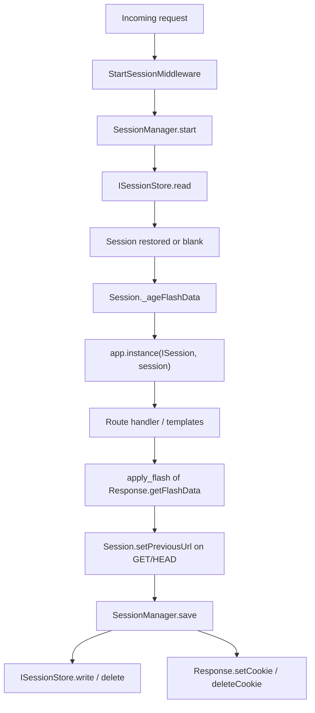

# `orionis.session`

> Lazy, cookie-backed HTTP sessions with flash data and four interchangeable backing stores.

## Table of contents

- [Requirements](#requirements)
- [Functional description](#functional-description)
  - [Where it fits](#where-it-fits)
  - [Request lifecycle](#request-lifecycle)
  - [File map](#file-map)
  - [Design decisions](#design-decisions)
- [API reference](#api-reference)
  - [`Session`](#session)
  - [`ISession`](#isession)
  - [`SessionManager`](#sessionmanager)
  - [`SessionRecord`](#sessionrecord)
  - [`ISessionStore`](#isessionstore)
  - [`MemorySessionStore`](#memorysessionstore)
  - [`FileSessionStore`](#filesessionstore)
  - [`CacheSessionStore`](#cachesessionstore)
  - [`DatabaseSessionStore`](#databasesessionstore)
  - [Flash helpers](#flash-helpers)
  - [Exceptions](#exceptions)
  - [Configuration](#configuration)
- [Usage examples](#usage-examples)
  - [Reading and writing session data in a controller](#reading-and-writing-session-data-in-a-controller)
  - [Flash messages, old input and validation errors](#flash-messages-old-input-and-validation-errors)
  - [Rotating the ID on login and invalidating on logout](#rotating-the-id-on-login-and-invalidating-on-logout)
  - [Driving a store directly, without the HTTP layer](#driving-a-store-directly-without-the-http-layer)
  - [Handling errors](#handling-errors)
  - [Selecting the driver from the environment](#selecting-the-driver-from-the-environment)
- [Performance and concurrency considerations](#performance-and-concurrency-considerations)
- [Compatibility notes](#compatibility-notes)

## Requirements

Nothing has to be installed beyond `pip install orionis`: the four stores ship
with the framework. Each driver does have its own runtime prerequisite:

| Driver     | Prerequisite                                                                        |
|------------|-------------------------------------------------------------------------------------|
| `memory`   | None.                                                                                |
| `file`     | A writable directory; it is created by `FileSessionStore.__init__`.                  |
| `cache`    | A configured cache store (`orionis.cache`); any backend works.                        |
| `database` | A configured connection (`orionis.database`). SQLite and PostgreSQL drivers are base dependencies; MySQL, Oracle and SQL Server need the matching extra (`pip install "orionis[mysql]"`, `[oracle]`, `[sqlserver]`). |

Serialization for the `file` and `database` stores relies on `msgspec>=0.21.1`,
already a base dependency of the framework.

## Functional description

`orionis.session` keeps per-user state across otherwise stateless HTTP
requests. It splits the problem into three collaborating pieces that never
overlap responsibilities:

- **`Session`** owns the in-memory payload, the flash bags and the state flags
  (`started`, `dirty`, `invalidated`, `wantsRegenerate`). It performs no I/O and
  never sees `Request`, `Response` or a store.
- **`SessionManager`** is the coordinator: it restores a `Session` at the start
  of a request, registers it in the container, and — only when the session was
  actually used — persists it and writes the cookie on the way out.
- **`ISessionStore`** implementations persist `SessionRecord` objects. They know
  nothing about cookies, identifiers or `Session` objects.

### Where it fits

`StartSessionMiddleware` (`orionis.http.layer.web.start_session`) is the only
consumer of `SessionManager` in the framework. It is part of the **web**
middleware pipeline built by `KernelHTTP`, so routes outside the web group never
create a session at all.

Related modules:

- `orionis.http` — `Response.withFlash()`, `Response.withInput()` and
  `Response.withErrors()` queue data that `apply_flash()` moves into the session;
  `orionis.http.validation` redirects back using `Session.getPreviousUrl()`.
- `orionis.view` — the `session`, `old`, `errors` and `flash` template globals
  read through `ISession`.
- `orionis.cache`, `orionis.database` / `orionis.orm` — backends for the `cache`
  and `database` drivers.
- `orionis.support.facades.session.Session` — facade whose accessor is
  `ISession`; `ScopedFacade` reads directly from the active scope, without a
  global pin. Access after scope closure fails.

### Request lifecycle



`save()` handles invalidation first, then returns when `session.started` is
`False`, so a request
that never wrote anything produces neither a store write nor a `Set-Cookie`
header.

### File map

| Path | Contents |
|---|---|
| `session.py` | `Session`, the runtime session object. |
| `manager.py` | `SessionManager`, the request coordinator. |
| `flash.py` | Reserved keys and the module-level flash helpers. |
| `exceptions.py` | `SessionException`, `SessionStorageException`. |
| `contracts/session.py` | `ISession`. |
| `contracts/store.py` | `ISessionStore`. |
| `contracts/__init__.py` | Re-exports `ISession` and `ISessionStore`. |
| `entities/record.py` | `SessionRecord`. |
| `stores/memory.py` | `MemorySessionStore`. |
| `stores/file.py` | `FileSessionStore`, `_SessionPayload`. |
| `stores/cache.py` | `CacheSessionStore`. |
| `stores/database.py` | `DatabaseSessionStore`, `_build_sessions_table`. |

`orionis/session/__init__.py` is empty: every symbol is imported from its own
module.

### Design decisions

- **Lazy activation.** No identifier is generated and nothing is persisted until
  the first write. Anonymous traffic costs one store read at most, and only when
  a cookie was sent.
- **Idempotent writes.** `put()` and `flash()` return early when the stored value
  already equals the new one, so re-rendering a page does not mark the session
  dirty.
- **`__slots__` everywhere.** `Session`, `SessionManager` and the four stores
  declare `__slots__`; `ISession` and `ISessionStore` declare `__slots__ = ()`,
  so instances carry no `__dict__`.
- **Strategy pattern for persistence.** Any object satisfying `ISessionStore`
  can be plugged in; `SessionManager.__resolveStore()` maps the configured
  `SessionDriver` to a concrete store once, at construction time.
- **`SessionRecord` as the only exchange currency.** Stores never see a
  `Session`, and `Session` never sees a store.
- **Three separate flash namespaces.** Status messages live under their own keys,
  form input under `_old_input`, validation errors under `_errors`. Each has one
  writer and one reader, so a redirect carrying errors cannot clobber a status
  message.
- **Credential stripping happens at the boundary.** `filter_input()` drops
  password-like fields before anything reaches the store.

## API reference

### `Session`

`orionis.session.session.Session`, implements [`ISession`](#isession).

```python
class Session(ISession):
    __slots__ = (
        "_data", "_dirty", "_id", "_invalidated",
        "_is_new", "_regenerate", "_started",
    )

    def __init__(
        self,
        id: str | None = None,
        data: dict[str, Any] | None = None,
        *,
        started: bool = False,
        is_new: bool = True,
    ) -> None: ...
```

| Parameter | Type | Description |
|---|---|---|
| `id` | `str \| None` | Session identifier. `None` for a brand-new session; the ID is generated on the first write. |
| `data` | `dict[str, Any] \| None` | Initial payload. `None` creates an empty dictionary. |
| `started` | `bool` (keyword-only) | `True` when the session was loaded from a store. |
| `is_new` | `bool` (keyword-only) | `False` for sessions restored from a store. |

**Read-only properties**

| Property | Type | Meaning |
|---|---|---|
| `id` | `str \| None` | Current identifier, `None` before the first write. |
| `started` | `bool` | `True` once a write activated the session. |
| `dirty` | `bool` | `True` when pending changes must be persisted. |
| `invalidated` | `bool` | `True` when the session is marked for deletion. |
| `isNew` | `bool` | `True` when the session was not restored from a store. |
| `wantsRegenerate` | `bool` | `True` when the ID must be rotated before saving. |

**Public methods**

| Signature | Returns | Behaviour |
|---|---|---|
| `get(key: str, default: Any = None)` | `Any` | Value for `key`, or `default`. |
| `put(key: str, value: Any)` | `None` | Stores the value, activating the session on the first call. No-op — and no dirty flag — when the stored value already equals `value`. |
| `has(key: str)` | `bool` | `True` when the key exists. |
| `forget(key: str)` | `None` | Removes the key; marks the session dirty only when the key existed and the session was already started. |
| `clear()` | `None` | Empties the payload, including the flash bags. Marks dirty only when there was data and the session was started. |
| `flash(key: str, value: Any)` | `None` | Queues a value in the *new* flash bag. No-op when the same value was already flashed in this request. |
| `getFlash(key: str, default: Any = None)` | `Any` | Reads the *new* bag first, then the *old* one, then `default`. |
| `flashInput(values: Mapping[str, Any])` | `None` | Flashes a submitted payload under `_old_input` after removing credential-like fields. Repeated calls in the same request merge. |
| `getOldInput(key: str, default: Any = None)` | `Any` | Value submitted for `key` in the previous request, or `default` when the bag is missing or is not a dictionary. |
| `flashErrors(errors: Mapping[str, Any] \| Exception)` | `None` | Normalises and flashes validation errors under `_errors`. Repeated calls in the same request merge. |
| `getErrors()` | `dict[str, list[str]]` | Flashed errors, `{}` when none. |
| `setPreviousUrl(url: str)` | `None` | Stores `url` under `_previous_url` via `put()`. |
| `getPreviousUrl(default: str \| None = None)` | `str \| None` | Last recorded URL, or `default`. |
| `regenerate()` | `None` | Requests an ID rotation, activating the session and marking it dirty. The swap itself happens in `SessionManager.save()`. |
| `invalidate()` | `None` | Clears the payload, sets `invalidated` and `dirty`, and cancels a pending regeneration. |
| `all()` | `dict[str, Any]` | Shallow copy of the payload, including the internal flash bags. |

**Framework-internal methods** (called by `SessionManager`, not part of
`ISession`)

| Signature | Returns | Behaviour |
|---|---|---|
| `_ageFlashData()` | `None` | Moves the new bag to the old one and drops the previous old bag; marks the session dirty when either bag existed. |
| `_rotateId()` | `str \| None` | Assigns a fresh identifier, clears `wantsRegenerate`, marks the session dirty, and returns the previous ID (or `None`). |
| `_markClean()` | `None` | Clears the dirty flag after a successful write. |

**Effects and internals.** Identifiers come from `secrets.token_urlsafe(32)`
(43 URL-safe characters). The private `__activate()` generates the ID on demand
and sets `started`. Flash data lives in two reserved payload keys, `_flash_new`
and `_flash_old`, which are also visible through `all()` — that is what stores
persist. No method of `Session` raises.

### `ISession`

`orionis.session.contracts.session.ISession` — `abc.ABC` with
`__slots__ = ()`, also re-exported from `orionis.session.contracts`.

It declares the six read-only properties and every public method listed above
(`get`, `put`, `has`, `forget`, `clear`, `flash`, `getFlash`, `flashInput`,
`getOldInput`, `flashErrors`, `getErrors`, `setPreviousUrl`, `getPreviousUrl`,
`regenerate`, `invalidate`, `all`) as abstract members. The three
framework-internal methods (`_ageFlashData`, `_rotateId`, `_markClean`) are
**not** part of the contract: they exist only on the concrete `Session`.

This contract is the binding key used by `SessionManager` when it registers the
session in the container, and the accessor of the `Session` facade.

### `SessionManager`

`orionis.session.manager.SessionManager` — plain class (no contract), with
`__slots__` covering the store, the lifetime delta and every pre-computed cookie
attribute.

```python
def __init__(self, app: IApplication, cache: ICacheManager) -> None: ...
```

| Parameter | Type | Description |
|---|---|---|
| `app` | `IApplication` | Application instance; provides `config("session")`, `basePath` and `instance()`. |
| `cache` | `ICacheManager` | Cache manager injected by the container so the cache-backed store never depends on the `Cache` facade's pin state. |

The constructor builds `SessionConfig(**app.config("session"))`, resolves the
store once, and pre-computes `timedelta(minutes=config.lifetime)` plus all
cookie attributes (`_cookie_name`, `_cookie_path`, `_cookie_domain`,
`_cookie_max_age`, `_cookie_secure`, `_cookie_http_only`, `_cookie_same_site`,
`_cookie_partitioned`). `_cookie_max_age` is `None` when
`expire_on_close` is enabled, otherwise `lifetime * 60`.

**Public methods**

```python
async def start(self, request: Request) -> Session: ...
async def save(self, response: Response, session: Session) -> None: ...
async def abort(self, session: Session) -> None: ...
```

`start()` reads the cookie named by `config.cookie`; when present it calls
`ISessionStore.read()` and rebuilds a `Session(id=..., data=..., started=True,
is_new=False)`, otherwise it creates a blank lazy `Session()`. It then ages the
flash data and binds the instance in the container with
`app.instance(ISession, session)`.

`save()` deletes invalidated records and expires their cookie, even when unused.
Other unused sessions are skipped. Active sessions rotate when requested; new
records use `write()`, restored ones use conditional `update()`. Every successful
save renews server and cookie expiry together, including clean sessions. A stale
request cannot recreate a missing/expired record or issue its old cookie.

`abort()` persists pending invalidation or old-ID removal when cancellation or an
error prevents a response. The web middleware renders ordinary exceptions through
`ICatch` before saving. `regenerate()` after `invalidate()` starts a fresh lifecycle;
`_markClean()` also marks the record as persisted.

**Store selection** (`__resolveStore`, private, driven by `SessionDriver`):

| Driver | Store built |
|---|---|
| `file` | `FileSessionStore(directory=app.basePath / config.files)` |
| `cache` | `CacheSessionStore(cache=cache, store=config.cache)` |
| `database` | `DatabaseSessionStore(connection=ConnectionResolver.connection(config.connection), table=config.table or "sessions")` |
| anything else (`memory`) | `MemorySessionStore()` |

**Effects.** Container mutation (one `instance()` call per request), store I/O,
and `Response.setCookie()` / `Response.deleteCookie()`. The session expiry
timestamp is computed in UTC, independently of the application timezone.

`SessionManager` is not registered by any provider. It is autowired by the
container when `KernelHTTP.boot()` builds `StartSessionMiddleware`, which means
a single long-lived instance serves every request.

### `SessionRecord`

`orionis.session.entities.record.SessionRecord` — `@dataclass(slots=True)`, the
only object exchanged between `SessionManager` and a store.

| Field | Type | Description |
|---|---|---|
| `id` | `str` | Unique session identifier. |
| `data` | `dict[str, Any]` | Serialisable payload, flash bags included. |
| `expires_at` | `datetime` | UTC instant after which the record is stale. |

The dataclass is mutable (it is not `frozen`) and has no default values, so all
three fields must be supplied.

### `ISessionStore`

`orionis.session.contracts.store.ISessionStore` — `abc.ABC` with
`__slots__ = ()`, also re-exported from `orionis.session.contracts`.

```python
async def read(self, session_id: str) -> SessionRecord | None: ...
async def write(self, record: SessionRecord) -> None: ...
async def update(self, record: SessionRecord) -> bool: ...
async def delete(self, session_id: str) -> bool: ...
async def gc(self) -> None: ...
```

All five members are abstract and asynchronous. `update()` atomically rejects
missing or expired records; `delete()` reports whether it removed one. Stores own
persisting, retrieving and evicting records; it never generates identifiers,
creates `Session` objects, or touches `Request`/`Response`.

### `MemorySessionStore`

`orionis.session.stores.memory.MemorySessionStore` — `__slots__ = ("_storage",)`.

```python
def __init__(self) -> None: ...
```

Records live in an instance-scoped `dict[str, SessionRecord]`, so two instances
never share state and everything is lost when the process ends.

- `read()` returns `None` for an unknown ID; when the record is expired it is
  deleted and `None` is returned.
- `write()` inserts or replaces by `record.id`.
- Reads and writes deep-copy nested data; `update()` checks presence/expiry and
  replaces without an intervening suspension.
- `delete()` pops the key, ignoring a miss.
- `gc()` collects expired keys first and then deletes them, so the dictionary is
  never mutated while iterating.

Intended for development and tests. Thread safety is not guaranteed.

### `FileSessionStore`

`orionis.session.stores.file.FileSessionStore` —
`__slots__ = ("_directory", "_locks", "_rename_lock")`.

```python
def __init__(self, directory: Path) -> None: ...
```

Creates *directory* (`mkdir(parents=True, exist_ok=True)`) and stores one file
per session, named `{session_id}.json`:

```json
{
    "id": "...",
    "expires_at": "2026-07-10T12:00:00+00:00",
    "data": { "...": "..." }
}
```

Encoding and decoding go through module-level `msgspec.json` codecs bound to the
private `_SessionPayload` struct (`frozen=True, gc=False`), built once at import
time.

- `read()` runs `_readRecord` on a worker thread (`asyncio.to_thread`): file
  read, JSON decode and eviction of an expired or corrupt file happen in a
  single hop, so the event loop never decodes JSON.
- `write()` runs `_writeRecord`, which serialises the record and writes it
  atomically: the payload is staged in a file of its own,
  `{session_id}.json.{random}.tmp`, and then renamed over the destination. The
  rename is serialised per store instance and retried three times, 5 ms apart,
  when the operating system reports a sharing violation. A write that cannot be
  published removes its own staging file before propagating the `OSError`.
- `delete()` unlinks the file with `missing_ok=True`.
- `update()` requires a live file. Validation, update and deletion share one of
  64 fixed `filelock` OS-lock stripes, also across store instances and processes.
  Path-like IDs raise `SessionStorageException`; cookies are validated before I/O.
- `gc()` runs `_gcSweep`, an `os.scandir` pass that removes every `*.json` file
  that is expired, undecodable or unreadable, and reclaims any `*.tmp` staging
  file older than one hour — old enough that no live write can still own it. It
  is never triggered automatically.

Supporting helpers, all synchronous and used by the methods above:
`_path()`, `_tempPath()`, `_serialize()`, `_deserialize()`, `_readFile()`,
`_writeFile()`, `_replace()`, `_deleteFile()`, `_readRecord()`,
`_writeRecord()`, `_gcSweep()`.
`_deserialize()` returns `None` on `ValueError` or `msgspec.DecodeError`, which
the caller treats as corruption.

### `CacheSessionStore`

`orionis.session.stores.cache.CacheSessionStore` — `__slots__ = ("_repository",)`.

```python
def __init__(self, cache: ICacheManager, store: str | None = None) -> None: ...
```

The constructor resolves `cache.store(store)` into an `ICacheRepository`;
`None` selects the configured default store. Every key is prefixed with the
module-level constant `session:`.

- `read()` fetches the entry and rebuilds a `SessionRecord` from the `id`,
  `data` and `expires_at` keys of the stored payload; a miss returns `None`.
  ISO dates are converted and payload shape/expiry are explicitly validated.
- `write()` derives the TTL from `record.expires_at - datetime.now(UTC)`. When
  that TTL is zero or negative the entry is deleted instead of written;
  otherwise TTL is rounded up to integer seconds for backend compatibility.
- `update()` uses atomic `ICacheRepository.replace()` and cannot recreate a key.
- `delete()` removes the prefixed key.
- `gc()` is an intentional no-op: expiry is enforced natively by the cache
  backend, and `ICacheManager` exposes no way to enumerate keys.

### `DatabaseSessionStore`

`orionis.session.stores.database.DatabaseSessionStore` — `__slots__` covering the
connection, readiness flag and lock, table name and reusable IR definition.

```python
def __init__(self, connection: IConnection, table: str = "sessions") -> None: ...
```

Rows live in a dedicated table built by the module-level helper
`_build_sessions_table(table)`:

| Column | Type | Notes |
|---|---|---|
| `id` | `String(255)` | Primary key; the session identifier. |
| `payload` | `Text` | JSON-encoded session data. |
| `expires_at` | `BigInteger` | Absolute expiry as whole epoch seconds. |

Operations use Orionis IR plans through the injected connection, preserving its
prefix and dialect quoting without interpolating raw SQL table names.

- `_ensureSchema()` creates the table on first use, guarded by an
  `asyncio.Lock` plus a `_ready` flag (double-checked, so concurrent callers
  create it once). Every public method awaits it first.
- `read()` deletes an expired row and returns `None`; a payload that fails to
  decode also yields `None`. A live row is returned as a `SessionRecord` whose
  `expires_at` is rebuilt with `datetime.fromtimestamp(expiration, tz=UTC)`.
- `write()` deletes the row when the record is already expired. Otherwise it
  truncates the expiry to a whole second, the unit the `BigInteger` column
  declares. Doing it explicitly keeps every dialect identical: PostgreSQL
  truncates a fractional value on its own, while SQLite stores it verbatim. It
  then tries an `UPDATE` first and, when no row was affected, calls the private
  `__insertOrRetryUpdate()`, which inserts and falls back to a second `UPDATE`
  if a concurrent writer won the race (`QueryException`). This keeps the upsert
  portable, with no dialect-specific `ON CONFLICT` syntax.
- `delete()` removes the row by ID.
- `update()` is guarded by ID and expiry. Lazy expiration deletion matches the
  observed value so it cannot delete a concurrent renewal.
- `gc()` issues a single bulk `DELETE ... WHERE expires_at <= :now`; unlike the
  cache store this one is a real sweep, because a SQL table has no native TTL.

Payload encoding uses module-level `msgspec.json` codecs through the private
`__encode()` / `__decode()` helpers.

### Flash helpers

`orionis.session.flash` is a leaf module with no framework dependencies. Its
functions are module-level, hence `snake_case`.

**Constants**

| Name | Value | Purpose |
|---|---|---|
| `OLD_INPUT_KEY` | `"_old_input"` | Reserved flash bag holding the previous form payload. |
| `ERRORS_KEY` | `"_errors"` | Reserved flash bag holding validation errors. |
| `PREVIOUS_URL_KEY` | `"_previous_url"` | Reserved session key holding the last visited page. |
| `SENSITIVE_INPUT_FIELDS` | `frozenset` of `_csrf`, `csrf_token`, `current_password`, `new_password`, `password`, `password_confirmation` | Never carried over when repopulating a form. |

**Functions**

```python
def filter_input(values: Mapping[str, Any]) -> dict[str, Any]: ...
def normalize_errors(errors: object) -> dict[str, list[str]]: ...
def queue_bag(flash: dict[str, Any], key: str, values: Mapping[str, Any]) -> None: ...
def apply_flash(session: ISession, data: Mapping[str, Any]) -> None: ...
```

- `filter_input()` returns a copy of *values* without any credential-like field.
  When no such field is present the mapping is copied wholesale.
- `normalize_errors()` coerces the supported payloads into
  `{field: [message, ...]}`. A mapping accepts a single string, any
  `list`/`tuple`/`set`/`frozenset`, or any other value (stringified). A
  non-mapping is duck-typed: an `errors` mapping attribute is used first, then a
  `failure` attribute exposing `field` and `message` — so the session layer never
  imports `orionis.schemas`. **Raises `TypeError`** when the argument is neither
  a mapping nor a recognised validation exception.
- `queue_bag()` merges *values* into the reserved bag *key* of a pending flash
  payload owned by a `Response` or a `PendingView`, replacing the entry when it
  is not already a dictionary.
- `apply_flash()` writes a pending flash payload into a session, routing
  `OLD_INPUT_KEY` to `flashInput()` and `ERRORS_KEY` to `flashErrors()` so
  reserved bags merge instead of being overwritten. Everything else goes through
  `flash()`.

### Exceptions

`orionis.session.exceptions` defines the module's hierarchy:

| Exception | Base | Meaning |
|---|---|---|
| `SessionException` | `Exception` | Base class for every session error. |
| `SessionStorageException` | `SessionException` | A backing-store operation failed unexpectedly. |

Neither is raised anywhere inside the framework today: they are the public
hierarchy offered to third-party store implementations. The only exception the
package raises on its own is the `TypeError` from `normalize_errors()`.

### Configuration

The manager consumes `app.config("session")`, validated by
`orionis.foundation.config.session.entities.session.Session`. The application
template lives in `config/session.py` (`BootstrapSession`).

| Key | Type | Default | Environment variable |
|---|---|---|---|
| `driver` | `str \| SessionDriver` | `memory` | `SESSION_DRIVER` |
| `lifetime` | `int` (minutes) | `120` | `SESSION_LIFETIME` |
| `expire_on_close` | `bool` | `False` | `SESSION_EXPIRE_ON_CLOSE` |
| `files` | `str \| None` | `storage/framework/sessions` | `SESSION_FILES` |
| `connection` | `str \| None` | value of `DB_CONNECTION` | `DB_CONNECTION` |
| `table` | `str \| None` | `sessions` | `SESSION_TABLE` |
| `cache` | `str \| None` | value of `CACHE_STORE` | `CACHE_STORE` |
| `cookie` | `str` | `sessionid` | `SESSION_COOKIE` |
| `path` | `str` | `/` | `SESSION_PATH` |
| `domain` | `str \| None` | `None` | `SESSION_DOMAIN` |
| `secure` | `bool` | `False` | `SESSION_SECURE` |
| `http_only` | `bool` | `True` | `SESSION_HTTP_ONLY` |
| `same_site` | `str \| SameSitePolicy` | `lax` | `SESSION_SAME_SITE` |
| `partitioned` | `bool` | `False` | `SESSION_PARTITIONED` |

`SessionDriver` (`memory`, `file`, `database`, `cache`) and `SameSitePolicy`
(`lax`, `strict`, `none`) live in
`orionis.foundation.config.session.enums`.

Validation performed by the entity at construction time:

- `driver` must be a `SessionDriver` or a known driver name (normalised to the
  enum); otherwise `ValueError` / `TypeError`.
- `cookie` must be a non-empty string free of spaces, semicolons and commas.
- `lifetime` must be a strictly positive `int`.
- `expire_on_close`, `secure`, `http_only` and `partitioned` must be booleans.
- `same_site` must be a `SameSitePolicy` or one of its values; it is stored in
  its canonical lowercase string form.
- `path` must be a string starting with `/`.
- `domain`, `files`, `connection`, `table` and `cache`, when not `None`, must be
  non-empty strings; `domain` may not start or end with a dot, nor contain two
  consecutive dots.

## Usage examples

### Reading and writing session data in a controller

The session bound to the current request is available as
`request.state.session`, and through the container under `ISession`.

```python
from orionis.http import HttpResponse, response
from orionis.http.base import BaseController
from orionis.http.request import Request
from orionis.session.contracts.session import ISession


class DashboardController(BaseController):

    async def index(self, request: Request) -> HttpResponse:
        session: ISession = request.state.session

        visits = session.get("visits", 0) + 1
        session.put("visits", visits)

        if not session.has("first_seen_at"):
            session.put("first_seen_at", "now")

        session.forget("one_time_notice")

        return await response.view("dashboard", visits=visits)
```

The same session can be resolved by dependency injection, which works in any
service, not just controllers:

```python
from orionis.http import HttpResponse, response
from orionis.http.base import BaseController
from orionis.session.contracts.session import ISession


class ProfileController(BaseController):

    async def show(self, session: ISession) -> HttpResponse:
        return response.json({"user_id": session.get("user_id")})
```

Inside a live web request the scoped facade calls its bound session directly,
without `await` or per-request pinning:

```python
from orionis.support.facades.session import Session


def remember_locale(locale: str) -> None:
    Session.put("locale", locale)
```

> Without a live scope containing `ISession`, facade access raises `RuntimeError`.
> Detached tasks must open their own scope and not retain a request's session.
> Constructor and handler injection remain available inside the web scope.

### Flash messages, old input and validation errors

A `Response` queues flash data fluently; `StartSessionMiddleware` moves the
queue into the session with `apply_flash()` right before saving.

```python
from typing import Any
from orionis.http import HttpResponse, response
from orionis.http.base import BaseController
from orionis.http.request import Request


class RegisterController(BaseController):

    async def store(self, request: Request) -> HttpResponse:
        payload: dict[str, Any] = await request.data()

        if "@" not in str(payload.get("email", "")):
            return (
                response.redirect("/register")
                    .withInput(payload)
                    .withErrors({"email": "The email address is not valid."})
            )

        return response.redirect("/login").withFlash(
            "success", "Account created.",
        )
```

The next request reads them back in a template through the `flash()`, `old()`
and `errors` globals:

```html

    <p class="alert">{{ flash('success') }}</p>



    <p class="alert alert-danger">{{ errors.first() }}</p>


<input name="email"
       value="{{ old('email') }}"
       class="is-invalid">
```

Server-side, the same three namespaces are reachable from the session object:

```python
from orionis.session.session import Session

session = Session()
session.flash("success", "Account created.")
session.flashInput({"email": "ada@example.com", "password": "secret"})
session.flashErrors({"email": "Already taken."})

assert session.getFlash("success") == "Account created."
assert session.getOldInput("email") == "ada@example.com"
assert session.getOldInput("password") is None      # stripped
assert session.getErrors() == {"email": ["Already taken."]}
```

### Rotating the ID on login and invalidating on logout

```python
from orionis.http import HttpResponse, response
from orionis.http.base import BaseController
from orionis.session.contracts.session import ISession


class SessionController(BaseController):

    async def login(self, session: ISession) -> HttpResponse:
        session.put("user_id", 7)
        session.regenerate()
        return response.redirect("/dashboard")

    async def logout(self, session: ISession) -> HttpResponse:
        session.invalidate()
        return response.redirect("/login")
```

`regenerate()` only raises a flag; `SessionManager.save()` performs the swap,
deleting the old record before writing the new one. `invalidate()` clears the
payload and makes the manager delete the record and expire the cookie.

### Driving a store directly, without the HTTP layer

Stores are plain async objects and can be used on their own, which is what tests
and maintenance commands do.

```python
import asyncio
from datetime import UTC, datetime, timedelta
from pathlib import Path
from orionis.session.entities.record import SessionRecord
from orionis.session.stores.file import FileSessionStore
from orionis.session.stores.memory import MemorySessionStore


async def main() -> None:
    record = SessionRecord(
        id="abc123",
        data={"user_id": 7},
        expires_at=datetime.now(UTC) + timedelta(minutes=120),
    )

    memory = MemorySessionStore()
    await memory.write(record)
    print((await memory.read("abc123")).data)       # {'user_id': 7}
    await memory.delete("abc123")
    print(await memory.read("abc123"))              # None

    files = FileSessionStore(directory=Path("storage/framework/sessions"))
    await files.write(record)
    print((await files.read("abc123")).id)          # abc123
    await files.gc()                                # sweep stale files
    await files.delete("abc123")


asyncio.run(main())
```

### Handling errors

`normalize_errors()` validates its input and may raise `TypeError`. It accepts
mappings and validation exceptions, and rejects anything else:

```python
from orionis.session.flash import normalize_errors
from orionis.session.session import Session

try:
    normalize_errors(["not", "a", "mapping"])
except TypeError as exc:
    print(f"rejected: {exc}")

session = Session()
session.flashErrors({"email": ["Already taken.", "Too long."]})
print(session.getErrors())     # {'email': ['Already taken.', 'Too long.']}
```

Store failures surface as the native exception of the backend (for example
`OSError` from the file store, or `QueryException` from
`orionis.database`); `SessionStorageException` is available for custom stores
that prefer to normalise their failures:

```python
from orionis.session.contracts.store import ISessionStore
from orionis.session.entities.record import SessionRecord
from orionis.session.exceptions import SessionStorageException


class BrittleStore(ISessionStore):

    __slots__ = ()

    async def read(self, session_id: str) -> SessionRecord | None:
        return None

    async def write(self, record: SessionRecord) -> None:
        error_msg = f"could not persist session '{record.id}'"
        raise SessionStorageException(error_msg)

    async def update(self, record: SessionRecord) -> bool:
      return False

    async def delete(self, session_id: str) -> bool:
      return False

    async def gc(self) -> None:
        return
```

### Selecting the driver from the environment

The driver is chosen entirely through configuration; no code changes are
required.

```dotenv
# In-process dictionary (default, development only)
SESSION_DRIVER=memory

# One JSON file per session
SESSION_DRIVER=file
SESSION_FILES=storage/framework/sessions

# Cache-backed sessions, using the store named by CACHE_STORE
SESSION_DRIVER=cache
CACHE_STORE=redis

# Database-backed sessions on a custom table
SESSION_DRIVER=database
DB_CONNECTION=pgsql
SESSION_TABLE=sessions

# Cookie attributes
SESSION_COOKIE=sessionid
SESSION_LIFETIME=120
SESSION_SECURE=true
SESSION_SAME_SITE=lax
```

## Performance and concurrency considerations

Revocation uses conditional updates, not a process-local cache. General payload
writes remain last-writer-wins, not a transactional cart/flash merge. Logout
does not cancel handlers already running. `write()` is an unconditional
maintenance primitive; HTTP uses it only for newly generated IDs.

- **One store instance per process.** `SessionManager` is built once, when
  `KernelHTTP.boot()` builds `StartSessionMiddleware`, and the configuration
  entity, the cookie attributes and the lifetime delta are computed there — never
  per request.
- **Cost of an anonymous request.** No cookie means no store read; no write means
  no store write and no `Set-Cookie`. `save()` returns on its first branch. Note
  that the standard web pipeline writes anyway: `CSRFTokenMiddleware` stores a
  token on the first request of every session, and `StartSessionMiddleware`
  records `_previous_url` on each GET/HEAD navigation. Laziness therefore pays
  off for routes outside the web group and for non-HTTP usage, not for a plain
  browser visit.
- **Idempotent writes.** `put()` and `flash()` compare before storing, so
  revisiting a page (for instance the `_previous_url` bookkeeping done by
  `StartSessionMiddleware`) does not mark the session dirty.
- **The file store never blocks the loop.** Read, decode and eviction happen in a
  single `asyncio.to_thread` hop, as do write and delete. Writes are atomic
  (unique staging file + rename), so a concurrent reader never observes a partial
  file.
- **Concurrent writes of one session are safe.** Every write stages its payload
  in a file of its own, and the rename that publishes it is serialised per store
  instance, so parallel requests sharing a session identifier settle as
  last-writer-wins instead of producing a mixed payload or an error. Across
  processes the rename is retried three times, 5 ms apart, to absorb the sharing
  violation Windows raises when two workers publish the same file at the same
  instant.
- **The database store creates its schema once.** `_ensureSchema()` uses a
  `_ready` flag plus an `asyncio.Lock` with a double check, so N concurrent
  requests issue one `CREATE TABLE`. Its reusable table definition feeds IR plans.
  Restored records use conditional UPDATE; unconditional upsert is reserved for
  new records or explicit maintenance.
- **The cache store delegates expiry.** TTL is computed per write and handed to
  the backend, so `gc()` has nothing to do.
- **Thread safety.** `Session`, `MemorySessionStore` and `SessionManager` hold
  mutable state without locks. They are safe under the standard single-threaded
  event-loop model (no `await` happens between reading and mutating in-memory
  state), but not across OS threads. `MemorySessionStore` is also per-process, so
  it must not be used behind multiple workers.
- **Facade access is scoped.** `Session` reads only from the current live scope.
  Its `pin()` validates availability without storing a global instance; `unpin()`
  has nothing global to clear. Scope exit releases access, including child tasks.
- **Allocation-conscious details.** Reserved keys and type tuples are
  module-level constants; `msgspec` codecs are built once at import time;
  `filter_input()` copies the mapping wholesale when it holds no credential
  field; every class in the package declares `__slots__`, and both contracts
  declare `__slots__ = ()`, so instances carry no `__dict__`.

## Compatibility notes

Custom stores must implement atomic `update(record) -> bool` and make
`delete(session_id) -> bool` report whether deletion won. Read-then-write without
a storage-level condition is not a valid implementation of `update()`.

- **Python ≥ 3.14**, as required by the framework. The package uses `datetime.UTC`
  (3.11+), `frozenset` literals, PEP 604 unions and `dataclass(slots=True)`
  (3.10+), plus keyword-only dataclass and `msgspec.Struct` features already in
  use across the framework.
- **Dependencies.** `filelock` for cross-process file locks;
  `msgspec>=0.21.1` for the file and database stores;
  `orionis.cache` for the cache driver; `orionis.database` / `orionis.orm` for
  the database driver. Everything else is standard library (`secrets`,
  `asyncio`, `os`, `contextlib`, `datetime`, `time`, `pathlib`).
- **Timezone.** Expiry is always computed and stored in UTC
  (`datetime.now(UTC)`), independently of the application timezone. The database
  store persists epoch seconds and rebuilds an aware `datetime` on read.
- **Serialisation.** Session payloads must be JSON-serialisable for the file and
  database stores. The memory store accepts any object; the cache store accepts
  whatever its backend serialiser supports.
- **Windows.** `Path.replace` raises `PermissionError` when two processes publish
  the same session file at the same instant; the store absorbs it with a bounded
  retry. Inside a single process the rename lock rules the collision out.
- **Reserved keys.** `_flash_new`, `_flash_old`, `_old_input`, `_errors` and
  `_previous_url` are owned by the framework and appear in `all()`. Application
  code must not write them directly; use `flash()`, `flashInput()`,
  `flashErrors()` and `setPreviousUrl()`.
