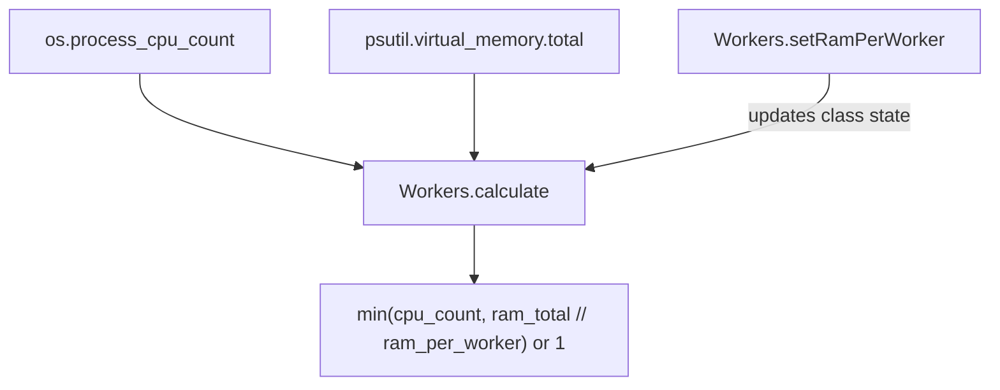

# Orionis System (`orionis.support.system`)

> Worker-count sizing based on available CPU cores and RAM.
>
> 🇪🇸 Versión en español: [README.es.md](README.es.md)

`orionis.support.system` answers one narrow question: **how many worker processes
can this machine safely run in parallel?** It exposes a single static
utility, `Workers`, that combines the CPU core count with the total system
RAM (and a configurable RAM budget per worker) to recommend a worker count
— the same kind of sizing logic used by process managers such as Gunicorn
or Uvicorn's `--workers` flag.

---

## Table of contents

1. [Requirements](#requirements)
2. [Module overview](#module-overview)
3. [Architecture](#architecture)
4. [API reference](#api-reference)
   - [`Workers`](#workers-orionissystemworkersworkers)
5. [Usage examples](#usage-examples)
6. [Performance and concurrency considerations](#performance-and-concurrency-considerations)
7. [Design notes](#design-notes)
8. [Compatibility notes](#compatibility-notes)

---

## Requirements

No installation beyond the framework itself is required:

```bash
uv add orionis
```

- **Python:** 3.14 or newer.
- **Runtime dependency:** [`psutil`](https://pypi.org/project/psutil/)
  (`psutil~=7.2`, a core, non-optional dependency of the framework) is used
  to read the total system RAM.

## Module overview

Choosing how many worker processes to spawn for an application server is a
recurring, easy-to-get-wrong decision: too many workers on a
memory-constrained machine leads to swapping and crashes, too few leaves
CPU cores idle. `orionis.support.system` centralizes this single calculation in
one class:

- **`Workers`** — a stateless, class-method-only utility (never
  instantiated) that:
  - Reads the number of CPUs available to the process (`os.process_cpu_count()`)
    and the total system
    RAM (`psutil.virtual_memory().total`) **once**, at module import time.
  - Lets you configure how much RAM (in GB) should be budgeted per worker
    (`setRamPerWorker`, default `0.5` GB).
  - Computes the recommended worker count (`calculate`) as the smaller of
    the CPU core count and how many "RAM budgets" fit in total system RAM,
    with a floor of `1`.

## Architecture



- `orionis/support/system/workers.py` computes `_CPU_COUNT` and `_RAM_TOTAL_BYTES`
  as **module-level constants**, evaluated once when the module is first
  imported, so `Workers.calculate()` never re-queries the OS or `psutil`.
- `Workers` implements the `IWorkers` contract
  (`orionis/support/system/contracts/workers.py`), a plain `ABC` with the same two
  `@classmethod`s.
- There is no service provider, facade, or DI wiring for this module —
  `Workers` is a plain static utility class meant to be imported and called
  directly wherever a worker count is needed (e.g. when configuring an ASGI
  server or a process pool).

## API reference

### `Workers` (`orionis.support.system.workers.Workers`)

```python
class Workers(IWorkers):
    __slots__ = ()
    _ram_per_worker_bytes: int = 1 << 29  # 0.5 GB, class-level state
```

Never instantiated — every member is a `@classmethod`.

| Method | Signature | Description |
| --- | --- | --- |
| `setRamPerWorker` | `(ram_per_worker: float) -> None` | Validates and converts the class-level RAM budget from GB to bytes. Takes effect immediately for subsequent calls; raises `ValueError` for non-finite, non-positive, or sub-byte budgets. |
| `calculate` | `() -> int` | Returns `min(cpu_count, ram_total_bytes // ram_per_worker_bytes) or 1` — the recommended number of worker processes. Always returns at least `1` when the computed value is `0` (thanks to `or 1`), but see the [Notes](#notes-on-edge-cases) on invalid RAM budgets below. |

Both methods are declared with `@classmethod` on both `Workers` and its
contract `IWorkers`, so they can be called directly on the class —
`Workers.calculate()` — without creating an instance.

#### Notes on edge cases

- `setRamPerWorker()` requires a finite budget greater than zero that
  converts to at least one byte. Zero, negative, non-finite, and sub-byte
  budgets raise `ValueError` at configuration time.

## Usage examples

### Sizing worker processes with default settings

```python
from orionis.support.system import Workers

# Uses the default budget of 0.5 GB of RAM per worker.
worker_count = Workers.calculate()
print(f"Recommended workers: {worker_count}")
```

### Adjusting the RAM budget per worker

```python
from orionis.support.system import Workers

# Each worker is expected to need about 2 GB of RAM.
Workers.setRamPerWorker(2.0)
worker_count = Workers.calculate()
```

### Feeding the result into a server/process-pool configuration

```python
from orionis.support.system import Workers

# Example: configuring a Uvicorn-style ASGI server programmatically.
config = {
    "workers": Workers.calculate(),
    "host": "0.0.0.0",
    "port": 8000,
}
```

### Using the contract for typing/DI-friendly code

```python
from orionis.support.system.contracts.workers import IWorkers
from orionis.support.system.workers import Workers

def print_worker_count(workers_cls: type[IWorkers] = Workers) -> None:
    print(workers_cls.calculate())
```

## Performance and concurrency considerations

- **CPU count and total RAM are read exactly once per process**:
  `_CPU_COUNT` and `_RAM_TOTAL_BYTES` are computed at **module import
  time** and cached as module-level constants; `calculate()` never calls
  `os.process_cpu_count()`, `os.cpu_count()`, or `psutil.virtual_memory()`
  again afterwards, so
  repeated calls are cheap (no syscalls, no `psutil` overhead per call).
- **`_ram_per_worker_bytes` is shared, mutable class state**:
  `setRamPerWorker`
  mutates a class attribute on `Workers` itself. Because there is a single
  shared value (not per-instance, not per-thread), calling
  `setRamPerWorker` from one part of an application (or from concurrently
  running code/tests) affects every subsequent `calculate()` call
  process-wide. There is no locking around this mutation — treat it as
  configuration set once at startup rather than something toggled
  concurrently from multiple threads/tasks.
- **`calculate()` itself is allocation-light arithmetic**: it does one
  integer floor-division and one `min()` call — no I/O or `async` is
  involved, so it is safe to call as often as needed.
- **`__slots__ = ()`** on `Workers` prevents instance attribute creation
  (consistent with the class never being instantiated) and avoids adding
  a `__dict__` to instances if one were ever created by mistake.
- **The computed values reflect the machine/container the process runs
  in** at the moment of import — if your deployment resizes CPU/RAM limits
  at runtime (e.g. certain container orchestrators), `Workers` will not
  automatically pick up the new limits without a process restart, since
  `_CPU_COUNT`/`_RAM_TOTAL_BYTES` are computed once. CPU affinity is
  reflected by `os.process_cpu_count()`, but fractional CPU-time quotas
  may require explicit deployment configuration.

## Design notes

- **Single-responsibility, stateless-by-instantiation utility**: `Workers`
  intentionally exposes only `@classmethod`s and `__slots__ = ()` — it is
  never meant to be instantiated, mirroring how a pure sizing/calculation
  helper is used across the framework (similar in spirit to
  `orionis.aio.Loop`, another class-method-only utility).
- **Process-aware CPU count and cached system data**: `_CPU_COUNT` and
  `_RAM_TOTAL_BYTES` are computed once at import time specifically to
  avoid repeated OS and `psutil.virtual_memory()` calls on every
  `calculate()` invocation. `_CPU_COUNT` prefers `os.process_cpu_count()`
  so CPU affinity restrictions are reflected, then falls back to
  `os.cpu_count()` when the process count is unknown.
- **Precomputed integer budget**: `setRamPerWorker()` converts GB to bytes
  once. Repeated `calculate()` calls use integer floor-division without
  repeating floating-point multiplication or integer conversion.
- **`IWorkers` contract mirrors the concrete class exactly**: both
  `setRamPerWorker` and `calculate` are declared as
  `@classmethod` + `@abstractmethod` on `IWorkers`, so code can depend on
  the abstract contract instead of the concrete `Workers` class if needed.

## Compatibility notes

- **Minimum Python version:** 3.14 (per `pyproject.toml`,
  `requires-python = ">=3.14"`), matching the rest of the framework.
- **Required dependency:** `psutil~=7.2` (core dependency, used only to
  read `psutil.virtual_memory().total`).
- Everything else relies on the standard library (`os.process_cpu_count()`
  and `os.cpu_count()`).
- Either CPU-count function can return `None`; `Workers` falls back from
  the process count to the system count and finally to `1`, once at import.
- No platform-specific behavior beyond what `os.process_cpu_count()`,
  `os.cpu_count()`, and `psutil` already handle; the module works
  identically on Windows, Linux, and macOS.
