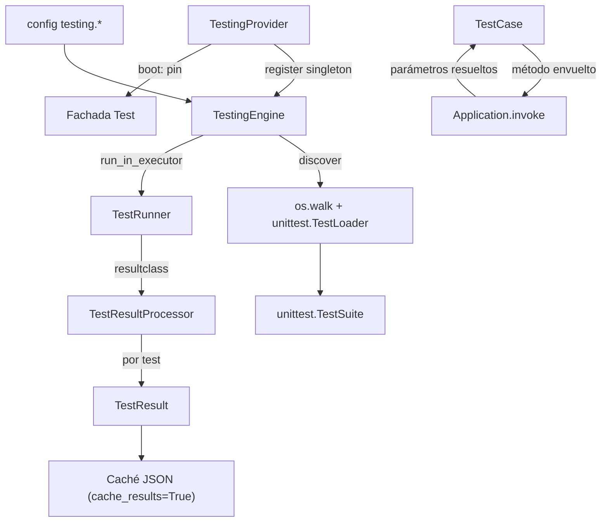

# orionis.test

> Motor de pruebas async-first construido sobre `unittest`: descubre tests en
> un árbol de directorios, inyecta dependencias del contenedor en los métodos
> de prueba, ejecuta la suite fuera del event loop y muestra resultados con
> Rich.

Versión en inglés: [README.md](README.md)

---

## Tabla de contenidos

- [Descripción funcional](#descripción-funcional)
  - [Ubicación dentro del framework](#ubicación-dentro-del-framework)
  - [Flujo de ejecución](#flujo-de-ejecución)
  - [Mapa del módulo](#mapa-del-módulo)
- [Referencia de API](#referencia-de-api)
  - [TestCase](#testcase)
  - [ITestingEngine](#itestingengine)
  - [TestingEngine](#testingengine)
  - [TestRunner](#testrunner)
  - [TestResultProcessor](#testresultprocessor)
  - [TestResult](#testresult)
  - [TestStatus](#teststatus)
  - [TestingProvider](#testingprovider)
  - [Claves de configuración](#claves-de-configuración)
- [Ejemplos de uso](#ejemplos-de-uso)
- [Consideraciones de rendimiento y concurrencia](#consideraciones-de-rendimiento-y-concurrencia)
- [Notas de compatibilidad](#notas-de-compatibilidad)

---

## Descripción funcional

`orionis.test` resuelve un problema concreto de un framework con inyección de
dependencias: `unittest` puro no tiene forma de entregar servicios del
contenedor a un método de prueba, y tampoco puede ejecutar una suite sin
bloquear a quien la invoca. Este módulo aporta una subclase de
`unittest.IsolatedAsyncioTestCase` cuyos métodos de prueba se ejecutan a través
de `Application.invoke(...)` (de modo que los parámetros extra los resuelve el
contenedor), más un motor que descubre, ejecuta y reporta la suite de forma
asíncrona.

### Ubicación dentro del framework

Dependencias directas con otros módulos de Orionis:

| Módulo | Para qué se usa |
| --- | --- |
| `orionis.support.facades.application` | `TestCase` invoca cada método de prueba a través de la fachada `Application`. |
| `orionis.foundation.contracts.application` | `TestingEngine` recibe `IApplication` para leer la config `testing.*`, `basePath` y `path("storage")`. |
| `orionis.container.providers` | `TestingProvider` extiende `ServiceProvider` y `DeferrableProvider`. |
| `orionis.support.facades.testing` | `TestingProvider.boot()` fija (pin) la fachada `Test`. |
| `orionis.support.entities.base` | `TestResult` extiende `BaseEntity` (aporta `toDict()`). |
| `orionis.support.facades.datetime` | `TestRunner` muestra la marca de tiempo inicial con `DateTime.now()`. |

Dependencia externa: `rich` (consola, paneles, tablas, texto con estilo). Es
una dependencia base del framework, así que no requiere instalación adicional.

Consumidores dentro del framework: `orionis.console.commands.test.test_command.TestCommand`
(el comando CLI `reactor test`) resuelve `ITestingEngine` por DI y lo gobierna;
`orionis.foundation.core_providers` registra `TestingProvider`.

### Flujo de ejecución



1. `TestingEngine.discover()` recorre `start_dir` con `os.walk`, importa cada
   archivo que casa con `file_pattern` usando un `unittest.TestLoader` nuevo, y
   conserva solo los casos cuyo nombre de método casa con `method_pattern`.
2. `TestingEngine.run()` construye un `TestRunner` que lleva la verbosidad
   configurada y lo ejecuta con
   `loop.run_in_executor(None, runner.run, suite)`.
3. `TestRunner.run()` imprime el panel inicial, ejecuta `test(result)` e
   imprime la tabla resumen.
4. `TestResultProcessor` construye un `TestResult` por resultado y lo imprime
   de inmediato (salida en vivo) dentro de `addSuccess` / `addFailure` /
   `addError` / `addSkip`.
5. Los resultados se devuelven como `list[TestResult]` y, si `cache_results`
   está activo, se escriben en
   `storage/framework/cache/testing/<epoch>.json`.

### Mapa del módulo

| Ruta | Contenido |
| --- | --- |
| `orionis/test/__init__.py` | Reexporta `TestCase` (`__all__ = ["TestCase"]`). |
| `orionis/test/cases/case.py` | `TestCase`. |
| `orionis/test/contracts/engine.py` | `ITestingEngine` (ABC). |
| `orionis/test/core/engine.py` | `TestingEngine`. |
| `orionis/test/entities/result.py` | `TestResult` (dataclass frozen). |
| `orionis/test/enums/status.py` | `TestStatus` (`StrEnum`). |
| `orionis/test/executors/runner.py` | `TestRunner`. |
| `orionis/test/executors/results.py` | `TestResultProcessor`. |
| `orionis/test/provider.py` | `TestingProvider`. |

`orionis/test/contracts/__init__.py`, `core/__init__.py`,
`entities/__init__.py`, `enums/__init__.py` y `executors/__init__.py` están
vacíos: esos símbolos deben importarse desde su módulo concreto.

---

## Referencia de API

### TestCase

`orionis.test.cases.case.TestCase` — también importable como
`from orionis.test import TestCase`.

```python
class TestCase(unittest.IsolatedAsyncioTestCase):

    @classmethod
    def setMethodPattern(cls, pattern: str) -> None: ...

    def __init__(self, method_name: str = "runTest") -> None: ...

    def _resolveTest(self, method: Callable[..., Any]) -> Callable[..., Any]: ...
```

Clase base para las pruebas de la aplicación y del framework.

**`setMethodPattern(pattern)`** (`classmethod`)

| Elemento | Detalle |
| --- | --- |
| `pattern : str` | Patrón glob (por ejemplo `"test*"`, `"should*"`). |
| Retorno | `None`. |
| Efectos | Compila `fnmatch.translate(pattern)` y lo publica en la variable de contexto `_METHOD_PATTERN`. El valor es visible en el contexto actual y en toda tarea creada después de él; nunca llega a una corrida que se ejecute en otra tarea o hilo. |

**`__init__(method_name="runTest")`**

Llama a `super().__init__(method_name)` y luego envuelve el método de prueba
**una sola vez**, en la construcción (no vía `__getattribute__`). Solo se
envuelve si se cumplen las tres condiciones:

- `method_name` no empieza por `_`;
- `method_name` no es uno de los hooks de ciclo de vida `setUp`, `tearDown`,
  `setUpClass`, `tearDownClass`, `asyncSetUp`, `asyncTearDown`;
- `_METHOD_PATTERN.get().match(method_name)` no es `None`.

Cuando se cumplen, el método ligado obtenido con `object.__getattribute__` se
reemplaza (vía `object.__setattr__`, de modo que el wrapper queda como atributo
de instancia) por el callable que devuelve `_resolveTest`.

**`_resolveTest(method)`**

Devuelve un wrapper `async` decorado con `functools.wraps(method)` que ejecuta
`await Application.invoke(method, *args, **kwargs)` y retorna su resultado. Eso
es lo que habilita los parámetros resueltos por DI en los métodos de prueba: el
contenedor inspecciona la firma del método e inyecta cada dependencia
declarada. Como el wrapper es una función corrutina, tanto los métodos de
prueba síncronos como los asíncronos terminan siendo esperados por
`IsolatedAsyncioTestCase`.

Constantes a nivel de módulo (privadas, pero definen el comportamiento
anterior):

- `_LIFECYCLE_HOOKS: frozenset[str]` — hooks que nunca se envuelven.
- `_DEFAULT_PATTERN: re.Pattern[str]` — `fnmatch.translate("test*")`
  precompilado.
- `_METHOD_PATTERN: ContextVar[re.Pattern[str]]` — patrón vigente, local al
  contexto, con `_DEFAULT_PATTERN` como valor por defecto.

### ITestingEngine

`orionis.test.contracts.engine.ITestingEngine` — `abc.ABC` implementado por
`TestingEngine` y usado como clave de binding en el contenedor y como accessor
de la fachada.

```python
class ITestingEngine(ABC):
    def setVerbosity(self, verbosity: int) -> Self: ...
    def setFailFast(self, *, fail_fast: bool) -> Self: ...
    def setStartDir(self, start_dir: str) -> Self: ...
    def setFilePattern(self, file_pattern: str) -> Self: ...
    def setMethodPattern(self, method_pattern: str) -> Self: ...
    def withoutPanel(self) -> Self: ...
    def discover(self) -> unittest.TestSuite: ...
    async def run(self) -> list[TestResult]: ...
```

Los ocho miembros son `@abstractmethod` y tienen cuerpo vacío (sin
implementación por defecto).

### TestingEngine

`orionis.test.core.engine.TestingEngine` — implementa `ITestingEngine`.

```python
class TestingEngine(ITestingEngine):
    def __init__(self, app: IApplication) -> None: ...
```

**Constructor.** Lee toda la configuración de forma anticipada. `app.config`
devuelve `None` ante una clave desconocida, así que cada valor cae al default
declarado por `orionis.foundation.config.testing.Testing`:

| Atributo | Origen | Valor si falta la clave |
| --- | --- | --- |
| `__base_path` | `app.basePath` | — |
| `__verbosity` | `app.config("testing.verbosity")` | `2` (solo cuando el valor es `None`, de modo que un `0` configurado se conserva) |
| `__fail_fast` | `app.config("testing.fail_fast") in [1, True, "1", "true", "True"]` | `False` |
| `__start_dir` | `app.config("testing.start_dir")` | `"tests"` |
| `__file_pattern` | `app.config("testing.file_pattern")` | `"test_*.py"` |
| `__method_pattern` | `app.config("testing.method_pattern")` | `"test*"` |
| `__json_cache` | `bool(app.config("testing.cache_results"))` | `False` |
| `__cache_folder` | `app.path("storage") / "framework" / "cache" / "testing"` | — |
| `__with_panel` | `True` (valor literal por defecto) | — |

Los valores de respaldo viven en `orionis/test/core/engine.py` como las
constantes de módulo `_DEFAULT_VERBOSITY`, `_DEFAULT_START_DIR`,
`_DEFAULT_FILE_PATTERN` y `_DEFAULT_METHOD_PATTERN`. Más allá de esa
sustitución el motor no valida nada: la comprobación de tipos corresponde a la
entidad de configuración, que lanza `TypeError` ante un valor mal formado.

La clase no usa `from __future__ import annotations` e importa `IApplication`
en runtime (con `# ruff: noqa: TC001` a nivel de archivo) porque el contenedor
resuelve el constructor por reflexión.

**Setters fluidos.** Cada uno sobrescribe el valor leído de configuración y
devuelve `self`, de modo que las llamadas se pueden encadenar:

| Método | Firma | Efecto |
| --- | --- | --- |
| `setVerbosity` | `(verbosity: int) -> Self` | Fija la verbosidad que se entrega a `TestRunner` y, a través de él, al procesador de resultados de esa corrida. |
| `setFailFast` | `(*, fail_fast: bool) -> Self` | Solo por palabra clave. Se reenvía a `TestRunner(failfast=...)`. |
| `setStartDir` | `(start_dir: str) -> Self` | Directorio que usa `discover()`. |
| `setFilePattern` | `(file_pattern: str) -> Self` | Glob aplicado a los nombres de archivo. |
| `setMethodPattern` | `(method_pattern: str) -> Self` | También llama a `TestCase.setMethodPattern(method_pattern)`, así el filtrado del descubrimiento y el envoltorio de DI usan siempre el mismo patrón. |
| `withoutPanel` | `() -> Self` | Pone `__with_panel = False`; se omiten los paneles inicial y de resumen. No existe método para volver a activarlo. |

**`discover() -> unittest.TestSuite`**

1. Inserta `app.basePath.absolute().as_posix()` en la posición 0 de `sys.path`
   si no está presente, para que el paquete raíz sea importable.
2. Resuelve el directorio inicial con `Path(self.__start_dir).resolve()` — un
   valor relativo se resuelve contra el **directorio de trabajo actual**, no
   contra `basePath`.
3. Crea un `unittest.TestLoader()` nuevo en cada llamada (nunca usa
   `unittest.defaultTestLoader`, evitando su estado cacheado).
4. Recorre el árbol con `os.walk`, que también entra en subdirectorios sin
   `__init__.py` (algo que `unittest.discover()` omite).
5. Por cada archivo que casa con `file_pattern`, deriva el nombre de módulo con
   puntos a partir de su ruta relativa al directorio raíz y llama a
   `loader.loadTestsFromName(module_name)` dentro de
   `contextlib.suppress(Exception)`: un archivo no importable (error de
   sintaxis, dependencia faltante, etc.) se omite en silencio y el
   descubrimiento continúa.
6. Aplana las suites anidadas con el generador recursivo privado
   `__extractTests` y agrega solo los casos cuyo `_testMethodName` casa con
   `method_pattern`.

Devuelve un `unittest.TestSuite`; nunca devuelve `None` ni lanza excepciones
propias del módulo.

**`run() -> list[TestResult]`** (corrutina)

1. `suite = self.discover()` — una suite nueva en cada llamada, así dos
   ejecuciones consecutivas sobre la misma instancia nunca reejecutan la tanda
   anterior.
2. Construye `TestRunner(verbosity=self.__verbosity, failfast=self.__fail_fast,
   with_panel=self.__with_panel)`. La verbosidad viaja con la instancia del
   runner, que se la entrega al `TestResultProcessor` que crea; la salida por
   consola sigue siendo responsabilidad exclusiva de ese procesador.
3. `await loop.run_in_executor(None, runner.run, suite)` — la ejecución
   bloqueante de `unittest` corre en el pool de hilos por defecto.
4. `results = result.getTestResults()` y `await self.__saveCache(results)`.
5. Devuelve `list[TestResult]`.

`__saveCache` (privado) retorna de inmediato si `cache_results` es falso; en
caso contrario crea la carpeta de caché (`mkdir(parents=True, exist_ok=True)`)
y escribe `<int(time.time())>.json` con
`json.dumps(data, indent=4, default=str)` sobre `[result.toDict() for ...]`,
también mediante `run_in_executor`. Los errores de sistema de archivos
(`OSError`) se propagan fuera de `run()`.

### TestRunner

`orionis.test.executors.runner.TestRunner` — extiende
`unittest.TextTestRunner`.

```python
class TestRunner(unittest.TextTestRunner):

    resultclass = TestResultProcessor

    def __init__(
        self,
        verbosity: int = 0,
        failfast: bool = False,
        buffer: bool = False,
        warnings: str | None = None,
        with_panel: bool = True,
        **kwargs: dict,
    ) -> None: ...

    def run(self, test: unittest.suite.TestSuite) -> unittest.result.TestResult: ...
```

El constructor reenvía `verbosity`, `failfast`, `buffer`, `warnings` y
`**kwargs` a `unittest.TextTestRunner`, y guarda una `rich.console.Console`
junto con la bandera `with_panel`. Su docstring documenta todos los
parámetros, incluidos `with_panel` y los `**kwargs` que se reenvían a la
biblioteca estándar (`stream`, `descriptions`, `tb_locals`, `durations`), cuya
semántica se define allí.

`verbosity` no lo consume esta clase: el `run()` sobrescrito nunca imprime la
salida estándar de `unittest`. Llega al `TestResultProcessor` que construye el
`_makeResult()` heredado, dueño del renderizado por test.

**`run(test)`** sobrescribe la implementación del padre:

1. Imprime el panel inicial si `with_panel` es verdadero. El panel muestra
   `DateTime.now().strftime("%Y-%m-%d %H:%M:%S")`, `os.getpid()` y el nombre de
   `asyncio.DefaultEventLoopPolicy`. **Antes llama a `console.clear()`**, lo
   que borra la salida previa de la terminal.
2. Crea el resultado con `self._makeResult()` (un `TestResultProcessor`, por
   `resultclass`) y lo registra con `unittest.registerResult`.
3. Copia `failfast`, `buffer` y `tb_locals` al objeto de resultado.
4. Dentro de `warnings.catch_warnings()`, mide con `time.perf_counter()`,
   invoca `startTestRun` si existe, ejecuta `test(result)` e invoca siempre
   `stopTestRun` en un bloque `finally`.
5. Imprime la tabla resumen (Total / Passed / Failed / Errored / Skipped y el
   pie `Total execution time: …`) si `with_panel` es verdadero y el resultado
   expone un `getTestResults` invocable.
6. Devuelve el objeto de resultado.

### TestResultProcessor

`orionis.test.executors.results.TestResultProcessor` — extiende
`unittest.TestResult`. Lo instancia el propio `unittest` a través de
`TestRunner.resultclass`.

```python
class TestResultProcessor(unittest.TestResult):

    def __init__(
        self,
        stream: object = None,
        descriptions: object = None,
        verbosity: int | None = None,
        **kwargs: object,
    ) -> None: ...

    def startTest(self, test: unittest.case.TestCase) -> None: ...
    def addSuccess(self, test: unittest.case.TestCase) -> None: ...
    def addFailure(self, test, err) -> None: ...
    def addError(self, test, err) -> None: ...
    def addSkip(self, test, reason: str) -> None: ...
    def getTestResults(self) -> list[TestResult]: ...
```

| Miembro | Comportamiento |
| --- | --- |
| `__init__` | Reenvía sus argumentos a `unittest.TestResult`, conserva `verbosity` como nivel de impresión propio de la instancia e inicializa la lista de resultados, una `rich.console.Console` y `__max_width = console.width * 0.8`. La firma refleja la llamada que hace `unittest.TextTestRunner._makeResult()`. |
| `startTest(test)` | Guarda `time.perf_counter()` en `__start_time` y delega en el padre. |
| `addSuccess(test)` | Construye un `TestResult` con `TestStatus.PASSED`, lo agrega, lo imprime y delega en el padre. |
| `addFailure(test, err)` | Igual con `TestStatus.FAILED` y la tupla `err`. |
| `addError(test, err)` | Igual con `TestStatus.ERRORED`. |
| `addSkip(test, reason)` | Igual con `TestStatus.SKIPPED`; `reason` solo se reenvía al padre, no se guarda en el `TestResult`. |
| `getTestResults()` | Devuelve la `list[TestResult]` interna (la lista viva, no una copia). |

`err` está tipado como `tuple[type[BaseException], BaseException, object]` (la
tupla de `sys.exc_info()`).

**Renderizado (`__printTestResult`, privado).** Depende exclusivamente de la
`verbosity` recibida en la construcción:

- `1` — una línea compacta por test: etiqueta de estado, nombre, relleno de
  puntos y `~ <segundos>s`. Si la línea no cabe en `__max_width`, el nombre se
  trunca y se le añade `...`.
- `2` — un `Panel` de Rich por test con ID, nombre, clase, método, módulo y
  ruta del archivo. Para `FAILED`/`ERRORED` añade `file_path:line_no`, el icono
  (`❌` en fallos, `💥` en errores), `exception: error_message` y las líneas de
  código capturadas, resaltando la línea que falló.
- Cualquier otro valor (incluidos el `None` por defecto y `0`) no imprime nada.

Colores por estado: `PASSED` verde, `SKIPPED` amarillo, `FAILED` magenta,
`ERRORED` rojo; los estados desconocidos caen a `white`.

**Construcción del resultado (`__createTestResult`, privado).**

- `id=id(test)`, `name=test.id()`,
  `execution_time=perf_counter() - __start_time`.
- `file_path` desde `inspect.getfile(type(test))`, protegido frente a
  `TypeError` y `OSError` (`None` si falla).
- `doc_string` desde `inspect.getdoc(...)` del atributo de clase que
  corresponde a `_testMethodName`; `None` si el método no se puede resolver.
- `exception` es el **nombre de la clase** de excepción
  (`exc_info[0].__name__`), no la instancia de excepción.
- `traceback` es `traceback.format_exception(*exc_info)` (una lista de
  cadenas) o `None` cuando no hay excepción.
- `source_code` siempre es una lista: `__extractTraceInfo` recorre
  `inspect.trace()` buscando frames cuyo `co_filename` contenga `file_path` y
  recolecta pares `(line_no, code)` desde `lineno - 2` hasta `lineno + 1`
  usando `linecache`. En tests que pasan queda vacía (`[]`).

### TestResult

`orionis.test.entities.result.TestResult` —
`@dataclass(frozen=True, kw_only=True)` que extiende
`orionis.support.entities.base.BaseEntity`. Inmutable; cada campo declara
`metadata={"description": ...}`. `toDict()` (heredado) es lo que serializa el
escritor de la caché JSON.

| Campo | Tipo | Default | Contenido |
| --- | --- | --- | --- |
| `id` | `Any` | obligatorio | `id(test)` de la instancia ejecutada. |
| `name` | `str` | obligatorio | `test.id()`, p. ej. `tests.foo.TestBar.testBaz`. |
| `status` | `TestStatus` | obligatorio | Resultado. |
| `execution_time` | `float` | obligatorio | Segundos medidos con `perf_counter`. |
| `error_message` | `str \| None` | `None` | `str(excepción)` en fallo/error. |
| `traceback` | `list[str] \| None` | `None` | Líneas del traceback formateado. |
| `class_name` | `str \| None` | `None` | `type(test).__name__`. |
| `method` | `str \| None` | `None` | `_testMethodName`. |
| `module` | `str \| None` | `None` | `type(test).__module__`. |
| `file_path` | `str \| None` | `None` | Archivo fuente de la clase de prueba. |
| `doc_string` | `str \| None` | `None` | Docstring del método de prueba. |
| `exception` | `str \| None` | `None` | **Nombre** de la clase de excepción. |
| `line_no` | `int \| None` | `None` | Línea del fallo dentro del archivo de prueba. |
| `source_code` | `list[tuple[int, str]] \| None` | `None` | Pares `(line_no, code)` alrededor del fallo. |

Los cuatro primeros campos no tienen default y son keyword-only, por lo que son
obligatorios al construir la entidad manualmente.

### TestStatus

`orionis.test.enums.status.TestStatus` — `enum.StrEnum`:

| Miembro | Valor | Significado |
| --- | --- | --- |
| `PASSED` | `"PASSED"` | Terminó sin fallos ni errores. |
| `FAILED` | `"FAILED"` | Terminó pero una aserción no se cumplió. |
| `ERRORED` | `"ERRORED"` | Excepción inesperada durante la ejecución. |
| `SKIPPED` | `"SKIPPED"` | No se ejecutó intencionalmente. |

Al ser `StrEnum`, los miembros son iguales a su valor de cadena
(`TestStatus.PASSED == "PASSED"`) y soportan métodos de `str`, que es como el
renderizador llama a `result.status.center(9)`.

### TestingProvider

`orionis.test.provider.TestingProvider` — extiende `ServiceProvider` y
`DeferrableProvider`. Registrado en
`orionis.foundation.core_providers.CORE_PROVIDERS`.

```python
class TestingProvider(ServiceProvider, DeferrableProvider):
    @classmethod
    def provides(cls) -> list[type]: ...
    def register(self) -> None: ...
    async def boot(self) -> None: ...
```

| Método | Comportamiento |
| --- | --- |
| `provides()` | Devuelve `[ITestingEngine]`, la declaración del servicio diferido. |
| `register()` | `self.app.singleton(ITestingEngine, TestingEngine)`. |
| `boot()` | `await TestFacade.pin()` — fija `orionis.support.facades.testing.Test`. |

Como el provider es diferible, `register()`/`boot()` solo se ejecutan cuando se
resuelve `ITestingEngine` por primera vez. Hasta entonces la fachada `Test` no
está fijada, así que el acceso a atributos devuelve el dispatcher diferido y
necesita `await`.

### Claves de configuración

Se consumen con `app.config("testing.<clave>")` — entidad
`orionis.foundation.config.testing.entities.testing.Testing`, bootstrap de la
aplicación en `config/testing.py`.

| Clave | Tipo | Default | Variable de entorno |
| --- | --- | --- | --- |
| `verbosity` | `int \| VerbosityMode` | `2` (detallado) | `TESTING_VERBOSITY` |
| `fail_fast` | `bool` | `False` | `TESTING_FAIL_FAST` |
| `start_dir` | `str` | `"tests"` | `TESTING_START_DIR` |
| `file_pattern` | `str` | `"test_*.py"` | `TESTING_FILE_PATTERN` |
| `method_pattern` | `str` | `"test*"` | `TESTING_METHOD_PATTERN` |
| `cache_results` | `bool` | `False` | `TESTING_CACHE_RESULTS` |

La entidad valida los tipos en `__post_init__` y lanza `TypeError` si no
coinciden; `verbosity` debe ser un valor válido de `VerbosityMode`. Cuando la
sección completa (o una clave suelta) falta en la configuración de la
aplicación, el motor aplica exactamente esos mismos valores por defecto, así
que una clave ausente nunca llega al descubrimiento.

---

## Ejemplos de uso

### 1. Escribir una prueba

```python
from orionis.test import TestCase


class TestGreeting(TestCase):

    async def testUpperCaseIsApplied(self) -> None:
        """Assert the greeting is upper-cased."""
        self.assertEqual("hello".upper(), "HELLO")
```

Ejecútala con el runner del framework (arranca la aplicación, cosa que
`python -m unittest` a secas no hace):

```bash
python reactor test --start-dir="tests" --verbosity=1
```

### 2. Inyectar servicios del contenedor en un método de prueba

Todo método que casa con el patrón se ejecuta vía
`await Application.invoke(method, ...)`, así que los parámetros extra los
resuelve el contenedor igual que en controladores y comandos de consola:

```python
from orionis.foundation.contracts.application import IApplication
from orionis.test import TestCase


class TestTestingConfiguration(TestCase):

    async def testStartDirectoryIsConfigured(
        self,
        app: IApplication,
    ) -> None:
        """Assert the configured start directory is a string."""
        self.assertIsInstance(app.config("testing.start_dir"), str)
```

### 3. Ejecutar la suite por código y manejar los fallos

```python
from orionis.foundation.contracts.application import IApplication
from orionis.test.contracts.engine import ITestingEngine
from orionis.test.enums.status import TestStatus

_FAILURE_STATUSES = frozenset({TestStatus.FAILED, TestStatus.ERRORED})


async def runSuite(app: IApplication) -> int:
    """Run the test suite and return a process exit code."""
    engine: ITestingEngine = await app.make(ITestingEngine)
    engine.setStartDir("tests").setFilePattern("test_*.py").setVerbosity(1)
    engine.setFailFast(fail_fast=False).withoutPanel()

    try:
        results = await engine.run()
    except OSError:
        # Raised by __saveCache() when testing.cache_results is enabled and
        # storage/framework/cache/testing cannot be created or written.
        return 1

    failures = [
        result for result in results if result.status in _FAILURE_STATUSES
    ]
    for failure in failures:
        print(failure.name, failure.exception, failure.error_message)

    return 1 if failures else 0
```

Nótese que una prueba fallida nunca lanza excepción: se reporta como un
`TestResult` con estado `FAILED` o `ERRORED`.

### 4. Usar un patrón de métodos distinto al default

Cámbialo en el motor, no en `TestCase`: `TestingEngine.setMethodPattern`
propaga el patrón a `TestCase.setMethodPattern`, de modo que el descubrimiento
y el envoltorio de DI quedan sincronizados.

```python
from orionis.foundation.contracts.application import IApplication
from orionis.test.contracts.engine import ITestingEngine
from orionis.test.entities.result import TestResult


async def runNamedSuite(app: IApplication) -> list[TestResult]:
    """Run every method matching the "should*" pattern."""
    engine: ITestingEngine = await app.make(ITestingEngine)
    return await engine.setMethodPattern("should*").setVerbosity(2).run()
```

```python
from orionis.test import TestCase


class TestPricing(TestCase):

    async def shouldApplyDiscount(self) -> None:
        """Assert the discounted price is computed."""
        self.assertEqual(round(100 * 0.9, 2), 90.0)
```

### 5. Integración con el comando CLI

`orionis.console.commands.test.test_command.TestCommand` es un envoltorio
delgado: resuelve `ITestingEngine` por DI y aplica cada opción siguiendo la
cadena **bandera de la CLI → configuración `testing.*` → default del motor**
(una opción que nadie resuelve no se aplica, así que el motor conserva su
propio valor). Devuelve `1` si algún resultado es `FAILED` o `ERRORED`, y `0`
en caso contrario; el reactor usa ese valor como código de salida del proceso.

```bash
python reactor test --start-dir="tests/app" --verbosity=2
python reactor test --fail-fast=1 --no-panel
python reactor test --method-pattern="testUser*"
```

En Windows conviene usar el entorno virtual del proyecto y salida UTF-8:

```powershell
$env:PYTHONIOENCODING = "utf-8"
.\.venv\Scripts\python.exe reactor test --start-dir="tests/test" --verbosity=1
```

---

## Consideraciones de rendimiento y concurrencia

- **La suite nunca bloquea el event loop.** `TestingEngine.run()` descarga toda
  la ejecución síncrona de `unittest` con
  `loop.run_in_executor(None, runner.run, suite)`, y `__saveCache` escribe el
  archivo JSON por el mismo executor.
- **Cada test recibe su propio event loop.** `TestCase` extiende
  `unittest.IsolatedAsyncioTestCase`, así que las pruebas no comparten loop
  entre sí ni con la corrutina que esperó `run()`.
- **El envoltorio de DI ocurre una vez por instancia.** El método se reemplaza
  en `__init__`; no hay interceptación de `__getattribute__`, por lo que el
  acceso normal a atributos conserva su costo habitual. La resolución de
  dependencias, en cambio, sí ocurre en cada llamada, porque
  `Application.invoke` refleja la firma cada vez.
- **La verbosidad de reporte está acotada a la corrida.** Se entrega a
  `TestRunner` y desde ahí al `TestResultProcessor` que esa corrida crea, así
  que dos corridas solapadas nunca se pisan el nivel de detalle. No queda nada
  a nivel de clase.
- **El patrón de descubrimiento es local al contexto.**
  `TestCase.setMethodPattern` escribe en la variable de contexto
  `_METHOD_PATTERN`, cuyo valor se copia a cada tarea creada después y nunca
  se propaga de vuelta al contexto del llamador. Una corrida que configure
  `"should*"` no puede cambiar el patrón que observa otra corrida en curso en
  otra tarea o hilo.
- **`getTestResults()` devuelve la lista viva**, no una copia: mutarla muta el
  estado interno del procesador.
- **La salida por consola es síncrona y en el hilo de trabajo.** La impresión
  ocurre dentro de los callbacks de `unittest`, que se ejecutan en el hilo que
  corre la suite, así que el orden de salida coincide con el de ejecución.
- **El costo del descubrimiento es proporcional al árbol.** `os.walk` visita
  cada directorio bajo `start_dir` e importa cada archivo que casa con
  `file_pattern`; acotar `--start-dir` es la forma más barata de acortar una
  corrida.
- **Los archivos rotos se omiten, no se reportan.**
  `contextlib.suppress(Exception)` alrededor de cada import cambia estrictez
  por resiliencia: un archivo que no importa simplemente no aporta pruebas.
- **`TestRunner.__startPanel()` llama a `console.clear()`**, borrando el
  contenido previo de la terminal. Usa `withoutPanel()` (o `--no-panel`) cuando
  haya que conservar la salida circundante.

---

## Notas de compatibilidad

- **Python:** `>= 3.14` (`requires-python` en `pyproject.toml`). El módulo usa
  `typing.Self` en anotaciones de retorno y `enum.StrEnum`.
- **Dependencia externa:** `rich~=15.0`, dependencia base (no opcional) del
  framework. No requiere instalación adicional a `pip install orionis`.
- **Se requiere una aplicación arrancada.** `TestCase` resuelve cada método de
  prueba a través de la fachada `Application` y `TestingEngine` necesita la
  configuración de `IApplication`; ejecutar estos casos con
  `python -m unittest` a secas no arranca el contenedor.
- **`from __future__ import annotations`** se usa en `cases/case.py`,
  `contracts/engine.py`, `entities/result.py` y `provider.py`, pero **no** en
  `core/engine.py`, cuyo constructor lo resuelve la reflexión del contenedor.
- **Sin excepciones propias del módulo.** `orionis.test` no define clases de
  excepción; lo que aflora son errores estándar (`OSError` al escribir la
  caché, `TypeError` de `Application.invoke` ante un callable inválido) y lo
  que lancen las propias pruebas.
- **Multiplataforma:** el descubrimiento se apoya en `os.walk`, `pathlib` y
  `os.path.relpath`, normalizando `os.sep` en nombres de módulo con puntos, así
  que se comporta igual en Windows, Linux y macOS.
