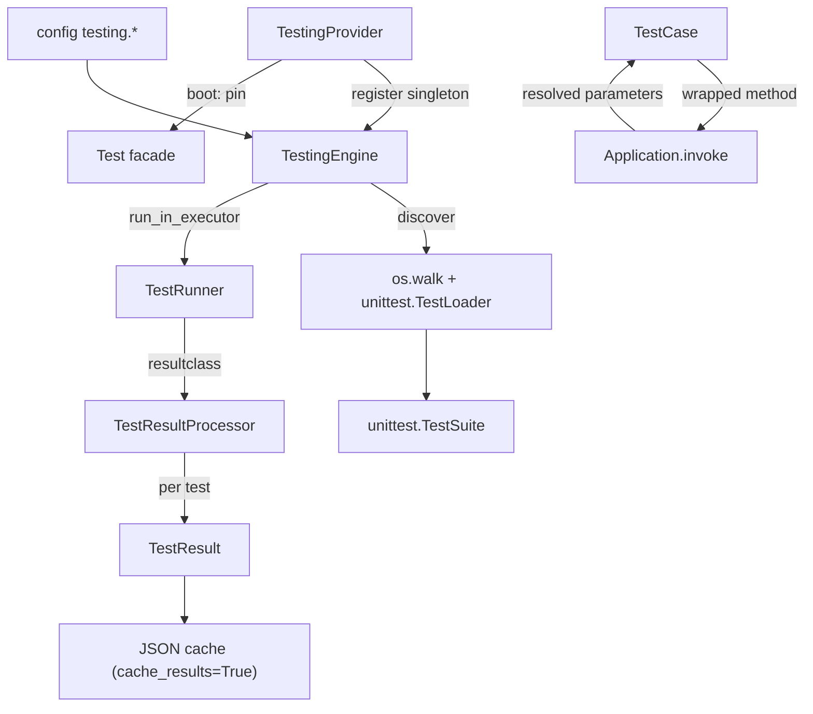

# orionis.test

> Async-first testing engine built on `unittest`: discovers tests across a
> directory tree, injects container dependencies into test methods, runs the
> suite off the event loop and renders results with Rich.

Spanish version: [README.es.md](README.es.md)

---

## Table of contents

- [Functional description](#functional-description)
  - [Position within the framework](#position-within-the-framework)
  - [Execution pipeline](#execution-pipeline)
  - [Module layout](#module-layout)
- [API reference](#api-reference)
  - [TestCase](#testcase)
  - [ITestingEngine](#itestingengine)
  - [TestingEngine](#testingengine)
  - [TestRunner](#testrunner)
  - [TestResultProcessor](#testresultprocessor)
  - [TestResult](#testresult)
  - [TestStatus](#teststatus)
  - [TestingProvider](#testingprovider)
  - [Configuration keys](#configuration-keys)
- [Usage examples](#usage-examples)
- [Performance and concurrency considerations](#performance-and-concurrency-considerations)
- [Compatibility notes](#compatibility-notes)

---

## Functional description

`orionis.test` solves a concrete problem of a dependency-injection
framework: plain `unittest` has no way to hand container services to a test
method, and it cannot run a suite without blocking the caller. This module
provides a `unittest.IsolatedAsyncioTestCase` subclass whose test methods are
executed through `Application.invoke(...)` (so extra parameters are resolved by
the container), plus an engine that discovers, executes and reports the suite
asynchronously.

### Position within the framework

Direct dependencies on other Orionis modules:

| Module | Used for |
| --- | --- |
| `orionis.support.facades.application` | `TestCase` invokes each test method through the `Application` facade. |
| `orionis.foundation.contracts.application` | `TestingEngine` receives `IApplication` to read `testing.*` config, `basePath` and `path("storage")`. |
| `orionis.container.providers` | `TestingProvider` extends `ServiceProvider` and `DeferrableProvider`. |
| `orionis.support.facades.testing` | `TestingProvider.boot()` pins the `Test` facade. |
| `orionis.support.entities.base` | `TestResult` extends `BaseEntity` (provides `toDict()`). |
| `orionis.support.facades.datetime` | `TestRunner` renders the start timestamp with `DateTime.now()`. |

External dependency: `rich` (console, panels, tables, styled text). It is a
core dependency of the framework, so no extra installation is required.

Consumers inside the framework: `orionis.console.commands.test.test_command.TestCommand`
(the `reactor test` CLI command) resolves `ITestingEngine` by DI and drives it;
`orionis.foundation.core_providers` registers `TestingProvider`.

### Execution pipeline



1. `TestingEngine.discover()` walks `start_dir` with `os.walk`, imports every
   file matching `file_pattern` with a fresh `unittest.TestLoader`, and keeps
   only the test cases whose method name matches `method_pattern`.
2. `TestingEngine.run()` builds a `TestRunner` carrying the configured
   verbosity and executes it with
   `loop.run_in_executor(None, runner.run, suite)`.
3. `TestRunner.run()` prints the start panel, runs `test(result)` and prints
   the summary table.
4. `TestResultProcessor` builds one `TestResult` per outcome and prints it
   immediately (live output) inside `addSuccess` / `addFailure` / `addError` /
   `addSkip`.
5. Results are returned as `list[TestResult]` and, if `cache_results` is
   enabled, written to `storage/framework/cache/testing/<epoch>.json`.

### Module layout

| Path | Contents |
| --- | --- |
| `orionis/test/__init__.py` | Re-exports `TestCase` (`__all__ = ["TestCase"]`). |
| `orionis/test/cases/case.py` | `TestCase`. |
| `orionis/test/contracts/engine.py` | `ITestingEngine` (ABC). |
| `orionis/test/core/engine.py` | `TestingEngine`. |
| `orionis/test/entities/result.py` | `TestResult` (frozen dataclass). |
| `orionis/test/enums/status.py` | `TestStatus` (`StrEnum`). |
| `orionis/test/executors/runner.py` | `TestRunner`. |
| `orionis/test/executors/results.py` | `TestResultProcessor`. |
| `orionis/test/provider.py` | `TestingProvider`. |

`orionis/test/contracts/__init__.py`, `core/__init__.py`,
`entities/__init__.py`, `enums/__init__.py` and `executors/__init__.py` are
empty: those symbols must be imported from their concrete module.

---

## API reference

### TestCase

`orionis.test.cases.case.TestCase` — also importable as
`from orionis.test import TestCase`.

```python
class TestCase(unittest.IsolatedAsyncioTestCase):

    @classmethod
    def setMethodPattern(cls, pattern: str) -> None: ...

    def __init__(self, method_name: str = "runTest") -> None: ...

    def _resolveTest(self, method: Callable[..., Any]) -> Callable[..., Any]: ...
```

Base class for application and framework tests.

**`setMethodPattern(pattern)`** (`classmethod`)

| Item | Detail |
| --- | --- |
| `pattern : str` | Glob pattern (for example `"test*"`, `"should*"`). |
| Returns | `None`. |
| Side effects | Compiles `fnmatch.translate(pattern)` and publishes it to the `_METHOD_PATTERN` context variable. The value is visible to the current context and to any task created from it afterwards; it never reaches a run executing in a different task or thread. |

**`__init__(method_name="runTest")`**

Calls `super().__init__(method_name)` and then wraps the test method **once**,
at construction time (not through `__getattribute__`). The method is wrapped
only when all three conditions hold:

- `method_name` does not start with `_`;
- `method_name` is not one of the lifecycle hooks `setUp`, `tearDown`,
  `setUpClass`, `tearDownClass`, `asyncSetUp`, `asyncTearDown`;
- `_METHOD_PATTERN.get().match(method_name)` is not `None`.

When they hold, the bound method obtained with `object.__getattribute__` is
replaced (via `object.__setattr__`, so the wrapper is stored as an instance
attribute) by the callable returned by `_resolveTest`.

**`_resolveTest(method)`**

Returns an `async` wrapper decorated with `functools.wraps(method)` that runs
`await Application.invoke(method, *args, **kwargs)` and returns its result.
This is what makes DI-resolved parameters on test methods work: the container
inspects the method signature and injects every declared dependency. Because
the wrapper is a coroutine function, both sync and async test methods end up
being awaited by `IsolatedAsyncioTestCase`.

Module-level constants (private, but they define the behaviour above):

- `_LIFECYCLE_HOOKS: frozenset[str]` — hooks that are never wrapped.
- `_DEFAULT_PATTERN: re.Pattern[str]` — precompiled `fnmatch.translate("test*")`.
- `_METHOD_PATTERN: ContextVar[re.Pattern[str]]` — context-local pattern in
  effect, defaulting to `_DEFAULT_PATTERN`.

### ITestingEngine

`orionis.test.contracts.engine.ITestingEngine` — `abc.ABC` implemented by
`TestingEngine` and used as the container binding key and facade accessor.

```python
class ITestingEngine(ABC):
    def setVerbosity(self, verbosity: int) -> Self: ...
    def setFailFast(self, *, fail_fast: bool) -> Self: ...
    def setStartDir(self, start_dir: str) -> Self: ...
    def setFilePattern(self, file_pattern: str) -> Self: ...
    def setMethodPattern(self, method_pattern: str) -> Self: ...
    def withoutPanel(self) -> Self: ...
    def discover(self) -> unittest.TestSuite: ...
    async def run(self) -> list[TestResult]: ...
```

All eight members are `@abstractmethod` and have empty bodies (no default
implementation).

### TestingEngine

`orionis.test.core.engine.TestingEngine` — implements `ITestingEngine`.

```python
class TestingEngine(ITestingEngine):
    def __init__(self, app: IApplication) -> None: ...
```

**Constructor.** Reads all configuration eagerly. `app.config` returns `None`
for an unknown key, so every value falls back to the default declared by
`orionis.foundation.config.testing.Testing`:

| Attribute | Source | Fallback when the key is missing |
| --- | --- | --- |
| `__base_path` | `app.basePath` | — |
| `__verbosity` | `app.config("testing.verbosity")` | `2` (only when the value is `None`, so a configured `0` is preserved) |
| `__fail_fast` | `app.config("testing.fail_fast") in [1, True, "1", "true", "True"]` | `False` |
| `__start_dir` | `app.config("testing.start_dir")` | `"tests"` |
| `__file_pattern` | `app.config("testing.file_pattern")` | `"test_*.py"` |
| `__method_pattern` | `app.config("testing.method_pattern")` | `"test*"` |
| `__json_cache` | `bool(app.config("testing.cache_results"))` | `False` |
| `__cache_folder` | `app.path("storage") / "framework" / "cache" / "testing"` | — |
| `__with_panel` | `True` (literal default) | — |

The fallbacks live in `orionis/test/core/engine.py` as the module constants
`_DEFAULT_VERBOSITY`, `_DEFAULT_START_DIR`, `_DEFAULT_FILE_PATTERN` and
`_DEFAULT_METHOD_PATTERN`. Beyond that substitution the engine performs no
validation: type checking belongs to the configuration entity, which raises
`TypeError` on a malformed value.

The class carries no `from __future__ import annotations` and imports
`IApplication` at runtime (with a file-level `# ruff: noqa: TC001`) because the
container resolves the constructor by reflection.

**Fluent setters.** Each one overwrites the value read from configuration and
returns `self`, so calls can be chained:

| Method | Signature | Effect |
| --- | --- | --- |
| `setVerbosity` | `(verbosity: int) -> Self` | Sets the verbosity handed to `TestRunner` and, through it, to the result processor of that run. |
| `setFailFast` | `(*, fail_fast: bool) -> Self` | Keyword-only. Forwarded to `TestRunner(failfast=...)`. |
| `setStartDir` | `(start_dir: str) -> Self` | Directory used by `discover()`. |
| `setFilePattern` | `(file_pattern: str) -> Self` | Glob applied to file names. |
| `setMethodPattern` | `(method_pattern: str) -> Self` | Also calls `TestCase.setMethodPattern(method_pattern)`, so discovery filtering and DI wrapping always use the same pattern. |
| `withoutPanel` | `() -> Self` | Sets `__with_panel = False`; the start and summary panels are skipped. There is no method to re-enable it. |

**`discover() -> unittest.TestSuite`**

1. Inserts `app.basePath.absolute().as_posix()` at position 0 of `sys.path` if
   not already present, so the top-level package is importable.
2. Resolves the start directory with `Path(self.__start_dir).resolve()` — a
   relative value is resolved against the **current working directory**, not
   against `basePath`.
3. Creates a new `unittest.TestLoader()` per call (it never uses
   `unittest.defaultTestLoader`, avoiding its cached state).
4. Traverses the tree with `os.walk`, which also enters subdirectories without
   `__init__.py` (something `unittest.discover()` skips).
5. For each file matching `file_pattern`, derives the dotted module name from
   its path relative to the top-level directory and calls
   `loader.loadTestsFromName(module_name)` inside
   `contextlib.suppress(Exception)`: an unimportable file (syntax error,
   missing dependency, and so on) is silently skipped and discovery continues.
6. Flattens nested suites with the private recursive generator
   `__extractTests` and adds only the cases whose `_testMethodName` matches
   `method_pattern`.

Returns a `unittest.TestSuite`; it never returns `None` and raises no
module-specific exception.

**`run() -> list[TestResult]`** (coroutine)

1. `suite = self.discover()` — a fresh suite on every call, so consecutive runs
   on the same instance never re-execute the previous batch.
2. Builds `TestRunner(verbosity=self.__verbosity, failfast=self.__fail_fast,
   with_panel=self.__with_panel)`. The verbosity travels with the runner
   instance, which hands it to the `TestResultProcessor` it creates; console
   output is still owned entirely by that processor.
3. `await loop.run_in_executor(None, runner.run, suite)` — the blocking
   `unittest` execution runs on the default thread pool.
4. `results = result.getTestResults()` and `await self.__saveCache(results)`.
5. Returns `list[TestResult]`.

`__saveCache` (private) returns immediately when `cache_results` is falsy;
otherwise it creates the cache folder (`mkdir(parents=True, exist_ok=True)`)
and writes `<int(time.time())>.json` with
`json.dumps(data, indent=4, default=str)` over `[result.toDict() for ...]`,
also through `run_in_executor`. Filesystem errors (`OSError`) propagate out of
`run()`.

### TestRunner

`orionis.test.executors.runner.TestRunner` — extends
`unittest.TextTestRunner`.

```python
class TestRunner(unittest.TextTestRunner):

    resultclass = TestResultProcessor

    def __init__(
        self,
        verbosity: int = 0,
        failfast: bool = False,
        buffer: bool = False,
        warnings: str | None = None,
        with_panel: bool = True,
        **kwargs: dict,
    ) -> None: ...

    def run(self, test: unittest.suite.TestSuite) -> unittest.result.TestResult: ...
```

The constructor forwards `verbosity`, `failfast`, `buffer`, `warnings` and
`**kwargs` to `unittest.TextTestRunner`, and stores a `rich.console.Console`
plus the `with_panel` flag. Its docstring documents every parameter, including
`with_panel` and the `**kwargs` forwarded to the standard library (`stream`,
`descriptions`, `tb_locals`, `durations`), whose semantics are defined there.

`verbosity` is not consumed by this class: the overridden `run()` never prints
the standard `unittest` output. It reaches the `TestResultProcessor` built by
the inherited `_makeResult()`, which owns the per-test rendering.

**`run(test)`** overrides the parent implementation:

1. Prints the start panel when `with_panel` is true. The panel shows
   `DateTime.now().strftime("%Y-%m-%d %H:%M:%S")`, `os.getpid()` and the
   `asyncio.DefaultEventLoopPolicy` name. **It calls `console.clear()` first**,
   which wipes previous terminal output.
2. Creates the result with `self._makeResult()` (a `TestResultProcessor`,
   because of `resultclass`) and registers it with `unittest.registerResult`.
3. Copies `failfast`, `buffer` and `tb_locals` onto the result.
4. Inside `warnings.catch_warnings()`, measures with `time.perf_counter()`,
   invokes `startTestRun` if present, runs `test(result)` and always invokes
   `stopTestRun` in a `finally` block.
5. Prints the summary table (Total / Passed / Failed / Errored / Skipped and
   the caption `Total execution time: …`) when `with_panel` is true and the
   result exposes a callable `getTestResults`.
6. Returns the result object.

### TestResultProcessor

`orionis.test.executors.results.TestResultProcessor` — extends
`unittest.TestResult`. It is instantiated by `unittest` itself through
`TestRunner.resultclass`.

```python
class TestResultProcessor(unittest.TestResult):

    def __init__(
        self,
        stream: object = None,
        descriptions: object = None,
        verbosity: int | None = None,
        **kwargs: object,
    ) -> None: ...

    def startTest(self, test: unittest.case.TestCase) -> None: ...
    def addSuccess(self, test: unittest.case.TestCase) -> None: ...
    def addFailure(self, test, err) -> None: ...
    def addError(self, test, err) -> None: ...
    def addSkip(self, test, reason: str) -> None: ...
    def getTestResults(self) -> list[TestResult]: ...
```

| Member | Behaviour |
| --- | --- |
| `__init__` | Forwards its arguments to `unittest.TestResult`, keeps `verbosity` as the instance-scoped print level and initialises the result list, a `rich.console.Console` and `__max_width = console.width * 0.8`. The signature mirrors the call made by `unittest.TextTestRunner._makeResult()`. |
| `startTest(test)` | Stores `time.perf_counter()` in `__start_time` and delegates to the parent. |
| `addSuccess(test)` | Builds a `TestResult` with `TestStatus.PASSED`, appends it, prints it, delegates to the parent. |
| `addFailure(test, err)` | Same with `TestStatus.FAILED` and the `err` triple. |
| `addError(test, err)` | Same with `TestStatus.ERRORED`. |
| `addSkip(test, reason)` | Same with `TestStatus.SKIPPED`; `reason` is only forwarded to the parent, it is not stored in the `TestResult`. |
| `getTestResults()` | Returns the internal `list[TestResult]` (the live list, not a copy). |

`err` is typed `tuple[type[BaseException], BaseException, object]` (the
`sys.exc_info()` triple).

**Rendering (`__printTestResult`, private).** Driven exclusively by the
`verbosity` received at construction:

- `1` — one compact line per test: status badge, name, dot filler and
  `~ <seconds>s`. When the line does not fit `__max_width`, the test name is
  truncated and `...` is appended.
- `2` — a Rich `Panel` per test with ID, name, class, method, module and file
  path. For `FAILED`/`ERRORED` it also prints `file_path:line_no`, the icon
  (`❌` for failures, `💥` for errors), `exception: error_message` and the
  captured source lines, highlighting the failing one.
- Any other value (including the default `None` and `0`) prints nothing.

Status colours: `PASSED` green, `SKIPPED` yellow, `FAILED` magenta,
`ERRORED` red; unknown statuses fall back to `white`.

**Result construction (`__createTestResult`, private).**

- `id=id(test)`, `name=test.id()`, `execution_time=perf_counter() - __start_time`.
- `file_path` from `inspect.getfile(type(test))`, guarded against `TypeError`
  and `OSError` (`None` on failure).
- `doc_string` from `inspect.getdoc(...)` of the class attribute matching
  `_testMethodName`; `None` when the method cannot be resolved.
- `exception` is the exception **class name** (`exc_info[0].__name__`), not the
  exception instance.
- `traceback` is `traceback.format_exception(*exc_info)` (a list of strings) or
  `None` when there is no exception.
- `source_code` is always a list: `__extractTraceInfo` scans `inspect.trace()`
  for frames whose `co_filename` contains `file_path` and collects
  `(line_no, code)` pairs from `lineno - 2` to `lineno + 1` via `linecache`.
  For passing tests it stays empty (`[]`).

### TestResult

`orionis.test.entities.result.TestResult` —
`@dataclass(frozen=True, kw_only=True)` extending
`orionis.support.entities.base.BaseEntity`. Immutable; every field declares
`metadata={"description": ...}`. `toDict()` (inherited) is what the JSON cache
writer serialises.

| Field | Type | Default | Content |
| --- | --- | --- | --- |
| `id` | `Any` | required | `id(test)` of the executed instance. |
| `name` | `str` | required | `test.id()`, e.g. `tests.foo.TestBar.testBaz`. |
| `status` | `TestStatus` | required | Outcome. |
| `execution_time` | `float` | required | Seconds measured with `perf_counter`. |
| `error_message` | `str \| None` | `None` | `str(exception)` on failure/error. |
| `traceback` | `list[str] \| None` | `None` | Formatted traceback lines. |
| `class_name` | `str \| None` | `None` | `type(test).__name__`. |
| `method` | `str \| None` | `None` | `_testMethodName`. |
| `module` | `str \| None` | `None` | `type(test).__module__`. |
| `file_path` | `str \| None` | `None` | Source file of the test class. |
| `doc_string` | `str \| None` | `None` | Docstring of the test method. |
| `exception` | `str \| None` | `None` | Exception class **name**. |
| `line_no` | `int \| None` | `None` | Failing line inside the test file. |
| `source_code` | `list[tuple[int, str]] \| None` | `None` | `(line_no, code)` pairs around the failure. |

The first four fields have no default and are keyword-only, so they are
mandatory when constructing the entity manually.

### TestStatus

`orionis.test.enums.status.TestStatus` — `enum.StrEnum`:

| Member | Value | Meaning |
| --- | --- | --- |
| `PASSED` | `"PASSED"` | Completed with no failures or errors. |
| `FAILED` | `"FAILED"` | Completed but an assertion did not hold. |
| `ERRORED` | `"ERRORED"` | Unexpected exception during execution. |
| `SKIPPED` | `"SKIPPED"` | Intentionally not executed. |

Being a `StrEnum`, members compare equal to their string value
(`TestStatus.PASSED == "PASSED"`) and support `str` methods, which is how the
renderer calls `result.status.center(9)`.

### TestingProvider

`orionis.test.provider.TestingProvider` — extends `ServiceProvider` and
`DeferrableProvider`. Registered in
`orionis.foundation.core_providers.CORE_PROVIDERS`.

```python
class TestingProvider(ServiceProvider, DeferrableProvider):
    @classmethod
    def provides(cls) -> list[type]: ...
    def register(self) -> None: ...
    async def boot(self) -> None: ...
```

| Method | Behaviour |
| --- | --- |
| `provides()` | Returns `[ITestingEngine]`, the deferred service declaration. |
| `register()` | `self.app.singleton(ITestingEngine, TestingEngine)`. |
| `boot()` | `await TestFacade.pin()` — pins `orionis.support.facades.testing.Test`. |

Because the provider is deferrable, `register()`/`boot()` only run when
`ITestingEngine` is first resolved. Until then the `Test` facade is unpinned,
so attribute access returns the deferred dispatcher and needs `await`.

### Configuration keys

Consumed from `app.config("testing.<key>")` — entity
`orionis.foundation.config.testing.entities.testing.Testing`, application
bootstrap in `config/testing.py`.

| Key | Type | Default | Environment variable |
| --- | --- | --- | --- |
| `verbosity` | `int \| VerbosityMode` | `2` (detailed) | `TESTING_VERBOSITY` |
| `fail_fast` | `bool` | `False` | `TESTING_FAIL_FAST` |
| `start_dir` | `str` | `"tests"` | `TESTING_START_DIR` |
| `file_pattern` | `str` | `"test_*.py"` | `TESTING_FILE_PATTERN` |
| `method_pattern` | `str` | `"test*"` | `TESTING_METHOD_PATTERN` |
| `cache_results` | `bool` | `False` | `TESTING_CACHE_RESULTS` |

The entity validates types in `__post_init__` and raises `TypeError` on
mismatch; `verbosity` must be a valid `VerbosityMode` value. When the whole
section (or a single key) is absent from the application configuration, the
engine applies the very same defaults listed above, so a missing key never
reaches discovery.

---

## Usage examples

### 1. Writing a test

```python
from orionis.test import TestCase


class TestGreeting(TestCase):

    async def testUpperCaseIsApplied(self) -> None:
        """Assert the greeting is upper-cased."""
        self.assertEqual("hello".upper(), "HELLO")
```

Run it with the framework runner (it boots the application, which plain
`python -m unittest` does not):

```bash
python reactor test --start-dir="tests" --verbosity=1
```

### 2. Injecting container services into a test method

Every matched method runs through `await Application.invoke(method, ...)`, so
extra parameters are resolved by the container exactly as in controllers and
console commands:

```python
from orionis.foundation.contracts.application import IApplication
from orionis.test import TestCase


class TestTestingConfiguration(TestCase):

    async def testStartDirectoryIsConfigured(
        self,
        app: IApplication,
    ) -> None:
        """Assert the configured start directory is a string."""
        self.assertIsInstance(app.config("testing.start_dir"), str)
```

### 3. Running the suite programmatically and handling failures

```python
from orionis.foundation.contracts.application import IApplication
from orionis.test.contracts.engine import ITestingEngine
from orionis.test.enums.status import TestStatus

_FAILURE_STATUSES = frozenset({TestStatus.FAILED, TestStatus.ERRORED})


async def runSuite(app: IApplication) -> int:
    """Run the test suite and return a process exit code."""
    engine: ITestingEngine = await app.make(ITestingEngine)
    engine.setStartDir("tests").setFilePattern("test_*.py").setVerbosity(1)
    engine.setFailFast(fail_fast=False).withoutPanel()

    try:
        results = await engine.run()
    except OSError:
        # Raised by __saveCache() when testing.cache_results is enabled and
        # storage/framework/cache/testing cannot be created or written.
        return 1

    failures = [
        result for result in results if result.status in _FAILURE_STATUSES
    ]
    for failure in failures:
        print(failure.name, failure.exception, failure.error_message)

    return 1 if failures else 0
```

Note that a failing test never raises: it is reported as a `TestResult` with
status `FAILED` or `ERRORED`.

### 4. Using a non-default method pattern

Change it on the engine, not on `TestCase`: `TestingEngine.setMethodPattern`
propagates the pattern to `TestCase.setMethodPattern`, so discovery and DI
wrapping stay in sync.

```python
from orionis.foundation.contracts.application import IApplication
from orionis.test.contracts.engine import ITestingEngine
from orionis.test.entities.result import TestResult


async def runNamedSuite(app: IApplication) -> list[TestResult]:
    """Run every method matching the "should*" pattern."""
    engine: ITestingEngine = await app.make(ITestingEngine)
    return await engine.setMethodPattern("should*").setVerbosity(2).run()
```

```python
from orionis.test import TestCase


class TestPricing(TestCase):

    async def shouldApplyDiscount(self) -> None:
        """Assert the discounted price is computed."""
        self.assertEqual(round(100 * 0.9, 2), 90.0)
```

### 5. Integrating with the CLI command

`orionis.console.commands.test.test_command.TestCommand` is a thin wrapper: it
resolves `ITestingEngine` by DI, applies the CLI flags over the configured
defaults and maps the results to an exit code.

```bash
python reactor test --start-dir="tests/app" --verbosity=2
python reactor test --fail-fast=1 --no-panel
python reactor test --method-pattern="testUser*"
```

On Windows use the project virtual environment and UTF-8 output:

```powershell
$env:PYTHONIOENCODING = "utf-8"
.\.venv\Scripts\python.exe reactor test --start-dir="tests/test" --verbosity=1
```

---

## Performance and concurrency considerations

- **The suite never blocks the event loop.** `TestingEngine.run()` offloads the
  whole synchronous `unittest` execution with
  `loop.run_in_executor(None, runner.run, suite)`, and `__saveCache` writes the
  JSON file through the same executor.
- **Each test gets its own event loop.** `TestCase` extends
  `unittest.IsolatedAsyncioTestCase`, so tests do not share a loop with each
  other nor with the coroutine that awaited `run()`.
- **DI wrapping happens once per instance.** The method is replaced in
  `__init__`; there is no `__getattribute__` interception, so ordinary
  attribute access keeps its normal cost. Dependency resolution itself still
  happens on every call, since `Application.invoke` reflects the signature each
  time.
- **Reporting verbosity is scoped to a run.** It is handed to `TestRunner` and
  from there to the `TestResultProcessor` that run creates, so two overlapping
  runs never overwrite the output detail of each other. Nothing is stored at
  class level.
- **The discovery pattern is context-local.** `TestCase.setMethodPattern`
  writes to the `_METHOD_PATTERN` context variable, whose value is copied into
  every task created afterwards and never propagates back to the caller's
  context. A run configuring `"should*"` cannot change the pattern observed by
  a run executing concurrently in another task or thread.
- **`getTestResults()` returns the live list**, not a copy: mutating it mutates
  the processor's internal state.
- **Console output is synchronous and in-thread.** Printing happens inside the
  `unittest` callbacks, which execute on the worker thread running the suite,
  so output order matches execution order.
- **Discovery cost is proportional to the tree.** `os.walk` visits every
  directory under `start_dir` and imports every file matching `file_pattern`;
  narrowing `--start-dir` is the cheapest way to shorten a run.
- **Broken files are skipped, not reported.** `contextlib.suppress(Exception)`
  around each import trades strictness for resilience: a file that fails to
  import simply contributes no tests.
- **`TestRunner.__startPanel()` calls `console.clear()`**, erasing previous
  terminal content. Use `withoutPanel()` (or `--no-panel`) when the surrounding
  output must be preserved.

---

## Compatibility notes

- **Python:** `>= 3.14` (`requires-python` in `pyproject.toml`). The module
  uses `typing.Self` in return annotations and `enum.StrEnum`.
- **External dependency:** `rich~=15.0`, a core (non-optional) dependency of
  the framework. No extra installation beyond `pip install orionis`.
- **A booted application is required.** `TestCase` resolves each test method
  through the `Application` facade and `TestingEngine` needs `IApplication`
  configuration; running these test cases with a bare `python -m unittest`
  does not boot the container.
- **`from __future__ import annotations`** is used in `cases/case.py`,
  `contracts/engine.py`, `entities/result.py` and `provider.py`, but **not** in
  `core/engine.py`, whose constructor is resolved by container reflection.
- **No module-specific exceptions.** `orionis.test` defines no exception
  classes; what surfaces are standard errors (`OSError` from the cache write,
  `TypeError` from `Application.invoke` on an invalid callable) and whatever
  the tests themselves raise.
- **Cross-platform:** discovery relies on `os.walk`, `pathlib` and
  `os.path.relpath`, with `os.sep` normalised into dotted module names, so it
  behaves the same on Windows, Linux and macOS.
