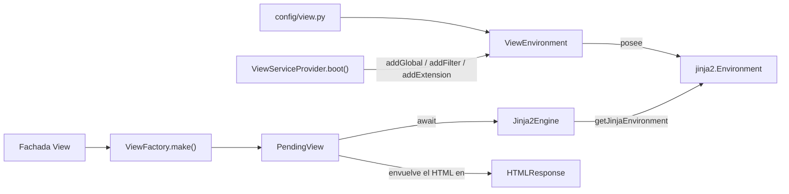

# View (`orionis.view`)

> Capa de renderizado en servidor async-first: un único entorno Jinja2 configurado, un motor de render asíncrono, una respuesta HTML awaitable y encadenable, 29 globales de plantilla, 2 filtros y la etiqueta ``.

> 🇬🇧 English version: [README.md](README.md)

---

## Tabla de contenidos

1. [Descripción funcional](#descripción-funcional)
   - [Dónde encaja](#dónde-encaja)
   - [Flujo de renderizado](#flujo-de-renderizado)
   - [Mapa de archivos](#mapa-de-archivos)
   - [Decisiones de diseño](#decisiones-de-diseño)
2. [Referencia de API](#referencia-de-api)
   - [`ViewEnvironment`](#viewenvironment)
   - [`Jinja2Engine`](#jinja2engine)
   - [`ViewFactory`](#viewfactory)
   - [`PendingView`](#pendingview)
   - [`OrionisBytecodeCache`](#orionisbytecodecache)
   - [`CsrfExtension`](#csrfextension)
   - [Globales de plantilla](#globales-de-plantilla)
   - [`ErrorBag`](#errorbag)
   - [Filtros de plantilla](#filtros-de-plantilla)
   - [Excepciones](#excepciones)
   - [`ViewServiceProvider`](#viewserviceprovider)
   - [Contratos](#contratos)
   - [Configuración que lee el módulo](#configuración-que-lee-el-módulo)
3. [Ejemplos de uso](#ejemplos-de-uso)
4. [Consideraciones de rendimiento y concurrencia](#consideraciones-de-rendimiento-y-concurrencia)
5. [Notas de compatibilidad](#notas-de-compatibilidad)

---

## Descripción funcional

`orionis.view` convierte un nombre de plantilla más un contexto en un
`orionis.http.responses.HTMLResponse`. Posee exactamente un
`jinja2.Environment` por aplicación, construido en el constructor a partir
de `app.config("view")`, y solo lo expone mediante métodos tipados, de
modo que ninguna otra capa del framework toca Jinja2 directamente.

### Dónde encaja

| Módulo relacionado | Relación |
|---|---|
| `orionis.foundation` | `ViewEnvironment` recibe `IApplication`; lee `app.config("view")` y `app.basePath`. Entidad de configuración: `orionis.foundation.config.view.entities.view.View`. |
| `orionis.http` | `PendingView` construye `HTMLResponse`; `ResponseFactory.view()` (`orionis/http/factory.py`) delega en la fachada `View`. |
| `orionis.session` | `PendingView` escribe datos flash con los helpers de `orionis.session.flash`; los globales `old`, `flash`, `errors` y `session` leen `ISession`. |
| `orionis.localization` | Los globales `trans`/`__`, `choice`, `locale` y `locales` llaman a la fachada `Lang`. |
| `orionis.storage` | Los globales `asset`/`secure_asset` resuelven `IStorageManager` y llaman a `disk(...).file(...).url()`. |
| `orionis.cache`, `orionis.encrypter` | Los globales `cache`, `encrypt` y `decrypt` resuelven `ICacheManager` / `IEncrypter`. |
| `orionis.container` | `ViewServiceProvider` extiende `ServiceProvider`; la fachada `View` (`orionis.support.facades.view.View`) resuelve `IViewFactory`. |

### Flujo de renderizado



### Mapa de archivos

| Símbolo | Archivo | Propósito |
|---|---|---|
| `ViewEnvironment` | [environment.py](../environment.py) | Construye y posee el único `jinja2.Environment`. |
| `Jinja2Engine` | [engine.py](../engine.py) | Render asíncrono con `render_async`; normalización de rutas en notación de puntos. |
| `ViewFactory` | [factory.py](../factory.py) | Punto de entrada para controladores; devuelve un `PendingView`. |
| `PendingView` | [pending.py](../pending.py) | Intención de render awaitable y encadenable. |
| `OrionisBytecodeCache` | [cache.py](../cache.py) | Subclase de `FileSystemBytecodeCache` con nombres de caché legibles. |
| `ViewException` y subclases | [exceptions.py](../exceptions.py) | Jerarquía de excepciones del módulo. |
| `ViewServiceProvider` | [provider.py](../provider.py) | Bindings del contenedor, cableado de globales/filtros/extensiones y pin de la fachada. |
| Constructores `_global_*` | [globals/](../globals/) | Un módulo por categoría de global; reexportados por `globals/__init__.py`. |
| `_filter_json`, `_filter_markdown` | [filters/](../filters/) | Filtros de plantilla integrados. |
| `CsrfExtension` | [extensions/csrf.py](../extensions/csrf.py) | Etiqueta de sentencia ``. |
| `IViewEngine`, `IViewEnvironment`, `IViewFactory` | [contracts/](../contracts/) | Contratos `abc.ABC` con `__slots__ = ()`. |

`orionis/view/__init__.py` está vacío: cada símbolo se importa desde su
propio módulo (por ejemplo `from orionis.view.factory import ViewFactory`).

### Decisiones de diseño

- **Propiedad única del entorno.** `ViewEnvironment` es la única clase que
  guarda un `jinja2.Environment`; las mutaciones pasan por
  `addGlobal`/`addFilter`/`addTest`/`addExtension`. Los consumidores solo
  obtienen el objeto crudo mediante `getJinjaEnvironment()`.
- **`__slots__` en todas partes.** `ViewEnvironment`, `Jinja2Engine`,
  `ViewFactory`, `PendingView` y `ErrorBag` declaran `__slots__`, y los
  tres contratos declaran `__slots__ = ()`, de modo que las
  implementaciones no arrastran `__dict__`.
- **Render diferido.** `ViewFactory.make()` no hace E/S; devuelve un
  `PendingView` cuyo `__await__` dispara el render. Eso es lo que permite
  encadenar `response.view("auth.login").withErrors(...)`.
- **Proxy por `__getattr__`.** `PendingView` acepta cualquier atributo
  invocable que exista en `HTMLResponse`, registra la llamada y la
  reproduce sobre la respuesta real después de renderizar.
- **Globales construidos con clausuras.** Cada global lo produce un
  constructor `_global_*` que captura `IApplication` una sola vez en el
  boot, así no hace falta resolver el contenedor en cada render para
  alcanzar la instancia de la aplicación.
- **Globales async con sintaxis natural.** En un entorno con
  `enable_async=True`, el generador de código de Jinja2 envuelve toda
  llamada con `auto_await`, por lo que `{{ csrf_token() }}` o
  `{{ errors.first('email') }}` funcionan sin `await` explícito en la
  plantilla.

---

## Referencia de API

### `ViewEnvironment`

`orionis.view.environment.ViewEnvironment` — implementa `IViewEnvironment`.
`__slots__ = ("_jinja_env",)`.

```python
ViewEnvironment(app: IApplication) -> None
```

Lee `app.config("view")`. Si el valor devuelto es un `dict`, se convierte
con `View(**raw)`; en caso contrario se usa tal cual. Después:

- Un `jinja2.FileSystemLoader` por cada entrada de `config.paths`. Las
  rutas relativas se resuelven contra `app.basePath`; las absolutas se
  usan sin tocar. Si hay más de un loader se envuelven en un
  `jinja2.ChoiceLoader`; con uno solo se usa directamente.
- Cuando `config.cache_path` no es `None`, el directorio se crea con
  `mkdir(parents=True, exist_ok=True)` (rutas relativas resueltas contra
  `app.basePath`) y se adjunta un `OrionisBytecodeCache`.
- El entorno se construye con `enable_async=True`,
  `autoescape=config.autoescape`, `auto_reload=config.auto_reload`,
  `cache_size=config.cache_size`, `bytecode_cache=<caché o None>`,
  `undefined=jinja2.Undefined` y `keep_trailing_newline=True`.

**Efectos secundarios:** crea en disco el directorio de la caché de
bytecode cuando `cache_path` está configurado.

| Método | Firma | Devuelve / lanza |
|---|---|---|
| `addGlobal` | `addGlobal(self, name: str, value: Any) -> None` | Escribe `jinja2.Environment.globals[name]`. |
| `addFilter` | `addFilter(self, name: str, callback: Callable) -> None` | Escribe `jinja2.Environment.filters[name]`. |
| `addTest` | `addTest(self, name: str, callback: Callable) -> None` | Escribe `jinja2.Environment.tests[name]`. El framework no registra ningún test integrado. |
| `addExtension` | `addExtension(self, extension: Any) -> None` | Llama a `Environment.add_extension`. Cualquier excepción se envuelve en `ViewException` conservando la original como `__cause__`. |
| `getJinjaEnvironment` | `getJinjaEnvironment(self) -> jinja2.Environment` | Devuelve la instancia interna del entorno. |

> ℹ️ El render asíncrono **no es configurable**. `Jinja2Engine.render`
> solo llama a `render_async` y el generador de código async espera
> (`await`) todos los globales, así que `enable_async=True` está fijado en
> el código y la entidad de configuración `View` no expone ningún campo
> para ello.

### `Jinja2Engine`

`orionis.view.engine.Jinja2Engine` — implementa `IViewEngine`.
`__slots__ = ("_environment", "_jinja")`.

```python
Jinja2Engine(environment: IViewEnvironment) -> None
```

Guarda el entorno y cachea `environment.getJinjaEnvironment()` en el slot
`_jinja`. El objeto del entorno se muta in situ durante el boot, así que
la referencia cacheada sigue siendo válida durante toda la vida de la
aplicación.

```python
async def render(self, template: str, context: dict[str, Any]) -> str
```

| Parámetro | Tipo | Descripción |
|---|---|---|
| `template` | `str` | Identificador en notación de puntos o ruta relativa directa. |
| `context` | `dict[str, Any]` | Variables expuestas dentro de la plantilla. |

**Devuelve:** `str` — el HTML renderizado.

**Lanza:**

- `ViewTemplateNotFoundException` — el loader no encontró el archivo
  (envuelve `jinja2.TemplateNotFound`).
- `ViewRenderException` — Jinja2 lanzó un `jinja2.TemplateError` durante
  el renderizado.

El render siempre usa `Template.render_async(**context)`; el `render()`
síncrono de Jinja2 nunca se invoca.

```python
@staticmethod
def _normalisePath(template: str) -> str
```

Privado, pero relevante para entender el contrato público. Reglas, en
orden:

1. Si el identificador ya contiene `/`, se conserva tal cual.
2. En caso contrario, cada `.` se convierte en `/`.
3. Si el último segmento no tiene extensión, se añade `.html`.

Los resultados se memoizan en el diccionario de nivel de módulo
`_PATH_CACHE` (`dict[str, str]`, sin límite de tamaño ni desalojo). La
extensión por defecto vive en `_DEFAULT_EXT = ".html"`.

Ejemplos de la transformación: `"users.index"` → `"users/index.html"`,
`"partials/nav.html"` → `"partials/nav.html"`, `"mail.welcome.txt"` →
`"mail/welcome.txt"`.

### `ViewFactory`

`orionis.view.factory.ViewFactory` — implementa `IViewFactory`.
`__slots__ = ("_engine",)`.

```python
ViewFactory(engine: IViewEngine) -> None

def make(self, template: str, **context: Any) -> PendingView
```

`make()` **no** es una corrutina y no hace E/S: solo devuelve
`PendingView(self._engine, template, context)`. Las excepciones
`ViewTemplateNotFoundException` y `ViewRenderException` que figuran en su
docstring aparecen al hacer `await` sobre el `PendingView` devuelto.

### `PendingView`

`orionis.view.pending.PendingView`.
`__slots__ = ("_context", "_engine", "_flash", "_mutations", "_template")`.

```python
PendingView(engine: IViewEngine, template: str, context: dict[str, Any]) -> None
```

| Método | Firma | Descripción |
|---|---|---|
| `withFlash` | `withFlash(self, key: str, value: Any = None) -> PendingView` | Encola una entrada flash. Devuelve `self`. |
| `withInput` | `withInput(self, values: Mapping[str, Any]) -> PendingView` | Encola el payload enviado bajo la clave reservada `OLD_INPUT_KEY`, después de que `filter_input(values)` descarte los campos tipo credencial. Devuelve `self`. |
| `withErrors` | `withErrors(self, errors: Mapping[str, Any] \| Exception) -> PendingView` | Encola `normalize_errors(errors)` bajo la clave reservada `ERRORS_KEY`. Acepta un mapping o una excepción de validación. Devuelve `self`. |
| `__getattr__` | `__getattr__(self, name: str) -> Callable[..., PendingView]` | Devuelve un registrador para cualquier atributo **invocable** de `HTMLResponse`. Lanza `AttributeError` en caso contrario. |
| `__await__` | `__await__(self) -> Generator[Any, None, HTMLResponse]` | Delega en `render().__await__()`. |
| `render` | `async render(self) -> HTMLResponse` | Ejecuta el render (ver abajo). |

Secuencia de `render()`:

1. Si hay datos flash encolados, se escriben en la sesión mediante el
   privado `__flashToSession()`, que resuelve `await Session.resolve()` y
   llama a `apply_flash(session, self._flash)`. Cualquier excepción al
   resolver la sesión se descarta y la escritura se omite, de modo que las
   rutas sin middleware de sesión siguen funcionando.
2. `await self._engine.render(self._template, self._context)`.
3. El HTML se envuelve en `HTMLResponse(content=..., headers={"X-Orionis-Render": "SSR"})`.
4. `ViewTemplateNotFoundException` se relanza sin cambios. Cualquier otra
   excepción se envuelve en `ViewRenderException` con el mensaje
   `Failed to render view '<template>': <detail>`, donde a `detail` se le
   quita el ruido de qualname de clausuras (`<algo>.<locals>.`) mediante
   la expresión regular de nivel de módulo `_LOCALS_QUALNAME`.
5. Cada mutación registrada se reproduce sobre la respuesta real en orden
   de inserción: `getattr(response, name)(*args, **kwargs)`.

**Efectos secundarios:** escribe en la sesión activa cuando hay datos
flash encolados.

Los valores encolados con `withFlash()` se escriben **antes** de
renderizar, así que la propia vista puede leerlos con el global `flash()`.

### `OrionisBytecodeCache`

`orionis.view.cache.OrionisBytecodeCache` — subclase de
`jinja2.bccache.FileSystemBytecodeCache`.

| Método | Firma | Descripción |
|---|---|---|
| `get_cache_key` | `get_cache_key(self, name: str, filename: str \| None = None) -> str` | Sustituye `/` y `\` por `.`, elimina una extensión final de `_TEMPLATE_EXTENSIONS` (`.html`, `.htm`, `.jinja`, `.jinja2`, `.j2`) y añade `.` más los primeros `_DIGEST_LENGTH` (8) caracteres del digest SHA-1 del nombre sin tocar. `filename` se ignora. |
| `_get_cache_filename` | `_get_cache_filename(self, bucket: Bucket) -> str` | Devuelve `str(Path(self.directory) / f"{bucket.key}.cache")`. |

Resultado: `users/index.html` se cachea como
`<cache_dir>/users.index.aa344d9c.cache` en lugar del nombre totalmente
hasheado que usa Jinja2 por defecto.

Aplanar los separadores y quitar la extensión es una transformación con
pérdida, así que el digest es lo que mantiene la correspondencia
inyectiva: `mail/welcome.html` y `mail/welcome.j2` (o `users/index.html`
y `users.index.html`) comparten el tramo legible pero nunca el archivo de
caché. Sin él, ambas plantillas se sobrescribirían mutuamente la entrada
y la caché de bytecode dejaría de servir para ellas de forma silenciosa.

### `CsrfExtension`

`orionis.view.extensions.csrf.CsrfExtension` — subclase de
`jinja2.ext.Extension`. `tags: ClassVar[set[str]] = {"csrf"}`.

| Miembro | Firma | Descripción |
|---|---|---|
| `parse` | `parse(self, parser: Parser) -> nodes.Output` | Consume el token de la etiqueta y emite `nodes.Output([self.call_method("_renderField", lineno=lineno)], lineno=lineno)`. |
| `_renderField` | `async _renderField(self) -> Markup` | Lee el global `csrf_field` de `self.environment.globals`, lo espera si es awaitable y devuelve `escape(field)`. Lanza `ViewRenderException` si el global no está registrado. |

Por tanto `` es un atajo sin argumentos de
`{{ csrf_field() }}`. `_renderField` puede ser corrutina porque el
entorno async envuelve el `nodes.Call` generado con `auto_await`.

### Globales de plantilla

`ViewServiceProvider.boot()` registra **29 nombres** producidos por 28
funciones constructoras `_global_*` (`trans` y su alias `__` comparten el
mismo objeto). Cada fila muestra la firma del invocable que realmente
queda almacenado en `Environment.globals`.

| Global | Firma del invocable | Corrutina | Comportamiento |
|---|---|---|---|
| `app` | `application() -> IApplication` | no | Devuelve el contenedor de aplicación capturado. |
| `asset` | `asset(path: str, disk: str \| None = None) -> str` | sí | `await storage.disk(disk or "public").file(path).url()`. Propaga `UnsupportedStorageOperationException` si el disco no expone URLs públicas. |
| `secure_asset` | `secure_asset(path: str, disk: str \| None = None) -> str` | sí | Igual que `asset` y luego reescribe el esquema a HTTPS. |
| `cache` | `cache(key: str, default: Any \| None = None) -> Any` | sí | `await ICacheManager.get(key)`; devuelve `default` si el valor es `None`. |
| `choice` | `choice(key: str, count: int, locale: str \| None = None, **replace: Any) -> str` | no | `Lang.choice(...)`. |
| `collect` | `collect(value: Any = None) -> Collection` | no | `None` → `Collection` vacía; una `Collection` se devuelve sin tocar; una `list` se envuelve directamente; `str`/`bytes` y los no iterables pasan a ser colección de un elemento; cualquier otro iterable se expande con `list(value)`. |
| `config` | `config(key: str, default: Any = None) -> Any` | no | `app.config(key)`, con `default` cuando el resultado es `None`. |
| `csrf_field` | `csrf_field() -> Markup` | sí | `<input type="hidden" name="_csrf" value="{token}">` construido con `Markup.format`, así el token queda escapado y el campo no necesita `\| safe`. |
| `csrf_token` | `csrf_token() -> str` | sí | Lee la clave de sesión resuelta una vez en el boot desde `http.csrf.session_key` (por defecto `_csrf_token`). Devuelve `""` si no existe. |
| `decrypt` | `decrypt(payload: str) -> str` | sí | `IEncrypter.decrypt(payload)`. |
| `dump` | `dump(*args: Any) -> Markup` | no | `VarDumper().values(*args)` renderizado con `toHtml(insert_line=True)`. |
| `encrypt` | `encrypt(plaintext: str) -> str` | sí | `IEncrypter.encrypt(plaintext)`. |
| `errors` | Instancia de `ErrorBag` | n/a | Ver [`ErrorBag`](#errorbag). |
| `flash` | `flash(key: str, default: Any = None) -> Any` | sí | `session.getFlash(key, default)`; devuelve `default` si no hay sesión alcanzable. |
| `framework_version` | `framework_version() -> str` | no | `orionis.metadata.VERSION`, importado de forma perezosa dentro de la llamada. |
| `locale` | `locale() -> str` | no | `Lang.getLocale()`. |
| `locales` | `locales() -> tuple[str, ...]` | no | `Lang.availableLocales()`. |
| `now` | `now() -> pendulum.DateTime` | no | `DateTime.now()`. |
| `old` | `old(key: str, default: Any = None) -> Any` | sí | `session.getOldInput(key, default)`; `None` se convierte en `""`. Lee únicamente la bolsa `_old_input`. |
| `python_version` | `python_version() -> str` | no | `f"{major}.{minor}.{micro}"` a partir de `sys.version_info`. |
| `request` | `request() -> IRequest \| None` | sí | `await app.make(IRequest)`, o `None` si no hay petición en alcance. |
| `route` | `route(name: str, **params: Any) -> str` | sí | Ver abajo. Lanza `ViewRouteException`. |
| `secure_url` | `secure_url(path: str = "/", **query: Any) -> str` | sí | Como `url` y luego fuerza el esquema HTTPS. |
| `session` | `session() -> ISession \| None` | sí | `await app.make(ISession)`, o `None` si no está disponible. |
| `stringable` | `stringable(value: Any = "") -> Stringable` | no | Devuelve el valor sin tocar si ya es un `Stringable`. |
| `today` | `today() -> pendulum.Date` | no | `DateTime.today()`. |
| `trans` / `__` | `trans(key: str, locale: str \| None = None, **replace: Any) -> str` | no | `Lang.get(...)`. Ambos nombres apuntan al mismo objeto función. |
| `url` | `url(path: str = "/", **query: Any) -> str` | sí | Ver abajo. |

**Semántica de `url` / `secure_url`** (`globals/url.py`): una ruta que
empieza por `http://`, `https://` o `//` se considera absoluta y no se
prefija. En caso contrario se antepone la URL base de la petición actual
(`request.baseUrl.rstrip("/")`, o `""` si no hay petición en alcance) y la
ruta se normaliza a `"/" + path.lstrip("/")` (`"/"` cuando la ruta está
vacía). `**query` se codifica con `urlencode(query, doseq=True)` y se
añade con `?` o `&` según si el destino ya contiene `?`.
`secure_url`/`secure_asset` reescriben un `http://` o `//` inicial a
`https://` y dejan intactas las rutas relativas.

**Semántica de `route`** (`globals/route.py`): el mapa nombre → ruta se
construye de forma perezosa en el primer uso mediante
`await app.build(RouteLoader)` y `loader.load()`, y queda guardado en la
clausura (un flag `loaded` lo protege). Se recorren tanto el bucket
estático como el dinámico y gana la primera aparición de cada nombre
(`setdefault`). Los marcadores `{name}` y `{name:type}` se sustituyen con
`quote(str(value), safe="")`; los argumentos sobrantes forman la cadena de
consulta. Un marcador sin valor o un nombre de ruta desconocido lanzan
`ViewRouteException`. Los planes de interpolación se memoizan en el
diccionario de nivel de módulo `_ROUTE_PLAN_CACHE`.

Los globales que llegan a la sesión (`old`, `flash`, `errors`, `session`)
y el global `request` descartan cualquier excepción al resolver el
servicio y devuelven un valor neutro, de modo que una plantilla nunca
falla por la ausencia de alcance de petición.

### `ErrorBag`

`orionis.view.globals.errors.ErrorBag` — el objeto registrado como global
`errors`. `__slots__ = ("_app",)`.

```python
ErrorBag(app: IApplication) -> None
```

| Método | Firma | Descripción |
|---|---|---|
| `all` | `async all(self) -> dict[str, list[str]]` | Todos los mensajes agrupados por campo. |
| `any` | `async any(self) -> bool` | `True` cuando la bolsa contiene al menos un mensaje. |
| `has` | `async has(self, field: str) -> bool` | `True` cuando *field* tiene al menos un mensaje. |
| `get` | `async get(self, field: str) -> list[str]` | Mensajes de *field*, `[]` si es válido. |
| `first` | `async first(self, field: str \| None = None) -> str` | Primer mensaje de *field*, o el primero de toda la bolsa si se omite *field*. `""` si no hay ninguno. |

Todos los métodos resuelven `ISession` y llaman a `session.getErrors()`;
si la sesión no se puede resolver, se devuelve un mapping vacío. Todos son
corrutinas y el entorno async las espera de forma transparente, así que
las plantillas usan sintaxis natural:
`{{ errors.first('email') }}`.

### Filtros de plantilla

| Filtro | Firma del invocable | Descripción |
|---|---|---|
| `json` | `jsonify(value: Any, indent: int \| None = None) -> str` | `msgspec.json.encode`, opcionalmente reformateado con `msgspec.json.format(..., indent=indent)`. Ante `TypeError`, `ValueError` o `msgspec.EncodeError` devuelve `str(value)` en lugar de lanzar. |
| `markdown` | `render_markdown(value: Any) -> str` | `markdown.markdown(str(value), extensions=["extra", "codehilite", "toc"])`. |

El filtro `markdown` devuelve un `str` plano, así que con
`autoescape=True` hay que pasar el resultado por `| safe` para que se
renderice como HTML.

### Excepciones

`orionis/view/exceptions.py`:

```text
Exception
└── ViewException
    ├── ViewRenderException
    ├── ViewTemplateNotFoundException
    └── ViewRouteException
```

| Excepción | La lanza | Condición |
|---|---|---|
| `ViewException` | `ViewEnvironment.addExtension` | Jinja2 rechazó la extensión. También es la clase base para capturar toda la jerarquía. |
| `ViewRenderException` | `Jinja2Engine.render`, `PendingView.render`, `CsrfExtension._renderField` | `TemplateError` de Jinja2, cualquier fallo distinto de `ViewTemplateNotFoundException` durante `PendingView.render`, o ausencia del global `csrf_field`. |
| `ViewTemplateNotFoundException` | `Jinja2Engine.render` | El loader no localizó la plantilla; `PendingView.render` la relanza sin cambios. |
| `ViewRouteException` | El global `route` | Nombre de ruta desconocido, o marcador de ruta sin valor. |

Todas las excepciones lanzadas a partir de un error capturado conservan el
original como `__cause__` (`raise ... from exc`).

### `ViewServiceProvider`

`orionis.view.provider.ViewServiceProvider` — subclase de
`orionis.container.providers.service_provider.ServiceProvider`.

```python
def register(self) -> None
```

Vincula tres singletons: `IViewEnvironment` → `ViewEnvironment`,
`IViewEngine` → `Jinja2Engine`, `IViewFactory` → `ViewFactory`.

```python
async def boot(self) -> None
```

1. Resuelve el singleton compartido `IViewEnvironment`.
2. Construye los 27 globales, añade `trans` más su alias `__` (el mismo
   objeto) y registra los 29 con `addGlobal`.
3. Registra los filtros `json` y `markdown` con `addFilter`.
4. Registra `CsrfExtension` con `addExtension`.
5. `await ViewFacade.pin()`, de modo que `View.make(...)` pase a ser
   acceso directo sin resolución del contenedor en cada llamada.

### Contratos

Los tres viven en `orionis/view/contracts/` y son clases `abc.ABC` con
`__slots__ = ()`.

| Contrato | Miembros abstractos |
|---|---|
| `IViewEngine` | `async render(self, template: str, context: dict[str, Any]) -> str` |
| `IViewEnvironment` | `addGlobal(name, value)`, `addFilter(name, callback)`, `addTest(name, callback)`, `addExtension(extension)`, `getJinjaEnvironment()` |
| `IViewFactory` | `make(self, template: str, **context: Any) -> PendingView` |

`orionis/view/contracts/__init__.py` está vacío; cada contrato se importa
desde su propio módulo.

### Configuración que lee el módulo

Entidad: `orionis.foundation.config.view.entities.view.View` (dataclass
`frozen` y `kw_only`). El bootstrap a nivel de aplicación es
`config/view.py` (`BootstrapView`).

| Campo | Tipo | Valor por defecto de la entidad | ¿Lo lee `ViewEnvironment`? |
|---|---|---|---|
| `paths` | `list` | `["resources/views"]` | Sí — un `FileSystemLoader` por entrada. |
| `cache_size` | `int` | `400` | Sí — `cache_size` del entorno (`0` lo desactiva). |
| `cache_path` | `str \| None` | `None` | Sí — activa `OrionisBytecodeCache` y crea el directorio. |
| `auto_reload` | `bool` | `True` | Sí. |
| `autoescape` | `bool` | `True` | Sí. |

El render asíncrono no forma parte de la configuración: el entorno
siempre se construye con `enable_async=True` (ver `ViewEnvironment`).

La entidad valida sus propios campos en `__post_init__` y lanza
`TypeError` o `ValueError` (`paths` vacío, `cache_size` negativo, tipos
incorrectos) antes de que `ViewEnvironment` los vea.

---

## Ejemplos de uso

### 1. Caso más común — renderizar desde un controlador

```python
from orionis.http import HttpResponse, response
from orionis.http.base import BaseController

class UserController(BaseController):

    async def index(self) -> HttpResponse:
        """
        Render the user list.

        Returns
        -------
        HttpResponse
            Rendered HTML response.
        """
        users = [{"id": 1, "name": "Ada"}, {"id": 2, "name": "Alan"}]
        return await response.view("users.index", users=users, title="Users")
```

El equivalente a través de la fachada:

```python
from orionis.support.facades.view import View

async def render_users() -> object:
    """
    Render the user list through the View facade.

    Returns
    -------
    object
        The resulting HTMLResponse.
    """
    return await View.make("users.index", users=[], title="Users")
```

Plantilla correspondiente (`resources/views/users/index.html`):

```html
<h1>{{ title }}</h1>
<p class="error">{{ errors.first() }}</p>
<ul>

  <li><a href="{{ url('/users/' ~ user.id) }}">{{ user.name }}</a></li>

</ul>
<form method="post" action="{{ url('/users') }}">
  
  <input name="name" value="{{ old('name') }}">
  <button type="submit">{{ __('Create') }}</button>
</form>
```

### 2. Manejo de errores

```python
from orionis.support.facades.view import View
from orionis.view.exceptions import (
    ViewRenderException,
    ViewTemplateNotFoundException,
)

async def safe_render(template: str) -> str:
    """
    Render a template and degrade gracefully on failure.

    Parameters
    ----------
    template : str
        Template identifier in dot notation.

    Returns
    -------
    str
        The rendered body, or a fallback message.
    """
    try:
        rendered = await View.make(template)
    except ViewTemplateNotFoundException:
        return "<p>The page does not exist.</p>"
    except ViewRenderException as exc:
        return f"<p>The page could not be rendered: {exc}</p>"

    return (rendered.getBody() or b"").decode()
```

Capturando toda la jerarquía de una vez (incluye `ViewRouteException`,
que lanza el global `route()`, y `ViewException`, que lanza
`addExtension`):

```python
from orionis.support.facades.view import View
from orionis.view.exceptions import ViewException

async def render_or_none(template: str) -> object | None:
    """
    Render a template, returning None on any view-subsystem failure.

    Parameters
    ----------
    template : str
        Template identifier in dot notation.

    Returns
    -------
    object | None
        The HTMLResponse, or None when the view subsystem failed.
    """
    try:
        return await View.make(template)
    except ViewException:
        return None
```

### 3. Integración — mutadores encadenados, flash y errores de validación

```python
from typing import Any
from orionis.http import HttpResponse, response
from orionis.http.base import BaseController
from orionis.http.request import Request

class ContactController(BaseController):

    async def store(self, request: Request) -> HttpResponse:
        """
        Re-render the contact form with errors and previous input.

        Parameters
        ----------
        request : Request
            Incoming HTTP request carrying the submitted payload.

        Returns
        -------
        HttpResponse
            Rendered HTML response with flash data applied.
        """
        payload: dict[str, Any] = await request.data()

        return await (
            response.view("contact.form")
                .withInput(payload)
                .withErrors({"email": "The email address is not valid."})
                .withFlash("warning", "Please review the form.")
                .withCookie("last_form", "contact", max_age=600)
        )
```

`withCookie` no está definido en `PendingView`: lo acepta `__getattr__`
porque `HTMLResponse.withCookie` existe y es invocable, y se reproduce
sobre la respuesta una vez renderizada la plantilla.

### 4. Integración — extender el entorno desde un provider propio

```python
from orionis.container.providers.service_provider import ServiceProvider
from orionis.view.contracts.environment import IViewEnvironment

def _upper_snake(value: object) -> str:
    """
    Convert a value to UPPER_SNAKE_CASE.

    Parameters
    ----------
    value : object
        Value converted with ``str()`` before transformation.

    Returns
    -------
    str
        Upper-cased text with spaces replaced by underscores.
    """
    return str(value).upper().replace(" ", "_")

class ViewMacrosProvider(ServiceProvider):

    async def boot(self) -> None:
        """
        Register an extra filter and test in the shared environment.

        Returns
        -------
        None
        """
        env: IViewEnvironment = await self.app.make(IViewEnvironment)

        env.addFilter("upper_snake", _upper_snake)
        env.addTest("empty", lambda value: not value)
```

Registra el provider después de `ViewServiceProvider` para que el
singleton del entorno ya exista.

### 5. Renderizar sin el contenedor (cableado directo)

```python
import asyncio
from bootstrap.app import app
from orionis.view.engine import Jinja2Engine
from orionis.view.environment import ViewEnvironment
from orionis.view.factory import ViewFactory

async def main() -> None:
    """
    Render a template using the view stack built by hand.

    Returns
    -------
    None
    """
    environment = ViewEnvironment(app)
    engine = Jinja2Engine(environment)
    factory = ViewFactory(engine)

    rendered = await factory.make("users.index", users=[], title="Users")
    print((rendered.getBody() or b"").decode())

asyncio.run(main())
```

Construir la pila así se salta `ViewServiceProvider.boot()`, por lo que no
se registra ningún global, filtro ni extensión: una plantilla que use
``, `url()` o `errors` falla. Llama a
`await ViewServiceProvider(app).boot()` (o ejecuta el arranque normal de
la aplicación) cuando la plantilla dependa de ellos.

---

## Consideraciones de rendimiento y concurrencia

- **Asíncrono por construcción.** `enable_async=True` siempre está
  activado y `Jinja2Engine.render` solo llama a `render_async`, así que el
  renderizado nunca bloquea el bucle de eventos por el lado de Jinja2. Las
  lecturas de archivos que hace `FileSystemLoader` son síncronas, igual
  que en Jinja2 mismo.
- **Un entorno por aplicación.** `ViewEnvironment` es un singleton del
  contenedor; `Jinja2Engine` cachea `getJinjaEnvironment()` en un slot al
  construirse, así que no hay búsquedas por render.
- **Memoización de rutas.** `Jinja2Engine._PATH_CACHE` y el
  `_ROUTE_PLAN_CACHE` de `route` son diccionarios de nivel de módulo sin
  límite. Están indexados por nombre de plantilla y por plantilla de ruta
  respectivamente — conjuntos finitos y estables para una aplicación dada.
- **Caché de plantillas compiladas.** `cache_size` controla el LRU en
  memoria de plantillas compiladas de Jinja2 (`0` lo desactiva).
  `cache_path` añade una caché de bytecode en disco, evitando recompilar
  entre reinicios del proceso. `auto_reload=True` vuelve a leer las
  plantillas cuyo archivo cambió, lo que cuesta un `stat` por render y
  normalmente se desactiva en producción.
- **Resolución en el boot.** Los globales capturan `IApplication` en una
  clausura durante el boot, y `csrf_token` resuelve
  `http.csrf.session_key` una sola vez. La fachada se fija (pin) al final
  de `boot()`, así que `View.make(...)` es una llamada directa y no un
  despacho async del contenedor.
- **Mapa de rutas perezoso.** El global `route()` carga el mapa de rutas
  con nombre una sola vez, en el primer uso, y lo guarda en su clausura.
  Con `app.compiled = True` el loader lee la caché de rutas de disco, así
  que una ruta ausente de esa caché no es visible para `route()`.
- **Render diferido.** `ViewFactory.make()` solo asigna un `PendingView`
  (cinco slots), y `_mutations`/`_flash` permanecen en `None` hasta que
  realmente se encadena algo.
- **`__slots__`.** Todas las clases con estado del módulo y los tres
  contratos declaran `__slots__`, así que las instancias no arrastran
  `__dict__`.
- **Seguridad entre hilos.** Las cachés de nivel de módulo
  (`_PATH_CACHE`, `_ROUTE_PLAN_CACHE`) prescinden de locks a propósito:
  cada entrada es una función pura de su clave, así que un escritor
  concurrente solo puede guardar el valor que otro hilo habría calculado,
  y las escrituras de `dict` en CPython son atómicas. El
  `jinja2.Environment` compartido solo se muta en
  `ViewServiceProvider.boot()` — registrar globales, filtros o extensiones
  después del boot, desde una petición o un hilo de trabajo, **no** está
  soportado. El render en sí es seguro: el LRU de plantillas compiladas de
  Jinja2 tiene su propio lock interno.

---

## Notas de compatibilidad

- **Python:** `>= 3.14` (`requires-python` en `pyproject.toml`). El módulo
  usa uniones PEP 604 (`str | None`) y tipos unión como argumento de
  `isinstance` (`isinstance(value, str | bytes)` en
  `globals/collection.py`).
- **Sin instalación adicional.** Todas las dependencias de este módulo ya
  son dependencias base de `orionis`: `jinja2~=3.1` (que arrastra
  `markupsafe`), `markdown~=3.7`, `msgspec>=0.21.1`, `pendulum~=3.2`. Con
  `pip install orionis` es suficiente.
- **`from __future__ import annotations`:** se usa en `cache.py`,
  `exceptions.py`, `pending.py`, los contratos y todos los módulos de
  implementación de `globals/`, `filters/` y `extensions/` (sus
  `__init__.py` de reexportación no llevan imports propios). Está
  deliberadamente **ausente** en `environment.py`, `engine.py`,
  `factory.py` y `provider.py`, porque el contenedor resuelve por
  reflexión las dependencias de sus constructores y las anotaciones en
  forma de cadena romperían esa resolución.
- **Marca de renderizado.** Toda respuesta producida por `PendingView`
  lleva la cabecera `X-Orionis-Render: SSR`.
- **Autoescapado.** Lo gobierna `autoescape` en `config/view.py`. Los
  valores `Markup` que devuelven `csrf_field`, `dump` y `` están
  exentos; el filtro `markdown` devuelve un `str` plano y necesita
  `| safe`.
- **Variables indefinidas.** `undefined=jinja2.Undefined` — una variable
  desconocida se renderiza como cadena vacía en vez de lanzar, pero
  invocar un atributo sobre ella provoca un error de Jinja2 que aflora
  como `ViewRenderException`.
- **Salto de línea final.** `keep_trailing_newline=True`, así que el salto
  de línea final del archivo de plantilla se conserva en la salida.
- **Los globales async requieren el entorno async.** El `await`
  transparente de `{{ csrf_token() }}` y `{{ errors.first('email') }}`
  proviene de `auto_await` en la generación de código async de Jinja2.
  Copiar estos globales a un `jinja2.Environment` síncrono renderizaría
  objetos corrutina en lugar de valores.
