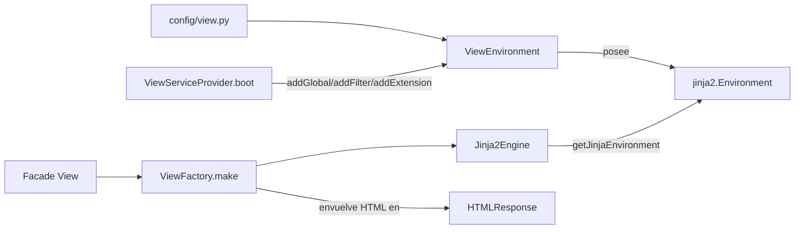

# Orionis View (`orionis.view`)

> Sistema de renderizado de plantillas Jinja2 async-first — configuración del entorno, motor de renderizado, fábrica de respuestas HTML, caché de bytecode, filtros/globals integrados, y el `ViewServiceProvider` que conecta todo en el contenedor de la aplicación.
>
> 🇬🇧 English version: [README.md](README.md)

`orionis.view` es la capa de renderizado del lado del servidor (SSR)
del framework. Envuelve [Jinja2](https://jinja.palletsprojects.com/)
detrás de una API pequeña y tipada para que los controladores nunca
toquen Jinja2 directamente: llaman a `View.make("users.index",
users=users)` (vía la facade `View` o el contrato `IViewFactory`) y
reciben un `HTMLResponse` listo para devolver. Todo — rutas de
descubrimiento de plantillas, caché de bytecode, autoescape,
filtros/globals/extensiones personalizados, y manejo de errores — se
configura una sola vez, al arrancar la aplicación, a través de
`config/view.py` y el `ViewServiceProvider`.

---

## Tabla de contenidos

1. [Requisitos](#requisitos)
2. [Descripción funcional del módulo](#descripción-funcional-del-módulo)
3. [Referencia de API](#referencia-de-api)
   - [`ViewEnvironment`](#viewenvironment-orionisviewenvironmentviewenvironment)
   - [`Jinja2Engine`](#jinja2engine-orionisviewenginejinja2engine)
   - [`ViewFactory`](#viewfactory-orionisviewfactoryviewfactory)
   - [`OrionisBytecodeCache`](#orionisbytecodecache-orionisviewcacheorionisbytecodecache)
   - [`buildViewFilters`, `helpers`, `buildViewExtensions`](#buildviewfilters-helpers-buildviewextensions)
   - [Excepciones](#excepciones)
   - [`ViewServiceProvider`](#viewserviceprovider-orionisviewproviderviewserviceprovider)
   - [Contratos (`IViewEngine`, `IViewEnvironment`, `IViewFactory`)](#contratos-iviewengine-iviewenvironment-iviewfactory)
4. [Ejemplos de uso](#ejemplos-de-uso)
5. [Consideraciones de rendimiento y concurrencia](#consideraciones-de-rendimiento-y-concurrencia)
6. [Notas de diseño](#notas-de-diseño)
7. [Notas de compatibilidad](#notas-de-compatibilidad)

---

## Requisitos

No se necesita instalación adicional además del propio framework —
Jinja2, Markdown y msgspec ya son dependencias centrales de `orionis`:

```bash
pip install orionis
```

- **Python:** 3.14 o superior (el mismo mínimo que el resto del framework).
- **Dependencias** (ya incluidas como deps centrales en `pyproject.toml`):
  `jinja2~=3.1`, `markdown~=3.7`, `msgspec>=0.21.1`.
- Los directorios de plantillas, rutas de caché, autoescape, etc. se
  configuran a través de `config/view.py` (que extiende
  `orionis.foundation.config.view.entities.view.View`) — no se necesita
  ningún paso de instalación separado para usarlos.

## Descripción funcional del módulo

| Tipo | Archivo | Propósito |
|---|---|---|
| `ViewEnvironment` | [environment.py](../environment.py) | Construye y posee la única instancia `Environment` de Jinja2 de la aplicación (loaders, autoescape, caché de bytecode, globals, filtros, tests, extensiones). |
| `Jinja2Engine` | [engine.py](../engine.py) | Renderiza una plantilla con nombre de forma asíncrona vía `Environment.get_template(...).render_async(...)`, convirtiendo nombres en notación de puntos a rutas de archivo. |
| `ViewFactory` | [factory.py](../factory.py) | El punto de entrada de cara al controlador: renderiza una plantilla y envuelve el HTML en un `HTMLResponse`. |
| `OrionisBytecodeCache` | [cache.py](../cache.py) | Una subclase de `jinja2.bccache.FileSystemBytecodeCache` que produce nombres de archivo de caché legibles en lugar de los nombres hasheados por defecto de Jinja2. |
| `buildViewFilters` | [filters.py](../filters.py) | Devuelve el mapeo de filtros integrados (`json`, `markdown`) registrado en el arranque. |
| Constructores `_global_*` | [helpers/](../helpers/) | Un módulo por categoría de global (`app`, `asset`, `bcrypt`, `cache`, `config`, `csrf`, `datetime`, `dump`, `lang`, `request`, `route`, `session`, `url`, `version`), cada uno exportando constructores `_global_<nombre>` reexportados por `helpers/__init__.py` y conectados por el provider. |
| `buildViewExtensions` | [extensions.py](../extensions.py) | Devuelve la lista de clases de extensión de Jinja2 a registrar (vacía por defecto; se extiende esta lista para añadir extensiones personalizadas). |
| `ViewException`, `ViewRenderException`, `ViewTemplateNotFoundException` | [exceptions.py](../exceptions.py) | La jerarquía de excepciones del sistema de vistas. |
| `ViewServiceProvider` | [provider.py](../provider.py) | Registra `IViewEnvironment`/`IViewEngine`/`IViewFactory` como singletons, conecta globals/filtros/extensiones en el arranque, y fija (pin) la facade `View`. |
| `IViewEngine`, `IViewEnvironment`, `IViewFactory` | [contracts/](../contracts/) | Contratos `abc.ABC` satisfechos por `Jinja2Engine`, `ViewEnvironment` y `ViewFactory` respectivamente. |

Flujo de renderizado:



---

## Referencia de API

### `ViewEnvironment` (`orionis.view.environment.ViewEnvironment`)

```python
ViewEnvironment(app: IApplication) -> None
```

Implementa `IViewEnvironment`. Se construye una sola vez (típicamente
como singleton del contenedor) a partir de la configuración `view` de
la aplicación (`app.config("view")`, convertida a
`orionis.foundation.config.view.entities.view.View` si se recibe como
`dict` crudo). Es la **única** clase autorizada a tocar directamente el
`Environment` de Jinja2 subyacente.

| Método | Firma | Descripción |
|---|---|---|
| `__init__` | `__init__(app: IApplication) -> None` | Construye el `Environment` de Jinja2: un `jinja2.FileSystemLoader` por cada entrada configurada en `paths` (envueltos en un `jinja2.ChoiceLoader` cuando hay más de uno), un `OrionisBytecodeCache` opcional cuando `cache_path` está establecido (el directorio se crea si falta), y `enable_async=True`, `autoescape`, `auto_reload`, `cache_size` tomados de la configuración. `undefined` se fija en `jinja2.Undefined` y `keep_trailing_newline=True`. |
| `addGlobal` | `addGlobal(name: str, value: Any) -> None` | Registra `value` bajo `name` en `jinja2.Environment.globals`, disponible en todas las plantillas. |
| `addFilter` | `addFilter(name: str, callback: Callable) -> None` | Registra `callback` bajo `name` en `jinja2.Environment.filters`, usable como `{{ value | name }}`. |
| `addTest` | `addTest(name: str, callback: Callable) -> None` | Registra `callback` bajo `name` en `jinja2.Environment.tests`, usable como ``. |
| `addExtension` | `addExtension(extension: Any) -> None` | Registra una subclase `Extension` de Jinja2 (o su ruta de importación) vía `Environment.add_extension`. Lanza `ViewException` si Jinja2 la rechaza. |
| `getJinjaEnvironment` | `getJinjaEnvironment() -> jinja2.Environment` | Devuelve el `jinja2.Environment` subyacente. Tratar el objeto devuelto como de solo lectura fuera de `ViewEnvironment`; toda mutación debe pasar por los métodos tipados anteriores. |

Campos relevantes de configuración `View` leídos desde `config/view.py`
(`orionis.foundation.config.view.entities.view.View`): `paths` (lista de
directorios de plantillas, relativos a la ruta base de la app salvo que
sean absolutos), `cache_size` (límite LRU en memoria de plantillas
compiladas, `0` lo deshabilita), `cache_path` (directorio opcional de
caché de bytecode; `None` deshabilita la caché en disco), `auto_reload`
(recargar plantillas cuando cambia el archivo fuente), `autoescape`
(escape HTML automático), `enable_async` (siempre `True` en Orionis).

### `Jinja2Engine` (`orionis.view.engine.Jinja2Engine`)

```python
Jinja2Engine(environment: IViewEnvironment) -> None
```

Implementa `IViewEngine`. `__slots__ = ("_environment",)`.

| Método | Firma | Descripción |
|---|---|---|
| `render` | `async render(template: str, context: dict[str, Any]) -> str` | Normaliza `template` a una ruta de archivo (ver abajo), la busca vía `Environment.get_template(...)`, y espera `Template.render_async(**context)`. Lanza `ViewTemplateNotFoundException` si no se encuentra el archivo de plantilla, o `ViewRenderException` si Jinja2 lanza cualquier error al renderizar. El `render()` **síncrono** de Jinja2 nunca se llama. |
| `_normalisePath` | `_normalisePath(template: str) -> str` *(staticmethod)* | Convierte un identificador en notación de puntos a una ruta compatible con el loader: si `template` ya contiene `/`, se usa tal cual; si no, cada `.` se reemplaza por `/`. Se añade la extensión `.html` solo cuando el último segmento de la ruta no tiene extensión (p. ej. `"users.index"` → `"users/index.html"`, `"partials/nav.html"` queda sin cambios). |

### `ViewFactory` (`orionis.view.factory.ViewFactory`)

```python
ViewFactory(engine: IViewEngine) -> None
```

Implementa `IViewFactory`. `__slots__ = ("_engine",)`. Esta es la clase
que se espera que usen los controladores (típicamente a través de la
facade `View`).

| Método | Firma | Descripción |
|---|---|---|
| `make` | `async make(template: str, **context: Any) -> HTMLResponse` | Renderiza `template` vía el `IViewEngine.render(template, context)` vinculado y envuelve el HTML resultante en un `orionis.http.response.HTMLResponse` con el encabezado `X-Orionis-Render: SSR`. Propaga `ViewTemplateNotFoundException`/`ViewRenderException` desde el motor. |

### `OrionisBytecodeCache` (`orionis.view.cache.OrionisBytecodeCache`)

```python
OrionisBytecodeCache(directory: str) -> None  # de FileSystemBytecodeCache
```

Una subclase de `jinja2.bccache.FileSystemBytecodeCache` usada
automáticamente por `ViewEnvironment` siempre que `cache_path` esté
configurado.

| Método | Firma | Descripción |
|---|---|---|
| `get_cache_key` | `get_cache_key(name: str, filename: str \| None = None) -> str` | Convierte un nombre de plantilla (p. ej. `"users/index.html"`) en una clave de caché legible reemplazando `/`/`\` por `.` y quitando una extensión final (`.html`, `.htm`, `.jinja`, `.jinja2`, `.j2`) si está presente. |
| `_get_cache_filename` | `_get_cache_filename(bucket: Bucket) -> str` | Devuelve `"<cache_dir>/<bucket.key>.cache"` — una sobrescritura del esquema de nombres hasheados por defecto de Jinja2. |

### `buildViewFilters`, `helpers`, `buildViewExtensions`

Son funciones planas (no clases) invocadas una sola vez por
`ViewServiceProvider.boot()`:

| Función | Firma | Descripción |
|---|---|---|
| `buildViewFilters` | `buildViewFilters() -> dict[str, Callable[..., Any]]` | Devuelve `{"json": <jsonify>, "markdown": <markdown>}`. `json` serializa cualquier valor con `msgspec.json` (opcionalmente con formato legible vía un argumento `indent`), recurriendo a `str(value)` ante `TypeError`/`ValueError`/`msgspec.EncodeError`. `markdown` renderiza una cadena Markdown a HTML vía el paquete `markdown` con las extensiones `extra`, `codehilite` y `toc` habilitadas. |
| `orionis.view.helpers` | `_global_<nombre>(app: IApplication) -> Any` | Cada constructor devuelve el callable registrado como global de plantilla: `app`, `asset`, `secure_asset`, `url`, `secure_url`, `route`, `csrf_token`, `csrf_field`, `config`, `cache`, `encrypt`, `decrypt`, `dd`, `now`, `today`, `request`, `session`, `python_version`, `framework_version`, más los globals de localización `__`/`trans`, `choice`, `locale`, `locales` (respaldados por la facade `Lang`). Los constructores sin dependencia de la aplicación (`dd`, `now`, `today`, versiones, localización) no reciben argumentos. |
| `buildViewExtensions` | `buildViewExtensions() -> list[Any]` | Devuelve la lista ordenada de clases `Extension` de Jinja2 (o rutas de importación) a registrar. Vacía por defecto. |

### Excepciones

Definidas en `orionis/view/exceptions.py`:

| Excepción | Base | Se lanza cuando |
|---|---|---|
| `ViewException` | `Exception` | Clase base de toda la jerarquía de excepciones de vistas; capturar esta para manejar cualquier error relacionado con vistas de forma uniforme. |
| `ViewRenderException` | `ViewException` | Se encontró una plantilla pero Jinja2 lanzó un error al renderizarla (`jinja2.TemplateError`), preservado como `__cause__`. |
| `ViewTemplateNotFoundException` | `ViewException` | No se pudo localizar el archivo de plantilla solicitado en ningún loader configurado (`jinja2.TemplateNotFound`), preservado como `__cause__`. |

### `ViewServiceProvider` (`orionis.view.provider.ViewServiceProvider`)

Extiende `orionis.container.providers.service_provider.ServiceProvider`.

| Método | Firma | Descripción |
|---|---|---|
| `register` | `register(self) -> None` | Vincula `IViewEnvironment → ViewEnvironment`, `IViewEngine → Jinja2Engine`, y `IViewFactory → ViewFactory` como **singletons** en el contenedor de la aplicación. |
| `boot` | `async boot(self) -> None` | Resuelve el singleton `IViewEnvironment`, construye cada global de plantilla a partir de los constructores de `orionis.view.helpers` y lo registra vía `addGlobal`, cada entrada de `buildViewFilters()` vía `addFilter`, y cada extensión de `buildViewExtensions()` vía `addExtension`; finalmente espera `ViewFacade.pin()` para que la facade `View` se resuelva sin más búsquedas en el contenedor. |

### Contratos (`IViewEngine`, `IViewEnvironment`, `IViewFactory`)

Los tres son clases `abc.ABC` con `__slots__ = ()`, definidas bajo
`orionis/view/contracts/`, que reflejan exactamente los métodos
públicos de `Jinja2Engine`, `ViewEnvironment` y `ViewFactory` descritos
arriba (mismas firmas y docstrings, sin implementación). Existen para
que el resto del framework dependa de las interfaces en lugar de las
implementaciones concretas basadas en Jinja2.

---

## Ejemplos de uso

### Renderizar desde un controlador vía la facade `View`

```python
# Dentro de un controlador HTTP, después de que ViewServiceProvider arrancó:
from orionis.support.facades.view import View

async def index(self):
    users = [{"name": "Ada"}, {"name": "Grace"}]
    return await View.make("users.index", users=users)
    # renderiza resources/views/users/index.html
```

### Resolver `IViewFactory` mediante inyección de dependencias

```python
from orionis.view.contracts.factory import IViewFactory

class UsersController:
    def __init__(self, views: IViewFactory) -> None:
        self._views = views

    async def show(self, user_id: int):
        return await self._views.make("users.show", user_id=user_id)
```

### Usar los filtros integrados `json` y `markdown` en una plantilla

```jinja
{# resources/views/users/index.html #}
<h1>Users</h1>
<pre>{{ users | json(indent=2) }}</pre>

{{ "**Welcome** to *Orionis*" | markdown }}
```

### Usar los globals integrados en una plantilla

```jinja
{# config()/app()/python_version()/framework_version() son síncronos;
   request()/session() son async y se esperan automáticamente
   porque el entorno se crea con enable_async=True #}
<p>{{ config("app.name") }}</p>
<p>Ejecutando Python {{ python_version() }} / Orionis {{ framework_version() }}</p>
<p>{{ __("messages.welcome") }}</p>
```

### Manejar excepciones de vistas

```python
from orionis.view.exceptions import (
    ViewException,
    ViewRenderException,
    ViewTemplateNotFoundException,
)
from orionis.support.facades.view import View

async def render_safely(template: str, **context) -> str:
    try:
        response = await View.make(template, **context)
        return response.content
    except ViewTemplateNotFoundException:
        return "404: plantilla no encontrada"
    except ViewRenderException:
        return "500: error al renderizar la plantilla"
    except ViewException:
        return "500: error desconocido de vistas"
```

---

## Consideraciones de rendimiento y concurrencia

- Jinja2 se configura con `enable_async=True` y `Jinja2Engine`
  **siempre** llama a `Template.render_async(...)`; la API síncrona
  `render()` de Jinja2 nunca se usa, así que el renderizado nunca
  bloquea el loop de eventos en el lado de la ejecución de la plantilla.
  Los globals que realizan E/S (`request`, `session`) son a su vez
  `async def` y Jinja2 los espera automáticamente gracias a su modelo de
  ejecución async.
- `cache_size` controla la caché **en memoria** LRU integrada de Jinja2
  para objetos de plantilla compilados (por instancia de `Environment`,
  es decir, por proceso); `cache_path` además habilita
  `OrionisBytecodeCache`, una caché de bytecode **en disco** que
  sobrevive a reinicios del proceso, evitando recompilar plantillas
  entre reinicios/redespliegues de la aplicación. Establecer
  `cache_path` en `None` deshabilita por completo la caché en disco.
- `auto_reload` (comprobar el mtime de cada archivo de plantilla antes
  de usar una versión compilada cacheada) añade sobrecarga de `stat()`
  del sistema de archivos por renderizado; está pensado para desarrollo
  (`APP_DEBUG=True` define el valor por defecto en `config/view.py`) y
  típicamente se deshabilita en producción para menor sobrecarga por
  petición.
- `ViewEnvironment`, `Jinja2Engine` y `ViewFactory` se registran como
  **singletons** por `ViewServiceProvider`, así que la misma instancia
  de `jinja2.Environment` se reutiliza durante toda la vida de la
  aplicación — el costo de construcción (crear loaders, resolver
  configuración, crear el directorio de caché de bytecode) se paga una
  sola vez al arrancar, no por petición.
- Los globals integrados `config`, `app`, `python_version` y
  `framework_version` son búsquedas síncronas en memoria sin E/S;
  `request`/`session` realizan una resolución del contenedor
  (`await app.make(...)`) en cada acceso, con el costo normal de la vía
  de resolución de DI del framework.
- Los globals `request`/`session` atrapan excepciones con un
  `except Exception` genérico y devuelven `None` en lugar de propagar
  — una plantilla puede llamarlos de forma segura incluso fuera de un
  scope activo de petición/sesión HTTP, al costo de ocultar
  silenciosamente el error subyacente. Lo mismo aplica a la búsqueda de
  la URL base detrás de `url`/`secure_url`/`route`, que cae en una ruta
  relativa.
- `Jinja2Engine`, `ViewEnvironment` y `ViewFactory` están todos basados
  en `__slots__`, manteniendo su huella de memoria por instancia
  exactamente en la única dependencia que mantienen (`_environment`,
  `_jinja_env`, `_engine` respectivamente).
- Ninguna de las clases de este módulo implementa su propio bloqueo; la
  seguridad para hilos/tareas en renderizados concurrentes se apoya en
  que los objetos `Environment`/`Template` compilados de Jinja2 son
  seguros para uso concurrente de solo lectura, que es el patrón de uso
  estándar de Jinja2 una vez que el entorno terminó de configurarse en
  el arranque.

## Notas de diseño

- **Responsabilidad por capas**: `ViewEnvironment` (configuración y
  posesión del `Environment` de Jinja2) → `Jinja2Engine` (renderizado) →
  `ViewFactory` (envolver en un objeto de la familia `HTTPResponse`)
  refleja la separación `Factory`/`Engine`/compilador de Laravel,
  manteniendo cada clase enfocada en una sola responsabilidad.
- **Nombres de plantilla en notación de puntos**: `"users.index"` →
  `resources/views/users/index.html` es una convención deliberada
  tomada de las vistas Blade de Laravel, manejada completamente en
  `Jinja2Engine._normalisePath`; las rutas explícitas que contienen `/`
  evitan la conversión de punto a barra.
- **Claves de caché de bytecode legibles**: `OrionisBytecodeCache`
  sobrescribe los nombres de archivo de caché hasheados por defecto de
  Jinja2 con una conversión de barra a punto del nombre de la
  plantilla, haciendo que los archivos `.cache` en disco sean
  directamente rastreables hasta su plantilla de origen.
- **Puntos de extensión por convención sobre configuración**:
  `buildViewFilters` y `buildViewExtensions` son funciones planas que
  devuelven un dict/lista, invocadas una sola vez durante
  `ViewServiceProvider.boot()`; los globals de plantilla viven en
  `orionis/view/helpers/`, un módulo por categoría, exportados desde
  `helpers/__init__.py` y registrados por el provider — añadir un
  filtro, global o extensión a nivel de proyecto significa extender
  esos puntos.
- **Fijado (pin) de facade**: como otros subsistemas del framework,
  `ViewServiceProvider.boot()` termina con `await ViewFacade.pin()`,
  así que las llamadas posteriores a `View.make(...)` resuelven el
  singleton `IViewFactory` vinculado sin pasar por el despachador
  dinámico del contenedor en cada llamada.
- **Diseño basado en interfaces primero**: `IViewEngine`,
  `IViewEnvironment` e `IViewFactory` son contratos `abc.ABC` (no
  `typing.Protocol`), así que el contenedor vincula implementaciones
  concretas a estas interfaces y el resto del framework solo depende de
  los tipos de interfaz.

## Notas de compatibilidad

- Requiere **Python 3.14+**, en línea con el resto del framework
  `orionis` (`requires-python = ">=3.14"` en `pyproject.toml`).
- Depende de `jinja2~=3.1`, `markdown~=3.7` y `msgspec>=0.21.1`, todas
  declaradas como dependencias centrales (no opcionales) de `orionis` —
  no se necesita ningún extra ni paso de instalación separado.
- `enable_async=True` se usa siempre; el módulo se apoya en el soporte
  de renderizado async de Jinja2 (`render_async`), que requiere un loop
  de eventos `asyncio` activo en el momento del renderizado.
- Sin comportamiento específico de plataforma más allá del manejo
  estándar de rutas del sistema de archivos para los directorios de
  plantillas y el directorio de caché de bytecode.
