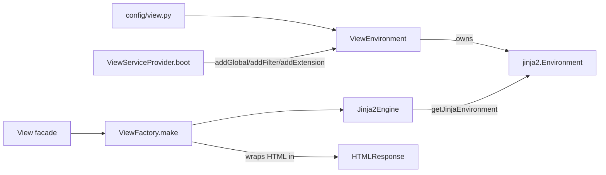

# Orionis View (`orionis.view`)

> Async-first Jinja2 template rendering system — environment configuration, rendering engine, HTML response factory, bytecode caching, built-in filters/globals, and the `ViewServiceProvider` that wires it all into the application container.
>
> 🇪🇸 Versión en español: [README.es.md](README.es.md)

`orionis.view` is the framework's server-side rendering (SSR) layer. It
wraps [Jinja2](https://jinja.palletsprojects.com/) behind a small,
typed API so that controllers never touch Jinja2 directly: they call
`View.make("users.index", users=users)` (via the `View` facade or the
`IViewFactory` contract) and get back a ready-to-return
`HTMLResponse`. Everything — template discovery paths, bytecode
caching, autoescaping, custom filters/globals/extensions, and error
handling — is configured once, at application boot, through
`config/view.py` and the `ViewServiceProvider`.

---

## Table of contents

1. [Requirements](#requirements)
2. [Module overview](#module-overview)
3. [API reference](#api-reference)
   - [`ViewEnvironment`](#viewenvironment-orionisviewenvironmentviewenvironment)
   - [`Jinja2Engine`](#jinja2engine-orionisviewenginejinja2engine)
   - [`ViewFactory`](#viewfactory-orionisviewfactoryviewfactory)
   - [`OrionisBytecodeCache`](#orionisbytecodecache-orionisviewcacheorionisbytecodecache)
   - [`buildViewFilters`, `helpers`, `buildViewExtensions`](#buildviewfilters-helpers-buildviewextensions)
   - [Exceptions](#exceptions)
   - [`ViewServiceProvider`](#viewserviceprovider-orionisviewproviderviewserviceprovider)
   - [Contracts (`IViewEngine`, `IViewEnvironment`, `IViewFactory`)](#contracts-iviewengine-iviewenvironment-iviewfactory)
4. [Usage examples](#usage-examples)
5. [Performance and concurrency considerations](#performance-and-concurrency-considerations)
6. [Design notes](#design-notes)
7. [Compatibility notes](#compatibility-notes)

---

## Requirements

No extra installation is required beyond the framework itself — Jinja2,
Markdown, and msgspec are already core dependencies of `orionis`:

```bash
pip install orionis
```

- **Python:** 3.14 or newer (the same minimum as the rest of the framework).
- **Dependencies** (already bundled as core deps in `pyproject.toml`):
  `jinja2~=3.1`, `markdown~=3.7`, `msgspec>=0.21.1`.
- Template directories, cache paths, autoescaping, etc. are configured
  through `config/view.py` (which extends
  `orionis.foundation.config.view.entities.view.View`) — no separate
  installation step is needed to use them.

## Module overview

| Type | File | Purpose |
|---|---|---|
| `ViewEnvironment` | [environment.py](../environment.py) | Builds and owns the single Jinja2 `Environment` instance for the application (loaders, autoescape, bytecode cache, globals, filters, tests, extensions). |
| `Jinja2Engine` | [engine.py](../engine.py) | Renders a named template asynchronously via `Environment.get_template(...).render_async(...)`, converting dot-notation names to file paths. |
| `ViewFactory` | [factory.py](../factory.py) | The controller-facing entry point: renders a template and wraps the HTML in an `HTMLResponse`. |
| `OrionisBytecodeCache` | [cache.py](../cache.py) | A `jinja2.bccache.FileSystemBytecodeCache` subclass that produces human-readable cache filenames instead of Jinja2's default hashed names. |
| `buildViewFilters` | [filters.py](../filters.py) | Returns the built-in filter mapping (`json`, `markdown`) registered at boot. |
| `_global_*` builders | [helpers/](../helpers/) | One module per global category (`app`, `asset`, `bcrypt`, `cache`, `config`, `csrf`, `datetime`, `dump`, `lang`, `request`, `route`, `session`, `url`, `version`), each exporting `_global_<name>` builders re-exported by `helpers/__init__.py` and wired by the provider. |
| `buildViewExtensions` | [extensions.py](../extensions.py) | Returns the list of Jinja2 extension classes to register (empty by default; extend this list to add custom extensions). |
| `ViewException`, `ViewRenderException`, `ViewTemplateNotFoundException` | [exceptions.py](../exceptions.py) | The view-system exception hierarchy. |
| `ViewServiceProvider` | [provider.py](../provider.py) | Registers `IViewEnvironment`/`IViewEngine`/`IViewFactory` as singletons, wires globals/filters/extensions at boot, and pins the `View` facade. |
| `IViewEngine`, `IViewEnvironment`, `IViewFactory` | [contracts/](../contracts/) | `abc.ABC` contracts satisfied by `Jinja2Engine`, `ViewEnvironment`, and `ViewFactory` respectively. |

Rendering pipeline:



---

## API reference

### `ViewEnvironment` (`orionis.view.environment.ViewEnvironment`)

```python
ViewEnvironment(app: IApplication) -> None
```

Implements `IViewEnvironment`. Built once (typically as a container
singleton) from the application's `view` configuration
(`app.config("view")`, coerced into
`orionis.foundation.config.view.entities.view.View` if given as a raw
`dict`). It is the **only** class allowed to touch the underlying
Jinja2 `Environment` directly.

| Method | Signature | Description |
|---|---|---|
| `__init__` | `__init__(app: IApplication) -> None` | Builds the Jinja2 `Environment`: one `jinja2.FileSystemLoader` per configured `paths` entry (wrapped in a `jinja2.ChoiceLoader` when there is more than one), an optional `OrionisBytecodeCache` when `cache_path` is set (the directory is created if missing), and `enable_async=True`, `autoescape`, `auto_reload`, `cache_size` taken from configuration. `undefined` is set to `jinja2.Undefined` and `keep_trailing_newline=True`. |
| `addGlobal` | `addGlobal(name: str, value: Any) -> None` | Registers `value` under `name` in `jinja2.Environment.globals`, making it available in every template. |
| `addFilter` | `addFilter(name: str, callback: Callable) -> None` | Registers `callback` under `name` in `jinja2.Environment.filters`, usable as `{{ value | name }}`. |
| `addTest` | `addTest(name: str, callback: Callable) -> None` | Registers `callback` under `name` in `jinja2.Environment.tests`, usable as ``. |
| `addExtension` | `addExtension(extension: Any) -> None` | Registers a Jinja2 `Extension` subclass (or its dotted path) via `Environment.add_extension`. Raises `ViewException` if Jinja2 rejects it. |
| `getJinjaEnvironment` | `getJinjaEnvironment() -> jinja2.Environment` | Returns the underlying `jinja2.Environment`. Treat the returned object as read-only outside `ViewEnvironment`; all mutation should go through the typed methods above. |

Relevant `View` configuration fields read from `config/view.py`
(`orionis.foundation.config.view.entities.view.View`): `paths` (list of
template directories, relative to the app base path unless absolute),
`cache_size` (LRU in-memory compiled-template limit, `0` disables it),
`cache_path` (optional bytecode cache directory; `None` disables disk
caching), `auto_reload` (reload templates when the source file
changes), `autoescape` (automatic HTML escaping), `enable_async`
(always `True` in Orionis).

### `Jinja2Engine` (`orionis.view.engine.Jinja2Engine`)

```python
Jinja2Engine(environment: IViewEnvironment) -> None
```

Implements `IViewEngine`. `__slots__ = ("_environment",)`.

| Method | Signature | Description |
|---|---|---|
| `render` | `async render(template: str, context: dict[str, Any]) -> str` | Normalises `template` to a filesystem path (see below), looks it up via `Environment.get_template(...)`, and awaits `Template.render_async(**context)`. Raises `ViewTemplateNotFoundException` if the template file cannot be located, or `ViewRenderException` if Jinja2 raises any error while rendering. Jinja2's **synchronous** `render()` is never called. |
| `_normalisePath` | `_normalisePath(template: str) -> str` *(staticmethod)* | Converts a dot-notation identifier to a loader-compatible path: if `template` already contains `/`, it is used as-is; otherwise every `.` is replaced with `/`. A `.html` extension is appended only when the final path segment has no extension (e.g. `"users.index"` → `"users/index.html"`, `"partials/nav.html"` stays unchanged). |

### `ViewFactory` (`orionis.view.factory.ViewFactory`)

```python
ViewFactory(engine: IViewEngine) -> None
```

Implements `IViewFactory`. `__slots__ = ("_engine",)`. This is the class
controllers are expected to use (typically through the `View` facade).

| Method | Signature | Description |
|---|---|---|
| `make` | `async make(template: str, **context: Any) -> HTMLResponse` | Renders `template` via the bound `IViewEngine.render(template, context)` and wraps the resulting HTML string in an `orionis.http.response.HTMLResponse` with header `X-Orionis-Render: SSR`. Propagates `ViewTemplateNotFoundException`/`ViewRenderException` from the engine. |

### `OrionisBytecodeCache` (`orionis.view.cache.OrionisBytecodeCache`)

```python
OrionisBytecodeCache(directory: str) -> None  # from FileSystemBytecodeCache
```

A `jinja2.bccache.FileSystemBytecodeCache` subclass used automatically
by `ViewEnvironment` whenever `cache_path` is configured.

| Method | Signature | Description |
|---|---|---|
| `get_cache_key` | `get_cache_key(name: str, filename: str \| None = None) -> str` | Converts a template name (e.g. `"users/index.html"`) into a readable cache key by replacing `/`/`\` with `.` and stripping a trailing extension (`.html`, `.htm`, `.jinja`, `.jinja2`, `.j2`) if present. |
| `_get_cache_filename` | `_get_cache_filename(bucket: Bucket) -> str` | Returns `"<cache_dir>/<bucket.key>.cache"` — an override of Jinja2's default hashed filename scheme. |

### `buildViewFilters`, `helpers`, `buildViewExtensions`

These are plain functions (not classes) invoked once by
`ViewServiceProvider.boot()`:

| Function | Signature | Description |
|---|---|---|
| `buildViewFilters` | `buildViewFilters() -> dict[str, Callable[..., Any]]` | Returns `{"json": <jsonify>, "markdown": <markdown>}`. `json` serialises any value with `msgspec.json` (optionally pretty-printed via an `indent` argument), falling back to `str(value)` on `TypeError`/`ValueError`/`msgspec.EncodeError`. `markdown` renders a Markdown string to HTML via the `markdown` package with the `extra`, `codehilite`, and `toc` extensions enabled. |
| `orionis.view.helpers` | `_global_<name>(app: IApplication) -> Any` | Each builder returns the callable registered as a template global: `app`, `asset`, `secure_asset`, `url`, `secure_url`, `route`, `csrf_token`, `csrf_field`, `config`, `cache`, `encrypt`, `decrypt`, `dd`, `now`, `today`, `request`, `session`, `python_version`, `framework_version`, plus the localization globals `__`/`trans`, `choice`, `locale`, `locales` (backed by the `Lang` facade). Builders with no application dependency (`dd`, `now`, `today`, versions, localization) take no arguments. |
| `buildViewExtensions` | `buildViewExtensions() -> list[Any]` | Returns the ordered list of Jinja2 `Extension` classes (or dotted paths) to register. Empty by default. |

### Exceptions

Defined in `orionis/view/exceptions.py`:

| Exception | Base | Raised when |
|---|---|---|
| `ViewException` | `Exception` | Base class for the whole view-exception hierarchy; catch this to handle any view-related error uniformly. |
| `ViewRenderException` | `ViewException` | A template was found but Jinja2 raised an error while rendering it (`jinja2.TemplateError`), preserved as `__cause__`. |
| `ViewTemplateNotFoundException` | `ViewException` | The requested template file could not be located by any configured loader (`jinja2.TemplateNotFound`), preserved as `__cause__`. |

### `ViewServiceProvider` (`orionis.view.provider.ViewServiceProvider`)

Extends `orionis.container.providers.service_provider.ServiceProvider`.

| Method | Signature | Description |
|---|---|---|
| `register` | `register(self) -> None` | Binds `IViewEnvironment → ViewEnvironment`, `IViewEngine → Jinja2Engine`, and `IViewFactory → ViewFactory` as **singletons** in the application container. |
| `boot` | `async boot(self) -> None` | Resolves the `IViewEnvironment` singleton, builds every template global from the `orionis.view.helpers` builders and registers it via `addGlobal`, every entry from `buildViewFilters()` via `addFilter`, and every extension from `buildViewExtensions()` via `addExtension`; finally awaits `ViewFacade.pin()` so the `View` facade resolves with no further container lookups. |

### Contracts (`IViewEngine`, `IViewEnvironment`, `IViewFactory`)

All three are `abc.ABC` classes with `__slots__ = ()`, defined under
`orionis/view/contracts/`, mirroring exactly the public methods of
`Jinja2Engine`, `ViewEnvironment`, and `ViewFactory` described above
(same signatures and docstrings, no implementation). They exist so the
rest of the framework depends on the interfaces rather than the
concrete Jinja2-based implementations.

---

## Usage examples

### Rendering from a controller via the `View` facade

```python
# Inside an HTTP controller, after ViewServiceProvider has booted:
from orionis.support.facades.view import View

async def index(self):
    users = [{"name": "Ada"}, {"name": "Grace"}]
    return await View.make("users.index", users=users)
    # renders resources/views/users/index.html
```

### Resolving `IViewFactory` through dependency injection

```python
from orionis.view.contracts.factory import IViewFactory

class UsersController:
    def __init__(self, views: IViewFactory) -> None:
        self._views = views

    async def show(self, user_id: int):
        return await self._views.make("users.show", user_id=user_id)
```

### Using the built-in `json` and `markdown` filters in a template

```jinja
{# resources/views/users/index.html #}
<h1>Users</h1>
<pre>{{ users | json(indent=2) }}</pre>

{{ "**Welcome** to *Orionis*" | markdown }}
```

### Using the built-in globals in a template

```jinja
{# config()/app()/python_version()/framework_version() are sync;
   request()/session() are async and are awaited automatically
   because the environment is created with enable_async=True #}
<p>{{ config("app.name") }}</p>
<p>Running Python {{ python_version() }} / Orionis {{ framework_version() }}</p>
<p>{{ __("messages.welcome") }}</p>
```

### Handling view exceptions

```python
from orionis.view.exceptions import (
    ViewException,
    ViewRenderException,
    ViewTemplateNotFoundException,
)
from orionis.support.facades.view import View

async def render_safely(template: str, **context) -> str:
    try:
        response = await View.make(template, **context)
        return response.content
    except ViewTemplateNotFoundException:
        return "404: template not found"
    except ViewRenderException:
        return "500: error rendering template"
    except ViewException:
        return "500: unknown view error"
```

---

## Performance and concurrency considerations

- Jinja2 is configured with `enable_async=True` and `Jinja2Engine`
  **always** calls `Template.render_async(...)`; the synchronous
  `render()` API of Jinja2 is never used, so rendering never blocks the
  event loop on the template-execution side. Global callables that
  perform I/O (`request`, `session`) are themselves `async def` and are
  awaited automatically by Jinja2's async execution model.
- `cache_size` controls Jinja2's built-in **in-memory** LRU cache of
  compiled template objects (per `Environment` instance, i.e. per
  process); `cache_path` additionally enables `OrionisBytecodeCache`, a
  **disk-based** bytecode cache that survives process restarts, avoiding
  template recompilation across application restarts/redeploys. Setting
  `cache_path` to `None` disables the disk cache entirely.
- `auto_reload` (checking each template file's mtime before using a
  cached compiled version) adds filesystem `stat()` overhead per
  render; it is intended for development (`APP_DEBUG=True` drives the
  default in `config/view.py`) and is typically disabled in production
  for lower per-request overhead.
- `ViewEnvironment`, `Jinja2Engine`, and `ViewFactory` are registered as
  **singletons** by `ViewServiceProvider`, so the same `jinja2.Environment`
  instance is reused for the lifetime of the application — construction
  cost (building loaders, resolving config, creating the bytecode cache
  directory) is paid once at boot, not per request.
- The built-in `config`, `app`, `python_version`, and
  `framework_version` globals are synchronous, in-memory lookups with no
  I/O; `request`/`session` perform a container resolution
  (`await app.make(...)`) on every access, which has the normal cost of
  the framework's DI resolution path.
- The `request`/`session` globals swallow exceptions with a
  bare `except Exception` and return `None` instead of propagating — a
  template can safely call these even outside of an active HTTP
  request/session scope, at the cost of silently hiding the underlying
  error. The same applies to the base URL lookup behind
  `url`/`secure_url`/`route`, which falls back to a relative path.
- `Jinja2Engine`, `ViewEnvironment`, and `ViewFactory` are all
  `__slots__`-based, keeping their per-instance memory footprint to
  exactly the one dependency they hold (`_environment`, `_jinja_env`,
  `_engine` respectively).
- None of the classes in this module implement their own locking;
  thread/task-safety for concurrent renders relies on Jinja2's own
  `Environment`/compiled-`Template` objects being safe for concurrent
  read-only use, which is the standard Jinja2 usage pattern once the
  environment has finished being configured at boot.

## Design notes

- **Layered responsibility**: `ViewEnvironment` (configuration and
  ownership of the Jinja2 `Environment`) → `Jinja2Engine` (rendering) →
  `ViewFactory` (wrapping into an `HTTPResponse`-family object) mirrors
  Laravel's `Factory`/`Engine`/compiler separation, keeping each class
  focused on a single concern.
- **Dot-notation template naming**: `"users.index"` → `resources/views/users/index.html`
  is a deliberate convention borrowed from Laravel Blade views, handled
  entirely in `Jinja2Engine._normalisePath`; explicit paths containing
  `/` bypass the dot-to-slash conversion.
- **Human-readable bytecode cache keys**: `OrionisBytecodeCache`
  overrides Jinja2's default hashed cache filenames with a
  slash-to-dot conversion of the template name, making cached
  `.cache` files on disk directly traceable back to their source
  template.
- **Convention-over-configuration extension points**: `buildViewFilters`
  and `buildViewExtensions` are plain functions returning a dict/list,
  invoked once during `ViewServiceProvider.boot()`; template globals
  live in `orionis/view/helpers/`, one module per category, exported
  from `helpers/__init__.py` and registered by the provider — adding a
  project-wide filter, global, or extension means extending those.
- **Facade pinning**: like other framework subsystems, `ViewServiceProvider.boot()`
  ends with `await ViewFacade.pin()`, so subsequent `View.make(...)`
  calls resolve the bound `IViewFactory` singleton without going
  through the container's dynamic dispatcher on every call.
- **Interface-first design**: `IViewEngine`, `IViewEnvironment`, and
  `IViewFactory` are `abc.ABC` contracts (not `typing.Protocol`), so the
  container binds concrete implementations to these interfaces and the
  rest of the framework only ever depends on the interface types.

## Compatibility notes

- Requires **Python 3.14+**, consistent with the rest of the `orionis`
  framework (`requires-python = ">=3.14"` in `pyproject.toml`).
- Depends on `jinja2~=3.1`, `markdown~=3.7`, and `msgspec>=0.21.1`, all
  declared as core (non-optional) dependencies of `orionis` — no extras
  or separate installation step is required.
- `enable_async=True` is always used; the module relies on Jinja2's
  async rendering support (`render_async`), which requires an active
  `asyncio` event loop at render time.
- No platform-specific behavior beyond standard filesystem path handling
  for template directories and the bytecode cache directory.
