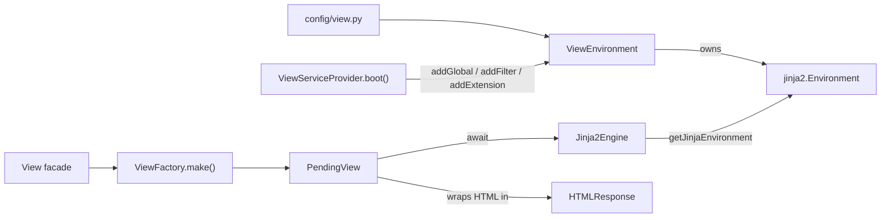

# View (`orionis.view`)

> Async-first server-side rendering layer: a single configured Jinja2 environment, an async rendering engine, an awaitable/chainable HTML response, 29 template globals, 2 filters and the `` tag.

> 🇪🇸 Spanish version: [README.es.md](README.es.md)

---

## Table of contents

1. [Functional description](#functional-description)
   - [Where it fits](#where-it-fits)
   - [Rendering pipeline](#rendering-pipeline)
   - [File map](#file-map)
   - [Design decisions](#design-decisions)
2. [API reference](#api-reference)
   - [`ViewEnvironment`](#viewenvironment)
   - [`Jinja2Engine`](#jinja2engine)
   - [`ViewFactory`](#viewfactory)
   - [`PendingView`](#pendingview)
   - [`OrionisBytecodeCache`](#orionisbytecodecache)
   - [`CsrfExtension`](#csrfextension)
   - [Template globals](#template-globals)
   - [`ErrorBag`](#errorbag)
   - [Template filters](#template-filters)
   - [Exceptions](#exceptions)
   - [`ViewServiceProvider`](#viewserviceprovider)
   - [Contracts](#contracts)
   - [Configuration read by the module](#configuration-read-by-the-module)
3. [Usage examples](#usage-examples)
4. [Performance and concurrency considerations](#performance-and-concurrency-considerations)
5. [Compatibility notes](#compatibility-notes)

---

## Functional description

`orionis.view` turns a template name plus a context into an
`orionis.http.responses.HTMLResponse`. It owns exactly one
`jinja2.Environment` per application, built at construction time from
`app.config("view")`, and exposes it only through typed helpers so no
other layer of the framework touches Jinja2 directly.

### Where it fits

| Related module | Relationship |
|---|---|
| `orionis.foundation` | `ViewEnvironment` receives `IApplication`; reads `app.config("view")` and `app.basePath`. Configuration entity: `orionis.foundation.config.view.entities.view.View`. |
| `orionis.http` | `PendingView` builds `HTMLResponse`; `ResponseFactory.view()` (`orionis/http/factory.py`) delegates to the `View` facade. |
| `orionis.session` | `PendingView` writes flash data through `orionis.session.flash` helpers; the `old`, `flash`, `errors` and `session` globals read `ISession`. |
| `orionis.localization` | The `trans`/`__`, `choice`, `locale` and `locales` globals call the `Lang` facade. |
| `orionis.storage` | The `asset`/`secure_asset` globals resolve `IStorageManager` and call `disk(...).file(...).url()`. |
| `orionis.cache`, `orionis.encrypter` | The `cache`, `encrypt` and `decrypt` globals resolve `ICacheManager` / `IEncrypter`. |
| `orionis.container` | `ViewServiceProvider` extends `ServiceProvider`; the `View` facade (`orionis.support.facades.view.View`) resolves `IViewFactory`. |

### Rendering pipeline



### File map

| Symbol | File | Purpose |
|---|---|---|
| `ViewEnvironment` | [environment.py](../environment.py) | Builds and owns the single `jinja2.Environment`. |
| `Jinja2Engine` | [engine.py](../engine.py) | Async rendering via `render_async`; dot-notation path normalisation. |
| `ViewFactory` | [factory.py](../factory.py) | Controller-facing entry point; returns a `PendingView`. |
| `PendingView` | [pending.py](../pending.py) | Awaitable, chainable render intent. |
| `OrionisBytecodeCache` | [cache.py](../cache.py) | `FileSystemBytecodeCache` subclass with readable cache filenames. |
| `ViewException` and subclasses | [exceptions.py](../exceptions.py) | Exception hierarchy of the module. |
| `ViewServiceProvider` | [provider.py](../provider.py) | Container bindings, globals/filters/extensions wiring, facade pinning. |
| `_global_*` builders | [globals/](../globals/) | One module per global category; re-exported by `globals/__init__.py`. |
| `_filter_json`, `_filter_markdown` | [filters/](../filters/) | Built-in template filters. |
| `CsrfExtension` | [extensions/csrf.py](../extensions/csrf.py) | `` statement tag. |
| `IViewEngine`, `IViewEnvironment`, `IViewFactory` | [contracts/](../contracts/) | `abc.ABC` contracts with `__slots__ = ()`. |

`orionis/view/__init__.py` is empty: every symbol is imported from its own
module (e.g. `from orionis.view.factory import ViewFactory`).

### Design decisions

- **Single environment ownership.** `ViewEnvironment` is the only class
  that holds a `jinja2.Environment`; mutations flow through
  `addGlobal`/`addFilter`/`addTest`/`addExtension`. Consumers get the raw
  object through `getJinjaEnvironment()` only.
- **`__slots__` everywhere.** `ViewEnvironment`, `Jinja2Engine`,
  `ViewFactory`, `PendingView` and `ErrorBag` declare `__slots__`, and the
  three contracts declare `__slots__ = ()` so implementations carry no
  `__dict__`.
- **Deferred rendering.** `ViewFactory.make()` performs no I/O; it returns
  a `PendingView` whose `__await__` triggers the render. This is what makes
  `response.view("auth.login").withErrors(...)` chainable.
- **Proxy by `__getattr__`.** `PendingView` accepts any callable attribute
  that exists on `HTMLResponse`, records the call, and replays it on the
  real response after rendering.
- **Closure-built globals.** Every global is produced by a `_global_*`
  builder that captures `IApplication` once at boot, so no per-render
  container lookup is needed to reach the application instance.
- **Async globals with plain template syntax.** In an `enable_async=True`
  environment, Jinja2's code generator wraps every call in `auto_await`,
  so `{{ csrf_token() }}` or `{{ errors.first('email') }}` work without an
  explicit `await` in the template.

---

## API reference

### `ViewEnvironment`

`orionis.view.environment.ViewEnvironment` — implements `IViewEnvironment`.
`__slots__ = ("_jinja_env",)`.

```python
ViewEnvironment(app: IApplication) -> None
```

Reads `app.config("view")`. When the returned value is a `dict` it is
coerced with `View(**raw)`; otherwise it is used as-is. Then:

- One `jinja2.FileSystemLoader` per entry of `config.paths`. Relative
  paths are resolved against `app.basePath`; absolute paths are used
  untouched. More than one loader is wrapped in a `jinja2.ChoiceLoader`;
  a single loader is used directly.
- When `config.cache_path` is not `None`, the directory is created with
  `mkdir(parents=True, exist_ok=True)` (relative paths resolved against
  `app.basePath`) and an `OrionisBytecodeCache` is attached.
- The environment is built with `enable_async=True`,
  `autoescape=config.autoescape`, `auto_reload=config.auto_reload`,
  `cache_size=config.cache_size`, `bytecode_cache=<cache or None>`,
  `undefined=jinja2.Undefined` and `keep_trailing_newline=True`.

**Side effects:** creates the bytecode cache directory on disk when
`cache_path` is configured.

| Method | Signature | Returns / raises |
|---|---|---|
| `addGlobal` | `addGlobal(self, name: str, value: Any) -> None` | Writes `jinja2.Environment.globals[name]`. |
| `addFilter` | `addFilter(self, name: str, callback: Callable) -> None` | Writes `jinja2.Environment.filters[name]`. |
| `addTest` | `addTest(self, name: str, callback: Callable) -> None` | Writes `jinja2.Environment.tests[name]`. No built-in test is registered by the framework. |
| `addExtension` | `addExtension(self, extension: Any) -> None` | Calls `Environment.add_extension`. Any exception is wrapped in `ViewException` with the original kept as `__cause__`. |
| `getJinjaEnvironment` | `getJinjaEnvironment(self) -> jinja2.Environment` | Returns the internal environment instance. |

> ℹ️ Async rendering is **not configurable**. `Jinja2Engine.render` only
> calls `render_async` and every template global is awaited by the async
> code generator, so `enable_async=True` is hardcoded and the `View`
> configuration entity exposes no field for it.

### `Jinja2Engine`

`orionis.view.engine.Jinja2Engine` — implements `IViewEngine`.
`__slots__ = ("_environment", "_jinja")`.

```python
Jinja2Engine(environment: IViewEnvironment) -> None
```

Stores the environment and caches `environment.getJinjaEnvironment()` in
the `_jinja` slot. The environment object is mutated in place during boot,
so the cached reference stays valid for the application lifetime.

```python
async def render(self, template: str, context: dict[str, Any]) -> str
```

| Parameter | Type | Description |
|---|---|---|
| `template` | `str` | Dot-notation identifier or a direct relative path. |
| `context` | `dict[str, Any]` | Variables exposed inside the template. |

**Returns:** `str` — the rendered HTML.

**Raises:**

- `ViewTemplateNotFoundException` — the loader could not find the file
  (wraps `jinja2.TemplateNotFound`).
- `ViewRenderException` — Jinja2 raised a `jinja2.TemplateError` during
  rendering.

Rendering always uses `Template.render_async(**context)`; the synchronous
`render()` of Jinja2 is never called.

```python
@staticmethod
def _normalisePath(template: str) -> str
```

Private but relevant to the public contract. Rules, in order:

1. If the identifier already contains `/`, it is kept as is.
2. Otherwise every `.` becomes `/`.
3. If the last segment carries no extension, `.html` is appended.

Results are memoised in the module-level `_PATH_CACHE` dictionary
(`dict[str, str]`, no size limit and no eviction). The default extension
lives in `_DEFAULT_EXT = ".html"`.

Examples of the transformation: `"users.index"` → `"users/index.html"`,
`"partials/nav.html"` → `"partials/nav.html"`, `"mail.welcome.txt"` →
`"mail/welcome.txt"`.

### `ViewFactory`

`orionis.view.factory.ViewFactory` — implements `IViewFactory`.
`__slots__ = ("_engine",)`.

```python
ViewFactory(engine: IViewEngine) -> None

def make(self, template: str, **context: Any) -> PendingView
```

`make()` is **not** a coroutine and performs no I/O: it just returns
`PendingView(self._engine, template, context)`. The
`ViewTemplateNotFoundException` and `ViewRenderException` listed in its
docstring surface when the returned `PendingView` is awaited.

### `PendingView`

`orionis.view.pending.PendingView`.
`__slots__ = ("_context", "_engine", "_flash", "_mutations", "_template")`.

```python
PendingView(engine: IViewEngine, template: str, context: dict[str, Any]) -> None
```

| Method | Signature | Description |
|---|---|---|
| `withFlash` | `withFlash(self, key: str, value: Any = None) -> PendingView` | Queues one flash entry. Returns `self`. |
| `withInput` | `withInput(self, values: Mapping[str, Any]) -> PendingView` | Queues the submitted payload under the reserved `OLD_INPUT_KEY` after `filter_input(values)` strips credential-like fields. Returns `self`. |
| `withErrors` | `withErrors(self, errors: Mapping[str, Any] \| Exception) -> PendingView` | Queues `normalize_errors(errors)` under the reserved `ERRORS_KEY`. Accepts a mapping or a validation exception. Returns `self`. |
| `__getattr__` | `__getattr__(self, name: str) -> Callable[..., PendingView]` | Returns a recorder for any **callable** attribute of `HTMLResponse`. Raises `AttributeError` otherwise. |
| `__await__` | `__await__(self) -> Generator[Any, None, HTMLResponse]` | Delegates to `render().__await__()`. |
| `render` | `async render(self) -> HTMLResponse` | Performs the render (see below). |

`render()` sequence:

1. If flash data was queued, it is written to the session through the
   private `__flashToSession()`, which resolves `await Session.resolve()`
   and calls `apply_flash(session, self._flash)`. Any exception while
   resolving the session is swallowed and the write is skipped, so routes
   without session middleware keep working.
2. `await self._engine.render(self._template, self._context)`.
3. The HTML is wrapped in `HTMLResponse(content=..., headers={"X-Orionis-Render": "SSR"})`.
4. `ViewTemplateNotFoundException` is re-raised unchanged. Any other
   exception is wrapped in `ViewRenderException` with the message
   `Failed to render view '<template>': <detail>`, where `detail` has the
   closure qualname noise (`<something>.<locals>.`) stripped by the
   module-level regex `_LOCALS_QUALNAME`.
5. Every recorded mutation is replayed on the real response in insertion
   order: `getattr(response, name)(*args, **kwargs)`.

**Side effects:** writes to the active session when flash data is queued.

Flash values queued with `withFlash()` are written **before** rendering,
so the very same view can read them back through the `flash()` global.

### `OrionisBytecodeCache`

`orionis.view.cache.OrionisBytecodeCache` — subclass of
`jinja2.bccache.FileSystemBytecodeCache`.

| Method | Signature | Description |
|---|---|---|
| `get_cache_key` | `get_cache_key(self, name: str, filename: str \| None = None) -> str` | Replaces `/` and `\` with `.`, strips one trailing extension from `_TEMPLATE_EXTENSIONS` (`.html`, `.htm`, `.jinja`, `.jinja2`, `.j2`) and appends `.` plus the first `_DIGEST_LENGTH` (8) characters of the SHA-1 digest of the untouched name. `filename` is ignored. |
| `_get_cache_filename` | `_get_cache_filename(self, bucket: Bucket) -> str` | Returns `str(Path(self.directory) / f"{bucket.key}.cache")`. |

Result: `users/index.html` is cached as
`<cache_dir>/users.index.aa344d9c.cache` instead of Jinja2's default
fully hashed filename.

Flattening separators and dropping the extension is lossy, so the digest
is what keeps the mapping injective: `mail/welcome.html` and
`mail/welcome.j2` (or `users/index.html` and `users.index.html`) share a
readable stem but never a cache file. Without it both templates would
keep overwriting each other's entry and the bytecode cache would silently
stop paying off for them.

### `CsrfExtension`

`orionis.view.extensions.csrf.CsrfExtension` — subclass of `jinja2.ext.Extension`.
`tags: ClassVar[set[str]] = {"csrf"}`.

| Member | Signature | Description |
|---|---|---|
| `parse` | `parse(self, parser: Parser) -> nodes.Output` | Consumes the tag token and emits `nodes.Output([self.call_method("_renderField", lineno=lineno)], lineno=lineno)`. |
| `_renderField` | `async _renderField(self) -> Markup` | Reads the `csrf_field` global from `self.environment.globals`, awaits it when awaitable, and returns `escape(field)`. Raises `ViewRenderException` when the global is not registered. |

`` is therefore a zero-argument shortcut for
`{{ csrf_field() }}`. `_renderField` can be a coroutine because the
async environment wraps the generated `nodes.Call` with `auto_await`.

### Template globals

`ViewServiceProvider.boot()` registers **29 names** produced by 28
`_global_*` builder functions (`trans` and its alias `__` share the same
object). Each entry below shows the signature of the callable actually
stored in `Environment.globals`.

| Global | Callable signature | Coroutine | Behaviour |
|---|---|---|---|
| `app` | `application() -> IApplication` | no | Returns the captured application container. |
| `asset` | `asset(path: str, disk: str \| None = None) -> str` | yes | `await storage.disk(disk or "public").file(path).url()`. Propagates `UnsupportedStorageOperationException` when the disk exposes no public URL. |
| `secure_asset` | `secure_asset(path: str, disk: str \| None = None) -> str` | yes | Same as `asset`, then rewrites the scheme to HTTPS. |
| `cache` | `cache(key: str, default: Any \| None = None) -> Any` | yes | `await ICacheManager.get(key)`; returns `default` when the value is `None`. |
| `choice` | `choice(key: str, count: int, locale: str \| None = None, **replace: Any) -> str` | no | `Lang.choice(...)`. |
| `collect` | `collect(value: Any = None) -> Collection` | no | `None` → empty `Collection`; a `Collection` is returned untouched; a `list` is wrapped directly; `str`/`bytes` and non-iterables become a single-item collection; any other iterable is expanded with `list(value)`. |
| `config` | `config(key: str, default: Any = None) -> Any` | no | `app.config(key)`, falling back to `default` when the result is `None`. |
| `csrf_field` | `csrf_field() -> Markup` | yes | `<input type="hidden" name="_csrf" value="{token}">` built with `Markup.format`, so the token is escaped and the field needs no `\| safe`. |
| `csrf_token` | `csrf_token() -> str` | yes | Reads the session key resolved once at boot from `http.csrf.session_key` (default `_csrf_token`). Returns `""` when absent. |
| `decrypt` | `decrypt(payload: str) -> str` | yes | `IEncrypter.decrypt(payload)`. |
| `dump` | `dump(*args: Any) -> Markup` | no | `VarDumper().values(*args)` rendered with `toHtml(insert_line=True)`. |
| `encrypt` | `encrypt(plaintext: str) -> str` | yes | `IEncrypter.encrypt(plaintext)`. |
| `errors` | `ErrorBag` instance | n/a | See [`ErrorBag`](#errorbag). |
| `flash` | `flash(key: str, default: Any = None) -> Any` | yes | `session.getFlash(key, default)`; returns `default` when no session is reachable. |
| `framework_version` | `framework_version() -> str` | no | `orionis.metadata.VERSION`, imported lazily inside the call. |
| `locale` | `locale() -> str` | no | `Lang.getLocale()`. |
| `locales` | `locales() -> tuple[str, ...]` | no | `Lang.availableLocales()`. |
| `now` | `now() -> pendulum.DateTime` | no | `DateTime.now()`. |
| `old` | `old(key: str, default: Any = None) -> Any` | yes | `session.getOldInput(key, default)`; `None` is converted to `""`. Reads only the `_old_input` bag. |
| `python_version` | `python_version() -> str` | no | `f"{major}.{minor}.{micro}"` from `sys.version_info`. |
| `request` | `request() -> IRequest \| None` | yes | `await app.make(IRequest)`, or `None` when no request is in scope. |
| `route` | `route(name: str, **params: Any) -> str` | yes | See below. Raises `ViewRouteException`. |
| `secure_url` | `secure_url(path: str = "/", **query: Any) -> str` | yes | Like `url`, then forces the HTTPS scheme. |
| `session` | `session() -> ISession \| None` | yes | `await app.make(ISession)`, or `None` when unavailable. |
| `stringable` | `stringable(value: Any = "") -> Stringable` | no | Returns the value untouched when it already is a `Stringable`. |
| `today` | `today() -> pendulum.Date` | no | `DateTime.today()`. |
| `trans` / `__` | `trans(key: str, locale: str \| None = None, **replace: Any) -> str` | no | `Lang.get(...)`. Both names point to the same function object. |
| `url` | `url(path: str = "/", **query: Any) -> str` | yes | See below. |

**`url` / `secure_url` semantics** (`globals/url.py`): a path starting
with `http://`, `https://` or `//` is treated as already absolute and is
not prefixed. Otherwise the current request base URL
(`request.baseUrl.rstrip("/")`, or `""` when no request is in scope) is
prefixed and the path is normalised to `"/" + path.lstrip("/")` (`"/"`
for an empty path). `**query` is encoded with `urlencode(query, doseq=True)`
and appended with `?` or `&` depending on whether the target already
contains `?`. `secure_url`/`secure_asset` rewrite a leading `http://` or
`//` into `https://` and leave relative paths untouched.

**`route` semantics** (`globals/route.py`): the name → path map is built
lazily on first use through `await app.build(RouteLoader)` and
`loader.load()`, then kept in the closure (a `loaded` flag guards it).
Static and dynamic buckets are both scanned and the first occurrence of a
name wins (`setdefault`). Placeholders `{name}` and `{name:type}` are
replaced with `quote(str(value), safe="")`; leftover keyword arguments
become the query string. A missing placeholder value or an unknown route
name raises `ViewRouteException`. Interpolation plans are memoised in the
module-level `_ROUTE_PLAN_CACHE`.

Globals that reach the session (`old`, `flash`, `errors`, `session`) and
the `request` global swallow every exception raised while resolving the
service and fall back to a neutral value, so a template never fails
because of a missing request scope.

### `ErrorBag`

`orionis.view.globals.errors.ErrorBag` — the object registered as the
`errors` global. `__slots__ = ("_app",)`.

```python
ErrorBag(app: IApplication) -> None
```

| Method | Signature | Description |
|---|---|---|
| `all` | `async all(self) -> dict[str, list[str]]` | Every message grouped by field. |
| `any` | `async any(self) -> bool` | `True` when the bag holds at least one message. |
| `has` | `async has(self, field: str) -> bool` | `True` when *field* has at least one message. |
| `get` | `async get(self, field: str) -> list[str]` | Messages for *field*, `[]` when valid. |
| `first` | `async first(self, field: str \| None = None) -> str` | First message of *field*, or the first message of the whole bag when *field* is omitted. `""` when there is none. |

Every method resolves `ISession` and calls `session.getErrors()`; when the
session cannot be resolved, an empty mapping is returned. All methods are
coroutines and are awaited transparently by the async environment, so
templates use plain syntax: `{{ errors.first('email') }}`.

### Template filters

| Filter | Callable signature | Description |
|---|---|---|
| `json` | `jsonify(value: Any, indent: int \| None = None) -> str` | `msgspec.json.encode`, optionally re-formatted with `msgspec.json.format(..., indent=indent)`. On `TypeError`, `ValueError` or `msgspec.EncodeError` it falls back to `str(value)` instead of raising. |
| `markdown` | `render_markdown(value: Any) -> str` | `markdown.markdown(str(value), extensions=["extra", "codehilite", "toc"])`. |

The `markdown` filter returns a plain `str`, so with `autoescape=True` the
result must be piped through `| safe` to be rendered as HTML.

### Exceptions

`orionis/view/exceptions.py`:

```text
Exception
└── ViewException
    ├── ViewRenderException
    ├── ViewTemplateNotFoundException
    └── ViewRouteException
```

| Exception | Raised by | Condition |
|---|---|---|
| `ViewException` | `ViewEnvironment.addExtension` | Jinja2 rejected the extension. Also the base class for catching the whole hierarchy. |
| `ViewRenderException` | `Jinja2Engine.render`, `PendingView.render`, `CsrfExtension._renderField` | Jinja2 `TemplateError`, any non-`ViewTemplateNotFoundException` failure during `PendingView.render`, or a missing `csrf_field` global. |
| `ViewTemplateNotFoundException` | `Jinja2Engine.render` | The loader could not locate the template; re-raised unchanged by `PendingView.render`. |
| `ViewRouteException` | The `route` template global | Unknown route name, or a path placeholder without a value. |

All exceptions raised from a caught error preserve the original as
`__cause__` (`raise ... from exc`).

### `ViewServiceProvider`

`orionis.view.provider.ViewServiceProvider` — subclass of
`orionis.container.providers.service_provider.ServiceProvider`.

```python
def register(self) -> None
```

Binds three singletons: `IViewEnvironment` → `ViewEnvironment`,
`IViewEngine` → `Jinja2Engine`, `IViewFactory` → `ViewFactory`.

```python
async def boot(self) -> None
```

1. Resolves the shared `IViewEnvironment` singleton.
2. Builds the 27 globals, adds `trans` plus its alias `__` (the same
   object), and registers all 29 with `addGlobal`.
3. Registers the `json` and `markdown` filters with `addFilter`.
4. Registers `CsrfExtension` with `addExtension`.
5. `await ViewFacade.pin()` so `View.make(...)` becomes a direct
   passthrough with no per-call container resolution.

### Contracts

All three live in `orionis/view/contracts/` and are `abc.ABC` classes with
`__slots__ = ()`.

| Contract | Abstract members |
|---|---|
| `IViewEngine` | `async render(self, template: str, context: dict[str, Any]) -> str` |
| `IViewEnvironment` | `addGlobal(name, value)`, `addFilter(name, callback)`, `addTest(name, callback)`, `addExtension(extension)`, `getJinjaEnvironment()` |
| `IViewFactory` | `make(self, template: str, **context: Any) -> PendingView` |

`orionis/view/contracts/__init__.py` is empty; import each contract from
its own module.

### Configuration read by the module

Entity: `orionis.foundation.config.view.entities.view.View`
(frozen, `kw_only` dataclass). The application-level bootstrap is
`config/view.py` (`BootstrapView`).

| Field | Type | Entity default | Read by `ViewEnvironment` |
|---|---|---|---|
| `paths` | `list` | `["resources/views"]` | Yes — one `FileSystemLoader` per entry. |
| `cache_size` | `int` | `400` | Yes — `cache_size` of the environment (`0` disables it). |
| `cache_path` | `str \| None` | `None` | Yes — enables `OrionisBytecodeCache` and creates the directory. |
| `auto_reload` | `bool` | `True` | Yes. |
| `autoescape` | `bool` | `True` | Yes. |

Async rendering is not part of the configuration: the environment is
always built with `enable_async=True` (see `ViewEnvironment`).

The entity validates its own fields in `__post_init__` and raises
`TypeError` or `ValueError` (empty `paths`, negative `cache_size`, wrong
types) before `ViewEnvironment` ever sees them.

---

## Usage examples

### 1. Most common case — render from a controller

```python
from orionis.http import HttpResponse, response
from orionis.http.base import BaseController

class UserController(BaseController):

    async def index(self) -> HttpResponse:
        """
        Render the user list.

        Returns
        -------
        HttpResponse
            Rendered HTML response.
        """
        users = [{"id": 1, "name": "Ada"}, {"id": 2, "name": "Alan"}]
        return await response.view("users.index", users=users, title="Users")
```

The equivalent through the facade:

```python
from orionis.support.facades.view import View

async def render_users() -> object:
    """
    Render the user list through the View facade.

    Returns
    -------
    object
        The resulting HTMLResponse.
    """
    return await View.make("users.index", users=[], title="Users")
```

Matching template (`resources/views/users/index.html`):

```html
<h1>{{ title }}</h1>
<p class="error">{{ errors.first() }}</p>
<ul>

  <li><a href="{{ url('/users/' ~ user.id) }}">{{ user.name }}</a></li>

</ul>
<form method="post" action="{{ url('/users') }}">
  
  <input name="name" value="{{ old('name') }}">
  <button type="submit">{{ __('Create') }}</button>
</form>
```

### 2. Error handling

```python
from orionis.support.facades.view import View
from orionis.view.exceptions import (
    ViewRenderException,
    ViewTemplateNotFoundException,
)

async def safe_render(template: str) -> str:
    """
    Render a template and degrade gracefully on failure.

    Parameters
    ----------
    template : str
        Template identifier in dot notation.

    Returns
    -------
    str
        The rendered body, or a fallback message.
    """
    try:
        rendered = await View.make(template)
    except ViewTemplateNotFoundException:
        return "<p>The page does not exist.</p>"
    except ViewRenderException as exc:
        return f"<p>The page could not be rendered: {exc}</p>"

    return (rendered.getBody() or b"").decode()
```

Catching the whole hierarchy at once (including `ViewRouteException`
raised by the `route()` global and `ViewException` raised by
`addExtension`):

```python
from orionis.support.facades.view import View
from orionis.view.exceptions import ViewException

async def render_or_none(template: str) -> object | None:
    """
    Render a template, returning None on any view-subsystem failure.

    Parameters
    ----------
    template : str
        Template identifier in dot notation.

    Returns
    -------
    object | None
        The HTMLResponse, or None when the view subsystem failed.
    """
    try:
        return await View.make(template)
    except ViewException:
        return None
```

### 3. Integration — chained mutators, flash and validation errors

```python
from typing import Any
from orionis.http import HttpResponse, response
from orionis.http.base import BaseController
from orionis.http.request import Request

class ContactController(BaseController):

    async def store(self, request: Request) -> HttpResponse:
        """
        Re-render the contact form with errors and previous input.

        Parameters
        ----------
        request : Request
            Incoming HTTP request carrying the submitted payload.

        Returns
        -------
        HttpResponse
            Rendered HTML response with flash data applied.
        """
        payload: dict[str, Any] = await request.data()

        return await (
            response.view("contact.form")
                .withInput(payload)
                .withErrors({"email": "The email address is not valid."})
                .withFlash("warning", "Please review the form.")
                .withCookie("last_form", "contact", max_age=600)
        )
```

`withCookie` is not defined on `PendingView`: it is accepted by
`__getattr__` because `HTMLResponse.withCookie` exists and is callable,
and it is replayed on the response once the template has been rendered.

### 4. Integration — extending the environment from a custom provider

```python
from orionis.container.providers.service_provider import ServiceProvider
from orionis.view.contracts.environment import IViewEnvironment

def _upper_snake(value: object) -> str:
    """
    Convert a value to UPPER_SNAKE_CASE.

    Parameters
    ----------
    value : object
        Value converted with ``str()`` before transformation.

    Returns
    -------
    str
        Upper-cased text with spaces replaced by underscores.
    """
    return str(value).upper().replace(" ", "_")

class ViewMacrosProvider(ServiceProvider):

    async def boot(self) -> None:
        """
        Register an extra filter and test in the shared environment.

        Returns
        -------
        None
        """
        env: IViewEnvironment = await self.app.make(IViewEnvironment)

        env.addFilter("upper_snake", _upper_snake)
        env.addTest("empty", lambda value: not value)
```

Register the provider after `ViewServiceProvider` so the environment
singleton already exists.

### 5. Rendering without the container (direct wiring)

```python
import asyncio
from bootstrap.app import app
from orionis.view.engine import Jinja2Engine
from orionis.view.environment import ViewEnvironment
from orionis.view.factory import ViewFactory

async def main() -> None:
    """
    Render a template using the view stack built by hand.

    Returns
    -------
    None
    """
    environment = ViewEnvironment(app)
    engine = Jinja2Engine(environment)
    factory = ViewFactory(engine)

    rendered = await factory.make("users.index", users=[], title="Users")
    print((rendered.getBody() or b"").decode())

asyncio.run(main())
```

Building the stack this way skips `ViewServiceProvider.boot()`, so no
global, filter or extension is registered: a template using ``,
`url()` or `errors` fails. Call `await ViewServiceProvider(app).boot()`
(or run the normal application boot) when the template relies on them.

---

## Performance and concurrency considerations

- **Async by construction.** `enable_async=True` is always set and
  `Jinja2Engine.render` only calls `render_async`, so rendering never
  blocks the event loop on the Jinja2 side. Template file reads performed
  by `FileSystemLoader` are synchronous, as in Jinja2 itself.
- **One environment per application.** `ViewEnvironment` is a container
  singleton; `Jinja2Engine` caches `getJinjaEnvironment()` in a slot at
  construction time, so no lookup happens per render.
- **Path memoisation.** `Jinja2Engine._PATH_CACHE` and `route`'s
  `_ROUTE_PLAN_CACHE` are unbounded module-level dictionaries. They are
  keyed by template name and route template respectively — sets that are
  finite and stable for a given application.
- **Compiled-template cache.** `cache_size` controls Jinja2's in-memory
  LRU of compiled templates (`0` disables it). `cache_path` adds a
  filesystem bytecode cache, avoiding recompilation across process
  restarts. `auto_reload=True` re-reads templates whose source changed,
  which costs a `stat` per render and is normally disabled in production.
- **Boot-time resolution.** Globals capture `IApplication` in a closure at
  boot, and `csrf_token` resolves `http.csrf.session_key` once. The
  facade is pinned at the end of `boot()`, so `View.make(...)` is a direct
  call rather than an async container dispatch.
- **Lazy route map.** The `route()` global loads the named-route map once,
  on first use, and stores it in its closure. With `app.compiled = True`
  the loader reads the route cache from disk, so a route not present in
  that cache is not visible to `route()`.
- **Deferred render.** `ViewFactory.make()` allocates only a `PendingView`
  (five slots), and `_mutations`/`_flash` stay `None` until something is
  actually chained.
- **`__slots__`.** Every stateful class of the module and the three
  contracts declare `__slots__`, so instances carry no `__dict__`.
- **Thread safety.** The module-level caches (`_PATH_CACHE`,
  `_ROUTE_PLAN_CACHE`) are lock-free by design: every entry is a pure
  function of its key, so a racing writer can only store the value another
  thread would have computed, and CPython `dict` writes are atomic. The
  shared `jinja2.Environment` is only mutated by
  `ViewServiceProvider.boot()` — registering globals, filters or
  extensions after boot, from a request or a worker thread, is **not**
  supported. Rendering itself is safe: Jinja2's own compiled-template LRU
  is internally locked.

---

## Compatibility notes

- **Python:** `>= 3.14` (`requires-python` in `pyproject.toml`). The
  module relies on PEP 604 unions (`str | None`) and on union types used
  as `isinstance` arguments (`isinstance(value, str | bytes)` in
  `globals/collection.py`).
- **No extra installation.** Every dependency of this module is already a
  core dependency of `orionis`: `jinja2~=3.1` (which brings `markupsafe`),
  `markdown~=3.7`, `msgspec>=0.21.1`, `pendulum~=3.2`. `pip install orionis`
  is enough.
- **`from __future__ import annotations`:** used in `cache.py`,
  `exceptions.py`, `pending.py`, the contracts and every implementation
  module under `globals/`, `filters/` and `extensions/` (their re-export
  `__init__.py` files carry no imports of their own). It is deliberately
  **absent** from `environment.py`, `engine.py`, `factory.py` and
  `provider.py`, because the container resolves their constructor
  dependencies by reflection and string annotations would break that
  resolution.
- **Rendering marker.** Every response produced by `PendingView` carries
  the `X-Orionis-Render: SSR` header.
- **Autoescaping.** Driven by `autoescape` in `config/view.py`. `Markup`
  values returned by `csrf_field`, `dump` and `` are exempt;
  the `markdown` filter returns a plain `str` and needs `| safe`.
- **Undefined variables.** `undefined=jinja2.Undefined` — an unknown
  variable renders as an empty string instead of raising, but calling an
  attribute on it raises a Jinja2 error, which surfaces as
  `ViewRenderException`.
- **Trailing newline.** `keep_trailing_newline=True`, so the final newline
  of a template file is preserved in the output.
- **Async globals require the async environment.** The transparent
  `await` of `{{ csrf_token() }}` and `{{ errors.first('email') }}` comes
  from Jinja2's `auto_await` in async code generation. Copying these
  globals into a synchronous `jinja2.Environment` would render coroutine
  objects instead of values.
